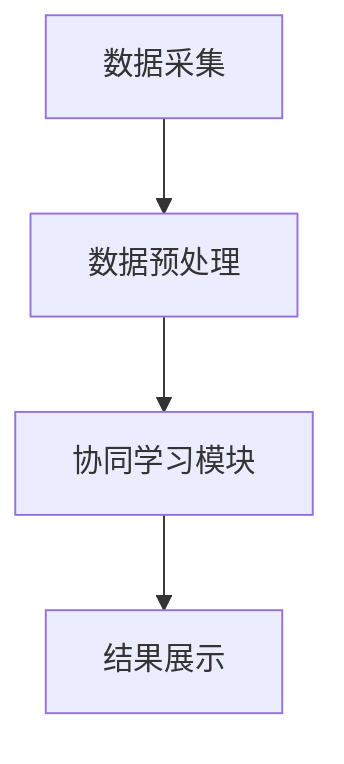
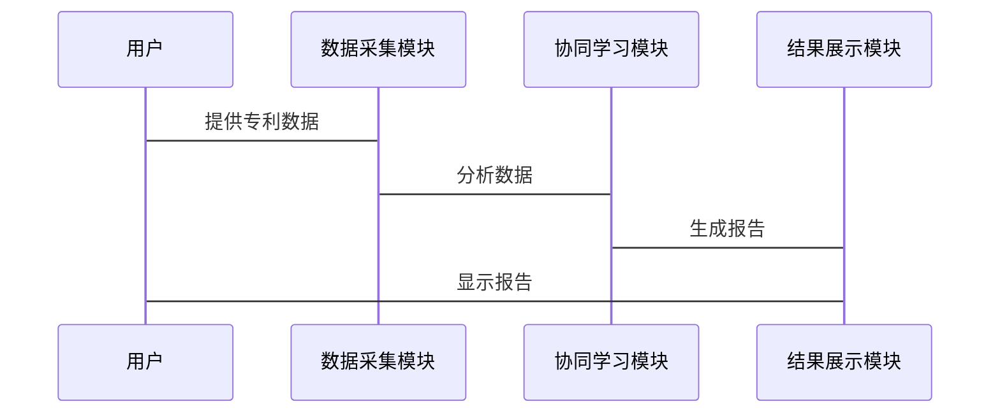

                 


# 价值投资中的AI驱动专利分析：多智能体系统的优势

## 关键词：
价值投资，人工智能，专利分析，多智能体系统，协同学习

## 摘要：
本文探讨了在价值投资中利用AI驱动的专利分析方法，并重点介绍了多智能体系统在专利分析中的优势。通过分析专利数据，投资者可以更准确地评估企业的技术创新能力，从而做出更明智的投资决策。文章详细介绍了多智能体系统的协同机制，分析了其在专利数据预处理、特征提取、相似性度量等环节的优势，并通过实际案例展示了如何利用多智能体系统进行专利分析，从而辅助价值投资。

---

## 第1章：价值投资与专利分析概述

### 1.1 价值投资的基本概念
#### 1.1.1 价值投资的定义与核心理念
价值投资是一种长期投资策略，强调通过分析企业的基本面，如财务状况、行业地位、管理团队等，寻找被市场低估的投资标的。其核心理念是“买入并持有”，注重企业的内在价值而非短期市场波动。

#### 1.1.2 专利分析在价值投资中的作用
专利是企业技术创新能力的重要体现，反映了企业在特定技术领域的研发投入和竞争优势。通过分析企业的专利布局，投资者可以评估其技术储备、市场竞争力以及未来的增长潜力。

#### 1.1.3 传统专利分析方法的局限性
传统专利分析方法主要依赖人工审查，存在效率低、覆盖面窄、难以量化等问题。此外，专利数据的复杂性和多样性使得传统方法难以捕捉到深层次的技术趋势和竞争关系。

---

### 1.2 AI技术在金融领域的应用
#### 1.2.1 AI在金融分析中的优势
AI技术能够快速处理海量数据，发现传统方法难以察觉的模式和趋势。在金融分析中，AI可以用于风险评估、市场预测、投资组合优化等领域。

#### 1.2.2 专利分析与金融投资的结合
专利分析可以帮助投资者评估企业的技术实力和创新能力，从而更好地判断其市场地位和竞争优势。结合AI技术，专利分析可以实现自动化、智能化，提高分析效率和准确性。

#### 1.2.3 多智能体系统在专利分析中的潜力
多智能体系统通过协同学习和知识共享，能够更全面地分析专利数据，发现潜在的技术关联和竞争优势。这种分布式、协作式的分析方式为价值投资提供了新的可能性。

---

## 第2章：多智能体系统的核心概念

### 2.1 多智能体系统的定义与特点
#### 2.1.1 多智能体系统的定义
多智能体系统（Multi-Agent System, MAS）是由多个智能体组成的分布式系统，智能体能够通过感知环境、自主决策并采取行动，以实现特定目标。

#### 2.1.2 多智能体系统的组成要素
- **智能体**：具有感知、决策和行动能力的实体。
- **环境**：智能体所处的外部环境，包括数据源、目标和约束。
- **通信机制**：智能体之间交换信息和协调行动的渠道。
- **协同机制**：智能体之间通过协作实现共同目标的规则和策略。

#### 2.1.3 多智能体系统的优势与挑战
- **优势**：分布式计算能力、协作能力强、适应性高。
- **挑战**：通信开销大、协同复杂、系统设计难度高。

---

### 2.2 多智能体系统与专利分析的结合
#### 2.2.1 多智能体系统在专利分析中的应用场景
- **数据预处理**：智能体协同完成专利数据清洗和特征提取。
- **技术趋势分析**：通过协同学习发现技术热点和演变方向。
- **竞争分析**：分析企业在特定技术领域的专利布局和竞争优势。

#### 2.2.2 多智能体系统如何提升专利分析的效率
- **分布式计算**：多个智能体同时处理不同数据源，提高分析速度。
- **知识共享**：智能体之间共享分析结果，避免重复劳动。
- **协同决策**：通过协作优化分析策略，提高结果准确性。

#### 2.2.3 多智能体系统的协同机制与专利分析的关系
- **协同机制**：智能体通过通信和协作完成复杂的分析任务。
- **专利分析**：协同机制确保分析过程的全面性和高效性。

---

## 第3章：AI驱动专利分析的数学模型与算法原理

### 3.1 专利分析的数学模型
#### 3.1.1 专利数据的特征提取
- **文本特征**：利用NLP技术提取专利标题、摘要和关键词的特征向量。
- **技术领域特征**：基于专利分类号（如IPC分类）提取技术领域特征。

#### 3.1.2 专利数据的相似性度量
- **余弦相似度**：用于衡量专利文本之间的相似性。
- **Jaccard相似度**：基于专利关键词的相似性计算。

#### 3.1.3 专利数据的分类与聚类
- **分类**：将专利分为不同技术类别，如人工智能、区块链等。
- **聚类**：将相似的专利归为一类，识别技术热点和趋势。

---

### 3.2 基于多智能体系统的协同学习算法
#### 3.2.1 协同过滤算法
- **基本原理**：通过用户行为数据推荐相似的专利。
- **实现步骤**：
  1. 收集用户对专利的偏好数据。
  2. 计算用户之间的相似度。
  3. 推荐与用户相似的其他用户的专利偏好。

#### 3.2.2 强化学习算法
- **基本原理**：通过奖励机制优化智能体的决策策略。
- **实现步骤**：
  1. 定义状态空间、动作空间和奖励函数。
  2. 智能体通过与环境交互学习最优策略。
  3. 应用于专利分析中的技术趋势预测。

#### 3.2.3 联合学习算法
- **基本原理**：多个智能体通过协作学习共同优化模型。
- **实现步骤**：
  1. 分配任务给多个智能体。
  2. 智能体协同完成任务并共享结果。
  3. 整合结果得到最终分析结论。

---

### 3.3 算法实现与代码示例
#### 3.3.1 专利数据预处理代码
```python
import pandas as pd
import numpy as np

# 加载专利数据
patents = pd.read_csv('patents.csv')

# 数据清洗
patents = patents.dropna()
patents = patents.drop_duplicates(subset=['title'])
```

#### 3.3.2 协同过滤算法实现代码
```python
def calculate_cosine_similarity(user1, user2):
    return np.dot(user1, user2) / (np.linalg.norm(user1) * np.linalg.norm(user2))

# 示例用户数据
users = {
    'user1': [0.5, 0.3, 0.2],
    'user2': [0.4, 0.6, 0.1]
}

similarity = calculate_cosine_similarity(users['user1'], users['user2'])
print(similarity)
```

#### 3.3.3 强化学习算法实现代码
```python
import gym
import numpy as np

# 定义环境
class PatentEnv(gym.Env):
    def __init__(self):
        self.action_space = gym.spaces.Discrete(5)
        self.observation_space = gym.spaces.Box(low=0, high=1, shape=(1,))
        self.current_state = 0

    def step(self, action):
        # 示例奖励函数
        reward = action == 3  # 假设动作3是最佳选择
        self.current_state = (self.current_state + 1) % 5
        return self.current_state, reward, False, {}

    def reset(self):
        self.current_state = 0
        return self.current_state
```

---

## 第4章：系统架构与设计

### 4.1 系统架构设计
#### 4.1.1 系统模块划分
- **数据采集模块**：从专利数据库中获取专利数据。
- **数据预处理模块**：清洗和特征提取。
- **协同学习模块**：智能体协同完成专利分析。
- **结果展示模块**：将分析结果可视化。

#### 4.1.2 系统功能设计
- **数据处理**：支持多种数据格式的导入和导出。
- **分析功能**：提供多种分析方法，如协同过滤、强化学习等。
- **结果展示**：生成可视化报告和图表。

#### 4.1.3 系统架构图（使用 Mermaid）


---

### 4.2 系统接口设计
#### 4.2.1 输入接口设计
- **输入格式**：支持CSV、JSON等格式。
- **输入参数**：包括专利数据、分析方法等。

#### 4.2.2 输出接口设计
- **输出格式**：支持文本、图表等形式。
- **输出内容**：包括专利分析结果、技术趋势报告等。

#### 4.2.3 数据接口设计
- **数据源**：支持多种专利数据库的接口。
- **数据清洗**：提供数据清洗和特征提取的功能。

---

### 4.3 系统交互设计
#### 4.3.1 系统交互流程
1. 用户输入专利数据。
2. 系统进行数据预处理。
3. 协同学习模块完成分析任务。
4. 结果展示模块生成报告。

#### 4.3.2 系统交互图（使用 Mermaid）


---

## 第5章：项目实战

### 5.1 项目环境安装
```bash
pip install pandas numpy gym
```

### 5.2 项目核心实现
```python
import pandas as pd
import numpy as np
import gym

# 示例项目代码
def main():
    patents = pd.read_csv('patents.csv')
    patents = patents.dropna()
    print(patents.head())

    env = PatentEnv()
    obs = env.reset()
    while True:
        action = env.action_space.sample()
        obs, reward, done, info = env.step(action)
        if done:
            break
    print("Analysis completed.")

if __name__ == "__main__":
    main()
```

---

## 第6章：总结与展望

### 6.1 总结
本文探讨了AI驱动的专利分析在价值投资中的应用，并重点介绍了多智能体系统的优势。通过协同学习和分布式计算，多智能体系统能够更高效、更全面地分析专利数据，为投资者提供更准确的决策支持。

### 6.2 展望
未来，随着AI技术的不断发展，多智能体系统在专利分析中的应用将更加广泛。结合区块链、边缘计算等新技术，专利分析将更加智能化、实时化，为价值投资提供更强大的工具支持。

---

## 作者：AI天才研究院/AI Genius Institute & 禅与计算机程序设计艺术 /Zen And The Art of Computer Programming

---

感谢您的阅读！希望本文能够为价值投资中的AI驱动专利分析提供新的思路和启示。

