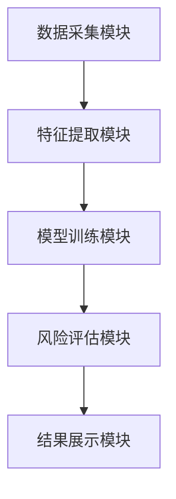

                 


# 价值投资中的AI驱动地缘政治风险分析：多智能体系统

> 关键词：价值投资，地缘政治风险，人工智能，多智能体系统，风险管理，投资策略

> 摘要：本文探讨了在价值投资中利用AI驱动的地缘政治风险分析方法，通过多智能体系统来优化投资决策。文章详细分析了地缘政治风险对投资的影响，介绍了多智能体系统的定义、特点及其在金融投资中的应用优势。并结合具体的算法原理和系统架构设计，展示了如何利用多智能体系统进行地缘政治风险的预测与评估，为投资者提供科学的决策支持。最后，通过实际案例分析和项目实战，验证了该方法的有效性，并提出了未来的优化方向。

---

## 第一部分: 背景与基础

### 第1章: 价值投资与地缘政治风险概述

#### 1.1 价值投资的基本概念
##### 1.1.1 价值投资的定义与核心理念
价值投资是一种投资策略，其核心理念是寻找市场价格低于其内在价值的资产进行投资。这种方法强调长期持有优质资产，关注企业的基本面，如盈利能力、财务状况和行业地位。价值投资的核心在于识别市场的非效率性，利用市场的短期波动，实现长期收益。

##### 1.1.2 价值投资的历史发展
价值投资的理论基础可以追溯到本杰明·格雷厄姆和戴维·多德的工作。20世纪30年代，他们提出了“安全边际”概念，即买入价格低于内在价值的股票，以降低投资风险。这一理论在后来的投资实践中得到了广泛应用，并衍生出多种价值投资策略，如红利投资、低市盈率投资等。

##### 1.1.3 价值投资在现代金融中的地位
在现代金融中，价值投资与趋势投资、技术分析等方法并存。随着市场的复杂化和信息量的增加，传统的价值投资方法逐渐引入了更多的数据分析和技术手段，尤其是人工智能技术的应用，为价值投资注入了新的活力。

#### 1.2 地缘政治风险的基本概念
##### 1.2.1 地缘政治风险的定义
地缘政治风险是指由于政治、经济、军事等外部因素的变化，导致某一地区或国家的经济不稳定，进而影响企业的经营环境和投资价值的风险。这些风险可能来源于国际关系紧张、政策变化、恐怖主义、自然灾害等因素。

##### 1.2.2 地缘政治风险的分类与特征
地缘政治风险可以分为国家风险、主权风险、政治风险和操作风险等。其特征包括突发性、传染性、长期性和复杂性。例如，中美贸易摩擦可能引发全球供应链的调整，进而影响相关行业的投资价值。

##### 1.2.3 地缘政治风险对投资的影响
地缘政治风险可能对企业的盈利能力、资产价值和市场流动性产生重大影响。例如，贸易摩擦可能导致关税增加，影响企业的成本结构；地缘政治冲突可能导致市场恐慌，引发资产价格的大幅波动。

#### 1.3 AI在金融投资中的应用
##### 1.3.1 AI在金融分析中的作用
人工智能技术在金融分析中的应用日益广泛，包括股票预测、风险评估、市场情绪分析等领域。AI可以通过大数据分析和机器学习算法，帮助投资者发现市场规律和潜在风险。

##### 1.3.2 AI在风险评估中的应用
AI可以通过自然语言处理技术分析新闻、社交媒体和政府公告，提取地缘政治风险的相关信息。结合统计模型，AI可以对风险进行量化评估，为投资者提供决策支持。

##### 1.3.3 多智能体系统在金融投资中的优势
多智能体系统通过分布式计算和协作学习，可以在复杂的金融环境中实时捕捉和分析地缘政治风险。多个智能体可以分别关注不同的风险因素，协同工作，提供更加全面和准确的风险评估。

#### 1.4 本章小结
本章介绍了价值投资的基本概念、地缘政治风险的定义与分类，以及AI技术在金融投资中的应用。AI和多智能体系统的引入，为价值投资中的风险分析提供了新的工具和方法。

---

### 第2章: 多智能体系统的定义与特点

#### 2.1 多智能体系统的定义
##### 2.1.1 多智能体系统的概念
多智能体系统（Multi-Agent System, MAS）是由多个智能体组成的分布式系统，这些智能体能够通过协作和通信完成特定任务。每个智能体都有自己的目标和行为策略，能够独立决策并与其他智能体协同工作。

##### 2.1.2 多智能体系统的组成部分
多智能体系统由智能体、环境、通信协议和协作机制组成。智能体是系统的基本单元，负责感知环境、决策和执行任务。环境是智能体所处的外部世界，包括数据源、市场和用户等。通信协议和协作机制确保智能体之间的信息共享和协同工作。

##### 2.1.3 多智能体系统的分类
多智能体系统可以根据智能体的智能水平、任务类型和协作方式分为多种类型。例如，基于任务的多智能体系统和基于市场的多智能体系统。任务型系统主要用于完成特定任务，而市场型系统模拟经济市场中的交易行为。

#### 2.2 多智能体系统的特征
##### 2.2.1 分布式智能
多智能体系统的智能分布在多个智能体中，避免了单点故障，提高了系统的容错性和鲁棒性。

##### 2.2.2 协作性
智能体通过协作完成任务，可以利用各自的优势，实现整体目标。协作机制可以是基于合同网、分布式规划或协商。

##### 2.2.3 反应性
智能体能够实时感知环境变化，并根据反馈调整行为。这种反应性使系统能够适应动态变化的环境。

##### 2.2.4 自适应性
多智能体系统可以根据环境变化动态调整策略，提高系统的灵活性和适应性。

#### 2.3 多智能体系统与传统AI的区别
##### 2.3.1 单智能体与多智能体的对比
单智能体系统由一个智能体完成任务，而多智能体系统由多个智能体协同工作。多智能体系统具有更高的灵活性和扩展性，适用于复杂任务。

##### 2.3.2 多智能体系统的独特优势
多智能体系统通过分布式计算和协作学习，可以处理大规模、复杂的数据和任务。多个智能体可以从不同角度分析问题，提供更全面的解决方案。

##### 2.3.3 多智能体系统的挑战
多智能体系统的复杂性较高，需要解决通信延迟、协调困难和智能体之间的冲突等问题。此外，系统的可扩展性和安全性也是需要重点关注的问题。

#### 2.4 本章小结
本章详细介绍了多智能体系统的定义、组成部分和主要特征，并分析了其与传统AI的区别和优势。多智能体系统在复杂任务中的优势为价值投资中的地缘政治风险分析提供了新的思路。

---

## 第二部分: 算法原理与系统架构

### 第3章: 地缘政治风险分析的算法原理

#### 3.1 数据预处理与特征提取
##### 3.1.1 数据来源与清洗
地缘政治风险分析的数据来源包括新闻报道、政府公告、经济指标和社交媒体等。数据清洗的步骤包括去除噪声、填补缺失值和标准化处理。

##### 3.1.2 特征提取
通过自然语言处理技术提取文本数据中的关键词和情感倾向，结合经济指标如GDP增长率、失业率等，构建特征向量。

##### 3.1.3 数据标准化
使用归一化或标准化方法，将特征数据转换为统一的尺度，便于模型训练和分析。

#### 3.2 基于多智能体的分类算法
##### 3.2.1 算法原理
多智能体系统中的每个智能体负责分析不同的风险因素，如政治风险、经济风险和社会风险。通过协同学习，智能体可以综合各方面的信息，对地缘政治风险进行分类。

##### 3.2.2 协作学习机制
智能体之间通过通信协议共享数据和模型参数，利用分布式计算和协作学习技术，提高分类的准确性和效率。

#### 3.3 风险评估模型
##### 3.3.1 模型选择
使用随机森林、支持向量机（SVM）或深度学习模型（如LSTM）进行风险评估。模型的选择取决于数据特征和任务需求。

##### 3.3.2 模型训练与优化
通过交叉验证和网格搜索，优化模型的参数，提高分类准确率和召回率。

##### 3.3.3 风险指标计算
基于模型的输出，计算地缘政治风险的综合指标，如风险概率和风险影响程度。

#### 3.4 本章小结
本章详细介绍了地缘政治风险分析的算法原理，包括数据预处理、特征提取、模型选择和风险评估等步骤。多智能体系统的协作学习机制为风险分析提供了新的思路。

---

### 第4章: 系统架构与实现

#### 4.1 系统功能设计
##### 4.1.1 功能模块划分
系统主要功能模块包括数据采集、特征提取、模型训练、风险评估和结果展示。

##### 4.1.2 功能流程
数据采集模块负责获取多源数据，特征提取模块进行数据预处理，模型训练模块完成分类模型的训练，风险评估模块基于模型输出风险指标，结果展示模块以可视化方式呈现分析结果。

#### 4.2 系统架构设计
##### 4.2.1 系统架构图


##### 4.2.2 模块交互流程
数据采集模块将数据传递给特征提取模块，特征提取模块处理后传递给模型训练模块，模型训练模块训练完成后将模型传递给风险评估模块，风险评估模块输出风险指标并传递给结果展示模块。

#### 4.3 系统接口设计
##### 4.3.1 数据接口
系统需要与多种数据源对接，如新闻API、社交媒体API和经济指标数据库。

##### 4.3.2 模型接口
模型训练模块需要与特征提取模块和风险评估模块进行交互，确保数据流和模型参数的正确传递。

#### 4.4 本章小结
本章详细描述了系统的功能设计和架构设计，展示了多智能体系统在地缘政治风险分析中的应用。

---

## 第三部分: 项目实战与优化

### 第5章: 项目实战

#### 5.1 环境搭建与数据准备
##### 5.1.1 环境安装
安装Python、Pandas、Scikit-learn、NLTK等必要的库和工具。

##### 5.1.2 数据来源
使用新闻API和社交媒体API获取地缘政治事件的相关数据，清洗数据并提取特征。

#### 5.2 系统核心实现
##### 5.2.1 数据预处理代码
```python
import pandas as pd
from sklearn.preprocessing import StandardScaler

# 加载数据
data = pd.read_csv('geopolitical_risk.csv')

# 数据清洗
data.dropna(inplace=True)
data = data[~data.duplicated()]

# 特征提取
features = data[['gdp_growth', 'unemployment_rate', 'sentiment_score']]
```

##### 5.2.2 模型训练代码
```python
from sklearn.ensemble import RandomForestClassifier
from sklearn.metrics import accuracy_score

# 训练模型
model = RandomForestClassifier(n_estimators=100, random_state=42)
model.fit(X_train, y_train)

# 模型评估
y_pred = model.predict(X_test)
print("Accuracy:", accuracy_score(y_test, y_pred))
```

##### 5.2.3 风险评估代码
```python
import numpy as np

# 风险指标计算
risk_prob = model.predict_proba(X_test)[:, 1]
risk_impact = np.log(risk_prob / (1 - risk_prob))
```

#### 5.3 实际案例分析
##### 5.3.1 美中贸易摩擦分析
分析中美贸易摩擦对企业盈利能力的影响，利用模型预测风险概率和风险影响程度。

##### 5.3.2 风险应对策略
根据模型输出的风险指标，制定相应的投资策略，如调整仓位、分散投资等。

#### 5.4 本章小结
本章通过实际案例展示了系统的实现过程，验证了多智能体系统在地缘政治风险分析中的有效性。

---

## 第四部分: 结论与展望

### 第6章: 结论与展望

#### 6.1 全文总结
本文探讨了在价值投资中利用AI驱动的地缘政治风险分析方法，通过多智能体系统优化投资决策。多智能体系统的分布式计算和协作学习能力，为复杂环境下的风险分析提供了新的思路。

#### 6.2 本研究的贡献
本文的主要贡献包括：
1. 提出了基于多智能体系统的地缘政治风险分析方法。
2. 设计了系统的整体架构，展示了各模块的交互流程。
3. 通过实际案例验证了方法的有效性。

#### 6.3 研究的不足与改进方向
本文的主要不足包括：
1. 数据来源和质量的限制，未来可以引入更多的数据源。
2. 模型的可解释性较低，未来可以优化模型结构，提高可解释性。
3. 系统的动态适应性不足，未来可以研究自适应算法，提高系统的实时性。

#### 6.4 未来研究方向
未来的研究可以关注以下方向：
1. 多智能体系统的动态协作机制。
2. 高维数据的特征提取方法。
3. 模型的可解释性和透明性。

#### 6.5 本章小结
本章总结了全文的主要内容，指出了研究的贡献和不足，并提出了未来的研究方向。

---

## 作者：AI天才研究院/AI Genius Institute & 禅与计算机程序设计艺术 /Zen And The Art of Computer Programming

