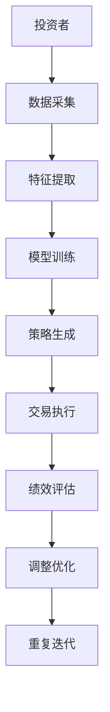
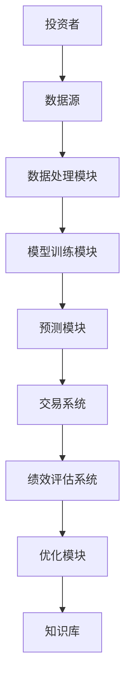
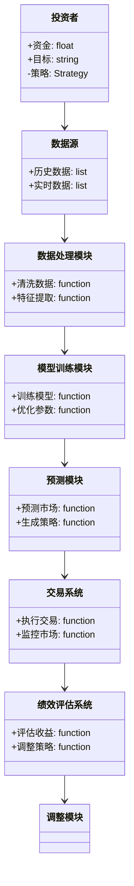

                 


# 价值投资中的AI驱动数字化转型效果分析：多智能体系统

## 关键词：价值投资，AI，数字化转型，多智能体系统，金融分析，投资策略

## 摘要：  
本文探讨了AI驱动的多智能体系统在价值投资中的应用与效果，通过分析多智能体系统的算法原理、系统架构和实际案例，揭示了数字化转型如何提升投资决策的效率和准确性。文章从背景、理论、技术实现到实战应用，全面解析了多智能体系统在价值投资中的优势与挑战，并提出了未来的发展方向。

---

## 第一部分: 价值投资与AI驱动数字化转型的背景

### 第1章: 价值投资与数字化转型概述

#### 1.1 价值投资的核心概念  
价值投资是一种以基本面分析为基础的投资策略，旨在通过分析企业的财务状况、行业地位和竞争优势，寻找被市场低估的投资标的。其核心思想是“买入并持有”，注重长期价值而非短期波动。  

#### 1.2 数字化转型的背景与意义  
随着科技的发展，金融行业正经历着数字化转型的浪潮。数字化转型不仅改变了传统的业务模式，还通过数据驱动的方式提升了决策效率和精准度。数字化转型的核心在于利用技术手段（如AI、大数据、区块链等）优化业务流程、提升用户体验和创造新的价值点。  

#### 1.3 AI技术在金融领域的应用现状  
AI技术在金融领域的应用日益广泛，包括：  
1. **金融分析**：通过自然语言处理（NLP）和情感分析，分析新闻、社交媒体等非结构化数据，预测市场情绪。  
2. **投资决策**：利用机器学习算法，构建量化投资模型，实现自动化交易和风险控制。  
3. **风险管理**：通过AI技术实时监控市场动态，识别潜在风险并制定应对策略。  

#### 1.4 多智能体系统在价值投资中的应用前景  
多智能体系统（MAS）是一种由多个智能体组成的分布式系统，每个智能体都有自己的目标和决策机制。在价值投资中，多智能体系统可以通过分工协作，分别负责数据采集、模型训练、策略优化和交易执行等任务，从而提升投资决策的效率和准确性。  

---

## 第二部分: 多智能体系统的核心概念与联系

### 第2章: 多智能体系统的核心原理  

#### 2.1 多智能体系统的定义与特点  
多智能体系统（Multi-Agent System, MAS）由多个智能体组成，这些智能体通过协作完成复杂的任务。其特点包括：  
1. **分布式性**：智能体独立决策，不依赖中央控制系统。  
2. **协作性**：智能体之间通过通信和协调完成共同目标。  
3. **适应性**：智能体能够根据环境变化动态调整行为。  

#### 2.2 多智能体系统的ER实体关系图  
以下是多智能体系统在价值投资中的ER实体关系图：  

```mermaid
er
    actor 投资者
    actor 市场
    actor 算法
    actor 数据源
    actor 监管机构
    actor 交易系统
    actor 风险评估系统
    actor 绩效评估系统
    actor 知识库
    actor 专家系统
    actor 优化模块
    actor 执行模块
    actor 监测模块
    actor 评估模块
    actor 调整模块
    actor 知识库
    actor 数据处理模块
    actor 模型训练模块
    actor 预测模块
    actor 执行模块
    actor 监测模块
    actor 评估模块
    actor 调整模块
    actor 知识库
    actor 数据处理模块
```

---

## 第三部分: 多智能体系统在价值投资中的应用

### 第3章: 多智能体系统的算法与实现  

#### 3.1 多智能体系统的算法流程图  
以下是多智能体系统的算法流程图：  



#### 3.2 算法原理与数学模型  
多智能体系统的算法通常基于强化学习和博弈论。以下是一个简单的强化学习模型：  

$$ Q(s, a) = r + \gamma \max_{a'} Q(s', a') $$  

其中：  
- \( Q(s, a) \) 表示状态 \( s \) 下动作 \( a \) 的价值。  
- \( r \) 表示奖励。  
- \( \gamma \) 表示折扣因子。  
- \( \max_{a'} Q(s', a') \) 表示在下一个状态 \( s' \) 下的最大价值。  

---

## 第四部分: 系统设计与实现

### 第4章: 系统设计与实现  

#### 4.1 系统架构设计  
以下是系统的架构设计图：  



#### 4.2 系统功能设计  
以下是系统的功能设计图：  



---

## 第五部分: 实战应用与案例分析

### 第5章: 实战应用与案例分析  

#### 5.1 环境安装与配置  
以下是Python环境的安装与配置步骤：  
1. 安装Python和必要的库（如Pandas、NumPy、Scikit-learn）。  
2. 安装Jupyter Notebook用于数据可视化和分析。  

#### 5.2 系统核心实现  
以下是Python代码实现：  

```python
# 数据采集模块
import pandas as pd
import requests

def get_data(ticker):
    url = f"https://api.example.com/{ticker}"
    response = requests.get(url)
    data = response.json()
    return pd.DataFrame(data)

# 特征提取模块
from sklearn.feature_selection import SelectKBest
from sklearn.ensemble import RandomForestClassifier

def extract_features(data):
    features = SelectKBest(k=10).fit_transform(data, data['label'])
    return features

# 模型训练模块
from xgboost import XGBClassifier

def train_model(features, labels):
    model = XGBClassifier()
    model.fit(features, labels)
    return model

# 交易执行模块
from backtrader import Strategy, datafeed

class ValueInvestingStrategy(Strategy):
    def __init__(self):
        self.datafeed = datafeed.DataFeed(
            symbol=symbol,
            fromdate=start,
            todate=end
        )

    def next(self):
        # 执行交易逻辑
        pass

# 绩效评估模块
from backtrader.analyzer import SharpeRatio

def evaluate_performance(strategy):
    performance = strategy.analyzer.get(SharpeRatio)
    return performance
```

#### 5.3 案例分析  
以下是多智能体系统在价值投资中的实际案例分析：  
1. **数据采集**：从多个数据源（如Yahoo Finance、Google Finance）获取历史数据和实时数据。  
2. **特征提取**：提取财务指标、市场情绪等特征。  
3. **模型训练**：利用XGBoost等算法训练预测模型。  
4. **策略生成**：基于模型预测生成投资策略。  
5. **交易执行**：通过回测验证策略的可行性，并在实际市场中执行交易。  

---

## 第六部分: 总结与展望

### 第6章: 总结与展望  

#### 6.1 总结  
本文详细分析了AI驱动的多智能体系统在价值投资中的应用，从理论到实践，全面探讨了其算法原理、系统架构和实际案例。通过多智能体系统的协作，可以显著提升投资决策的效率和准确性。  

#### 6.2 展望  
未来，随着AI技术的不断发展，多智能体系统在价值投资中的应用将更加广泛。以下是未来的发展方向：  
1. **强化学习优化**：进一步提升多智能体系统的决策能力。  
2. **跨市场协作**：实现多市场、多资产的全球化投资策略。  
3. **风险管理增强**：通过智能体的协作，实时监控和应对市场风险。  

---

## 作者：AI天才研究院/AI Genius Institute & 禅与计算机程序设计艺术/Zen And The Art of Computer Programming

