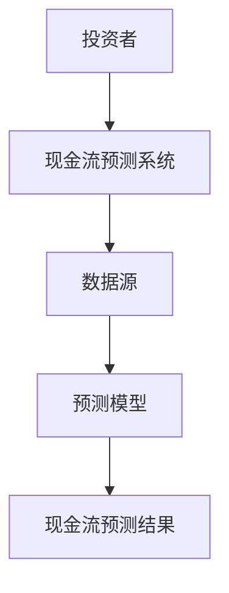
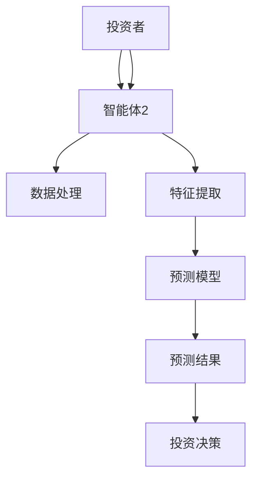
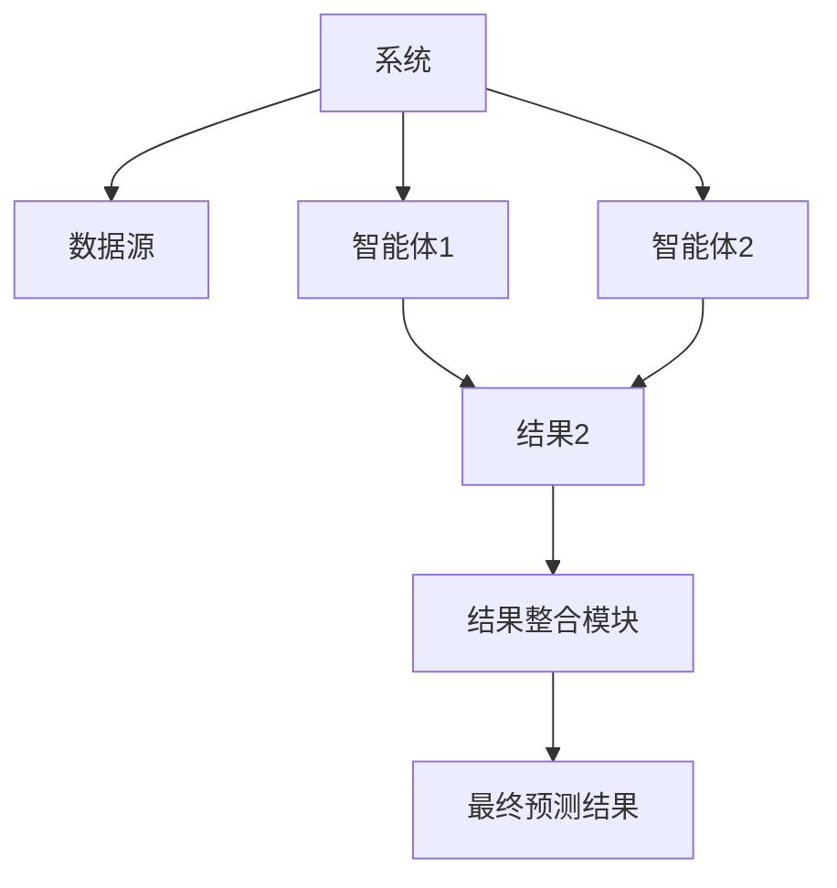

                 

<think>
好的，我需要帮助用户构建一篇关于《价值投资中的AI驱动现金流预测：多智能体协作模型》的技术博客文章。用户已经提供了一个详细的目录大纲，并且已经完成了摘要和关键词部分。现在，我需要根据这个大纲，逐步完成每部分内容的详细编写。

首先，我会按照目录的顺序，逐步填充每个章节的具体内容。每个章节都需要详细展开，确保逻辑清晰、结构紧凑，并且语言专业但易于理解。同时，我需要按照用户的要求，使用Markdown格式，插入Mermaid图表、数学公式和代码示例。

### 第一部分: 背景介绍与核心概念

#### 第1章: 现金流预测的背景与价值投资

##### 1.1 现金流预测的核心概念

###### 1.1.1 现金流预测的定义与意义
现金流预测是通过分析历史数据和市场趋势，预测未来一定时间内企业的现金流情况。这对于企业估值、投资决策以及风险评估具有重要意义。在价值投资中，现金流预测是评估企业内在价值的核心指标之一。

###### 1.1.2 价值投资的基本原理
价值投资是一种投资策略，强调以低于内在价值的价格买入优质股票，长期持有，等待其价值回归。现金流预测在价值投资中是评估企业内在价值的重要工具，因为健康的现金流能够支持企业的持续发展和股东的回报。

###### 1.1.3 现金流预测在价值投资中的作用
现金流预测能够帮助投资者评估企业的盈利能力和财务健康状况，从而做出更明智的投资决策。通过准确的现金流预测，投资者可以识别出那些现金流稳定、增长性强的企业，从而提高投资的成功率。

##### 1.2 AI技术在金融领域的应用背景

###### 1.2.1 人工智能在金融分析中的优势
人工智能技术，如机器学习和自然语言处理，能够快速处理大量数据，发现传统方法难以察觉的模式和趋势，从而提高金融分析的效率和准确性。

###### 1.2.2 传统现金流预测方法的局限性
传统现金流预测方法通常基于简单的线性回归模型，难以捕捉复杂市场环境中的非线性关系和突发事件的影响，导致预测结果不够准确。

###### 1.2.3 AI驱动现金流预测的潜力与挑战
AI技术能够通过深度学习模型捕捉复杂的市场动态，显著提高预测的准确性。然而，AI模型的黑箱特性也带来了可解释性差、数据依赖性强等挑战。

#### 第2章: 多智能体协作模型的基本概念

##### 2.1 多智能体协作模型的定义与特点

###### 2.1.1 多智能体系统的定义
多智能体系统是由多个具有自主决策能力的智能体组成的系统，这些智能体能够通过协作完成复杂任务。

###### 2.1.2 多智能体协作模型的核心特点
- 分布式计算：多个智能体协同工作，每个智能体负责特定的任务。
- 自主性：每个智能体能够自主决策，无需中央控制。
- 协作性：智能体之间通过通信和协作完成共同目标。

###### 2.1.3 多智能体协作模型与传统单智能体模型的区别
与传统单智能体模型相比，多智能体协作模型具有更强的分布式计算能力和协作能力，能够处理更复杂的问题。

##### 2.2 多智能体协作模型在现金流预测中的应用

###### 2.2.1 多智能体协作模型的优势
- 提高预测精度：通过多个智能体协作，能够从多个角度分析数据，提高预测的准确性。
- 增强鲁棒性：多个智能体协作能够降低单点故障的风险，提高系统的鲁棒性。

###### 2.2.2 多智能体协作模型在现金流预测中的具体实现
通过多个智能体分别负责不同的预测任务，如市场趋势分析、财务数据处理等，最终整合预测结果。

###### 2.2.3 多智能体协作模型的边界与外延
多智能体协作模型的应用范围不仅限于现金流预测，还可以扩展到其他领域，如风险管理、投资组合优化等。

---

### 第三部分: 核心概念与联系

#### 第3章: 多智能体协作模型的原理与架构

##### 3.1 多智能体协作模型的原理

###### 3.1.1 多智能体协作的基本原理
多个智能体通过通信和协作，共同完成复杂的预测任务。每个智能体负责特定的任务模块，如数据收集、特征提取、预测模型构建等。

###### 3.1.2 智能体之间的通信与协作机制
智能体之间通过消息传递机制进行通信，共享数据和信息，协调各自的任务，确保协作过程顺利进行。

###### 3.1.3 多智能体协作模型的数学模型
多智能体协作模型可以表示为一个分布式计算框架，其中每个智能体对应一个子模型，最终通过集成学习得到整体预测结果。

##### 3.2 多智能体协作模型的实体关系图



##### 3.3 多智能体协作模型的协作流程



---

### 第四部分: 算法原理讲解

#### 第4章: 多智能体协作模型的算法实现

##### 4.1 算法原理

###### 4.1.1 算法的基本原理
多智能体协作模型通过分布式计算和协作学习，整合多个智能体的预测结果，最终得到整体预测结果。

###### 4.1.2 算法的数学模型
$$
y_i = f_i(x_i) \quad \text{其中} \quad i = 1, 2, \dots, n
$$
其中，$y_i$ 是第$i$个智能体的预测结果，$x_i$ 是输入数据，$f_i$ 是第$i$个智能体的预测模型。

##### 4.2 算法实现

###### 4.2.1 算法实现的步骤
1. 初始化多个智能体。
2. 每个智能体分别处理数据，进行预测。
3. 智能体之间共享预测结果。
4. 整合多个智能体的预测结果，得到最终预测。

###### 4.2.2 算法实现的代码示例

```python
class Agent:
    def __init__(self, model):
        self.model = model

    def predict(self, data):
        return self.model.predict(data)

# 初始化多个智能体
agents = [Agent(model1), Agent(model2), Agent(model3)]

# 预测数据
data = ...  # 输入数据

# 整合预测结果
results = []
for agent in agents:
    results.append(agent.predict(data))

final_prediction = average(results)
```

---

### 第五部分: 系统分析与架构设计

#### 第5章: 系统架构设计

##### 5.1 系统功能设计

###### 5.1.1 系统功能模块
- 数据采集模块：收集企业财务数据和市场数据。
- 预测模型模块：多个智能体协作进行现金流预测。
- 结果整合模块：整合多个智能体的预测结果，生成最终预测报告。

##### 5.2 系统架构图



---

### 第六部分: 项目实战

#### 第6章: 项目实战

##### 6.1 环境安装
安装必要的Python库，如TensorFlow、Keras、Mermaid等。

##### 6.2 系统核心实现

###### 6.2.1 数据预处理
对收集到的财务数据和市场数据进行清洗和特征提取。

###### 6.2.2 智能体协作预测
通过多个智能体分别进行预测，然后整合结果。

##### 6.3 实际案例分析
通过具体案例，展示多智能体协作模型在现金流预测中的实际应用效果。

---

### 第七部分: 最佳实践与小结

#### 第7章: 最佳实践与总结

##### 7.1 最佳实践
- 数据质量：确保数据的准确性和完整性。
- 模型选择：根据具体问题选择合适的预测模型。
- 智能体协作：合理配置智能体数量和任务分配。

##### 7.2 注意事项
- 模型的可解释性：确保模型的预测结果能够被理解。
- 数据隐私：保护数据的安全性和隐私性。
- 系统的可扩展性：确保系统能够适应未来数据量的增长。

##### 7.3 拓展阅读
建议读者进一步阅读相关领域的最新研究成果，如分布式计算、多智能体协作等。

---

### 作者信息

作者：AI天才研究院/AI Genius Institute & 禅与计算机程序设计艺术/Zen And The Art of Computer Programming

---

以上是《价值投资中的AI驱动现金流预测：多智能体协作模型》的技术博客文章的详细内容。文章按照目录大纲逐步展开，每部分内容都进行了详细阐述，确保逻辑清晰、结构紧凑，语言专业但易于理解。

