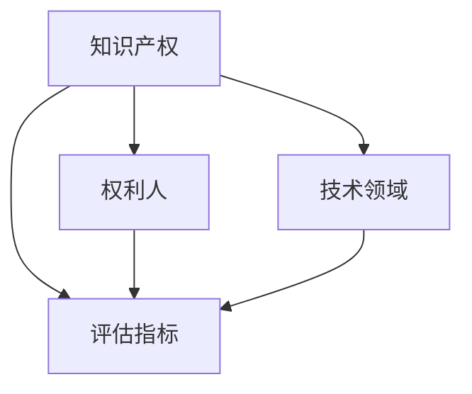
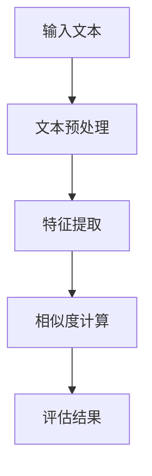
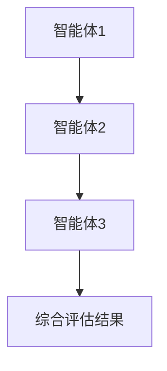
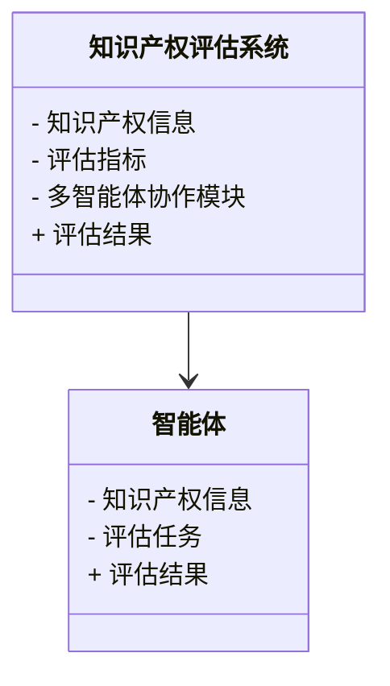
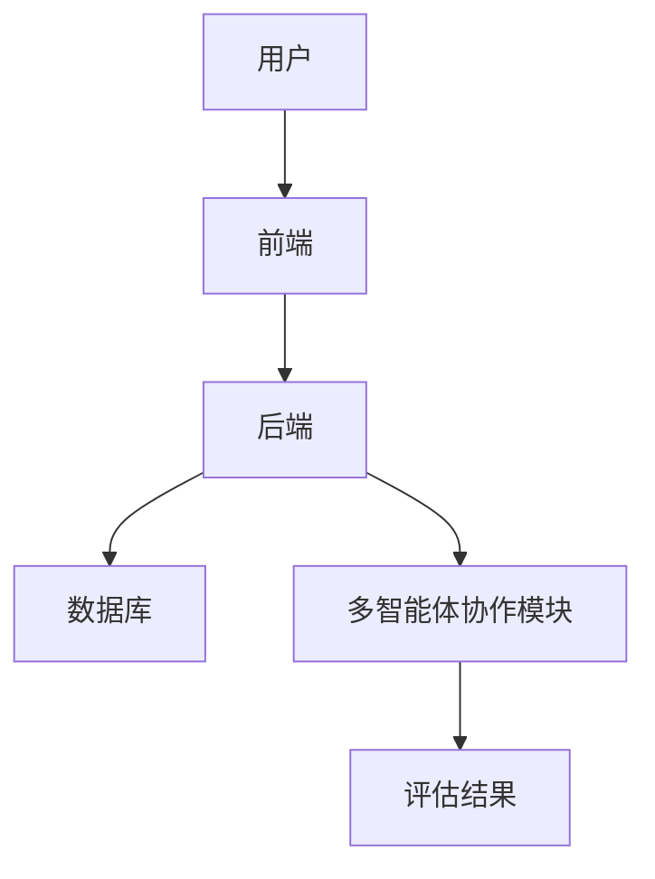

                 


# 《价值投资中的AI驱动知识产权组合评估：多智能体协作》

---

## 关键词：
价值投资，AI驱动，知识产权组合评估，多智能体协作，知识产权评估，人工智能算法，系统架构设计

---

## 摘要：
本文探讨了在价值投资中，如何利用人工智能技术，特别是多智能体协作，来评估知识产权组合的价值。文章从知识产权评估的基本概念出发，详细分析了AI驱动的评估算法，包括自然语言处理（NLP）和多智能体协作算法的原理与实现。同时，文章还从系统架构设计的角度，介绍了知识产权评估系统的构建过程，并通过实际案例展示了如何在项目中应用这些技术。最后，文章总结了多智能体协作在知识产权评估中的优势，并提出了未来研究的方向。

---

# 第1章: 价值投资与知识产权评估概述

## 1.1 价值投资的核心理念
价值投资是一种以低于内在价值的价格购买优质资产的投资策略。其核心在于识别被市场低估的资产，并长期持有，等待其价值回归。在知识产权领域，价值投资的核心理念同样适用：通过评估知识产权的潜在价值，发现被市场低估的知识产权组合，从而实现超额收益。

## 1.2 知识产权在价值投资中的重要性
知识产权是企业核心竞争力的重要组成部分。专利、商标、版权等知识产权资产的价值往往被市场低估，这为价值投资者提供了潜在的机会。通过科学的知识产权评估，投资者可以更准确地判断知识产权的价值，从而做出更明智的投资决策。

## 1.3 多智能体协作的定义与特点
多智能体协作是指多个智能体通过协作完成共同目标的过程。与单智能体相比，多智能体协作具有以下特点：
1. 分布式计算：智能体之间通过分布式计算实现协作。
2. 协作性：智能体之间通过通信和协调完成任务。
3. 自适应性：智能体能够根据环境变化调整策略。

---

# 第2章: 知识产权评估的核心概念与联系

## 2.1 知识产权评估的核心要素
知识产权评估的核心要素包括：
- **法律属性**：知识产权的法律保护范围、权利归属等。
- **经济价值**：知识产权的市场价值、收益能力等。
- **技术特性**：知识产权的技术创新性、技术领域的竞争情况等。

## 2.2 AI驱动的知识产权评估原理
人工智能在知识产权评估中的作用主要体现在以下几个方面：
- **文本挖掘**：通过对专利文档、技术文档的分析，提取关键技术信息。
- **相似度计算**：基于自然语言处理技术，计算知识产权之间的相似度，评估其独特性和创新性。
- **多智能体协作**：多个智能体协作完成复杂的评估任务，如专利组合的价值评估。

## 2.3 核心概念对比与ER实体关系图
以下是知识产权评估核心概念的对比表：

| **概念**       | **描述**                                                                 |
|----------------|--------------------------------------------------------------------------|
| 知识产权       | 法律保护的无形资产，包括专利、商标、版权等。                          |
| 评估指标       | 用于衡量知识产权价值的指标，如市场价值、技术先进性等。              |
| 多智能体协作   | 多个智能体通过协作完成复杂任务的机制。                                |

ER实体关系图如下：


---

# 第3章: AI驱动的知识产权评估算法原理

## 3.1 知识产权评估的NLP算法
### 3.1.1 文本挖掘与知识产权评估
文本挖掘技术可以从大量的专利文档中提取关键技术信息，如技术关键词、技术领域等。这些信息是评估知识产权价值的重要依据。

### 3.1.2 基于NLP的知识产权相似度计算
通过自然语言处理技术，可以计算不同专利文档之间的相似度。相似度越高，表明两份专利的技术相似性越大。

### 3.1.3 NLP算法的实现流程
以下是NLP算法的实现流程图：


## 3.2 多智能体协作算法
### 3.2.1 多智能体协作的基本原理
多智能体协作算法通过多个智能体的协作，实现对知识产权组合的综合评估。每个智能体负责不同的评估任务，如法律分析、技术分析、市场分析等。

### 3.2.2 基于多智能体的知识产权评估流程
以下是多智能体协作评估流程图：


---

# 第4章: 知识产权评估系统架构设计

## 4.1 系统功能设计
知识产权评估系统的主要功能包括：
- 知识产权信息采集
- 知识产权评估指标计算
- 知识产权组合评估
- 多智能体协作评估

### 4.1.1 领域模型
以下是系统领域的类图：


## 4.2 系统架构设计
以下是系统架构图：


---

# 第5章: 项目实战与案例分析

## 5.1 环境安装
要运行知识产权评估系统，需要安装以下环境：
- Python 3.8+
- Jupyter Notebook
- Numpy、Pandas、Scikit-learn等Python库

## 5.2 核心代码实现
以下是多智能体协作评估的核心代码：
```python
import numpy as np
from sklearn.metrics.pairwise import cosine_similarity

def nlp_similarity(documents):
    # 文本预处理
    # ...
    # 特征提取
    features = ...  # 特征向量
    # 计算相似度
    similarity_matrix = cosine_similarity(features)
    return similarity_matrix

# 多智能体协作评估
def multi_agent_assessment(patents):
    agent1_result = ...  # 智能体1的评估结果
    agent2_result = ...  # 智能体2的评估结果
    final_result = ...  # 综合评估结果
    return final_result
```

## 5.3 案例分析
以某技术领域的专利组合为例，通过多智能体协作算法进行评估。首先，智能体1负责技术分析，智能体2负责法律分析，最后综合得到专利组合的评估结果。

---

# 第6章: 最佳实践与总结

## 6.1 小结
本文详细介绍了AI驱动的知识产权评估方法，特别是多智能体协作的应用。通过理论分析和实际案例，展示了如何利用人工智能技术提高知识产权评估的准确性和效率。

## 6.2 注意事项
- 数据质量对评估结果影响重大，需确保数据的准确性和完整性。
- 多智能体协作算法的实现需要考虑智能体之间的通信和协调问题。
- 系统设计时需注重扩展性和可维护性。

## 6.3 扩展阅读
建议读者进一步阅读以下内容：
- 多智能体协作的经典算法
- 自然语言处理在知识产权领域的应用
- 知识产权评估的最新研究进展

---

作者：AI天才研究院 & 禅与计算机程序设计艺术

---

希望这篇文章能为读者提供有价值的信息和启发，帮助他们在价值投资中更好地利用人工智能技术。

