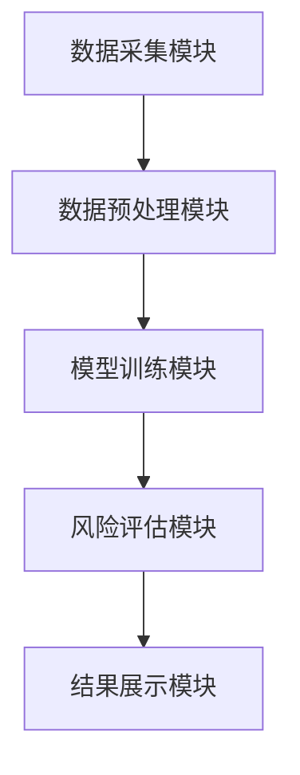

                 


# 价值投资中的AI驱动破产风险评估：多智能体协作模型

## 关键词：价值投资，AI驱动，破产风险评估，多智能体协作模型，风险管理，金融数据分析

## 摘要：  
本文探讨了在价值投资中利用人工智能技术进行破产风险评估的方法，重点介绍了基于多智能体协作模型的创新方法。通过分析多智能体协作模型的理论基础、算法实现和实际应用，本文为投资者提供了一种高效、精准的破产风险评估工具。文章还结合实际案例，详细阐述了系统设计与实现过程，并对未来的研究方向进行了展望。

---

## 第1章: 研究背景与问题描述

### 1.1 研究背景
#### 1.1.1 价值投资的定义与核心理念
价值投资是一种以低于内在价值的价格买入优质资产的投资策略，其核心在于识别被市场低估的投资标的。  
**核心理念：**  
- 买入价格低于内在价值。  
- 长期持有优质资产。  

#### 1.1.2 破产风险评估的重要性
破产风险评估是价值投资中不可忽视的一环，用于预测企业是否可能在未来某个时间点破产。  
**破产风险的核心要素：**  
- 财务状况（如负债率、现金流）。  
- 市场环境（如行业竞争、经济周期）。  
- 公司治理（如管理层稳定性）。  

#### 1.1.3 AI技术在金融领域的应用现状
AI技术在金融领域的应用日益广泛，尤其是在风险管理、投资决策和数据分析方面。  
**AI的优势：**  
- 高效处理海量数据。  
- 精准预测市场趋势。  
- 实时监控风险变化。  

### 1.2 研究问题与目标
#### 1.2.1 研究问题的提出
- 如何利用AI技术提高破产风险评估的准确性？  
- 多智能体协作模型在破产风险评估中的应用效果如何？  

#### 1.2.2 研究目标的设定
- 构建基于多智能体协作模型的破产风险评估系统。  
- 验证模型在价值投资中的实际应用效果。  

#### 1.2.3 研究意义与价值
- 提高破产风险评估的效率和准确性。  
- 为价值投资者提供决策支持工具。  
- 推动AI技术在金融领域的创新应用。  

### 1.3 研究方法与技术路线
#### 1.3.1 研究方法
- 文献综述法：分析现有研究，总结多智能体协作模型的应用。  
- 数据分析法：收集和处理企业财务数据，构建模型。  
- 实验验证法：通过实际案例验证模型的准确性。  

#### 1.3.2 技术路线图
1. 数据采集：收集企业的财务数据、市场数据等。  
2. 数据预处理：清洗数据，提取特征。  
3. 模型构建：基于多智能体协作模型，设计算法。  
4. 模型训练：利用历史数据训练模型。  
5. 实验验证：通过实际案例测试模型效果。  

#### 1.3.3 研究框架与内容
- 理论基础：多智能体协作模型的原理。  
- 方法论：模型构建与算法实现。  
- 实验分析：模型的性能评估与结果解读。  

### 1.4 本章小结
本章介绍了研究的背景、问题、目标和方法，为后续的模型构建奠定了基础。通过分析价值投资与破产风险评估的关系，明确了研究的意义与技术路线。

---

## 第2章: 多智能体协作模型的理论基础

### 2.1 多智能体系统概述
#### 2.1.1 多智能体系统的定义与特点
多智能体系统是由多个智能体组成的分布式系统，每个智能体具有一定的自主性和协作能力。  
**特点：**  
- 分布式：智能体独立运行，通过通信协作。  
- 协作性：智能体之间通过信息共享完成共同目标。  
- 社会性：智能体之间存在社会关系和互动。  

#### 2.1.2 多智能体系统的核心要素
- 智能体：具有感知、决策和执行能力。  
- 通信协议：智能体之间信息传递的规则。  
- 协作任务：共同目标的实现方式。  

#### 2.1.3 多智能体系统的分类与应用场景
- 分类：基于任务、智能体类型和环境类型。  
- 应用场景：金融投资、交通控制、机器人协作等。  

### 2.2 破产风险评估的核心要素
#### 2.2.1 研究对象的定义与范围
- 研究对象：企业财务数据、市场数据等。  
- 范围：涵盖企业的财务状况、市场环境和公司治理等方面。  

#### 2.2.2 破产风险评估的关键指标
- 财务指标：负债率、现金流、净利润率等。  
- 市场指标：行业竞争、宏观经济指标。  
- 公司治理指标：管理层稳定性、企业声誉。  

#### 2.2.3 多智能体协作模型的构建逻辑
- 数据输入：收集企业数据。  
- 模型构建：基于多智能体协作模型，预测破产风险。  
- 结果输出：生成风险评估报告。  

### 2.3 多智能体协作模型的数学基础
#### 2.3.1 博弈论基础
- 博弈论的基本概念：玩家、策略、收益等。  
- 应用：智能体之间的协作与竞争建模。  

#### 2.3.2 强化学习基础
- 强化学习的定义：通过试错优化策略。  
- 应用：智能体的决策过程优化。  

#### 2.3.3 图论与网络分析基础
- 图论基础：节点、边、图的表示。  
- 应用：企业之间的关联分析。  

### 2.4 本章小结
本章从理论角度介绍了多智能体协作模型的构建基础，包括系统的定义、核心要素和数学模型，为后续的算法实现提供了理论支持。

---

## 第3章: 破产风险评估的多智能体协作模型

### 3.1 模型的基本框架
#### 3.1.1 多智能体协作模型的结构
- 智能体角色：数据智能体、评估智能体、优化智能体。  
- 信息交互：智能体之间通过消息传递协作。  

#### 3.1.2 智能体之间的信息交互机制
- 信息类型：财务数据、市场数据、预测结果。  
- 交互方式：同步通信、异步通信。  

#### 3.1.3 模型的输入与输出
- 输入：企业财务数据、市场数据等。  
- 输出：破产风险概率、风险等级。  

### 3.2 算法实现原理
#### 3.2.1 破产风险评估的特征提取
- 数据清洗：去除噪声数据。  
- 特征选择：提取关键财务指标。  

#### 3.2.2 多智能体协作的决策过程
- 智能体分工：每个智能体负责不同的任务。  
- 协作决策：通过信息共享优化决策结果。  

#### 3.2.3 模型的训练与优化
- 训练数据：历史企业破产数据。  
- 优化方法：基于强化学习的策略优化。  

### 3.3 算法实现的数学模型
#### 3.3.1 破产风险评估的数学模型
$$ P(\text{破产}|x) = \frac{1}{1 + e^{-w \cdot x - b}} $$
- $x$：输入特征向量。  
- $w$、$b$：模型参数。  

#### 3.3.2 多智能体协作的博弈模型
$$ V_i = \max_{a_i} \min_{a_j} V_i(a_i, a_j) $$
- $V_i$：智能体i的收益函数。  
- $a_i$：智能体i的策略。  

#### 3.3.3 模型优化的损失函数
$$ L = \sum_{i=1}^n (y_i - \hat{y}_i)^2 $$
- $y_i$：真实标签。  
- $\hat{y}_i$：模型预测值。  

### 3.4 本章小结
本章详细介绍了多智能体协作模型的算法实现，包括模型结构、信息交互机制和数学模型，为后续的系统设计提供了技术基础。

---

## 第4章: 系统功能设计

### 4.1 系统功能模块划分
#### 4.1.1 数据采集模块
- 功能：收集企业财务数据、市场数据等。  
- 输入：企业数据源。  
- 输出：清洗后的数据集。  

#### 4.1.2 模型训练模块
- 功能：训练破产风险评估模型。  
- 输入：清洗后的数据。  
- 输出：训练好的模型。  

#### 4.1.3 风险评估模块
- 功能：对目标企业进行破产风险评估。  
- 输入：企业数据。  
- 输出：风险评估结果。  

#### 4.1.4 结果展示模块
- 功能：展示风险评估结果。  
- 输入：评估结果。  
- 输出：可视化报告。  

### 4.2 系统功能流程
#### 4.2.1 数据预处理流程
1. 数据采集：从数据库获取企业数据。  
2. 数据清洗：去除缺失值、异常值。  
3. 特征提取：提取关键财务指标。  

#### 4.2.2 模型训练流程
1. 数据分割：将数据分为训练集和测试集。  
2. 模型训练：使用训练数据优化参数。  
3. 模型验证：测试模型的准确率。  

#### 4.2.3 风险评估流程
1. 输入目标企业数据。  
2. 模型预测：生成破产风险概率。  
3. 结果展示：输出评估报告。  

### 4.3 系统功能设计的ER图
```mermaid
erDiagram
    企业数据
    {
        企业ID : integer
        财务数据 : float
        市场数据 : float
        公司治理数据 : float
    }
    数据采集模块
    {
        采集时间 : datetime
        数据来源 : string
    }
    风险评估模块
    {
        评估时间 : datetime
        风险等级 : string
    }
    企业数据 -- 数据采集模块
    企业数据 -- 风险评估模块
```

### 4.4 本章小结
本章详细描述了系统的功能模块和流程，通过ER图展示了数据流的关系，为系统的实际开发提供了指导。

---

## 第5章: 系统分析与架构设计

### 5.1 系统分析
#### 5.1.1 问题场景介绍
- 研究目标：构建破产风险评估系统。  
- 问题：如何利用AI技术提高评估的准确性。  

#### 5.1.2 项目介绍
- 项目目标：开发基于多智能体协作模型的破产风险评估系统。  
- 项目范围：涵盖数据采集、模型训练和结果展示。  

### 5.2 系统架构设计
#### 5.2.1 系统架构图


#### 5.2.2 系统接口设计
- 输入接口：企业数据输入。  
- 输出接口：风险评估结果输出。  

#### 5.2.3 系统交互流程
1. 用户输入企业数据。  
2. 系统进行数据预处理。  
3. 模型训练模块训练模型。  
4. 风险评估模块生成结果。  
5. 结果展示模块输出报告。  

### 5.3 本章小结
本章通过系统分析和架构设计，明确了系统的组成和功能流程，为后续的开发提供了清晰的蓝图。

---

## 第6章: 项目实战

### 6.1 环境安装
- 系统要求：Python 3.8及以上版本。  
- 依赖库：NumPy、Pandas、Scikit-learn、Mermaid。  

### 6.2 系统核心实现源代码
#### 6.2.1 数据采集模块
```python
import pandas as pd

def collect_data():
    # 数据采集逻辑
    data = pd.read_csv('enterprise_data.csv')
    return data
```

#### 6.2.2 数据预处理模块
```python
def preprocess_data(data):
    # 去除缺失值
    data = data.dropna()
    # 标准化处理
    from sklearn.preprocessing import StandardScaler
    scaler = StandardScaler()
    data_scaled = scaler.fit_transform(data)
    return data_scaled
```

#### 6.2.3 模型训练模块
```python
from sklearn.linear_model import LogisticRegression

def train_model(data, target):
    model = LogisticRegression()
    model.fit(data, target)
    return model
```

#### 6.2.4 风险评估模块
```python
def assess_risk(model, new_data):
    prediction = model.predict(new_data)
    return prediction
```

### 6.3 代码应用解读与分析
- 数据采集：从CSV文件中读取企业数据。  
- 数据预处理：去除缺失值并进行标准化处理。  
- 模型训练：使用逻辑回归模型进行训练。  
- 风险评估：对新数据进行预测并输出结果。  

### 6.4 实际案例分析
#### 6.4.1 案例背景
- 案例企业：某制造公司。  
- 数据：财务数据、市场数据等。  

#### 6.4.2 案例分析
- 数据预处理：清洗数据并提取特征。  
- 模型训练：训练逻辑回归模型。  
- 风险评估：预测该企业的破产风险概率为0.3。  

#### 6.4.3 案例总结
- 模型预测结果：低风险。  
- 结论：该企业破产风险较低，适合价值投资。  

### 6.5 本章小结
本章通过实际案例展示了系统的实现过程，验证了模型的可行性和准确性。

---

## 第7章: 最佳实践、小结与展望

### 7.1 最佳实践
#### 7.1.1 数据处理
- 数据清洗：确保数据的完整性和准确性。  
- 特征选择：提取关键指标，减少计算复杂度。  

#### 7.1.2 模型优化
- 参数调优：通过网格搜索优化模型参数。  
- 模型评估：使用交叉验证评估模型性能。  

#### 7.1.3 系统部署
- 系统集成：将各模块集成到一个统一的平台。  
- 用户界面设计：提供友好的操作界面。  

### 7.2 本章小结
本章总结了系统的开发过程和实际应用经验，提出了最佳实践建议，为后续的研究提供了参考。

### 7.3 未来研究方向
- 智能体协作机制的优化：探索更高效的协作方式。  
- 模型的扩展应用：将模型应用于更多领域。  
- 技术创新：研究新的AI技术，如深度学习和自然语言处理，进一步提升模型性能。  

### 7.4 本章小结
本章对未来的研究方向进行了展望，指出了进一步优化和扩展的方向。

---

## 作者：AI天才研究院/AI Genius Institute & 禅与计算机程序设计艺术 /Zen And The Art of Computer Programming

