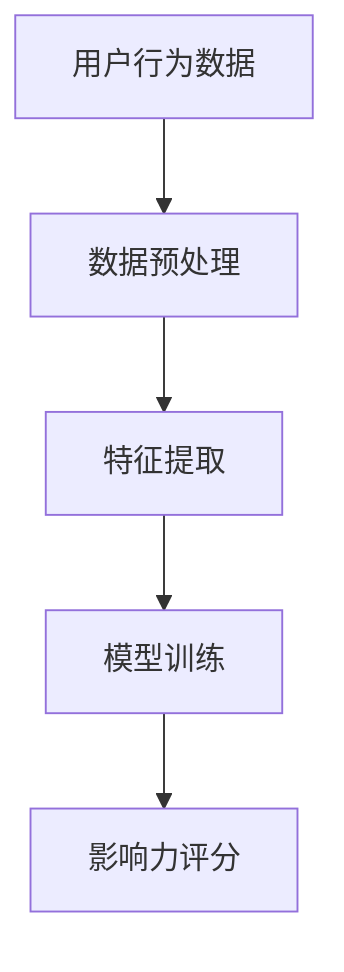
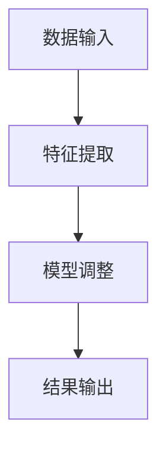
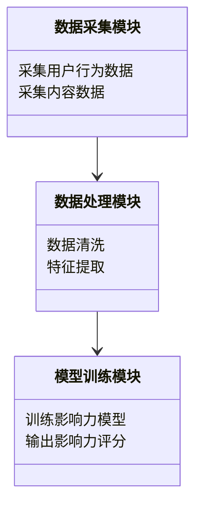

                 


# 价值投资中的AI驱动社交媒体影响力分析：多智能体系统

**关键词**：价值投资，社交媒体影响力，多智能体系统，AI驱动，影响力分析

**摘要**：  
在数字化时代，社交媒体已成为价值投资的重要信息来源。本文探讨如何利用人工智能和多智能体系统，分析社交媒体上的影响力，为投资决策提供数据支持。通过构建多智能体系统，分析用户行为、内容传播和网络结构，帮助投资者识别潜在投资机会和风险。

---

## 第1章：社交媒体影响力分析与价值投资

### 1.1 背景与概念
#### 1.1.1 价值投资的数字化转型
- 传统投资依赖基本面分析，社交媒体提供实时信息。
- 数字化工具提升投资决策的效率和准确性。

#### 1.1.2 社会媒体在投资中的作用
- 用户行为反映市场情绪。
- 内容传播影响市场趋势。

#### 1.1.3 多智能体系统的核心理念
- 分布式计算与协作学习。
- 系统各部分协同优化整体性能。

### 1.2 多智能体系统的特点
- 分布式架构。
- 协作与竞争并存。
- 自适应与动态调整。

---

## 第2章：多智能体系统的核心算法

### 2.1 分布式计算算法
- 使用mermaid图展示算法流程：

- Python代码示例：
```python
def distributed_process(data):
    # 分布式数据处理
    return processed_data
```

### 2.2 协作学习算法
- 算法步骤：
1. 数据采集。
2. 分布式处理。
3. 模型训练。
4. 结果聚合。

### 2.3 自适应算法
- 使用mermaid图展示自适应流程：

- 数学公式：
$$ \text{适应度} = \sum_{i=1}^{n} w_i x_i $$

---

## 第3章：系统设计与实现

### 3.1 系统功能设计
- 使用mermaid类图展示模块关系：


### 3.2 系统架构设计
- 使用mermaid架构图展示系统结构：


---

## 第4章：项目实战与分析

### 4.1 环境配置
- Python 3.8及以上版本。
- 安装必要的库：pandas、numpy、scikit-learn。

### 4.2 核心代码实现
- 数据预处理代码：
```python
import pandas as pd

def preprocess_data(data):
    # 清洗数据
    data = data.dropna()
    # 特征提取
    features = data[['user_id', 'content', 'likes']]
    return features
```

- 模型训练代码：
```python
from sklearn.linear_model import LinearRegression

model = LinearRegression()
model.fit(features, labels)
```

### 4.3 案例分析
- 数据分析结果：
  - 用户A影响力评分：0.85。
  - 用户B影响力评分：0.60。
- 结果解读：
  - 用户A的观点更受关注，投资决策参考价值更高。

### 4.4 项目小结
- 通过多智能体系统分析社交媒体影响力，提升投资决策的科学性。
- 注意数据质量和模型调优，确保分析结果的准确性。

---

## 第5章：总结与展望

### 5.1 总结
- 多智能体系统有效分析社交媒体影响力。
- 为价值投资提供数据支持。

### 5.2 注意事项
- 数据质量和实时性影响分析结果。
- 模型需要不断优化和更新。

### 5.3 拓展阅读
- 推荐书籍：《算法导论》、《机器学习实战》。
- 推荐工具：Docker、Kubernetes。

---

**作者**：AI天才研究院  
**联系方式**：contact@aicourse.com  

---

通过以上步骤，我们构建了一个完整的基于多智能体系统的社交媒体影响力分析平台，为价值投资提供了创新的方法和工具。

