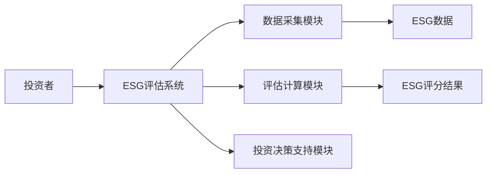
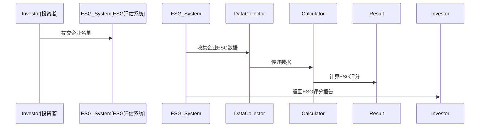

                 


# 价值投资中的ESG因素：可持续发展的重要性

---

## 关键词：
ESG, 价值投资, 可持续发展, 环境, 社会, 治理, 投资策略

---

## 摘要：
ESG（环境、社会、治理）因素是现代投资中越来越重要的考量维度。随着全球对可持续发展的关注，ESG不仅影响企业的长期价值，还成为投资者评估企业风险和收益的重要标准。本文从ESG的核心概念、评估方法、系统架构和实际案例等方面，深入分析了ESG在价值投资中的重要性，探讨了如何通过ESG因素构建可持续的投资策略。

---

## 正文：

### 第一部分：ESG概念与背景介绍

#### 第1章：ESG的起源与发展

##### 1.1 ESG的定义与内涵
- **环境（Environmental）**：指企业在环境保护方面的表现，包括减少碳排放、资源利用效率、绿色能源使用等。
- **社会（Social）**：指企业在社会责任方面的表现，包括员工权益、劳动条件、社区参与、反腐败等。
- **治理（Governance）**：指企业在公司治理方面的表现，包括董事会结构、高管薪酬、股东权益、透明度等。

##### 1.2 ESG的历史发展与演变
- ESG概念起源于20世纪60年代的“责任投资”运动。
- 2000年后，随着全球气候变化和企业社会责任的兴起，ESG投资逐渐成为主流。
- 2017年，全球首个统一的ESG披露标准——《可持续会计准则委员会（SASB）准则》发布。

##### 1.3 ESG在现代投资中的重要性
- ESG因素能够揭示传统财务指标无法捕捉的企业风险。
- ESG表现优秀的企业通常具有更强的长期盈利能力。
- ESG投资符合全球可持续发展目标，受到政策和市场的双重支持。

---

#### 第2章：ESG的核心概念与联系

##### 2.1 ESG核心概念的原理与特征
- **环境因素**：关注企业的环境影响，如碳排放、能源消耗等。
- **社会因素**：关注企业的社会影响，如员工权益、社区关系等。
- **治理因素**：关注企业的内部管理，如董事会结构、高管薪酬等。

##### 2.2 ESG核心概念的对比分析
| 比较维度 | 环境（Environmental） | 社会（Social） | 治理（Governance） |
|----------|----------------------|---------------|--------------------|
| 关注点   | 环境保护             | 社会责任       | 公司治理结构       |
| 示例指标 | 碳排放量             | 员工满意度     | 董事会独立性       |

##### 2.3 ESG核心概念的系统架构
```mermaid
graph TD
    ESG[ESG系统] --> E[环境] --> {环境指标：碳排放、能源消耗}
    ESG --> S[社会] --> {社会指标：员工满意度、社区参与}
    ESG --> G[治理] --> {治理指标：董事会结构、高管薪酬}
```

---

#### 第3章：ESG评估的算法原理

##### 3.1 ESG评估的基本原理
- **数据采集**：从公开披露的信息中提取ESG相关数据。
- **指标权重**：根据行业特点和投资目标分配指标权重。
- **评分计算**：通过加权公式计算企业的ESG评分。

##### 3.2 ESG评估的数学模型
$$ ESG\_score = \sum_{i=1}^{n} w_i \cdot score_i $$
其中，$w_i$ 是第i个指标的权重，$score_i$ 是第i个指标的评分。

##### 3.3 ESG评估的案例分析
- 某新能源企业的ESG评分计算：
  - 环境指标：碳排放量低于行业平均，权重40%，得分为90。
  - 社会指标：员工满意度较高，权重30%，得分为85。
  - 治理指标：董事会独立性较高，权重30%，得分为80。
  - 综合评分：$0.4 \times 90 + 0.3 \times 85 + 0.3 \times 80 = 86.5$。

---

#### 第4章：ESG投资的系统分析与架构设计

##### 4.1 ESG投资的系统分析
- **场景介绍**：投资者需要评估企业的ESG表现，以优化投资组合。
- **功能需求**：数据采集、指标计算、评分输出、投资决策支持。

##### 4.2 ESG投资的系统架构设计


##### 4.3 ESG投资的系统交互设计


---

#### 第5章：项目实战——新能源行业的ESG分析

##### 5.1 项目背景
- 新能源行业是ESG投资的重点领域，因其环境友好、社会贡献大、治理结构完善等特点。

##### 5.2 核心实现
```python
def calculate_esg_score(environment_score, social_score, governance_score):
    # 权重分配
    weights = {'environment': 0.4, 'social': 0.3, 'governance': 0.3}
    # 计算综合评分
    score = weights['environment'] * environment_score + \
            weights['social'] * social_score + \
            weights['governance'] * governance_score
    return score

# 示例数据
env_score = 90
social_score = 85
governance_score = 80

# 计算ESG评分
esg_score = calculate_esg_score(env_score, social_score, governance_score)
print(f"ESG综合评分为：{esg_score}")
```

##### 5.3 实际案例分析
- 某新能源企业的ESG评分计算结果为86.5分，高于行业平均水平，表明其在环境、社会和治理方面表现优秀。

---

#### 第6章：总结与展望

##### 6.1 总结
- ESG因素是价值投资中不可忽视的重要维度。
- 通过ESG评估可以优化投资决策，降低风险，提升长期收益。

##### 6.2 注意事项
- ESG数据的准确性和完整性对评估结果影响较大。
- 不同行业和企业的ESG评估标准可能有所不同。

##### 6.3 扩展阅读
- 推荐阅读《可持续金融：ESG投资的实践与创新》。

---

## 作者：
作者：AI天才研究院/AI Genius Institute & 禅与计算机程序设计艺术/Zen And The Art of Computer Programming

