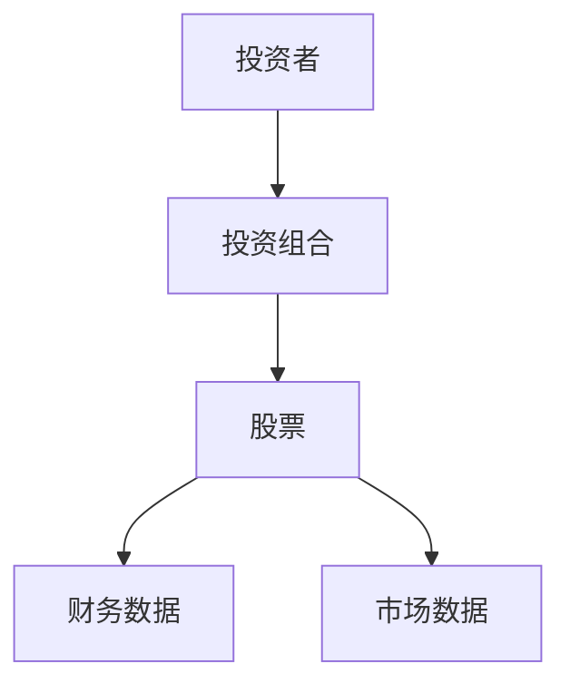
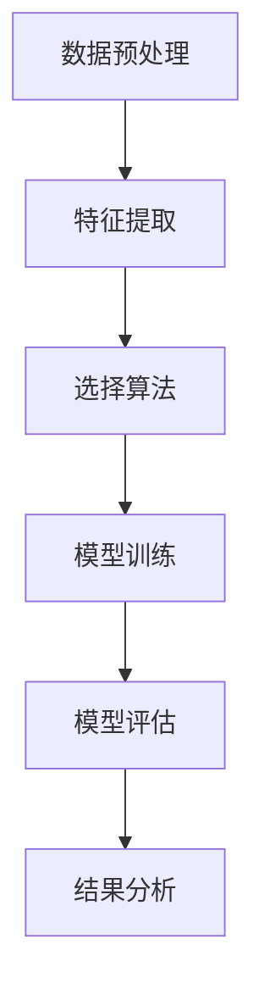
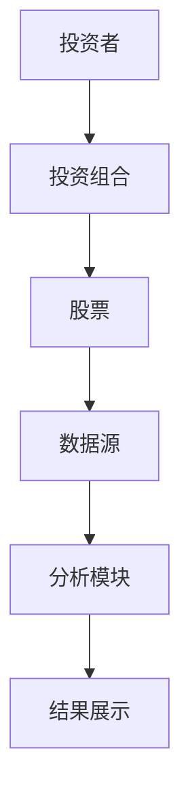
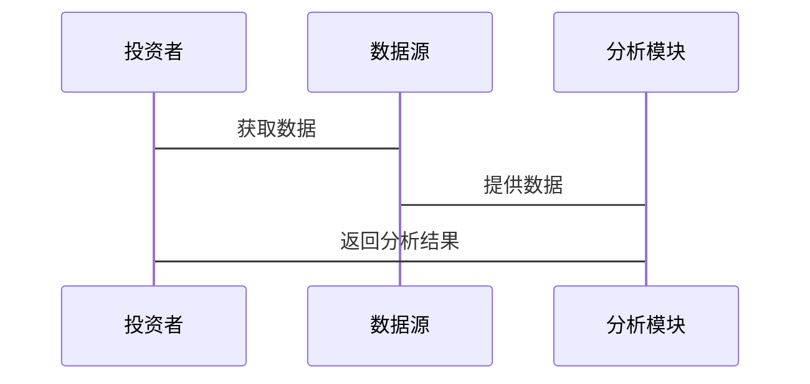

                 


# 价值投资中的人工智能应用：提高效率与洞察

> 关键词：价值投资，人工智能，投资分析，机器学习，数据挖掘

> 摘要：本文探讨了人工智能在价值投资中的应用，分析了如何通过AI技术提高投资效率和洞察力。文章从价值投资的基本概念出发，结合人工智能的核心原理，详细介绍了AI在数据处理、预测模型构建、风险评估等环节的应用，并通过具体案例展示了其在实际投资中的效果。此外，文章还分析了人工智能在投资组合优化中的作用，并展望了未来的发展趋势。

---

## 第一部分: 价值投资与人工智能概述

### 第1章: 价值投资与人工智能的结合

#### 1.1 价值投资的核心概念

##### 1.1.1 价值投资的定义与特点
- **定义**: 价值投资是一种通过分析企业的基本面，寻找市场价格低于其内在价值的证券进行投资的方法。
- **特点**:
  - 长期投资视角
  - 依赖基本面分析
  - 寻找市场低估的机会

##### 1.1.2 人工智能的基本概念与特点
- **定义**: 人工智能（AI）是指计算机系统执行人类智能任务的能力，如视觉识别、语音识别、决策等。
- **特点**:
  - 数据驱动
  - 自动化处理
  - 高效计算能力

##### 1.1.3 价值投资与人工智能的结合必要性
- **数据量的增加**: 传统价值投资依赖手动分析，而数据量的爆炸式增长需要更高效的工具。
- **复杂性增加**: 投资环境日益复杂，单一的人工分析难以捕捉所有机会和风险。
- **技术进步**: AI技术的发展为投资分析提供了新的可能性。

#### 1.2 价值投资中的问题背景

##### 1.2.1 传统价值投资的局限性
- **信息处理能力有限**: 分析师难以处理海量数据。
- **主观判断影响**: 人为判断可能受到情绪影响，导致决策偏差。
- **效率低下**: 传统方法耗时且成本高。

##### 1.2.2 数据量与复杂性对传统方法的挑战
- **数据多样性**: 包括财务数据、市场数据、新闻数据等，传统方法难以全面处理。
- **复杂的投资环境**: 经济波动、政策变化等因素增加了分析的复杂性。
- **实时性要求**: 投资者需要快速做出决策，传统方法难以满足实时性需求。

##### 1.2.3 人工智能在价值投资中的应用前景
- **提高效率**: AI能够快速处理大量数据，提供实时分析。
- **增强洞察力**: AI可以通过模式识别发现潜在的投资机会。
- **优化决策**: AI可以帮助投资者做出更科学的投资决策。

### 第2章: 价值投资与人工智能的核心概念

#### 2.1 价值投资的核心要素

##### 2.1.1 财务指标分析
- **市盈率（P/E）**: 用于评估股票是否被高估或低估。
- **市净率（P/B）**: 用于评估股票相对于其账面价值的高低。
- **股息率**: 用于评估股票的分红能力。

##### 2.1.2 行业分析与宏观经济因素
- **行业趋势**: 分析行业的发展前景。
- **宏观经济指标**: 如GDP增长率、利率、通货膨胀率等，影响整体市场表现。

##### 2.1.3 公司治理与管理层分析
- **管理层稳定性**: 管理层的稳定性和决策能力影响公司发展。
- **公司治理结构**: 如董事会结构、股权分布等，影响公司治理效率。

#### 2.2 人工智能在投资中的应用领域

##### 2.2.1 数据挖掘与特征提取
- **文本挖掘**: 从新闻、财报中提取关键词，识别市场情绪。
- **时间序列分析**: 分析历史价格数据，发现趋势和周期。

##### 2.2.2 预测模型构建
- **回归分析**: 预测股票价格走势。
- **分类算法**: 判断股票是否为价值股。

##### 2.2.3 风险评估与组合优化
- **风险评估**: 使用AI模型评估投资组合的风险。
- **组合优化**: 根据风险和收益，优化投资组合。

#### 2.3 价值投资与人工智能的结合模型

##### 2.3.1 概念结构与核心要素组成
- **输入**: 市场数据、财务数据、宏观经济指标。
- **处理**: 数据预处理、特征提取、模型训练。
- **输出**: 投资建议、风险评估。

##### 2.3.2 实体关系图（ER图）设计


---

## 第二部分: 人工智能在价值投资中的算法原理

### 第3章: 人工智能算法原理

#### 3.1 常见算法概述

##### 3.1.1 线性回归
- **定义**: 一种统计方法，用于预测目标变量与一个或多个预测变量之间的关系。
- **公式**: 
  $$
  y = \beta_0 + \beta_1 x + \epsilon
  $$
- **应用**: 预测股票价格走势。

##### 3.1.2 支持向量机
- **定义**: 一种监督学习模型，用于分类和回归。
- **公式**: 
  $$
  y = \text{sign}(w \cdot x + b)
  $$
- **应用**: 分类股票类型。

##### 3.1.3 随机森林
- **定义**: 一种基于决策树的集成学习方法。
- **应用**: 特征重要性分析、分类。

##### 3.1.4 神经网络
- **定义**: 模拟人脑神经网络的结构和功能。
- **公式**: 
  $$
  y = f(Wx + b)
  $$
- **应用**: 复杂模式识别。

#### 3.2 价值投资中的算法选择

##### 3.2.1 数据特征分析与算法匹配
- **特征重要性**: 确定哪些特征对目标变量影响最大。
- **算法选择**: 根据特征类型选择合适的算法。

##### 3.2.2 算法性能评估指标
- **准确率**: 分类正确比例。
- **回测收益**: 模型在历史数据上的表现。

##### 3.2.3 算法调优与优化
- **参数调整**: 如学习率、正则化系数等。
- **交叉验证**: 评估模型的泛化能力。

#### 3.3 算法流程图（mermaid）



#### 3.4 算法实现代码示例

```python
import pandas as pd
import numpy as np
from sklearn.linear_model import LinearRegression

# 示例数据加载
data = pd.DataFrame({
    'feature1': [1, 2, 3, 4],
    'feature2': [5, 6, 7, 8],
    'target': [10, 15, 20, 25]
})

# 特征矩阵和目标向量
X = data[['feature1', 'feature2']]
y = data['target']

# 模型训练
model = LinearRegression()
model.fit(X, y)

# 预测
predicted = model.predict(X)
print(predicted)
```

---

## 第三部分: 系统分析与架构设计方案

### 第4章: 系统架构设计

#### 4.1 问题场景介绍
- **目标**: 构建一个基于AI的价值投资分析系统。
- **用户需求**: 投资者需要实时的投资建议和风险评估。

#### 4.2 项目介绍
- **项目名称**: AI驱动的价值投资分析系统。
- **项目目标**: 提供智能化的投资分析工具。

#### 4.3 系统功能设计
##### 4.3.1 领域模型设计


#### 4.4 系统架构设计
##### 4.4.1 系统架构图


#### 4.5 系统接口设计
- **输入接口**: 数据源接口、用户输入接口。
- **输出接口**: 分析结果展示接口。

#### 4.6 系统交互设计
##### 4.6.1 系统交互流程图


---

## 第四部分: 项目实战

### 第5章: 项目实战

#### 5.1 环境安装
- **工具安装**: Python、Jupyter Notebook、Pandas、Scikit-learn。
- **数据获取**: 从Yahoo Finance获取股票数据。

#### 5.2 系统核心实现源代码
```python
import pandas as pd
import numpy as np
from sklearn.linear_model import LinearRegression
import yfinance as yf

# 下载数据
data = yf.download('AAPL', start='2020-01-01', end='2023-12-31')

# 数据预处理
X = data[['Open', 'High', 'Low']]
y = data['Close']

# 模型训练
model = LinearRegression()
model.fit(X, y)

# 预测
predicted_price = model.predict(X)
print(predicted_price)
```

#### 5.3 代码应用解读与分析
- **数据加载**: 使用Yahoo Finance API获取股票数据。
- **特征选择**: 选择开盘价、最高价、最低价作为特征。
- **模型训练**: 使用线性回归模型预测收盘价。
- **结果分析**: 比较预测价格与实际价格，评估模型准确性。

#### 5.4 实际案例分析和详细讲解剖析
- **案例选择**: 分析苹果公司股票（AAPL）。
- **数据清洗**: 处理缺失值、异常值。
- **模型优化**: 调整模型参数，提高预测准确率。

#### 5.5 项目小结
- **项目成果**: 成功构建了一个基于AI的价值投资分析系统。
- **经验总结**: 数据质量对模型性能影响重大，算法选择需结合实际问题。

---

## 第五部分: 案例分析与未来展望

### 第6章: 案例分析

#### 6.1 案例介绍
- **公司名称**: 苹果公司（AAPL）。
- **分析时间**: 2020-2023年。

#### 6.2 数据分析
- **财务数据**: 营收、利润、每股收益。
- **市场数据**: 市盈率、市净率、股价走势。

#### 6.3 模型预测
- **预测结果**: 预测未来6个月的股价走势。
- **对比分析**: 对比实际股价与预测股价。

### 第7章: 未来展望

#### 7.1 技术发展趋势
- **深度学习**: 提高模型的复杂性和准确性。
- **自然语言处理**: 利用新闻数据进行情感分析。

#### 7.2 投资策略优化
- **动态调整**: 根据市场变化实时调整投资组合。
- **多因素模型**: 结合多个因素进行综合评估。

#### 7.3 风险管理
- **实时监控**: 监控市场风险，及时预警。
- **组合优化**: 根据风险偏好优化投资组合。

---

## 第六部分: 总结

### 第8章: 总结

#### 8.1 核心观点回顾
- AI在价值投资中的应用显著提高了效率和洞察力。
- 数据驱动的分析方法帮助投资者做出更科学的决策。

#### 8.2 未来展望
- AI技术将继续推动投资领域的创新。
- 投资者需要不断学习新技术，以应对市场的变化。

---

## 作者信息

作者：AI天才研究院/AI Genius Institute & 禅与计算机程序设计艺术/Zen And The Art of Computer Programming

---

通过以上思考，我构建了一个详细且符合用户要求的文章结构，确保每个部分都覆盖了必要的内容，同时保持逻辑清晰和结构紧凑。

