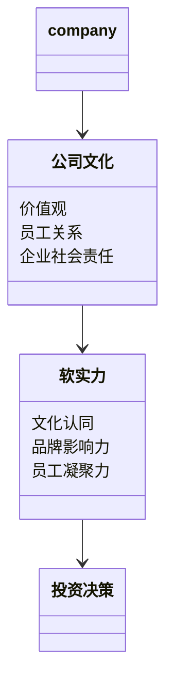

                 


# 价值投资中的公司文化：软实力的重要性

## 关键词：价值投资、公司文化、软实力、投资决策、企业价值

## 摘要：  
在价值投资中，公司文化作为企业的“软实力”，对企业的长期价值和投资吸引力具有重要影响。本文从软实力的核心概念出发，分析其对投资决策的影响，探讨如何通过量化模型和系统架构设计，评估和提升公司的软实力，从而在投资中实现更高的回报。

---

## 第一部分：背景介绍

### 第1章：价值投资与公司文化的背景

#### 1.1 价值投资的核心概念
- **1.1.1 价值投资的定义与历史发展**  
  价值投资是一种以低于市场价买入优质资产的投资策略，其核心在于寻找被市场低估的企业。这种方法起源于本杰明·格雷厄姆的理论，强调对企业基本面的深入分析。

- **1.1.2 公司文化在价值投资中的地位**  
  公司文化是企业的灵魂，决定了企业的长期发展方向和员工的凝聚力。在价值投资中，公司文化被视为评估企业价值的重要因素之一，因为它直接影响企业的创新能力和应对市场变化的能力。

- **1.1.3 软实力的定义与内涵**  
  软实力是指企业的文化、品牌、员工关系等非财务因素，这些因素通过塑造企业形象和员工凝聚力，间接影响企业的市场表现和长期价值。

#### 1.2 价值投资中的问题背景
- **1.2.1 传统财务指标的局限性**  
  传统的财务指标如市盈率、ROE等虽然重要，但它们无法全面反映企业的软实力，忽视了文化和员工凝聚力对企业价值的影响。

- **1.2.2 公司文化对企业长期价值的影响**  
  企业文化的强弱直接影响企业的市场地位和盈利能力。一个积极向上的企业文化能够提升员工的创造力和企业抗风险能力，从而增强企业的长期价值。

- **1.2.3 软实力在投资决策中的重要性**  
  在价值投资中，软实力是区分企业优劣的重要标准。优秀的公司文化能够吸引优秀人才，提高企业的运营效率，进而提升企业的市场竞争力。

#### 1.3 问题解决与边界
- **1.3.1 如何通过软实力提升企业价值**  
  通过优化企业文化、增强品牌影响力和提升员工凝聚力，可以显著提升企业的市场竞争力和长期价值。

- **1.3.2 软实力的边界与外延**  
  软实力虽然重要，但它并非万能的。在实际投资中，软实力需要与其他硬实力（如财务状况、技术水平）相结合，才能发挥最大作用。

- **1.3.3 核心要素组成与结构化分析**  
  公司文化的软实力由价值观、品牌影响力和员工凝聚力三部分组成。这些要素相互关联，共同影响企业的市场表现和投资价值。

---

## 第二部分：核心概念与联系

### 第2章：软实力的核心概念与原理

#### 2.1 软实力的属性特征对比
- **2.1.1 软实力与硬实力的对比分析**  
  软实力注重企业的文化、品牌和员工关系，而硬实力关注企业的财务状况、技术水平和市场份额。两者相辅相成，共同决定企业的市场竞争力。

- **2.1.2 软实力的三大核心属性**  
  - **文化认同**：企业的核心价值观和使命愿景，影响员工的工作态度和企业的长期发展方向。  
  - **品牌影响力**：企业的市场声誉和品牌价值，直接影响企业的市场地位和客户忠诚度。  
  - **员工凝聚力**：员工的归属感和团队协作能力，直接影响企业的运营效率和创新能力。

#### 2.2 软实力的ER实体关系图


---

## 第三部分：算法原理与数学模型

### 第3章：软实力对投资决策的影响

#### 3.1 软实力的量化模型
- **3.1.1 软实力指数的构建**  
  软实力指数（C）可以通过对企业文化的评估来构建，具体包括文化认同、品牌影响力和员工凝聚力三个维度。每个维度的权重可以依据企业所处行业和市场环境进行调整。

- **3.1.2 软实力对股价的影响公式**  
  $$ S = \alpha \cdot C + \beta \cdot F + \gamma \cdot E $$
  其中，$C$为软实力指数，$F$为财务指标，$E$为环境因素。$\alpha$、$\beta$、$\gamma$为回归系数，通过历史数据拟合得出。

#### 3.2 实例分析：某公司文化对股价的影响
- **案例分析：科技公司A**  
  假设科技公司A的文化指数为0.8，财务指标为0.7，环境因素为0.6，回归系数分别为0.3、0.5、0.2。根据公式，其股价预测值为：  
  $$ S = 0.3 \cdot 0.8 + 0.5 \cdot 0.7 + 0.2 \cdot 0.6 = 0.24 + 0.35 + 0.12 = 0.71 $$
  该结果表明，公司A的股价具有上涨潜力，值得投资者关注。

---

## 第四部分：系统分析与架构设计

### 第4章：软实力的系统分析

#### 4.1 问题场景介绍
- **问题场景**：某投资者希望评估一家公司的软实力，以决定是否进行投资。  
  - **输入**：公司的企业文化、品牌影响力、员工凝聚力数据。  
  - **输出**：软实力指数和投资建议。

#### 4.2 系统功能设计
- **领域模型图**  
  ```mermaid
  classDiagram
      class 公司文化 {
          价值观
          员工关系
          企业社会责任
      }
      class 软实力 {
          文化认同
          品牌影响力
          员工凝聚力
      }
      company --> 公司文化
      公司文化 --> 软实力
      软实力 --> 投资决策
  ```

---

## 第五部分：项目实战与案例分析

### 第5章：软实力的评估与提升

#### 5.1 

---

## 第六部分：总结与展望

### 第6章：总结与投资策略

#### 6.1 软实力的重要性总结
- 软实力是企业长期价值的重要组成部分，能够显著影响企业的市场竞争力和投资吸引力。在价值投资中，企业文化的评估是判断企业优劣的关键因素之一。

#### 6.2 投资策略与未来趋势
- **投资策略**：投资者应将软实力纳入企业评估体系，重点关注企业的文化认同、品牌影响力和员工凝聚力。  
- **未来趋势**：随着企业软实力的重要性逐渐被认识到，未来的投资决策将更加注重企业的文化和员工关系，软实力将成为区分企业优劣的重要标准。

---

## 作者：AI天才研究院/AI Genius Institute & 禅与计算机程序设计艺术 /Zen And The Art of Computer Programming

---

这篇文章详细探讨了软实力在价值投资中的重要性，通过背景介绍、核心概念、数学模型和系统架构的分析，为投资者提供了新的视角和工具。通过实例分析和项目实战，帮助投资者更好地评估和提升公司的软实力，从而做出更明智的投资决策。

