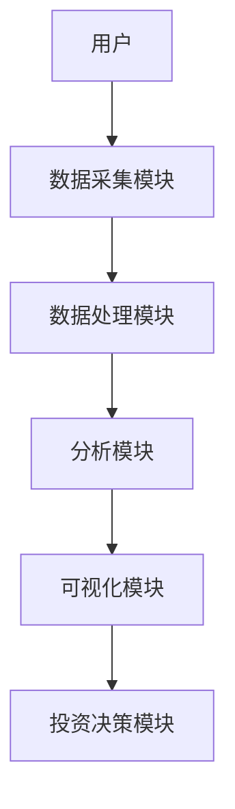
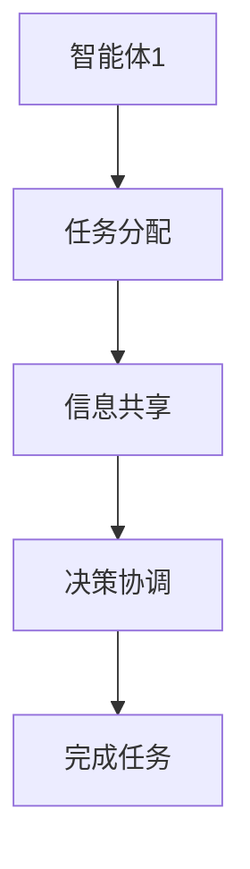
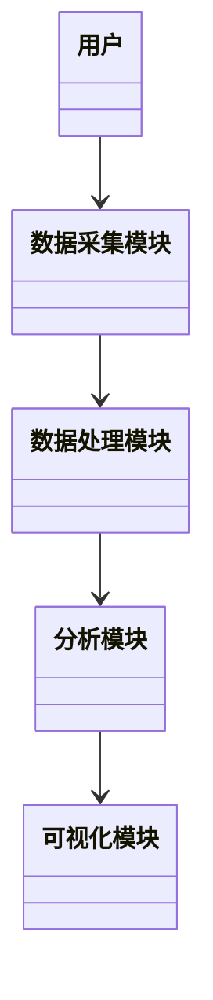
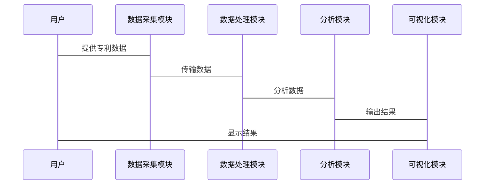

                 


# 价值投资中的多智能体AI专利分析系统

> 关键词：多智能体AI，价值投资，专利分析，机器学习，自然语言处理

> 摘要：本文探讨了多智能体AI在价值投资中的应用，特别是专利分析系统的构建。通过分析多智能体AI的特点、算法原理和系统设计，结合实际案例，展示了如何利用多智能体协作机制和机器学习技术，实现高效的专利数据分析与价值评估，为投资者提供决策支持。

---

## 第1章: 多智能体AI与价值投资的背景与概念

### 1.1 多智能体AI的定义与特点

#### 1.1.1 多智能体AI的基本概念
多智能体AI是指由多个相互作用的智能体组成的系统，每个智能体都有自己的目标和决策机制。这些智能体通过协作完成复杂的任务，从而实现比单个智能体更优的结果。与传统AI不同，多智能体AI强调智能体之间的动态交互和协调。

#### 1.1.2 多智能体AI的核心特点
- **分布式性**：智能体分布在网络中，每个智能体负责特定的任务。
- **协作性**：智能体之间通过信息共享和协作完成共同目标。
- **自主性**：每个智能体能够自主决策，无需中央控制。
- **动态性**：系统能够适应环境的变化，实时调整策略。

#### 1.1.3 多智能体AI与传统AI的对比
以下是多智能体AI与传统AI的对比：

| 对比维度 | 多智能体AI | 传统AI |
|----------|------------|--------|
| 结构      | 分布式     | 集中式 | 
| 智能体    | 多个        | 单个    |
| 协作性    | 高          | 无或低  |
| 应用场景  | 复杂任务     | 简单任务 |

### 1.2 价值投资的基本原理

#### 1.2.1 价值投资的定义与核心理念
价值投资是一种投资策略，强调以低于内在价值的价格购买优质资产。其核心理念是通过分析企业的基本面，寻找被市场低估的投资标的。

#### 1.2.2 价值投资的关键要素
- **企业基本面**：收入、利润、负债等财务指标。
- **行业地位**：企业的市场占有率、竞争能力。
- **管理团队**：公司管理层的稳定性与能力。
- **未来增长潜力**：企业的创新能力和市场扩展能力。

#### 1.2.3 价值投资在现代金融中的地位
价值投资在现代金融中占据重要地位，尤其是在长期投资和机构投资中。然而，随着市场信息的复杂化和碎片化，传统的价值投资方法逐渐面临挑战，需要借助技术手段提高效率和准确性。

### 1.3 多智能体AI在价值投资中的应用背景

#### 1.3.1 价值投资中的信息不对称问题
信息不对称是价值投资中的主要障碍之一。买方和卖方对信息的掌握程度不同，导致价格偏离真实价值。多智能体AI可以通过整合多方数据，减少信息不对称。

#### 1.3.2 AI技术在金融分析中的优势
- **数据处理能力**：AI可以快速处理大量非结构化数据，如新闻、社交媒体、专利文件等。
- **模式识别**：AI能够识别复杂数据中的潜在模式和趋势。
- **实时分析**：AI可以实时监控市场变化，提供及时的决策支持。

#### 1.3.3 多智能体AI在专利分析中的潜在价值
专利是企业创新能力和核心竞争力的体现。通过多智能体AI对专利数据进行分析，可以评估企业的技术优势和市场潜力，为价值投资提供依据。

---

## 第2章: 多智能体AI专利分析系统的概念与框架

### 2.1 多智能体AI专利分析系统的定义

#### 2.1.1 系统的核心概念
多智能体AI专利分析系统是一个由多个智能体组成的协作系统，用于分析专利数据，评估其价值，并为投资决策提供支持。

#### 2.1.2 系统的功能模块划分
- **数据采集模块**：收集专利数据。
- **数据处理模块**：清洗和预处理数据。
- **分析模块**：利用多智能体协作进行专利分析。
- **可视化模块**：将分析结果以可视化形式呈现。

### 2.2 多智能体AI专利分析系统的框架设计

#### 2.2.1 系统的整体架构
多智能体AI专利分析系统的整体架构如下：



#### 2.2.2 系统的核心组件与功能
- **数据采集模块**：从专利数据库中获取专利数据。
- **数据处理模块**：清洗数据，提取关键信息。
- **分析模块**：利用多智能体协作，分析专利的技术价值和市场潜力。
- **可视化模块**：将分析结果以图表形式展示。
- **投资决策模块**：根据分析结果，生成投资建议。

#### 2.2.3 系统的边界与外延
- **输入**：专利数据、市场数据。
- **输出**：专利价值评估报告、投资建议。
- **交互**：与用户、其他系统（如交易系统）进行交互。

### 2.3 本章小结

---

## 第3章: 多智能体AI专利分析系统的算法与数学模型

### 3.1 多智能体协作机制与算法原理

#### 3.1.1 多智能体协作的基本原理
多智能体协作机制包括任务分配、信息共享和决策协调。任务分配通过智能体之间的协商完成，信息共享通过消息传递实现，决策协调则通过达成一致策略完成。

#### 3.1.2 多智能体协作的算法流程
以下是多智能体协作的算法流程：



#### 3.1.3 多智能体协作的数学模型
多智能体协作的数学模型可以用以下公式表示：

$$ V = \sum_{i=1}^{n} v_i $$

其中，$V$ 是系统的总价值，$v_i$ 是第 $i$ 个智能体的价值贡献。

### 3.2 多智能体AI的学习算法

#### 3.2.1 基于强化学习的多智能体协作
强化学习是一种通过试错学习的算法，适用于多智能体协作中的决策问题。以下是强化学习的数学模型：

$$ Q(s, a) = r + \gamma \max_{a'} Q(s', a') $$

其中，$Q(s, a)$ 是状态-动作值函数，$s$ 是当前状态，$a$ 是当前动作，$r$ 是奖励，$\gamma$ 是折扣因子。

#### 3.2.2 多智能体协作中的纳什均衡
纳什均衡是博弈论中的一个概念，表示在多个智能体协作中，每个智能体的策略都是最优的。数学表达式如下：

$$ \forall i, u_i(s_i, \{s_j\}_{j \neq i}) \geq u_i(s'_i, \{s_j\}_{j \neq i}) $$

其中，$u_i$ 是第 $i$ 个智能体的效用函数，$s_i$ 是第 $i$ 个智能体的策略，$\{s_j\}_{j \neq i}$ 是其他智能体的策略。

---

## 第4章: 多智能体AI专利分析系统的系统分析与架构设计

### 4.1 系统应用场景

#### 4.1.1 专利数据分析
多智能体AI专利分析系统可以用于分析专利的技术价值、市场潜力和法律风险。

#### 4.1.2 投资决策支持
系统可以为投资者提供基于专利分析的投资建议，帮助其做出更明智的决策。

### 4.2 系统功能设计

#### 4.2.1 领域模型
以下是系统功能的领域模型：



#### 4.2.2 系统架构设计
以下是系统的架构设计：


#### 4.2.3 接口设计
系统接口设计如下：

- **输入接口**：接收专利数据和市场数据。
- **输出接口**：输出分析结果和投资建议。

#### 4.2.4 交互设计
以下是系统的交互设计：



---

## 第5章: 多智能体AI专利分析系统的项目实战

### 5.1 环境安装

#### 5.1.1 安装Python
安装Python 3.8及以上版本。

#### 5.1.2 安装依赖
安装所需的库，如 `numpy`, `pandas`, `matplotlib`, `scikit-learn`。

### 5.2 核心实现

#### 5.2.1 数据采集模块
以下是数据采集模块的代码：

```python
import requests
import json

def fetch_patent_data(api_key):
    url = f"https://api.example.com/patents?api_key={api_key}"
    response = requests.get(url)
    return json.loads(response.text)
```

#### 5.2.2 数据处理模块
以下是数据处理模块的代码：

```python
import pandas as pd

def process_data(data):
    df = pd.DataFrame(data)
    df.dropna(inplace=True)
    return df
```

#### 5.2.3 分析模块
以下是分析模块的代码：

```python
from sklearn.cluster import KMeans

def analyze_patents(df):
    X = df[['feature1', 'feature2']]
    kmeans = KMeans(n_clusters=3)
    kmeans.fit(X)
    return kmeans.labels_
```

#### 5.2.4 可视化模块
以下是可视化模块的代码：

```python
import matplotlib.pyplot as plt

def visualize_results(labels):
    plt.scatter(range(len(labels)), labels)
    plt.show()
```

### 5.3 案例分析

#### 5.3.1 案例背景
某科技公司拥有一批专利，希望通过多智能体AI专利分析系统评估其技术价值。

#### 5.3.2 数据分析
分析结果显示，该公司的专利在特定领域具有较高的技术价值。

#### 5.3.3 投资建议
基于分析结果，建议投资者加大对该公司的投资。

### 5.4 项目总结

---

## 第6章: 总结与展望

### 6.1 最佳实践 Tips

#### 6.1.1 系统优化建议
- 定期更新算法模型。
- 提高数据处理效率。

#### 6.1.2 技术路线选择
- 结合多智能体AI和深度学习技术。

### 6.2 小结

### 6.3 注意事项

#### 6.3.1 系统维护
- 定期备份数据。
- 监控系统运行状态。

#### 6.3.2 数据隐私
- 注意数据隐私和合规性。

### 6.4 拓展阅读

#### 6.4.1 推荐书籍
- 《多智能体系统》
- 《价值投资实战》

#### 6.4.2 推荐博客
- 多智能体AI博客
- 价值投资博客

---

## 作者：AI天才研究院 & 禅与计算机程序设计艺术

---

**声明：本文为AI天才研究院原创文章，转载请注明出处。**

