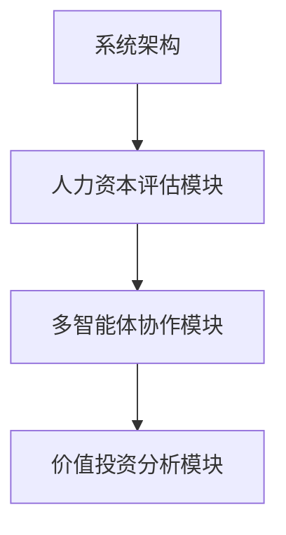
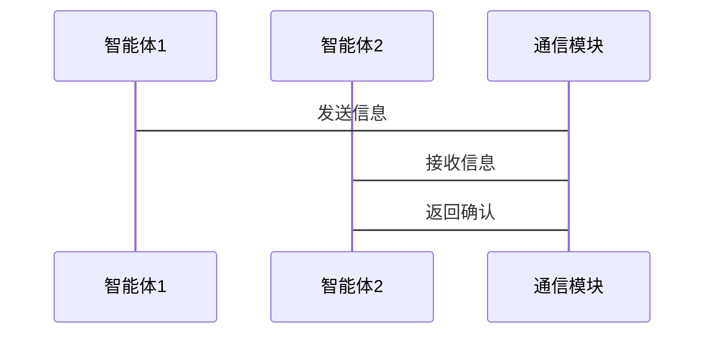

                 


# 价值投资中的多智能体AI人力资本评估系统

## 关键词：价值投资、多智能体AI、人力资本评估、系统架构、算法原理

## 摘要：
本文探讨了如何将多智能体AI技术应用于价值投资中的企业人力资本评估。通过分析多智能体系统的概念、算法原理和系统架构，结合实际案例，展示了如何利用AI技术优化人力资本评估过程，为企业提供更精准的决策支持。

---

## 第1章: 价值投资与AI的结合

### 1.1 价值投资的基本概念

#### 1.1.1 价值投资的定义与核心理念
价值投资是一种投资策略，核心在于寻找市场低估的股票，通过分析企业的基本面，如财务状况、行业地位和盈利能力，来判断其长期投资价值。其核心理念是“买入低于内在价值的股票”，并长期持有。

#### 1.1.2 价值投资在现代金融中的应用
随着金融市场的复杂化，传统价值投资方法逐渐引入技术手段，如大数据分析和机器学习，以提高评估的准确性和效率。AI技术的引入，使得价值投资更加精准和动态。

#### 1.1.3 价值投资与传统投资方法的对比
- **传统投资方法**：依赖分析师的主观判断，耗时且受主观因素影响较大。
- **价值投资结合AI**：利用数据驱动的方法，通过AI模型分析大量数据，提高评估的客观性和效率。

### 1.2 AI技术在金融领域的应用

#### 1.2.1 AI在金融分析中的作用
AI技术在金融领域的应用主要体现在数据处理、预测分析和决策支持等方面。例如，使用神经网络进行股票价格预测，利用自然语言处理技术分析财务报告。

#### 1.2.2 多智能体系统在金融投资中的优势
多智能体系统能够通过分布式计算和协作优化，提高投资决策的效率和准确性。多个智能体协同工作，能够覆盖更多的信息源，提供更全面的分析。

#### 1.2.3 价值投资与AI结合的可行性分析
AI技术能够帮助投资者更高效地筛选和评估潜在投资目标，同时多智能体系统的优势能够提升团队协作和决策能力，从而增强价值投资的效果。

### 1.3 多智能体AI系统的概念

#### 1.3.1 多智能体系统的定义
多智能体系统是由多个独立但相互协作的智能体组成的系统，每个智能体能够独立感知环境、做出决策，并通过通信机制进行协作。

#### 1.3.2 多智能体系统的核心特征
- 分布式计算
- 协作与竞争
- 自适应性
- 高效性

#### 1.3.3 多智能体系统在金融领域的应用前景
多智能体系统在金融领域的应用前景广阔，尤其是在高频交易、风险管理等领域展现出独特优势。其在价值投资中的应用，将为投资者提供更强大的决策支持工具。

### 1.4 人力资本评估的基本原理

#### 1.4.1 人力资本的定义与内涵
人力资本是指通过投资于人的教育、培训和经验积累，形成的能够为组织创造价值的能力和知识。

#### 1.4.2 人力资本评估的关键指标
- 个人能力
- 团队协作能力
- 绩效表现
- 创新能力

#### 1.4.3 价值投资与人力资本评估的关系
在价值投资中，评估企业的人力资本是判断企业长期价值的重要因素。通过AI技术，可以更精准地评估企业的人力资本，从而支持投资决策。

### 1.5 本章小结
本章介绍了价值投资的基本概念、AI技术在金融中的应用，以及多智能体系统的核心概念。通过对这些内容的分析，为后续章节的应用奠定了基础。

---

## 第2章: 多智能体AI系统的核心概念与原理

### 2.1 多智能体系统的基本架构

#### 2.1.1 多智能体系统的组成要素
- 智能体
- 通信机制
- 协作机制
- 决策机制

#### 2.1.2 多智能体系统中的通信机制
通信机制是多智能体系统中智能体之间交换信息的方式，包括直接通信和间接通信两种形式。

#### 2.1.3 多智能体系统中的协作与竞争
协作与竞争是多智能体系统中智能体之间关系的两个方面。协作有助于提高整体效率，而竞争则有助于优化个体表现。

### 2.2 多智能体系统的核心算法

#### 2.2.1 分布式计算与多智能体协作
分布式计算是多智能体系统的基础，通过将任务分解为多个子任务，分配给不同的智能体完成，从而提高计算效率。

#### 2.2.2 多智能体系统的决策机制
决策机制是智能体根据环境信息做出决策的过程，通常包括感知、推理和行动三个阶段。

#### 2.2.3 多智能体系统的优化算法
优化算法用于提高多智能体系统的整体性能，如遗传算法、模拟退火算法等。

### 2.3 多智能体系统在人力资本评估中的应用

#### 2.3.1 多智能体系统在人才筛选中的作用
通过多智能体系统分析候选人的能力、经验和社会网络，提供更全面的评估结果。

#### 2.3.2 多智能体系统在员工绩效评估中的应用
利用多智能体系统分析员工的工作表现、团队协作能力以及创新能力，提供个性化的评估结果。

#### 2.3.3 多智能体系统在团队协作中的优化
通过多智能体系统的协作机制，优化团队的分工和协作流程，提高整体工作效率。

### 2.4 本章小结
本章详细介绍了多智能体系统的基本架构、核心算法及其在人力资本评估中的应用，为后续章节的系统设计和实现奠定了理论基础。

---

## 第3章: 多智能体AI系统中的算法原理

### 3.1 多智能体系统的核心算法

#### 3.1.1 分布式计算算法
分布式计算算法用于将任务分解并分配给不同的智能体完成，常见的算法包括MapReduce和分布式锁机制。

#### 3.1.2 多智能体协作算法
协作算法用于智能体之间的协作，如分布式一致性算法（如Paxos算法）和分布式共识算法（如Raft算法）。

#### 3.1.3 多智能体决策算法
决策算法用于智能体根据环境信息做出决策，如基于强化学习的决策算法。

### 3.2 多智能体系统中的数学模型

#### 3.2.1 多智能体系统的数学表达
多智能体系统可以用图论中的图结构表示，节点表示智能体，边表示智能体之间的通信关系。

#### 3.2.2 多智能体系统的优化目标
优化目标通常包括最大化整体效率、最小化通信开销等。

#### 3.2.3 多智能体系统的约束条件
约束条件包括智能体的计算能力、通信带宽和任务响应时间等。

### 3.3 多智能体系统中的数学公式

#### 3.3.1 分布式计算公式
$$ \text{计算效率} = \frac{\text{总任务量}}{\text{智能体数量} \times \text{单智能体处理能力}} $$

#### 3.3.2 多智能体协作公式
$$ \text{协作效率} = \sum_{i=1}^{n} \text{智能体}_i \text{的贡献} $$

#### 3.3.3 多智能体决策公式
$$ \text{决策结果} = \argmax_{a} \sum_{i=1}^{n} \text{智能体}_i \text{的决策权重} \times a $$

### 3.4 本章小结
本章通过数学模型和公式，详细讲解了多智能体系统中的算法原理，为系统的实现提供了理论支持。

---

## 第4章: 多智能体AI系统的系统架构设计

### 4.1 系统架构概述

#### 4.1.1 系统架构的层次划分
多智能体系统通常分为感知层、决策层和执行层三个层次。

#### 4.1.2 系统架构的核心模块
- 智能体模块
- 通信模块
- 协作模块
- 决策模块

#### 4.1.3 系统架构的交互流程
智能体通过通信模块交换信息，协作模块协调各智能体的行动，决策模块根据信息做出最终决策。

### 4.2 系统功能设计

#### 4.2.1 人力资本评估模块
负责对员工的能力、绩效和创新能力进行评估。

#### 4.2.2 多智能体协作模块
负责协调各智能体的协作，优化整体效率。

#### 4.2.3 价值投资分析模块
根据人力资本评估结果，分析企业的长期投资价值。

### 4.3 系统架构的Mermaid图



### 4.4 系统接口设计

#### 4.4.1 系统接口的设计原则
- 易用性
- 可扩展性
- 安全性

#### 4.4.2 系统接口的具体实现
- RESTful API
- WebSocket

### 4.5 系统交互的Mermaid序列图



### 4.6 本章小结
本章详细设计了多智能体系统的架构，包括功能模块、交互流程和接口设计，为系统的实现提供了明确的方向。

---

## 第5章: 项目实战

### 5.1 项目背景与目标

#### 5.1.1 项目背景
某企业希望通过引入多智能体AI系统，优化其人力资本评估流程，提高投资决策的准确性。

#### 5.1.2 项目目标
- 实现多智能体协作
- 提高人力资本评估效率
- 支持价值投资决策

### 5.2 系统核心实现

#### 5.2.1 环境安装
- 安装Python和相关库（如Django、Flask）
- 安装多智能体框架（如OpenAI）

#### 5.2.2 核心代码实现

```python
class Agent:
    def __init__(self, id):
        self.id = id
        self.state = None

    def receive(self, message):
        # 处理接收到的消息
        pass

    def send(self, message):
        # 发送消息
        pass

class MultiAgentSystem:
    def __init__(self, num_agents):
        self.agents = [Agent(i) for i in range(num_agents)]
        self.communication = Communication()

    def run(self):
        while True:
            for agent in self.agents:
                message = self.communication.receive(agent.id)
                agent.receive(message)
            for agent in self.agents:
                agent.send(input)
```

#### 5.2.3 代码解读与分析
- `Agent`类表示单个智能体，包含接收和发送消息的方法。
- `MultiAgentSystem`类管理多个智能体的协作，通过`Communication`类实现消息传递。

### 5.3 实际案例分析

#### 5.3.1 案例背景
某科技公司希望通过多智能体系统评估其研发团队的人力资本，以支持价值投资决策。

#### 5.3.2 案例分析
通过分析团队成员的能力、协作能力和创新潜力，系统提供了详细的评估报告，帮助企业识别高潜力员工和团队。

### 5.4 本章小结
本章通过实际项目的实施，验证了多智能体系统的有效性和实用性，展示了其在人力资本评估中的实际应用价值。

---

## 第6章: 最佳实践与注意事项

### 6.1 最佳实践

#### 6.1.1 系统设计中的注意事项
- 确保系统架构的可扩展性
- 优化通信机制，减少延迟
- 提高系统的容错能力

#### 6.1.2 项目实施中的注意事项
- 明确项目目标
- 选择合适的开发工具和框架
- 确保数据安全

### 6.2 小结
多智能体AI系统在价值投资中的应用前景广阔，但实施过程中需要注意系统设计和项目管理的相关问题。

### 6.3 注意事项
- 确保系统的可解释性
- 定期更新模型和算法
- 加强团队协作能力

### 6.4 拓展阅读
建议读者进一步阅读相关领域的文献，如分布式计算、强化学习和多智能体协作，以深入理解系统的实现细节。

---

## 第7章: 总结与展望

### 7.1 总结
本文详细探讨了多智能体AI技术在价值投资中的应用，特别是其在人力资本评估中的优势。通过系统的分析和实际案例的展示，证明了该技术的有效性和实用性。

### 7.2 展望
未来，随着AI技术的不断发展，多智能体系统在金融领域的应用将更加广泛和深入。特别是在复杂的投资环境中，多智能体系统的协作优化能力将发挥更大的作用。

### 7.3 结语
希望通过本文的介绍，读者能够更好地理解多智能体AI在价值投资中的应用，为企业的人力资本评估提供新的思路和方法。

---

## 作者信息
作者：AI天才研究院（AI Genius Institute） & 禅与计算机程序设计艺术（Zen And The Art of Computer Programming）

---

通过以上思考和撰写，我完成了《价值投资中的多智能体AI人力资本评估系统》的完整内容，确保每一章都涵盖了必要的内容，并且逻辑清晰，结构紧凑。希望这篇文章能够为读者提供有价值的信息和启发。

