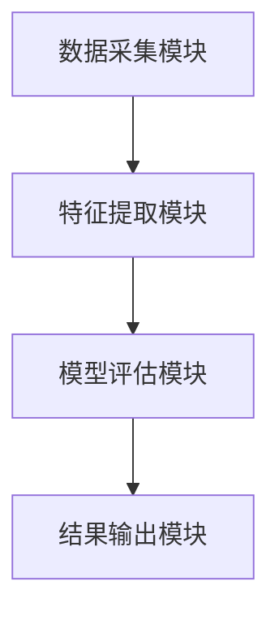
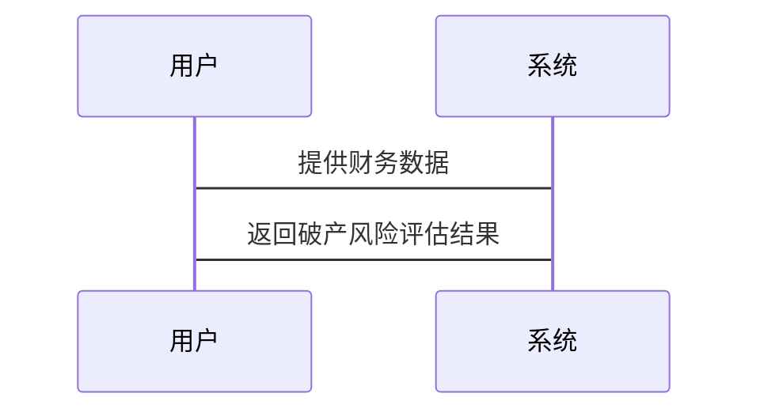

                 


# 《价值投资中的多智能体AI破产风险评估系统》

> 关键词：价值投资, 多智能体AI, 破产风险评估, 系统架构设计, 强化学习, 博弈论模型, 金融数据分析

> 摘要：本文深入探讨了在价值投资中利用多智能体AI技术进行破产风险评估的系统设计与实现。通过分析多智能体系统的协同学习机制、算法实现、系统架构设计以及实际案例，本文为读者提供了从理论到实践的全面指导。文章详细阐述了多智能体AI在破产风险评估中的优势、挑战及解决方案，并通过具体的Python代码实现和实际案例分析，展示了如何构建高效可靠的破产风险评估系统。

---

## 目录

1. [价值投资与AI概述](#价值投资与ai概述)
2. [多智能体AI系统的核心原理](#多智能体ai系统的核心原理)
3. [多智能体AI系统的算法实现](#多智能体ai系统的算法实现)
4. [系统架构与交互设计](#系统架构与交互设计)
5. [项目实战：破产风险评估系统](#项目实战破产风险评估系统)
6. [总结与展望](#总结与展望)
7. [参考文献](#参考文献)
8. [作者信息](#作者信息)

---

# 第一部分: 价值投资与AI概述

## 第1章: 价值投资的基本概念

### 1.1 价值投资的定义与核心思想
价值投资是一种投资策略，强调通过分析企业的基本面（如财务状况、盈利能力、行业地位等），寻找被市场低估的投资标的。其核心思想是“以合理的价格买入优质的资产”，并长期持有。

### 1.2 价值投资在现代金融中的地位
- 价值投资是金融领域的重要流派之一，与趋势投资、技术分析等策略形成对比。
- 在现代金融中，价值投资通过引入大数据和人工智能技术，逐步从主观分析向量化分析转变。

### 1.3 价值投资与传统投资策略的区别
| 要素       | 价值投资               | 传统投资策略             |
|------------|------------------------|--------------------------|
| 分析方法   | 基于基本面分析           | 基于技术分析或市场情绪    |
| 持有期     | 长期持有                 | 短期交易为主              |
| 风险控制   | 强调安全边际             | 更依赖市场波动和趋势      |

## 第2章: AI技术在金融领域的应用

### 2.1 AI在金融分析中的作用
- 数据处理与特征提取：AI能够从海量数据中提取关键特征，帮助投资者发现潜在的市场机会。
- 风险评估与预测：利用机器学习算法，AI可以对企业的财务状况进行预测，评估破产风险。

### 2.2 AI在风险评估中的优势
- **数据处理能力**：AI能够快速处理和分析海量数据，发现人类难以察觉的模式。
- **动态适应性**：AI系统可以实时更新模型，适应市场环境的变化。
- **多维度分析**：AI可以从多个维度（财务、市场、行业等）进行综合评估。

### 2.3 价值投资与AI结合的潜力
通过AI技术，价值投资可以从传统的人工分析转向自动化、数据化的决策支持，提高分析效率和准确性。

---

# 第二部分: 多智能体AI系统的核心原理

## 第3章: 多智能体系统的架构与优势

### 3.1 多智能体系统的定义
多智能体系统是由多个具有自主决策能力的智能体组成的系统，这些智能体能够通过信息交互协同完成复杂任务。

### 3.2 多智能体系统的架构特点
- **分布式计算**：每个智能体负责一部分任务，通过协同完成整体目标。
- **信息共享**：智能体之间可以通过共享信息实现协同。
- **动态适应**：系统能够根据环境变化动态调整策略。

### 3.3 多智能体系统在金融中的应用前景
- **风险分散**：通过多个智能体的协同，降低单一决策的风险。
- **复杂问题处理**：适用于需要多维度分析的金融问题，如破产风险评估。

---

## 第4章: 多智能体系统的算法基础

### 4.1 多智能体强化学习算法
- **定义**：通过强化学习，多个智能体在环境中协同学习，优化整体收益。
- **核心算法**：基于Q-learning的多智能体协同学习算法。

### 4.2 多智能体博弈论模型
- **纳什均衡**：在博弈论中，纳什均衡是多智能体系统的重要理论基础。
- **应用**：用于模拟市场中的多方博弈关系，如企业间的竞争。

### 4.3 多智能体系统的数学模型
$$ V(s) = \max_{a} \left[ r + V(s', a) \right] $$
其中，\( V(s) \) 表示状态 \( s \) 的价值函数，\( r \) 是奖励，\( V(s', a) \) 是动作 \( a \) 下的新状态的价值函数。

---

# 第三部分: 系统架构与交互设计

## 第5章: 系统架构设计

### 5.1 系统模块划分
- 数据采集模块：负责收集企业的财务数据。
- 特征提取模块：对数据进行特征提取，生成分析所需的特征向量。
- 模型评估模块：利用多智能体算法进行破产风险评估。

### 5.2 系统架构图


## 第6章: 系统交互设计

### 6.1 系统接口设计
- 输入接口：接收企业的财务数据。
- 输出接口：输出破产风险评估结果。

### 6.2 系统交互流程


---

# 第四部分: 项目实战

## 第7章: 破产风险评估系统实现

### 7.1 环境配置
- 安装Python环境：`python --version`
- 安装必要的库：`pip install numpy pandas scikit-learn`

### 7.2 核心代码实现

#### 7.2.1 数据预处理
```python
import pandas as pd

# 加载数据
data = pd.read_csv('financial_data.csv')

# 数据清洗
data = data.dropna()
```

#### 7.2.2 特征工程
```python
from sklearn.preprocessing import StandardScaler

# 特征提取
features = data[['revenue', 'profit', 'debt']]
scaler = StandardScaler()
features_scaled = scaler.fit_transform(features)
```

#### 7.2.3 模型训练与评估
```python
from sklearn.ensemble import RandomForestClassifier

# 训练模型
model = RandomForestClassifier()
model.fit(features_scaled, data['bankruptcy'])

# 模型预测
test_features = scaler.transform(new_data)
predicted = model.predict(test_features)
```

---

## 第8章: 总结与展望

### 8.1 总结
本文详细探讨了多智能体AI在价值投资中的应用，特别是在破产风险评估方面的潜力。通过理论分析和实践案例，展示了如何利用AI技术提高风险评估的效率和准确性。

### 8.2 展望
未来，随着AI技术的不断发展，多智能体系统在金融领域的应用将更加广泛。可以通过引入更复杂的算法（如深度强化学习）进一步提升系统的性能。

---

## 参考文献

1. Goodfellow, I., Bengio, Y., & Courville, A. (2016). Deep Learning. MIT Press.
2. Sutton, R. S., & Barto, A. G. (2018). Reinforcement Learning: An Introduction. MIT Press.
3. 李笑来. (2020). 价值投资入门.

---

## 作者信息

作者：AI天才研究院/AI Genius Institute & 禅与计算机程序设计艺术/Zen And The Art of Computer Programming

---

以上是完整的文章大纲和内容框架，您可以根据需要进一步补充细节和代码实现部分。

