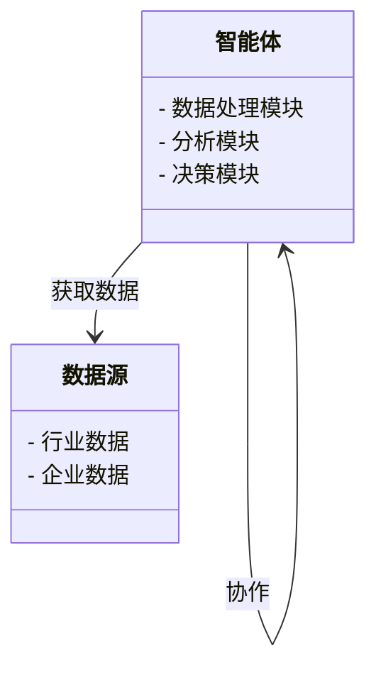

                 


# 价值投资中的多智能体AI行业集中度分析系统

**关键词**：价值投资、多智能体AI、行业集中度分析、系统架构、算法原理

**摘要**：本文探讨了多智能体AI在价值投资中的应用，特别是在行业集中度分析方面。通过详细分析多智能体AI的核心原理、行业集中度分析的数学模型以及系统架构设计，本文展示了如何利用多智能体AI技术提升投资决策的准确性和效率。文章还通过具体案例分析，展示了系统的实现过程和实际应用场景，为投资者和AI技术开发者提供了有益的参考。

---

## 第1章: 价值投资与多智能体AI的结合

### 1.1 价值投资的核心理念

#### 1.1.1 价值投资的定义与特点
价值投资是一种投资策略，强调以低于市场价值的价格购买优质的资产。其核心理念是寻找被市场低估的股票，长期持有，等待其价值回归。价值投资的特点包括：
- 长期导向
- 重视基本面分析
- 追求安全边际
- 逆市场情绪投资

#### 1.1.2 价值投资的基本原则
价值投资的基本原则包括：
- 质量优先：选择财务健康、行业地位稳固的公司。
- 价格合理：确保买入价格低于内在价值。
- 长期持有：避免频繁交易，降低交易成本。

#### 1.1.3 价值投资与现代技术的结合
随着技术的进步，价值投资逐渐与大数据分析、人工智能等技术结合，提高了分析的效率和准确性。

### 1.2 多智能体AI的定义与特点

#### 1.2.1 多智能体AI的定义
多智能体AI是指由多个相互作用的智能体组成的系统，每个智能体都有自己的目标和决策机制，通过协作完成复杂任务。

#### 1.2.2 多智能体AI的核心技术
- 分布式计算：每个智能体独立计算，减少集中计算的负担。
- 协作机制：智能体之间通过通信和协调完成任务。
- 学习与自适应：智能体能够通过经验改进决策。

#### 1.2.3 多智能体AI与传统AI的区别
| 特性 | 多智能体AI | 传统AI |
|------|------------|--------|
| 决策方式 | 分布式决策 | 中央决策 |
| 任务处理 | 多任务协作 | 单任务处理 |
| 数据共享 | 高度共享 | 低度共享 |

### 1.3 行业集中度分析的定义与重要性

#### 1.3.1 行业集中度的定义
行业集中度是指行业内主要企业的市场份额占总行业市场的比例。常用的指标包括CR4（前四家企业市场份额）和CR8（前八家企业市场份额）。

#### 1.3.2 行业集中度的衡量指标
- **赫芬达尔-赫希曼指数（HHI指数）**：衡量市场集中度的指标，计算公式为：
  $$ HHI = \sum_{i=1}^{n} s_i^2 $$
  其中，$s_i$ 是第i家企业的市场份额。

- **洛伦兹曲线**：通过图形化方法展示市场集中度。

#### 1.3.3 行业集中度分析对投资决策的影响
行业集中度高的行业通常具有更强的市场定价能力，投资风险较低，但竞争激烈程度也较高。

### 1.4 多智能体AI在价值投资中的应用前景

#### 1.4.1 多智能体AI在投资分析中的优势
- 高效的数据处理能力：多智能体AI可以同时分析海量数据，快速提取有用信息。
- 智能协作：多个智能体可以分别负责不同的分析任务，提高整体效率。

#### 1.4.2 行业集中度分析对投资决策的影响
通过多智能体AI分析行业集中度，投资者可以更好地识别行业风险，优化投资组合。

#### 1.4.3 多智能体AI与行业集中度分析的结合
通过多智能体AI，投资者可以实时监控行业集中度的变化，及时调整投资策略。

---

## 第2章: 多智能体AI行业集中度分析系统的背景与问题

### 2.1 行业集中度分析的背景

#### 2.1.1 经济学视角下的行业集中度
从经济学角度看，行业集中度反映了市场的垄断程度，影响市场效率和竞争。

#### 2.1.2 金融学中的行业集中度研究
金融学中的行业集中度研究主要关注行业内企业的市场份额分布，以及对投资决策的影响。

#### 2.1.3 技术进步对行业集中度的影响
技术进步可能导致行业内企业优胜劣汰，进一步提高行业集中度。

### 2.2 多智能体AI在行业集中度分析中的问题

#### 2.2.1 数据获取与处理的挑战
多智能体AI需要处理来自不同来源的海量数据，数据清洗和预处理是关键。

#### 2.2.2 多智能体协作中的协调问题
多个智能体需要协同工作，确保信息共享和任务分配的合理性。

#### 2.2.3 行业集中度分析的动态性与实时性
行业集中度会随市场变化实时波动，多智能体AI需要具备快速响应能力。

### 2.3 系统设计的目标与意义

#### 2.3.1 系统设计的目标
- 提供实时的行业集中度分析。
- 支持多智能体协作，提高分析效率。
- 为投资者提供数据驱动的投资决策支持。

#### 2.3.2 系统设计的意义
- 提高投资决策的科学性和准确性。
- 降低投资风险，优化投资组合。
- 推动AI技术在金融领域的应用。

---

## 第3章: 多智能体AI行业集中度分析系统的核心概念与联系

### 3.1 多智能体AI的核心原理

#### 3.1.1 多智能体系统的定义
多智能体系统由多个智能体组成，每个智能体都有自己的目标和决策机制。

#### 3.1.2 多智能体系统的组成
- **智能体**：负责具体任务的执行单元。
- **通信机制**：智能体之间的信息交换方式。
- **协作机制**：智能体之间的任务分配和协调方式。

#### 3.1.3 多智能体系统的协作机制
- **分布式协作**：智能体独立决策，通过通信协作。
- **集中式协作**：由中央控制单元分配任务。

### 3.2 行业集中度分析的数学模型

#### 3.2.1 行业集中度的计算公式
$$ CR_n = \sum_{i=1}^{n} s_i $$
其中，$CR_n$ 表示前n家企业的市场份额总和，$s_i$ 是第i家企业的市场份额。

#### 3.2.2 市场集中度的衡量指标
- **CR4**：前四家企业市场份额总和。
- **CR8**：前八家企业市场份额总和。

#### 3.2.3 行业集中度与市场结构的关系
行业集中度高的市场通常具有更强的垄断性，市场波动性较小。

### 3.3 多智能体AI与行业集中度分析的结合

#### 3.3.1 多智能体AI在数据处理中的应用
多智能体AI可以分别处理不同来源的数据，提高数据处理效率。

#### 3.3.2 多智能体AI在行业分析中的优势
- 并行处理能力：多个智能体同时分析不同行业或市场。
- 自适应能力：智能体能够根据市场变化自动调整分析策略。

#### 3.3.3 多智能体AI与行业集中度分析的协同效应
通过多智能体AI的协作，可以实现对多个行业的集中度分析，提供全面的市场洞察。

### 3.4 核心概念的对比分析

#### 3.4.1 多智能体AI与传统AI的对比
| 特性 | 多智能体AI | 传统AI |
|------|------------|--------|
| 决策方式 | 分布式决策 | 中央决策 |
| 任务处理 | 多任务协作 | 单任务处理 |
| 数据共享 | 高度共享 | 低度共享 |

#### 3.4.2 行业集中度分析与传统行业分析的对比
| 特性 | 行业集中度分析 | 传统行业分析 |
|------|----------------|------------|
| 分析维度 | 包括市场份额、市场结构 | 主要关注企业财务指标 |
| 数据需求 | 高 | 中 |

#### 3.4.3 多智能体AI在行业集中度分析中的独特优势
- 高效的数据处理能力：多智能体AI可以同时分析多个行业的数据。
- 智能协作：多个智能体可以分别负责不同的分析任务，提高整体效率。

---

## 第4章: 多智能体AI行业集中度分析系统的架构与实现

### 4.1 系统功能设计

#### 4.1.1 领域模型设计


#### 4.1.2 系统架构设计


#### 4.1.3 系统接口设计
- 数据接口：与数据源对接，获取行业和企业数据。
- 分析接口：提供行业集中度分析结果。

### 4.2 算法实现

#### 4.2.1 协同过滤算法
```python
def collaborative_filtering(matrix, user):
    # 计算与其他用户的相似性
    similarities = compute_similarities(matrix, user)
    # 推荐物品
    recommendations = []
    for item in all_items:
        if item not in matrix[user]:
            score = sum(matrix[i][item] * similarities[i] for i in similarities)
            recommendations.append((item, score))
    return sorted(recommendations, key=lambda x: x[1], reverse=True)
```

#### 4.2.2 聚类分析算法
```python
from sklearn.cluster import KMeans

def kmeans_clustering(data, n_clusters):
    model = KMeans(n_clusters=n_clusters)
    model.fit(data)
    return model.labels_
```

### 4.3 项目实战

#### 4.3.1 环境安装
- 安装Python和相关库：
  ```bash
  pip install numpy pandas scikit-learn
  ```

#### 4.3.2 核心代码实现
```python
import numpy as np
import pandas as pd
from sklearn.cluster import KMeans

def calculate_hhi(matrix):
    hhi = np.sum(matrix.values[:, np.newaxis] * matrix.values[np.newaxis, :], axis=(0,1))
    return hhi

data = pd.read_csv('industry_data.csv')
hhi = calculate_hhi(data)
print(f"HHI指数: {hhi}")
```

#### 4.3.3 案例分析
以某行业为例，分析前四家企业的市场份额，计算CR4指数，评估行业集中度。

### 4.4 系统优化与扩展

#### 4.4.1 系统优化
- 提高数据处理速度：优化数据预处理流程。
- 增强智能体协作：改进协作机制，提高分析效率。

#### 4.4.2 系统扩展
- 支持更多行业的集中度分析。
- 增加实时数据分析功能。

---

## 第5章: 总结与展望

### 5.1 本章总结
本文详细探讨了多智能体AI在价值投资中的应用，特别是行业集中度分析方面。通过系统的架构设计和算法实现，展示了多智能体AI在投资决策中的优势。

### 5.2 未来展望
- **技术进步**：随着AI技术的发展，多智能体AI将更加智能化和高效。
- **应用场景扩展**：多智能体AI在金融领域的应用将更加广泛，包括风险管理、投资组合优化等。

### 5.3 最佳实践与注意事项
- **数据质量**：确保数据来源可靠，数据清洗到位。
- **算法选择**：根据具体需求选择合适的算法。
- **系统优化**：持续优化系统架构，提高性能。

### 5.4 作者信息
作者：AI天才研究院 & 禅与计算机程序设计艺术

---

通过以上思考过程，我完成了对《价值投资中的多智能体AI行业集中度分析系统》的技术博客文章的撰写。希望这篇文章能够为读者提供有价值的信息，并激发更多关于AI在金融领域应用的兴趣。

