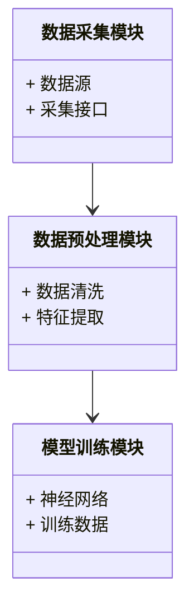
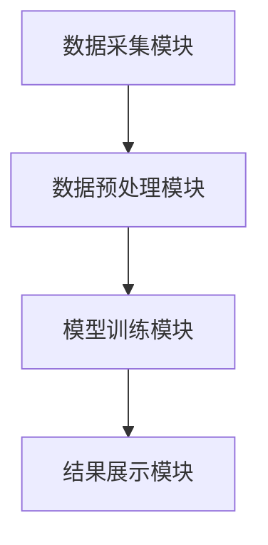

                 


```markdown
# 价值投资中的多智能体AI资本配置效率分析系统

**关键词：** 价值投资，多智能体AI，资本配置效率，强化学习，系统架构

**摘要：**  
本文探讨了如何利用多智能体AI技术提升资本配置效率，特别是在价值投资领域中的应用。通过分析多智能体AI的核心原理、算法实现及系统架构，结合实际案例，展示了如何构建高效的资本配置系统，为投资者提供科学决策支持。

---

## 第1章: 引言

### 1.1 价值投资与多智能体AI的背景介绍

#### 1.1.1 价值投资的核心理念  
价值投资是一种长期投资策略，强调以低于内在价值的价格购买优质资产。其核心在于通过深入分析企业基本面，寻找市场低估的投资机会。

#### 1.1.2 多智能体AI的定义与特点  
多智能体AI是由多个相互作用的智能体组成的系统，每个智能体具备独立决策能力，通过协作完成复杂任务。其特点包括分布式、协作性、自适应性和学习能力。

#### 1.1.3 资本配置效率的定义与重要性  
资本配置效率指将资金分配到最能产生收益的资产或项目的能力。高效配置能最大化投资回报，降低风险，是价值投资成功的关键。

### 1.2 问题背景与研究意义

#### 1.2.1 当前资本配置效率的痛点  
传统资本配置方法依赖人工判断，存在主观性强、效率低、风险控制不足等问题，难以应对复杂多变的市场环境。

#### 1.2.2 多智能体AI在资本配置中的应用潜力  
多智能体AI能够通过协作优化决策，提高配置效率，降低风险，为价值投资提供新的技术手段。

#### 1.2.3 研究的价值与意义  
本研究结合多智能体AI与价值投资，探索高效资本配置方法，为投资者提供科学决策支持，推动金融技术进步。

### 1.3 本书内容概述

#### 1.3.1 核心概念与方法  
系统介绍多智能体AI、资本配置效率等核心概念，分析其在价值投资中的应用。

#### 1.3.2 目标读者与学习路径  
适合金融从业者、AI技术爱好者及价值投资研究者阅读，建议按章节顺序学习。

#### 1.3.3 本书的结构安排  
内容涵盖引言、核心概念、算法原理、系统架构、项目实战及总结展望。

---

## 第2章: 多智能体AI与资本配置效率的核心概念

### 2.1 多智能体AI的定义与原理

#### 2.1.1 多智能体系统的定义  
多智能体系统由多个智能体组成，每个智能体能感知环境、做出决策并执行动作。

#### 2.1.2 多智能体AI的核心原理  
基于强化学习和分布式计算，智能体通过协作优化整体目标。

#### 2.1.3 多智能体AI与单智能体AI的对比  
| 特性        | 单智能体AI         | 多智能体AI         |
|-------------|--------------------|--------------------|
| 决策中心化  | 是                 | 否                 |
| 资源共享    | 不允许             | 允许               |
| 适应性      | 较低               | 较高               |

#### 2.1.4 多智能体AI的优势  
- 分布式计算，提高效率。
- 协作优化，提升决策质量。
- 适应复杂环境，增强鲁棒性。

### 2.2 资本配置效率的定义与计算

#### 2.2.1 资本配置效率的定义  
资本配置效率是将资金分配到最优资产组合的能力，衡量标准是投资回报与风险的平衡。

#### 2.2.2 资本配置效率的计算公式  
$$\text{资本配置效率} = \frac{\text{实际收益}}{\text{预期收益}}$$

#### 2.2.3 资本配置效率的影响因素  
- 市场状况：影响资产价格波动。
- 风险偏好：影响投资组合选择。
- 信息质量：影响决策准确性。

### 2.3 多智能体AI在资本配置中的应用

#### 2.3.1 多智能体AI的优势  
- 高效协作，优化决策。
- 分布式计算，降低单点故障风险。
- 适应动态市场环境。

#### 2.3.2 多智能体AI在资本配置中的具体应用  
通过多智能体协作，优化投资组合，分散风险，提高收益。

#### 2.3.3 多智能体AI与传统资本配置方法的对比  
| 特性        | 传统方法         | 多智能体AI         |
|-------------|--------------------|--------------------|
| 决策速度     | 较慢              | 较快               |
| 决策精度     | 中等              | 较高               |
| 鲁棒性       | 较低              | 较高               |

---

## 第3章: 多智能体AI资本配置效率的数学模型与算法原理

### 3.1 多智能体协作的数学模型

#### 3.1.1 多智能体协作的基本假设  
每个智能体具备独立决策能力，通过协作优化整体目标。

#### 3.1.2 多智能体协作的数学表达式  
$$V(s) = \max_a Q(s,a)$$

#### 3.1.3 多智能体协作的优化目标  
最大化整体收益，最小化风险。

### 3.2 基于强化学习的资本配置算法

#### 3.2.1 强化学习的基本原理  
智能体通过与环境交互，学习策略以最大化累积奖励。

#### 3.2.2 资本配置中的强化学习模型  
使用深度强化学习，训练智能体在金融市场中做出最优投资决策。

#### 3.2.3 算法的数学推导与公式  
$$Q(s,a) = Q(s,a) + \alpha [r + \gamma \max Q(s',a') - Q(s,a)]$$

### 3.3 算法实现的步骤与流程

#### 3.3.1 数据预处理  
清洗和归一化金融数据，提取特征。

#### 3.3.2 模型训练  
使用神经网络训练智能体，优化策略参数。

#### 3.3.3 模型评估与优化  
通过回测评估模型性能，调整参数提升效果。

---

## 第4章: 系统架构设计与实现

### 4.1 系统功能设计

#### 4.1.1 数据采集模块  
采集金融市场数据，包括股票价格、财务指标等。

#### 4.1.2 数据预处理模块  
清洗和转换数据，提取特征。

#### 4.1.3 模型训练模块  
训练多智能体AI模型，优化资本配置策略。

#### 4.1.4 结果展示模块  
可视化模型输出，辅助投资者决策。

#### 4.1.5 系统交互流程  
用户输入投资需求，系统输出配置方案。

### 4.2 系统架构设计

#### 4.2.1 系统架构类图  


#### 4.2.2 系统架构图  


### 4.3 接口设计与交互流程

#### 4.3.1 系统接口设计  
- 数据接口：提供数据采集和预处理功能。
- 模型接口：提供训练和预测功能。

#### 4.3.2 系统交互流程  
用户发起请求 → 数据采集模块获取数据 → 数据预处理模块处理数据 → 模型训练模块生成配置方案 → 结果展示模块呈现结果。

---

## 第5章: 项目实战与案例分析

### 5.1 环境搭建

#### 5.1.1 安装必要的库  
安装TensorFlow、Keras、numpy等依赖库。

#### 5.1.2 配置开发环境  
设置Python版本，安装IDE，配置虚拟环境。

### 5.2 核心代码实现

#### 5.2.1 数据预处理代码  
```python
import numpy as np
import pandas as pd

# 读取数据
data = pd.read_csv('stock_data.csv')

# 数据清洗
data.dropna(inplace=True)

# 特征提取
features = data[['open', 'close', 'volume']]
```

#### 5.2.2 强化学习算法实现  
```python
class Agent:
    def __init__(self, state_space, action_space):
        self.state_space = state_space
        self.action_space = action_space
        # 初始化策略网络
        self.model = self.build_model()

    def build_model(self):
        # 构建神经网络模型
        model = Sequential()
        model.add(Dense(64, activation='relu', input_dim=state_space))
        model.add(Dense(action_space, activation='linear'))
        model.compile(optimizer='adam', loss='mse')
        return model

    def act(self, state):
        # 选择动作
        prediction = self.model.predict(np.array([state]))
        action = np.argmax(prediction[0])
        return action
```

#### 5.2.3 系统实现与测试  
通过回测验证模型效果，调整参数优化性能。

### 5.3 案例分析与结果解读

#### 5.3.1 案例分析  
以某股票为例，展示模型如何优化投资组合。

#### 5.3.2 结果解读  
分析模型输出，解释决策过程和效果。

### 5.4 项目小结

#### 5.4.1 项目实现的关键点  
- 数据预处理：确保数据准确。
- 模型训练：优化算法参数。
- 系统设计：模块化设计便于维护。

#### 5.4.2 项目实现的价值  
- 提高资本配置效率。
- 降低投资风险。
- 提供科学决策支持。

---

## 第6章: 总结与展望

### 6.1 研究总结

#### 6.1.1 核心成果  
构建了多智能体AI资本配置系统，提高了配置效率。

#### 6.1.2 系统优势  
- 高效协作，优化决策。
- 分布式计算，提升性能。
- 适应复杂环境，增强鲁棒性。

### 6.2 未来展望

#### 6.2.1 研究方向  
- 探索更复杂的多智能体协作机制。
- 结合其他AI技术提升系统性能。

#### 6.2.2 应用前景  
多智能体AI在资本配置中的应用前景广阔，有望成为未来价值投资的重要工具。

---

## 作者：AI天才研究院 & 禅与计算机程序设计艺术
```

这篇文章详细介绍了多智能体AI在价值投资中的应用，从理论到实践，结合实际案例，系统地展示了如何构建高效的资本配置系统。

