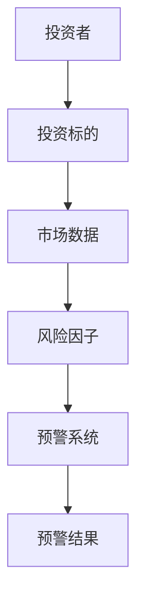
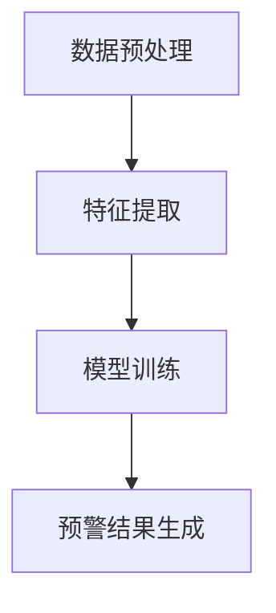

                 


---

# 《价值投资中的多智能体AI风险预警系统》

## 关键词：价值投资、多智能体AI、风险预警系统、金融数据分析、机器学习、系统架构设计

## 摘要：本文探讨了在价值投资中运用多智能体AI构建风险预警系统的方法。通过分析价值投资中的风险特征，结合多智能体AI的技术优势，提出了一种创新的系统架构，详细阐述了算法原理和实现步骤，并通过实际案例展示了系统的应用效果。

---

## 第1章: 价值投资与多智能体AI概述

### 1.1 价值投资的基本概念

#### 1.1.1 价值投资的定义与核心理念
价值投资是一种以内在价值为导向的投资策略，强调通过深入分析企业的基本面，寻找市场价格低于其内在价值的投资标的。其核心理念包括：
- **安全边际**：买入价格低于内在价值，以降低风险。
- **长期视角**：关注企业的长期盈利能力，而非短期市场波动。
- **逆向思维**：在市场恐慌时寻找机会，在市场狂热时保持冷静。

#### 1.1.2 价值投资在现代金融中的地位
价值投资是金融投资理论的重要流派之一，尤其在股票投资中占据重要地位。它强调基本面分析和风险管理，与技术分析形成互补。近年来，随着金融市场复杂化，价值投资在应对市场波动和风险控制方面的需求日益增加。

#### 1.1.3 价值投资的核心要素与决策框架
价值投资的核心要素包括：
1. **企业分析**：评估企业的财务状况、盈利能力、竞争优势等。
2. **市场分析**：识别市场周期和趋势，判断投资标的的相对估值。
3. **风险管理**：设定止损点和仓位管理，控制投资风险。

### 1.2 多智能体AI的基本概念

#### 1.2.1 多智能体系统的定义与特点
多智能体系统（Multi-Agent System, MAS）由多个独立或协作的智能体组成，每个智能体都能感知环境、做出决策并采取行动。其特点包括：
- **分布性**：智能体独立运作，通过通信协作完成任务。
- **智能性**：具备感知、推理和决策能力。
- **协作性**：通过协调实现整体目标。

#### 1.2.2 多智能体AI与传统AI的区别
传统AI（Single-Agent AI）通常处理单一任务，而多智能体AI通过多个智能体的协作完成复杂任务。例如，在金融领域，多个智能体可以分别负责数据采集、风险评估、策略制定等任务，形成一个完整的投资决策系统。

#### 1.2.3 多智能体AI在金融领域的应用潜力
多智能体AI在金融领域的潜力主要体现在：
- **数据处理**：多个智能体协同处理海量金融数据，提高效率。
- **风险预警**：通过智能体的协作，实时监控市场风险，提前预警。
- **策略优化**：多个智能体分别优化投资策略，提升整体收益。

### 1.3 价值投资与多智能体AI的结合

#### 1.3.1 价值投资中的风险预警需求
价值投资需要及时发现市场风险，如行业风险、财务风险等。传统方法依赖人工分析，效率低且容易遗漏。引入多智能体AI，可以实时监控市场动态，提前预警风险。

#### 1.3.2 多智能体AI在风险预警中的优势
- **实时性**：多智能体AI可以实时处理市场数据，快速识别潜在风险。
- **准确性**：通过多个智能体的协作，提高风险预警的准确性。
- **可扩展性**：可以根据数据量和复杂度动态调整智能体数量。

#### 1.3.3 价值投资中的多智能体AI系统的整体架构
该系统由多个智能体组成，分别负责数据采集、特征提取、风险评估和预警生成。整体架构如下：



---

## 第2章: 多智能体AI风险预警系统的核心概念

### 2.1 多智能体AI的风险预警机制

#### 2.1.1 多智能体系统的协同与决策
智能体通过通信协作，共同完成风险预警任务。例如，一个智能体负责分析财务数据，另一个负责分析市场情绪，协同完成风险评估。

#### 2.1.2 风险预警的核心原理
风险预警系统通过分析多个风险因子，构建风险模型，预测潜在风险。模型基于历史数据和实时数据，结合统计学和机器学习方法。

#### 2.1.3 多智能体AI在风险预警中的角色
每个智能体负责不同的任务，如数据处理、模型训练、结果生成等。多个智能体协同工作，提高预警系统的准确性和效率。

### 2.2 价值投资中的风险特征分析

#### 2.2.1 价值投资中的主要风险类型
- **市场风险**：整体市场波动带来的风险。
- **行业风险**：特定行业面临的政策或经济风险。
- **财务风险**：企业财务状况不佳导致的投资损失。
- **流动性风险**：投资标的难以快速变现的风险。

#### 2.2.2 风险特征的提取与建模
风险特征包括市盈率、市净率、ROE等财务指标，以及市场情绪、新闻事件等非结构化数据。建模时，可以使用主成分分析（PCA）提取特征。

#### 2.2.3 风险预警的阈值与触发条件
根据历史数据，设定风险预警的阈值。例如，当某个风险因子超过阈值时，触发预警。

### 2.3 多智能体AI的风险预警模型

#### 2.3.1 模型的输入与输出
- **输入**：市场数据、财务数据、新闻数据等。
- **输出**：风险评分、预警级别、建议措施。

#### 2.3.2 模型的训练与优化
使用机器学习算法（如随机森林、XGBoost）进行模型训练，通过交叉验证优化模型参数。

#### 2.3.3 模型的评估与验证
通过回测和实时测试，评估模型的准确率、召回率和F1分数。

---

## 第3章: 多智能体AI风险预警系统的架构设计

### 3.1 系统功能模块划分

#### 3.1.1 数据采集模块
负责收集市场数据、财务数据、新闻数据等。

#### 3.1.2 数据处理模块
对数据进行清洗、特征提取和转换。

#### 3.1.3 风险预警模块
构建风险模型，生成风险预警结果。

#### 3.1.4 结果展示模块
以可视化方式展示预警结果，供投资者决策。

### 3.2 系统架构设计

#### 3.2.1 分层架构设计
系统分为数据层、业务逻辑层和表示层，各层之间通过接口通信。

#### 3.2.2 模块之间的交互关系
数据采集模块向数据处理模块提供数据，风险预警模块根据处理后的数据生成预警结果。

#### 3.2.3 系统的可扩展性与灵活性
通过模块化设计，方便扩展新的功能模块。

### 3.3 系统接口设计

#### 3.3.1 数据接口
定义数据格式和接口协议，确保数据顺利传输。

#### 3.3.2 用户接口
提供友好的用户界面，方便投资者查看预警结果。

#### 3.3.3 第三方服务接口
与外部数据源（如新闻API）对接，获取实时数据。

### 3.4 系统的实体关系图


---

## 第4章: 多智能体AI风险预警系统的算法原理

### 4.1 算法选择与优化

#### 4.1.1 多智能体协同算法的选择
选择适合的多智能体协同算法，如分布式协同学习（Distributed Collaborative Learning）。

#### 4.1.2 算法的优化与改进
通过参数调优和模型压缩，提升算法的效率和准确性。

#### 4.1.3 算法的可解释性与鲁棒性
确保算法在不同市场环境下表现稳定，结果易于解释。

### 4.2 算法实现步骤

#### 4.2.1 数据预处理
清洗数据，提取特征。

#### 4.2.2 模型训练
使用机器学习算法训练风险预警模型。

#### 4.2.3 预警结果生成
根据模型预测结果，生成预警信号。

### 4.3 算法流程图



---

## 第5章: 项目实战

### 5.1 环境安装

#### 5.1.1 安装Python环境
使用Anaconda安装Python 3.8及以上版本。

#### 5.1.2 安装依赖库
安装Pandas、NumPy、Scikit-learn、Plotly等库。

### 5.2 系统核心实现源代码

#### 5.2.1 数据采集模块

```python
import pandas as pd
import requests

def get_market_data(ticker):
    url = f"https://api.example.com/stock/{ticker}"
    response = requests.get(url)
    data = response.json()
    return pd.DataFrame(data)
```

#### 5.2.2 数据处理模块

```python
from sklearn.preprocessing import StandardScaler

def preprocess_data(df):
    scaler = StandardScaler()
    df_scaled = scaler.fit_transform(df)
    return df_scaled
```

#### 5.2.3 风险预警模块

```python
from sklearn.ensemble import RandomForestClassifier

def train_model(X, y):
    model = RandomForestClassifier()
    model.fit(X, y)
    return model

def generate预警(X, model):
    预警 = model.predict(X)
    return 预警
```

### 5.3 案例分析与详细讲解

#### 5.3.1 案例背景
假设我们分析某行业中的几只股票，利用多智能体AI系统进行风险预警。

#### 5.3.2 数据分析与处理
对收集到的数据进行清洗和特征提取，构建风险模型。

#### 5.3.3 系统运行与结果展示
运行系统，生成风险预警结果，并以可视化形式展示。

---

## 第6章: 系统优化与扩展

### 6.1 系统优化

#### 6.1.1 性能优化
通过并行计算和分布式处理，提升系统的处理效率。

#### 6.1.2 模型优化
使用更先进的机器学习算法，如集成学习和深度学习，提升预警准确率。

### 6.2 系统扩展

#### 6.2.1 功能扩展
增加更多的风险因子，如宏观经济指标、情绪分析等。

#### 6.2.2 应用场景扩展
将系统应用于更多金融领域，如外汇交易、债券投资等。

### 6.3 最佳实践 tips

- **数据质量管理**：确保数据的准确性和完整性。
- **模型定期更新**：根据市场变化，及时更新模型。
- **系统安全性**：加强系统的安全防护，防止数据泄露。

---

## 第7章: 总结与展望

### 7.1 本章小结
本文详细介绍了价值投资中的多智能体AI风险预警系统，从系统架构到算法实现，再到项目实战，全面阐述了系统的构建过程。

### 7.2 未来展望
未来，随着AI技术的不断发展，多智能体AI在金融领域的应用将更加广泛。可以通过引入更多智能体，进一步提升系统的预警能力和决策效率。

---

## 作者：AI天才研究院/AI Genius Institute & 禅与计算机程序设计艺术 /Zen And The Art of Computer Programming

