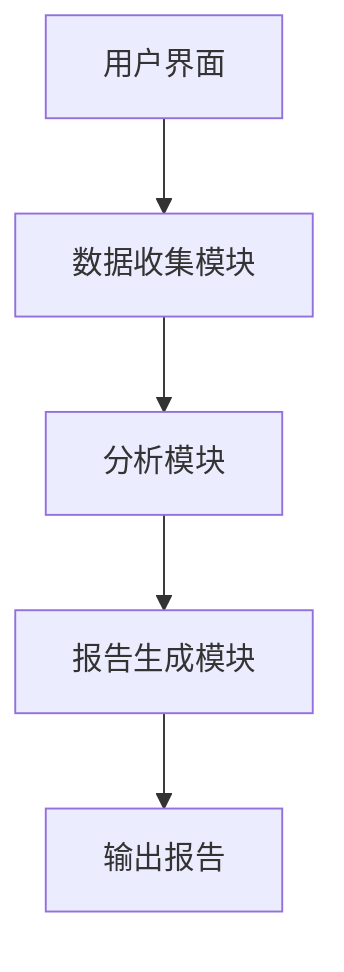

                 


# 价值投资中的定性分析：超越数字的洞察

> 关键词：价值投资，定性分析，投资决策，PEST分析，SWOT分析，竞争优势分析

> 摘要：本文深入探讨了价值投资中定性分析的重要性与应用。通过分析定性分析的核心概念、方法与框架，结合实际案例，展示了如何通过超越数字的洞察，做出更明智的投资决策。文章还详细阐述了定性分析的算法原理、数学模型、系统架构及最佳实践，为投资者提供了全面的指导。

---

# 第一部分: 定性分析的背景与核心概念

## 第1章: 价值投资与定性分析概述

### 1.1 价值投资的基本概念
- **1.1.1 价值投资的起源与核心理念**  
  价值投资由本杰明·格雷厄姆和菲利普·费雪等人提出，强调以低于内在价值的价格买入优质资产。其核心理念是寻找市场中的“烟屁股”，即被市场低估的企业。

- **1.1.2 定性分析在价值投资中的地位**  
  定性分析是价值投资的重要组成部分，用于评估企业的竞争优势、管理团队和行业地位，弥补了定量分析的局限性。

- **1.1.3 定性分析与定量分析的结合**  
  定性分析与定量分析相辅相成，前者提供战略层面的判断，后者提供数据支持，共同帮助投资者做出更全面的决策。

### 1.2 定性分析的定义与特点
- **1.2.1 定性分析的定义**  
  定性分析是通过非财务数据（如行业趋势、竞争优势、管理能力）评估企业价值的方法。

- **1.2.2 定性分析的核心特点**  
  - **主观性**：依赖分析师的经验和判断。  
  - **长期视角**：关注企业的可持续发展能力。  
  - **综合性**：整合多维度信息进行评估。

- **1.2.3 定性分析与定量分析的区别与联系**  
  定量分析依赖数字和模型，而定性分析侧重于非数字因素，两者结合才能全面评估企业价值。

### 1.3 定性分析的背景与意义
- **1.3.1 投资决策中定性因素的重要性**  
  市场情绪、行业趋势和管理团队等因素对投资决策的影响不容忽视。

- **1.3.2 定量分析的局限性**  
  定量模型难以捕捉市场中的非数据因素，如管理能力和行业政策变化。

- **1.3.3 定性分析在价值投资中的独特价值**  
  定性分析帮助投资者识别潜在风险和机会，特别是在市场波动加剧时更具价值。

---

## 第2章: 定性分析的核心框架

### 2.1 定性分析的主要方法
- **2.1.1 基本面分析法**  
  通过分析企业的商业模式、竞争优势和市场地位，评估其长期发展潜力。

- **2.1.2 财务报表分析法**  
  结合财务数据（如收入、利润、现金流）和非财务数据（如管理能力、行业趋势）进行综合评估。

- **2.1.3 竞争优势分析法**  
  识别企业在行业中的独特优势，如成本优势、技术壁垒或品牌影响力。

### 2.2 定性分析的关键维度
- **2.2.1 行业分析与市场定位**  
  行业的发展趋势、企业的市场地位及其竞争优势是定性分析的重要内容。

- **2.2.2 管理团队评估**  
  管理团队的经验、战略眼光和执行力对企业价值至关重要。

- **2.2.3 企业治理结构**  
  良好的治理结构能确保企业长期稳定发展，减少内部风险。

### 2.3 定性分析的框架体系
- **2.3.1 PEST分析框架**  
  PEST分析用于评估企业所处的政治、经济、社会和技术环境，帮助企业识别外部风险和机会。

- **2.3.2 SWOT分析模型**  
  SWOT分析通过评估企业的优势（Strengths）、劣势（Weaknesses）、机会（Opportunities）和威胁（Threats），制定战略决策。

- **2.3.3 价值链分析法**  
  价值链分析帮助企业识别核心竞争力，优化资源配置，提升整体效率。

---

## 第3章: 定性分析的实施步骤

### 3.1 定性分析的前期准备
- **3.1.1 明确分析目标**  
  确定定性分析的具体目标，如评估企业的竞争优势或管理团队。

- **3.1.2 收集相关信息**  
  收集企业的财务报表、行业报告、新闻报道等信息，为分析提供基础。

- **3.1.3 制定分析计划**  
  制定详细的分析计划，包括时间安排、资源分配和分析方法。

### 3.2 定性分析的具体步骤
- **3.2.1 识别关键因素**  
  根据分析目标，识别影响企业价值的关键因素，如行业趋势、竞争优势等。

- **3.2.2 评估因素权重**  
  根据每个因素的重要性，分配适当的权重，构建加权评分模型。

- **3.2.3 综合分析结果**  
  将各因素的评分加权求和，得出综合评分，评估企业的相对价值。

---

# 第二部分: 定性分析的算法与数学模型

## 第4章: 定性分析的算法原理

### 4.1 定性分析的核心算法
- **4.1.1 文本挖掘与自然语言处理**  
  使用NLP技术分析企业财报、新闻和行业报告，提取关键信息。

- **4.1.2 情感分析与市场情绪评估**  
  通过情感分析模型评估市场情绪，辅助投资决策。

- **4.1.3 竞争优势评分算法**  
  基于企业竞争优势的多维度评分，计算综合优势指数。

---

## 第5章: 定性分析的数学模型

### 5.1 加权评分模型
$$ \text{综合评分} = \sum_{i=1}^{n} w_i \times s_i $$
其中，\( w_i \) 为第 \( i \) 个因素的权重，\( s_i \) 为该因素的评分。

### 5.2 竞争优势指数模型
$$ \text{竞争优势指数} = \frac{\text{优势评分}}{\text{劣势评分}} $$

---

# 第三部分: 系统分析与架构设计

## 第6章: 定性分析的系统架构

### 6.1 系统功能设计
- **数据收集模块**：收集企业的财务数据、行业报告和新闻资讯。
- **分析模块**：包括文本挖掘、情感分析和竞争优势评分。
- **报告生成模块**：输出分析报告，提供投资建议。

### 6.2 系统架构设计



---

# 第四部分: 项目实战与最佳实践

## 第7章: 项目实战

### 7.1 环境配置
- 安装必要的Python库，如 `nltk`、`pandas` 和 `scikit-learn`。

### 7.2 核心实现
```python
def qualitative_analysis(company_info):
    # 竞争优势评分
    competition_score = company_info['competition_score']
    # 综合评分
    total_score = competition_score * 0.4 + company_info['management_score'] * 0.3
    return total_score
```

### 7.3 案例分析
以某科技公司为例，分析其竞争优势和管理团队，计算综合评分，得出投资建议。

---

## 第8章: 最佳实践

### 8.1 小结
定性分析是价值投资的重要工具，帮助投资者识别潜在风险和机会。

### 8.2 注意事项
- 定性分析依赖经验和判断，需结合定量分析使用。
- 定期更新分析模型，适应市场变化。

### 8.3 未来趋势
人工智能和大数据技术将进一步提升定性分析的效率和准确性。

---

# 作者：AI天才研究院 & 禅与计算机程序设计艺术

---

通过以上思考步骤，我们可以系统地理解定性分析在价值投资中的重要性，并掌握其核心方法和应用。希望本文能为投资者提供有价值的洞见，帮助他们在复杂多变的市场中做出更明智的决策。

