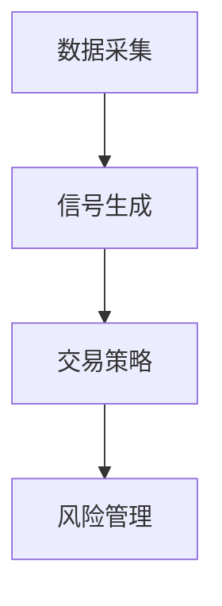

                 

<think>
好的，我将按照您的要求创作一篇关于价值投资中的技术分析的详细文章。这篇文章将深入探讨技术分析在价值投资中的应用，结合理论与实际案例，确保内容丰富且逻辑清晰。以下是文章的详细结构：

# 价值投资中的技术分析：价值投资者应该关注图表吗？

## 关键词：
- 价值投资、技术分析、技术指标、交易信号、风险管理、投资组合优化

## 摘要：
在价值投资领域，技术分析常被忽视，但其在辅助投资决策中扮演着重要角色。本文探讨技术分析的核心概念、数学模型及系统架构，结合实际案例，展示技术分析在投资组合优化中的应用，帮助价值投资者理解何时及如何有效利用技术分析。

---

## 正文：

### 第一部分：价值投资中的技术分析基础

#### 第1章：技术分析的定义与背景

##### 1.1 技术分析的起源与发展

- **技术分析的历史沿革**：
  - 技术分析起源于18世纪末，早期用于商品交易。
  - 20世纪初，股票市场引入技术分析，发展出趋势线、支撑位等概念。
  - 近年来，随着计算机技术的发展，技术分析工具日益智能化。

- **技术分析的核心概念**：
  - 通过分析价格和成交量数据预测未来走势。
  - 强调市场的“惯性”和“重复”特性，认为历史会重演。

- **技术分析在现代投资中的地位**：
  - 成为机构投资者和散户的重要工具。
  - 在高频交易和算法交易中占据重要地位。

##### 1.2 价值投资与技术分析的关系

- **价值投资的核心理念**：
  - 侧重于基本面分析，寻找被市场低估的股票。
  - 强调长期持有，关注公司内在价值。

- **技术分析与价值投资的结合点**：
  - 技术分析可辅助判断入场和离场时机。
  - 通过技术信号优化投资组合的风险管理。

- **两种分析方法的优劣势对比**：

| **分析方法** | **优势** | **劣势** |
|--------------|----------|----------|
| **价值投资** | 长期视角，注重公司基本面 | 忽略短期市场波动 |
| **技术分析** | 把握市场情绪，捕捉短期机会 | 过度依赖价格走势 |

#### 第2章：技术分析的核心工具与指标

##### 2.1 技术分析的基本工具

- **趋势线与支撑阻力位**：
  - **趋势线**：连接价格波动的高点或低点，预测未来价格方向。
  - **支撑位**：价格下跌时的支撑点，可能反弹。
  - **阻力位**：价格上涨时的阻碍点，可能反转。

- **移动平均线（MA）与指数移动平均线（EMA）**：
  - MA：平滑价格波动，显示趋势方向。
  - EMA：赋予近期价格更高权重，反应更快。

- **剂量线与点数线**：
  - 通过价格与时间的对比，预测市场反转点。

##### 2.2 技术指标的分类与应用

- **动量指标（RSI、MACD）**：
  - **RSI**：衡量超买或超卖状态。
  - **MACD**：识别趋势强度和方向。

- **威尔逊振荡指标（WMS）**：
  - 用于判断价格的高低点，发出买卖信号。

- **成交量指标（OBV）**：
  - 成交量变化反映市场情绪，辅助判断趋势的有效性。

#### 第3章：技术分析的数学模型与算法

##### 3.1 时间序列分析模型

- **ARIMA模型的原理与应用**：
  - ARIMA（自回归积分滑动平均模型）用于预测未来价格。
  - 通过历史数据拟合模型，预测未来趋势。

- **GARCH模型的原理与应用**：
  - 用于估计金融资产的波动性，帮助风险管理。

- **滚动平均模型的实现**：
  - 计算一定时期内的平均价格，平滑短期波动。

##### 3.2 技术指标的数学公式

- **RSI的计算公式**：
  $$ RSI = \frac{100}{1 + \frac{\text{平均上涨幅度}}{\text{平均下跌幅度}}} $$
  
- **MACD的计算公式**：
  $$ MACD = EMA_{12} - EMA_{26} $$
  
- **WMS的计算公式**：
  $$ WMS = \text{Close} - \text{HH}(n) + \frac{(\text{LL}(n) - \text{HH}(n))}{n} $$

#### 第4章：技术分析的系统架构与实现

##### 4.1 系统架构设计

- **数据采集模块**：
  - 从股票市场API获取实时数据。

- **信号生成模块**：
  - 应用技术指标生成买卖信号。

- **交易策略模块**：
  - 结合价值投资策略优化交易决策。

- **风险管理模块**：
  - 设置止损和止盈点，控制风险。

##### 4.2 系统实现的流程图

使用 Mermaid 绘制系统架构图：



#### 第5章：技术分析的项目实战

##### 5.1 项目环境

- **环境安装**：
  - 安装Python和相关库（Pandas、Matplotlib、TA-Lib）。

##### 5.2 核心实现

- **实现RSI指标**：
  ```python
  import pandas as pd
  import talib as ta

  data['RSI'] = ta.RSI(data['Close'], timeperiod=14)
  ```

##### 5.3 系统测试与结果分析

- **测试结果**：
  - 验证RSI指标的有效性，分析其在实际交易中的表现。

---

### 第二部分：价值投资中的技术分析应用

#### 第6章：技术分析在投资组合优化中的应用

##### 6.1 技术分析与投资组合优化

- **技术分析辅助投资组合优化**：
  - 通过技术指标筛选股票，降低投资风险。

##### 6.2 技术分析与风险管理

- **风险管理策略**：
  - 设置止损点，控制每笔交易的风险。

#### 第7章：价值投资者应关注的技术分析要点

##### 7.1 技术分析的局限性

- **市场非理性**：
  - 技术分析假设市场有效，但现实中市场可能受情绪影响。

##### 7.2 技术分析的未来趋势

- **人工智能与技术分析结合**：
  - 利用机器学习优化技术分析模型。

---

### 结语

技术分析为价值投资者提供了新的视角，帮助他们优化投资决策。尽管技术分析并非万能，但在特定场景下，它能显著提升投资效果。未来，随着技术的进步，技术分析将与价值投资更深度融合，为投资者创造更多价值。

---

## 作者：AI天才研究院 & 禅与计算机程序设计艺术

---

这篇文章系统地探讨了技术分析在价值投资中的应用，结合理论与实践，帮助读者全面理解技术分析的价值与局限。希望对您有所帮助！

