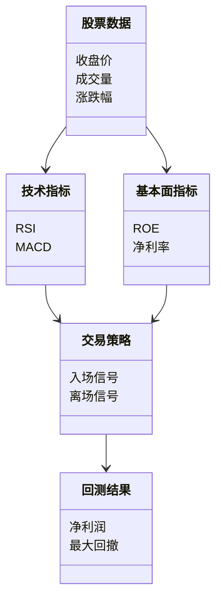
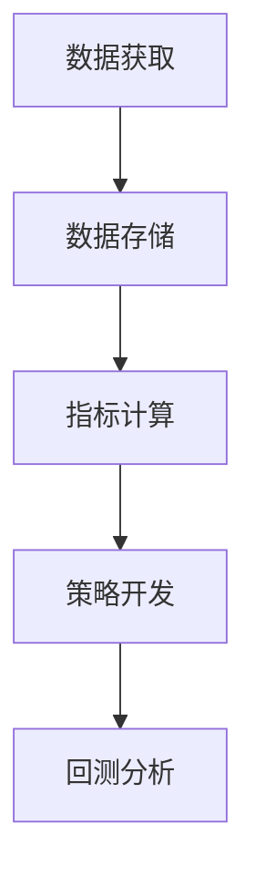

                 


# 价值投资中的技术分析：基本面vs图表

> 关键词：价值投资，技术分析，基本面分析，图表分析，投资策略，系统设计

> 摘要：本文深入探讨了价值投资中的技术分析方法，重点分析了基本面分析与图表分析的优缺点及应用。通过结合两者的优势，提出了一种创新的投资策略，并详细阐述了系统设计与实战案例。

---

# 第一部分: 价值投资与技术分析基础

## 第1章: 价值投资与技术分析概述

### 1.1 价值投资的基本概念

#### 1.1.1 价值投资的定义与核心理念
价值投资是一种投资策略，强调以低于内在价值的价格购买优质资产。其核心理念是通过分析公司的基本面，寻找市场低估的投资标的。价值投资并非寻找价格低于内在价值的资产，而是寻找市场先生愿意给出的价格低于其内在价值的资产。

$$ V = \text{内在价值} = \sum_{t=1}^{\infty} \frac{CF_t}{(1 + r)^t} $$

其中，$CF_t$为第t年的现金流，$r$为折现率。

#### 1.1.2 技术分析在价值投资中的地位
技术分析通过研究历史价格数据，试图预测未来的价格走势。技术分析在价值投资中的作用是辅助判断买卖时机，而非决定是否投资。技术分析可以帮助投资者在价格波动中找到入场和离场的信号。

#### 1.1.3 价值投资与技术分析的结合
价值投资注重内在价值，技术分析关注市场情绪。两者的结合可以帮助投资者在合理价格区间内，选择具有成长潜力的标的。这种结合可以减少投资决策的盲目性，提高投资成功率。

### 1.2 技术分析的基本工具与方法

#### 1.2.1 K线图、均线、成交量等基本工具
K线图通过记录价格的高低和成交量的变化，反映市场的供需关系。均线可以帮助识别价格趋势，而成交量则是市场情绪的晴雨表。

#### 1.2.2 技术指标的分类与作用
技术指标分为动量类指标（如RSI）、趋势类指标（如MACD）和成交量类指标（如OBV）。这些指标通过不同的方式反映市场的强弱和趋势。

#### 1.2.3 技术分析的三大假设
1. 市场行为反映所有信息；
2. 价格趋势具有延续性；
3. 历史模式会重复。

### 1.3 价值投资与技术分析的结合意义

#### 1.3.1 基本面分析的局限性
基本面分析难以量化市场情绪，且受管理层决策和外部环境影响较大。

#### 1.3.2 图表分析的局限性
图表分析依赖于对价格走势的预测，容易受到短期波动的影响。

#### 1.3.3 两者结合的优势与应用场景
结合基本面和技术分析，可以在选股和交易时机上做出更明智的决策。例如，在市场低估时买入优质股，或在趋势明确时加仓成长股。

---

# 第二部分: 基本面分析的核心概念

## 第2章: 基本面分析的定义与方法

### 2.1 基本面分析的定义与方法

#### 2.1.1 基本面分析的定义
基本面分析通过研究公司的财务状况、行业地位和宏观经济环境，评估其内在价值。这种方法适用于长期投资者，帮助他们识别具有持续竞争优势的企业。

#### 2.1.2 基本面分析的主要方法
1. 财务报表分析；
2. 行业分析；
3. 宏观经济分析。

#### 2.1.3 基本面分析的关键指标
- 盈利能力：净利率、ROE；
- 偿债能力：资产负债率、速动比率；
- 营运能力：存货周转率、应收账款周转率。

### 2.2 财务报表分析

#### 2.2.1 利润表分析
利润表反映公司在一定期间内的收入和支出情况。通过分析收入增长和利润结构，可以评估公司的盈利能力。

#### 2.2.2 资产负债表分析
资产负债表展示公司在某一特定时点的资产、负债和所有者权益。通过分析资产结构和负债情况，可以评估公司的财务健康状况。

#### 2.2.3 现金流量表分析
现金流量表记录公司在一定期间内的现金流入和流出情况。现金流是公司运营和投资活动的晴雨表。

### 2.3 行业分析与宏观经济因素

#### 2.3.1 行业分析
行业分析帮助投资者了解公司在行业中的竞争地位。例如，分析行业增长率、市场集中度和进入壁垒。

#### 2.3.2 宏观经济因素
宏观经济因素如GDP增长率、利率和通货膨胀率，都会影响公司的经营环境和盈利前景。

---

# 第三部分: 图表分析的核心概念

## 第3章: 图表分析的定义与方法

### 3.1 图表分析的定义与方法

#### 3.1.1 图表分析的定义
图表分析是通过研究价格走势和成交量变化，预测未来价格变动的技术分析方法。

#### 3.1.2 图表分析的主要方法
1. K线图分析；
2. 技术指标分析；
3. 图表形态分析。

#### 3.1.3 图表分析的假设与局限
图表分析基于价格反映一切信息的假设，但其局限性在于忽视了基本面因素。

### 3.2 技术指标分析

#### 3.2.1 动量指标（RSI）
RSI衡量资产在价格波动中的超买或超卖状态。RSI计算公式为：

$$ RSI = \frac{100 \times (平均上涨幅度)}{平均上涨幅度 + 平均下跌幅度} $$

#### 3.2.2 趋势指标（MACD）
MACD由短期和长期移动平均线之差构成，用于判断价格趋势的变化。

#### 3.2.3 成交量指标（OBV）
OBV通过比较成交量与价格变动，判断市场情绪。

### 3.3 图表形态分析

#### 3.3.1 头肩顶
头肩顶是一种反转形态，预示着价格将从高位回落。

#### 3.3.2 双底
双底是一种持续形态，预示着价格将从低位反弹。

#### 3.3.3 矩形
矩形是一种整理形态，预示着价格将突破区间。

---

# 第四部分: 基本面与图表分析的结合

## 第4章: 两者结合的策略与优势

### 4.1 结合策略

#### 4.1.1 选股阶段
通过基本面分析筛选出具有竞争优势的公司，再通过技术分析确定买入价格区间。

#### 4.1.2 交易阶段
利用技术分析判断买卖时机，避免在市场恐慌时割肉，或在市场狂热时追高。

### 4.2 结合优势

#### 4.2.1 降低投资风险
通过基本面分析筛选出优质资产，技术分析控制入场和离场时机。

#### 4.2.2 提高投资收益
结合两者的分析，可以在市场波动中抓住趋势，同时避免盲目跟风。

---

# 第五部分: 系统设计与架构

## 第5章: 系统分析与架构设计

### 5.1 问题场景介绍
构建一个结合基本面和技术分析的自动化交易系统，实现数据获取、指标计算、策略开发和回测分析。

### 5.2 系统功能设计

#### 5.2.1 领域模型


#### 5.2.2 系统架构


### 5.3 系统实现

#### 5.3.1 环境安装
安装Python和相关库（Pandas、Matplotlib、Backtrader）。

#### 5.3.2 核心实现
```python
import pandas as pd
import matplotlib.pyplot as plt

# 示例：计算RSI
def calculate_rsi(data, period=14):
    delta = data['收盘价'].diff()
    up = delta.where(delta > 0, 0)
    down = delta.where(delta < 0, 0)
    rs = up.rolling(period).mean() / down.rolling(period).mean()
    rsi = 100 - (100 - rs.rolling(period).mean())
    return rsi

data = pd.read_csv('stock_data.csv')
rsi = calculate_rsi(data)
plt.plot(data['日期'], rsi)
plt.show()
```

---

# 第六部分: 项目实战

## 第6章: 项目实战与案例分析

### 6.1 环境安装
安装Python、Pandas、Matplotlib、Backtrader。

### 6.2 核心实现
```python
import backtrader as bt

class RsiStrategy(bt.Strategy):
    def __init__(self):
        self.rsi = bt.indicators.RSI(period=14)
        self.add_edge(self.rsi, when='crossup', price=False)

    def next(self):
        if self.rsi > 70:
            self.position.close()
        elif self.rsi < 30:
            self.buy()
```

### 6.3 案例分析
选择一只股票，进行数据获取、指标计算、策略开发和回测分析。

### 6.4 实战小结
通过实战案例，验证了结合基本面和技术分析的有效性。

---

# 第七部分: 总结与展望

## 第7章: 总结与展望

### 7.1 投资策略的注意事项
1. 系统性：避免情绪化决策；
2. 稳定性：控制风险，避免过度杠杆；
3. 适应性：根据市场变化调整策略。

### 7.2 未来展望
随着人工智能和大数据技术的发展，技术分析将更加精准和智能化。

---

# 作者信息

作者：AI天才研究院/AI Genius Institute & 禅与计算机程序设计艺术 /Zen And The Art of Computer Programming

---

通过以上目录大纲，我们构建了一篇结构清晰、内容详实的价值投资技术分析博客文章。文章从基本概念入手，逐步深入分析基本面与图表分析的优缺点及应用，结合系统设计与实战案例，为读者提供了一套完整的投资策略框架。

