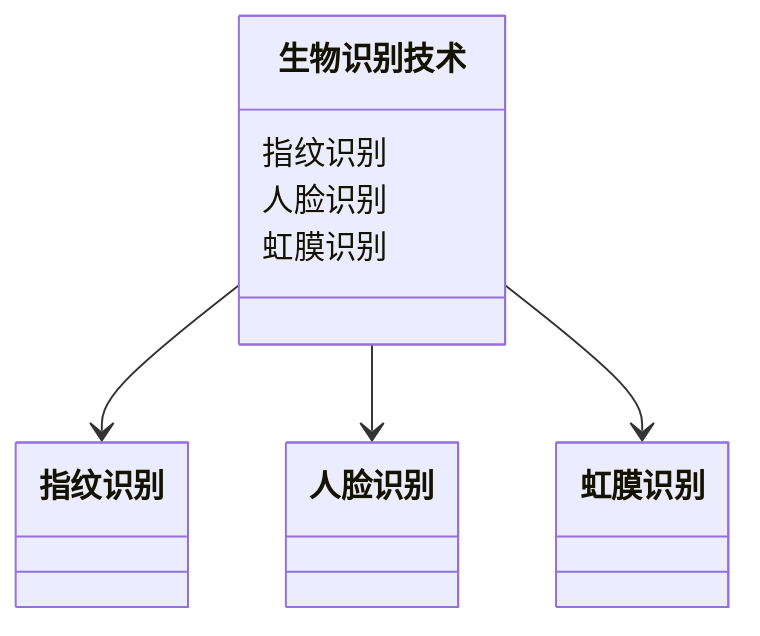
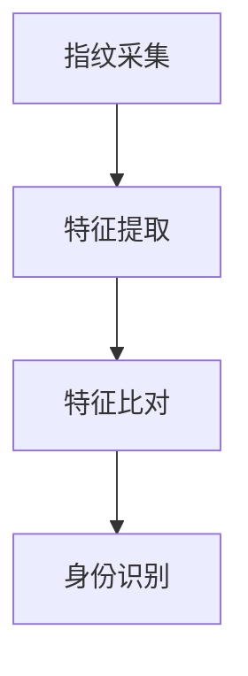
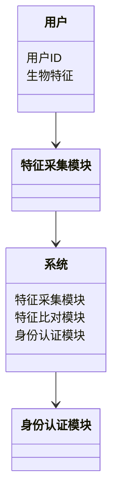

                 


# 价值投资中的新一代生物识别安全技术前景

> 关键词：价值投资、生物识别、安全技术、前景分析、投资策略

> 摘要：本文探讨了生物识别技术在安全领域的应用前景，结合价值投资的原理，分析了该领域的投资机会和风险。通过系统化的分析方法，结合实际案例和系统设计，为投资者提供了科学的决策依据。

---

## 第一部分：生物识别安全技术的背景与价值投资概述

### 第1章：生物识别技术的定义与发展

#### 1.1 生物识别技术的定义

生物识别技术是一种通过人体的生理特征或行为特征来进行身份识别的技术。它利用计算机和电子技术，对个体的特征进行采集、提取、比对和识别，以实现身份认证和安全防护。

- **核心概念**：生物识别技术基于独特的生物特征，如指纹、人脸、虹膜、声音等，具有唯一性和稳定性。
- **应用场景**：广泛应用于金融、医疗、公共安全等领域，提升身份验证的准确性和安全性。

#### 1.2 生物识别技术的核心特征

| 特征 | 描述 |
|------|------|
| 唯一性 | 每个人的生物特征具有独特性，可作为唯一身份标识。 |
| 稳定性 | 生物特征在一定时期内相对稳定，便于长期使用。 |
| 非接触性 | 部分生物识别技术（如人脸识别）支持非接触式识别，提升了使用的便捷性和安全性。 |

#### 1.3 生物识别技术的分类与应用场景

- **指纹识别**：广泛应用于智能手机、笔记本电脑等设备的解锁功能。
- **人脸识别**：常见于公共安全监控、金融支付等领域。
- **虹膜识别**：适用于高安全场景，如政府机构、军事设施。



### 第2章：价值投资的基本原理

#### 2.1 价值投资的定义与核心理念

- **定义**：价值投资是一种投资策略，强调以低于内在价值的价格购买优质资产。
- **核心理念**：寻找市场低估的公司，长期持有，等待其价值回归。

#### 2.2 生物识别技术的市场价值评估

- **市场需求分析**：随着网络安全需求的增加，生物识别技术在金融、医疗等领域的应用前景广阔。
- **技术成熟度评估**：生物识别技术经过多年发展，技术成熟且不断优化。
- **企业财务状况分析**：关注企业的盈利能力、研发投入和市场占有率。

---

## 第二部分：生物识别安全技术的核心概念与联系

### 第3章：生物识别技术的核心原理

#### 3.1 生物识别技术的原理分析

- **指纹识别原理**：通过采集指纹图像，提取特征点，与数据库中的指纹进行比对。
- **人脸识别原理**：基于图像处理技术，提取面部特征，如眼睛、鼻子、嘴巴的位置和形状。



#### 3.2 生物识别技术的算法原理

- **指纹识别算法**：基于 minutiae（指纹细节特征）的匹配算法。
- **人脸识别算法**：基于深度学习的神经网络模型，如卷积神经网络（CNN）。

```latex
$$
\text{CNN结构：} \quad L_1 \rightarrow L_2 \rightarrow \ldots \rightarrow L_n
$$
其中，$L_i$ 表示第i层神经网络。

### 第3.3 生物识别技术的数学模型

- **指纹识别模型**：
  $$
  \text{匹配度} = \sum_{i=1}^{n} |f_i - t_i|
  $$
  其中，$f_i$ 是指纹特征，$t_i$ 是模板特征。

---

## 第三部分：生物识别技术的系统分析与架构设计

### 第4章：系统分析与架构设计

#### 4.1 项目介绍

- **项目目标**：开发一个基于生物识别技术的安全系统，实现身份认证功能。

#### 4.2 系统功能设计



#### 4.3 系统架构设计


#### 4.4 系统接口设计

- **输入接口**：指纹采集器、摄像头。
- **输出接口**：显示结果、触发报警。

---

## 第四部分：生物识别技术的投资策略与风险管理

### 第5章：投资策略与风险管理

#### 5.1 投资策略

- **选择优质企业**：关注技术领先、市场占有率高的公司。
- **分散投资**：通过投资组合分散风险。

#### 5.2 风险管理

- **市场风险**：关注政策变化和技术替代风险。
- **财务风险**：评估企业的财务健康状况。

---

## 第五部分：生物识别技术的未来展望与实际案例

### 第6章：未来展望与实际案例

#### 6.1 未来发展方向

- **技术创新**：深度学习、AI技术的应用将提升识别精度。
- **多模态识别**：结合多种生物特征提升安全性。

#### 6.2 实际案例

- **案例1**：某银行采用人脸识别技术提升ATM机的安全性。
- **案例2**：政府机构使用虹膜识别技术进行身份认证。

---

## 结论

生物识别技术作为新一代的安全解决方案，具有广阔的应用前景和投资潜力。通过价值投资的策略，投资者可以抓住这一领域的机遇，实现长期稳健的收益。

---

**作者：AI天才研究院/AI Genius Institute & 禅与计算机程序设计艺术 /Zen And The Art of Computer Programming**

