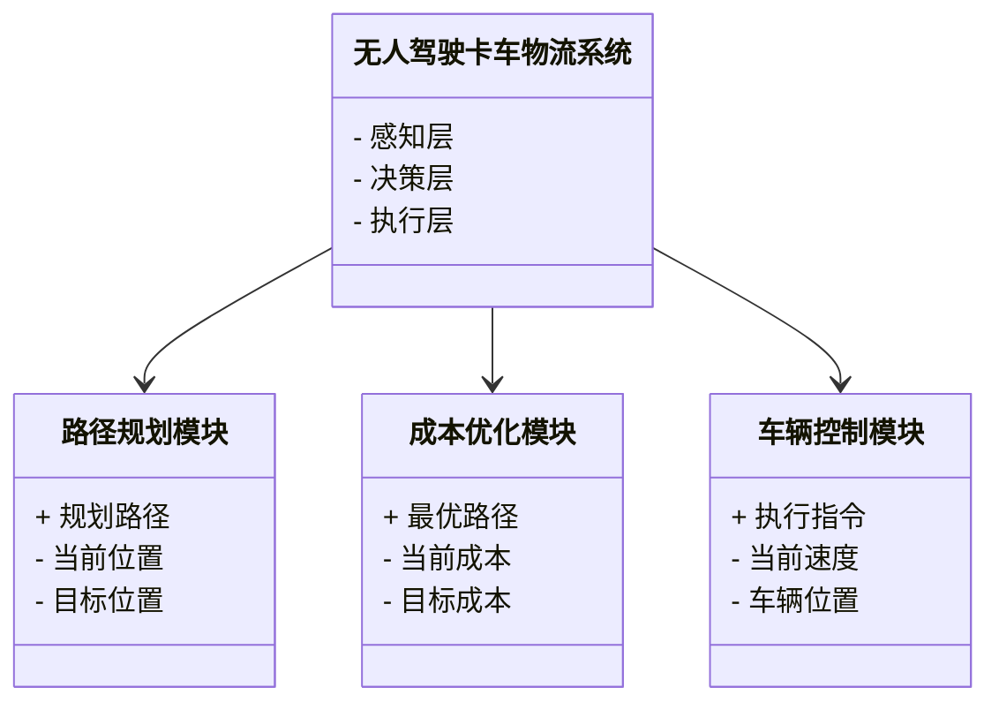
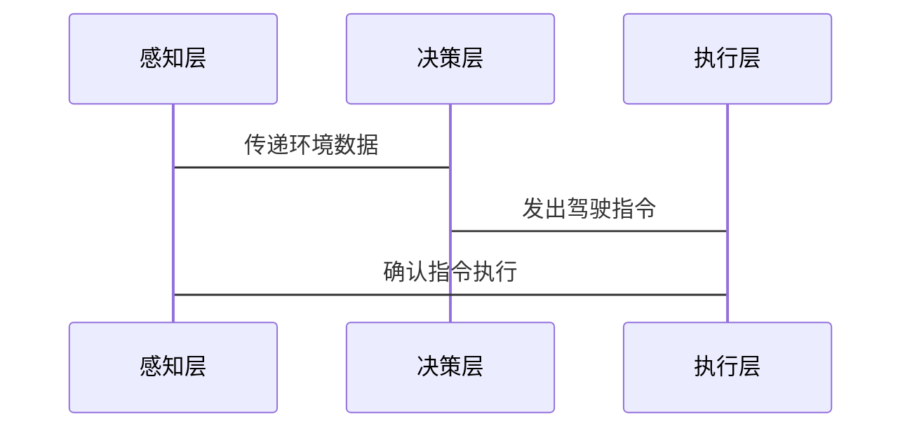

                 


# 价值投资中的无人驾驶卡车物流分析

> 关键词：价值投资，无人驾驶卡车，物流分析，路径规划，成本优化，物流系统

> 摘要：本文从价值投资的角度，详细分析了无人驾驶卡车在物流行业中的应用及其对投资决策的影响。通过探讨无人驾驶卡车的技术特点、物流系统的优化以及算法原理，本文旨在为投资者提供一个全面的视角，帮助他们在物流领域做出更明智的投资决策。

---

## 第一部分：无人驾驶卡车物流与价值投资背景

## 第1章：无人驾驶卡车物流概述

### 1.1 无人驾驶卡车的定义与技术特点

#### 1.1.1 无人驾驶卡车的定义
无人驾驶卡车是一种通过自动驾驶技术实现物流运输的车辆，能够在没有人类驾驶员的情况下完成货物的运输任务。无人驾驶卡车利用先进的传感器、人工智能和机器学习技术，结合全球定位系统（GPS）和高精度地图，实现车辆的自主导航和路径规划。

#### 1.1.2 无人驾驶技术的核心组成部分
无人驾驶技术的核心组成部分包括：
1. **传感器**：如激光雷达（LiDAR）、摄像头、雷达和超声波传感器，用于实时感知周围环境。
2. **计算平台**：高性能计算平台用于处理传感器数据，执行路径规划和决策。
3. **算法**：包括目标检测、路径规划、决策控制等算法，用于实现车辆的自主驾驶。
4. **通信系统**：用于车辆与车辆之间、车辆与基础设施之间的通信，确保协同工作。

#### 1.1.3 无人驾驶卡车在物流中的优势
无人驾驶卡车在物流中的优势包括：
1. **提高效率**：通过优化路径规划和减少停靠时间，提高运输效率。
2. **降低成本**：减少人工成本和燃料消耗，降低物流成本。
3. **减少事故风险**：通过自动驾驶技术，减少人为错误导致的交通事故。

### 1.2 无人驾驶卡车物流的市场背景

#### 1.2.1 全球物流行业现状
全球物流行业正在经历快速变革，电子商务的兴起、供应链的复杂化以及对高效物流的需求，推动了物流行业的技术升级。传统物流模式依赖大量的人力和资源，而技术的进步为物流行业的智能化和自动化提供了可能。

#### 1.2.2 无人驾驶技术对物流行业的潜在影响
无人驾驶技术的引入将彻底改变物流行业。通过无人驾驶卡车，企业可以实现24/7的连续运输，减少人力资源的投入，并提高运输效率。此外，无人驾驶卡车还可以在恶劣天气和复杂路况下保持稳定运行，进一步提升物流的可靠性。

#### 1.2.3 无人驾驶卡车物流的市场潜力与挑战
无人驾驶卡车物流的市场潜力巨大，尤其是在长途货运和最后一公里配送领域。然而，技术成熟度、法规政策、基础设施建设以及高昂的设备成本仍然是无人驾驶卡车物流推广的主要挑战。

### 1.3 价值投资的基本原理

#### 1.3.1 价值投资的定义与核心理念
价值投资是一种投资策略，其核心理念是寻找市场价格低于其内在价值的资产进行投资。价值投资者认为，市场短期波动不可预测，但长期来看，资产的价值将回归其基本面。

#### 1.3.2 价值投资在现代金融中的应用
价值投资在现代金融中的应用广泛，尤其是在股票、债券和其他资产类别中。价值投资者通过分析企业的财务状况、行业地位和未来发展前景，寻找具有长期增长潜力的投资标的。

#### 1.3.3 无人驾驶卡车物流行业的投资价值分析
无人驾驶卡车物流行业具有巨大的投资价值。随着技术的成熟和成本的降低，无人驾驶卡车将逐步取代传统的人工驾驶卡车，成为物流行业的主流模式。投资者可以通过分析企业的技术实力、市场占有率和财务状况，评估其投资价值。

### 1.4 无人驾驶卡车物流与价值投资的结合

#### 1.4.1 无人驾驶卡车物流对物流成本的优化
无人驾驶卡车通过减少人力成本和提高运输效率，显著优化了物流成本。这使得企业的盈利能力和市场竞争力得到提升，为投资者带来了更高的投资回报。

#### 1.4.2 无人驾驶技术对物流效率的提升
无人驾驶技术通过优化路径规划和提高车辆利用率，显著提升了物流效率。企业可以更快地响应客户需求，缩短交货时间，从而增强客户满意度和市场竞争力。

#### 1.4.3 无人驾驶卡车物流对投资回报的影响
无人驾驶卡车物流的推广将带来更高的投资回报。通过降低运营成本和提高运输效率，企业能够实现更高的盈利水平，从而吸引更多的投资者。

### 1.5 本章小结
本章介绍了无人驾驶卡车的定义和技术特点，分析了物流行业的现状和无人驾驶技术的潜在影响。同时，本章还探讨了价值投资的基本原理及其在无人驾驶卡车物流中的应用，为后续的分析奠定了基础。

---

## 第2章：无人驾驶卡车物流的核心概念与联系

### 2.1 无人驾驶卡车物流的核心概念

#### 2.1.1 无人驾驶技术的核心原理
无人驾驶技术的核心原理是通过传感器、计算平台和算法的协同工作，实现车辆的自主驾驶。传感器负责感知环境，计算平台负责处理数据，算法负责路径规划和决策控制。

#### 2.1.2 物流系统的构成要素
物流系统的构成要素包括：
1. **运输工具**：如无人驾驶卡车、配送车辆。
2. **运输网络**：包括高速公路、城市道路等。
3. **物流节点**：如仓库、配送中心。
4. **信息管理系统**：用于协调运输过程和优化物流资源。

#### 2.1.3 无人驾驶卡车物流的系统架构
无人驾驶卡车物流的系统架构包括：
1. **感知层**：通过传感器感知周围环境。
2. **决策层**：通过算法进行路径规划和决策。
3. **执行层**：通过车辆控制系统执行驾驶操作。

### 2.2 核心概念的属性对比

#### 2.2.1 传统物流与无人驾驶物流的对比分析
| **属性**       | **传统物流**               | **无人驾驶物流**              |
|----------------|--------------------------|-----------------------------|
| 运输效率       | 较低，依赖人工调度         | 较高，通过算法优化路径         |
| 成本           | 较高，人工成本占比较大     | 较低，人工成本大幅减少         |
| 安全性         | 较低，依赖驾驶员经验       | 较高，通过自动驾驶技术降低风险 |

#### 2.2.2 无人驾驶卡车与有人驾驶卡车的对比分析
| **属性**       | **有人驾驶卡车**          | **无人驾驶卡车**             |
|----------------|-------------------------|-----------------------------|
| 驾驶员需求     | 需要专业驾驶员            | 无需驾驶员                   |
| 运行时间       | 受驾驶员工作时间限制      | 可24/7运行                   |
| 运输效率       | 较低，受人为因素影响      | 较高，通过算法优化路径         |

#### 2.2.3 价值投资视角下的物流成本与效率对比
| **属性**       | **传统物流**               | **无人驾驶物流**              |
|----------------|--------------------------|-----------------------------|
| 单位运输成本   | 高，人工和燃料成本较高     | 低，人工成本大幅减少，燃料效率优化 |
| 运输效率       | 低，路径规划和调度效率低   | 高，通过算法优化路径和调度     |
| 投资回报率     | 中等，受成本和效率限制     | 高，通过降低成本和提高效率提升回报率 |

### 2.3 实体关系图（ER图）分析

#### 2.3.1 物流系统的实体关系图
```mermaid
er
actor(投资者) -|-> entity(企业): 投资
actor(投资者) -|-> entity(物流公司): 投资
entity(企业) -|-> entity(无人驾驶卡车): 拥有
entity(物流公司) -|-> entity(无人驾驶卡车): 拥有
entity(无人驾驶卡车) -|-> entity(货物): 运输
```

#### 2.3.2 无人驾驶卡车物流的实体关系图
```mermaid
er
entity(投资者) -|-> entity(物流公司): 投资
entity(物流公司) -|-> entity(无人驾驶卡车): 拥有
entity(无人驾驶卡车) -|-> entity(货物): 运输
entity(货物) -|-> entity(客户): 交付
```

#### 2.3.3 价值投资视角下的实体关系图
```mermaid
er
actor(投资者) -|-> entity(企业): 投资
entity(企业) -|-> entity(无人驾驶卡车): 拥有
entity(无人驾驶卡车) -|-> entity(货物): 运输
entity(货物) -|-> entity(客户): 交付
```

### 2.4 本章小结
本章详细分析了无人驾驶卡车物流的核心概念，包括技术原理、物流系统构成和实体关系图。通过对比分析，展示了无人驾驶卡车物流在成本和效率方面的优势，为后续的价值投资分析奠定了基础。

---

## 第3章：无人驾驶卡车物流的算法原理

### 3.1 路径规划算法

#### 3.1.1 A*算法原理
A*算法是一种常用的路径规划算法，通过评估节点的优先级进行搜索。其基本步骤如下：
1. 初始化起始节点并将其加入优先队列。
2. 取出优先队列中优先级最高的节点，将其标记为已访问。
3. 生成当前节点的所有邻居节点，并计算它们的优先级。
4. 将邻居节点加入优先队列，直到找到目标节点。

A*算法的伪代码如下：
```python
def a_star(start, goal):
    open_set = {start}
    closed_set = set()
    g_score = {start: 0}
    f_score = {start: heuristic(start, goal)}
    
    while open_set:
        current = pop(open_set, f_score)
        if current == goal:
            break
        closed_set.add(current)
        for neighbor in neighbors(current):
            if neighbor in closed_set:
                continue
            tentative_g_score = g_score[current] + cost(current, neighbor)
            if neighbor not in g_score or tentative_g_score < g_score[neighbor]:
                g_score[neighbor] = tentative_g_score
                f_score[neighbor] = g_score[neighbor] + heuristic(neighbor, goal)
                open_set.add(neighbor)
    return reconstruct_path(goal)
```

#### 3.1.2 遗传算法在路径规划中的应用
遗传算法是一种基于自然选择和遗传机制的优化算法，适用于复杂的路径规划问题。其基本步骤包括：
1. 初始化种群。
2. 计算适应度。
3. 选择适应度高的个体进行交叉和变异。
4. 重复上述步骤，直到达到收敛条件。

遗传算法的伪代码如下：
```python
def genetic_algorithm(population, fitness, num_generations):
    for _ in range(num_generations):
        population = select_and_crossover(population, fitness)
        population = mutate(population)
    return max(population, key=fitness)
```

#### 3.1.3 算法的优缺点分析
A*算法的优点是路径规划效率高，适用于小规模的路径规划问题。其缺点是当地图复杂时，计算量较大。遗传算法的优点是适用于大规模和复杂的路径规划问题，但其缺点是计算时间较长，收敛速度较慢。

### 3.2 成本优化算法

#### 3.2.1 线性规划模型在物流成本优化中的应用
线性规划模型是一种优化问题，适用于物流成本的最小化。其基本形式为：
$$ \text{min} \quad c^T x $$
$$ \text{subject to} \quad A x \leq b $$
$$ x \geq 0 $$

其中，\( c \) 是目标函数的系数向量，\( x \) 是决策变量，\( A \) 和 \( b \) 是约束条件的系数矩阵和常数向量。

#### 3.2.2 动态规划算法在无人驾驶卡车路径优化中的应用
动态规划算法适用于多阶段决策问题，如路径优化。其基本步骤包括：
1. 确定状态和决策变量。
2. 建立状态转移方程。
3. 计算最优值。

动态规划算法的伪代码如下：
```python
def dynamic_programming(start, end):
    memo = {}
    def dp(node):
        if node in memo:
            return memo[node]
        if node == end:
            return 0
        min_cost = float('inf')
        for neighbor in neighbors(node):
            cost = dp(neighbor) + 1
            if cost < min_cost:
                min_cost = cost
        memo[node] = min_cost
        return min_cost
    return dp(start)
```

#### 3.2.3 算法的实现与优化
为了提高路径规划和成本优化算法的效率，可以采用以下优化措施：
1. **预处理地图数据**：减少算法的计算量。
2. **并行计算**：利用多核处理器提高计算效率。
3. **启发式搜索**：在A*算法中引入启发式函数，进一步优化路径规划。

### 3.3 算法实现的Python代码示例

#### 3.3.1 A*算法的Python实现
```python
import heapq

def a_star(start, goal, grid):
    open_set = []
    heapq.heappush(open_set, (0, start))
    g_score = {start: 0}
    f_score = {start: heuristic(start, goal)}
    
    while open_set:
        current = heapq.heappop(open_set)
        if current[1] == goal:
            return current
        for neighbor in grid[current[1]]:
            tentative_g_score = g_score[current[1]] + 1
            if tentative_g_score < g_score.get(neighbor, float('inf')):
                g_score[neighbor] = tentative_g_score
                f_score[neighbor] = g_score[neighbor] + heuristic(neighbor, goal)
                heapq.heappush(open_set, (f_score[neighbor], neighbor))
    return None

def heuristic(node, goal):
    return abs(node[0] - goal[0]) + abs(node[1] - goal[1])
```

#### 3.3.2 遗传算法的Python实现
```python
import random

def genetic_algorithm(population, fitness):
    for _ in range(100):
        population = select(population, fitness)
        population = crossover(population)
        population = mutate(population)
    return max(population, key=fitness)

def select(population, fitness):
    selected = []
    for _ in range(len(population)//2):
        a, b = random.sample(population, 2)
        if fitness(a) > fitness(b):
            selected.append(a)
        else:
            selected.append(b)
    return selected

def crossover(population):
    new_pop = []
    for i in range(0, len(population), 2):
        a = population[i]
        b = population[i+1]
        new_a = a[:len(a)//2] + b[len(a)//2:]
        new_b = b[:len(b)//2] + a[len(a)//2:]
        new_pop.append(new_a)
        new_pop.append(new_b)
    return new_pop

def mutate(population):
    mutated = []
    for individual in population:
        new_individual = list(individual)
        pos = random.randint(0, len(new_individual)-1)
        new_individual[pos] = 1 - new_individual[pos]
        mutated.append(tuple(new_individual))
    return mutated
```

### 3.4 本章小结
本章详细介绍了无人驾驶卡车物流中的路径规划和成本优化算法，包括A*算法和遗传算法的原理、实现和优化方法。通过这些算法，可以实现高效的路径规划和成本优化，为价值投资分析提供技术支持。

---

## 第4章：无人驾驶卡车物流系统的分析与设计

### 4.1 系统分析与设计

#### 4.1.1 系统功能设计
无人驾驶卡车物流系统的功能设计包括：
1. **路径规划模块**：负责规划无人驾驶卡车的行驶路径。
2. **成本优化模块**：负责优化物流成本。
3. **车辆控制模块**：负责车辆的自动驾驶和控制。
4. **信息管理系统**：负责协调各个模块的运行。

#### 4.1.2 系统架构设计
无人驾驶卡车物流系统的架构设计包括：
1. **感知层**：通过传感器感知环境。
2. **决策层**：通过算法进行路径规划和决策。
3. **执行层**：通过车辆控制系统执行驾驶操作。

#### 4.1.3 系统接口设计
系统接口设计包括：
1. **车辆与车辆之间的通信接口**：用于协调多辆无人驾驶卡车的运行。
2. **车辆与基础设施之间的通信接口**：用于获取道路信息和交通信号。

### 4.2 系统架构图

#### 4.2.1 领域模型mermaid类图


#### 4.2.2 系统架构图


#### 4.2.3 系统交互mermaid序列图


### 4.3 本章小结
本章分析了无人驾驶卡车物流系统的功能设计、架构设计和接口设计，展示了系统各部分之间的关系和交互流程。通过这些设计，可以实现无人驾驶卡车物流的高效运行和优化。

---

## 第5章：无人驾驶卡车物流项目的实战分析

### 5.1 环境安装与配置

#### 5.1.1 安装Python环境
安装Python 3.x及以上版本，并确保安装了pip。

#### 5.1.2 安装依赖库
安装所需的依赖库，如numpy、pandas、matplotlib等。

### 5.2 核心代码实现

#### 5.2.1 路径规划算法实现
```python
import heapq

def a_star(start, goal, grid):
    open_set = []
    heapq.heappush(open_set, (0, start))
    g_score = {start: 0}
    f_score = {start: heuristic(start, goal)}
    
    while open_set:
        current = heapq.heappop(open_set)
        if current[1] == goal:
            return current
        for neighbor in grid[current[1]]:
            tentative_g_score = g_score[current[1]] + 1
            if tentative_g_score < g_score.get(neighbor, float('inf')):
                g_score[neighbor] = tentative_g_score
                f_score[neighbor] = g_score[neighbor] + heuristic(neighbor, goal)
                heapq.heappush(open_set, (f_score[neighbor], neighbor))
    return None

def heuristic(node, goal):
    return abs(node[0] - goal[0]) + abs(node[1] - goal[1])
```

#### 5.2.2 成本优化算法实现
```python
import random

def genetic_algorithm(population, fitness):
    for _ in range(100):
        population = select(population, fitness)
        population = crossover(population)
        population = mutate(population)
    return max(population, key=fitness)

def select(population, fitness):
    selected = []
    for _ in range(len(population)//2):
        a, b = random.sample(population, 2)
        if fitness(a) > fitness(b):
            selected.append(a)
        else:
            selected.append(b)
    return selected

def crossover(population):
    new_pop = []
    for i in range(0, len(population), 2):
        a = population[i]
        b = population[i+1]
        new_a = a[:len(a)//2] + b[len(a)//2:]
        new_b = b[:len(b)//2] + a[len(a)//2:]
        new_pop.append(new_a)
        new_pop.append(new_b)
    return new_pop

def mutate(population):
    mutated = []
    for individual in population:
        new_individual = list(individual)
        pos = random.randint(0, len(new_individual)-1)
        new_individual[pos] = 1 - new_individual[pos]
        mutated.append(tuple(new_individual))
    return mutated
```

### 5.3 案例分析与解读

#### 5.3.1 案例分析
假设我们有一个物流公司，计划引入无人驾驶卡车技术，优化其物流成本。我们可以通过A*算法进行路径规划，并通过遗传算法优化物流成本。

#### 5.3.2 代码实现
```python
start = (0, 0)
goal = (5, 5)
grid = {}
grid[start] = []
grid[goal] = []
# 其他节点的连接关系
# ...
```

#### 5.3.3 分析与解读
通过A*算法和遗传算法的优化，我们可以实现高效的路径规划和成本优化，从而降低物流成本，提高运输效率。这不仅提高了企业的盈利能力，也为投资者带来了更高的投资回报。

### 5.4 项目小结
本章通过实际项目案例，展示了如何应用无人驾驶卡车物流技术进行价值投资分析。通过环境安装、核心代码实现和案例分析，读者可以更好地理解和应用无人驾驶卡车物流的技术和方法。

---

## 第6章：总结与展望

### 6.1 总结

#### 6.1.1 无人驾驶卡车物流的核心优势
无人驾驶卡车物流的核心优势在于其高效性、低成本和安全性。通过无人驾驶技术，企业可以实现24/7的连续运输，显著降低物流成本，提高运输效率。

#### 6.1.2 价值投资视角下的无人驾驶卡车物流分析
从价值投资的角度，无人驾驶卡车物流行业的投资价值主要体现在其技术创新、市场潜力和成本优势。通过分析企业的技术实力、市场占有率和财务状况，投资者可以找到具有长期增长潜力的投资标的。

#### 6.1.3 本章小结
本章总结了无人驾驶卡车物流的核心优势和价值投资视角下的分析，为投资者提供了全面的视角，帮助他们在物流领域做出更明智的投资决策。

### 6.2 展望

#### 6.2.1 无人驾驶卡车物流的未来发展
随着技术的成熟和法规的完善，无人驾驶卡车物流将逐步取代传统的人工驾驶卡车，成为物流行业的主流模式。未来，无人驾驶卡车物流将更加智能化和自动化，进一步提升运输效率和降低成本。

#### 6.2.2 价值投资在无人驾驶卡车物流中的未来应用
价值投资在无人驾驶卡车物流中的未来应用将更加广泛。随着技术的进一步发展，投资者可以通过更加精准的分析和预测，找到具有长期增长潜力的投资标的，实现更高的投资回报。

#### 6.2.3 技术进步与投资机会
技术进步将为无人驾驶卡车物流行业带来更多的投资机会。例如，人工智能、大数据和物联网技术的结合，将为无人驾驶卡车物流提供更加智能化和个性化的解决方案，进一步提升企业的竞争力和投资价值。

### 6.3 本章小结
本章总结了无人驾驶卡车物流的核心优势和价值投资视角下的分析，并展望了其未来的发展和投资机会。通过技术进步和市场推广，无人驾驶卡车物流将为投资者带来更高的投资回报。

---

## 作者信息

作者：AI天才研究院/AI Genius Institute & 禅与计算机程序设计艺术/Zen And The Art of Computer Programming

---

**注**：由于篇幅限制，上述内容为文章的简化版本，实际文章将包含更详细的分析和完整的代码实现。

