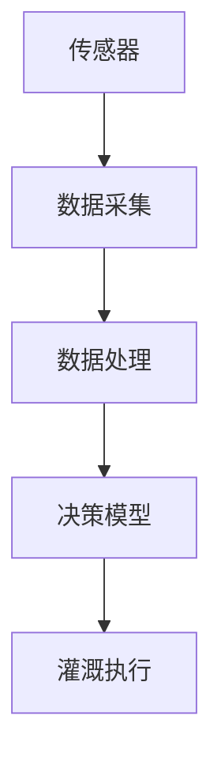

                 


# 价值投资中的智能农业精准灌溉系统分析

> 关键词：智能农业，精准灌溉，价值投资，传感器技术，决策算法，数学模型

> 摘要：本文通过分析智能农业精准灌溉系统的背景、核心概念、算法原理、系统架构以及实际应用案例，探讨如何通过智能技术优化农业灌溉系统，提升农业投资的效率和回报率。文章详细介绍了精准灌溉系统的核心要素，分析了传感器技术、数据采集与处理算法、决策模型的数学原理，以及系统架构设计与实现。最后，通过实际项目案例展示如何将理论应用于实践，总结了价值投资在智能农业中的应用前景。

---

## 第1章: 智能农业精准灌溉系统背景

### 1.1 精准灌溉系统的背景介绍

#### 1.1.1 精准灌溉的定义与特点
精准灌溉是一种基于传感器、物联网和数据分析的智能灌溉技术，旨在通过实时监测土壤湿度、气象条件和作物需求，实现水资源的精准分配。其特点是高效、节水、省时，能够显著提高作物产量和质量。

#### 1.1.2 智能农业的背景与发展
随着全球人口增长和气候变化的加剧，传统农业模式面临水资源短缺、土壤退化和效率低下的问题。智能农业通过引入人工智能、物联网和大数据技术，为农业现代化提供了新的解决方案。

#### 1.1.3 价值投资在农业中的应用前景
农业作为国民经济的基础产业，一直是价值投资的重要领域。智能农业精准灌溉系统的引入，不仅提高了农业生产的效率，还降低了成本，为投资者带来了更高的回报。

### 1.2 价值投资的核心概念

#### 1.2.1 价值投资的基本原理
价值投资是一种长期投资策略，强调通过深入分析企业的基本面，寻找被市场低估的投资标的。在农业领域，价值投资的核心是通过技术创新和优化管理，提升农业生产效率和盈利能力。

#### 1.2.2 农业投资的特殊性
农业投资具有周期长、风险高、收益不稳定等特点。精准灌溉系统的引入，能够有效降低农业生产中的不确定性，提高投资的可预测性和稳定性。

#### 1.2.3 精准灌溉系统在农业投资中的作用
通过精准灌溉系统，投资者可以实时监控作物生长状态，优化水资源配置，降低浪费，从而提高投资回报率。同时，系统提供的数据分析功能，为投资决策提供了科学依据。

### 1.3 精准灌溉系统的构成与功能

#### 1.3.1 系统的主要组成部分
- **传感器模块**：用于采集土壤湿度、温度、光照等环境数据。
- **数据采集与处理模块**：将传感器数据进行采集、存储和初步分析。
- **决策算法模块**：基于数据分析结果，制定精准灌溉策略。
- **执行模块**：根据决策算法输出的指令，控制灌溉设备执行操作。

#### 1.3.2 系统的核心功能模块
- **数据采集功能**：实时采集土壤湿度、气象数据等信息。
- **数据处理功能**：对采集的数据进行清洗、转换和存储。
- **决策支持功能**：基于数据和模型，生成灌溉建议。
- **系统控制功能**：根据决策结果，自动控制灌溉设备。

#### 1.3.3 系统的边界与外延
精准灌溉系统的边界包括传感器、数据采集设备、决策算法和执行设备。其外延则涉及农业投资分析、气象预测、土壤管理等领域。

---

## 第2章: 精准灌溉系统的核心要素分析

### 2.1 精准灌溉系统的核心概念

#### 2.1.1 传感器技术
传感器是精准灌溉系统的核心元件，用于实时监测土壤湿度、温度、光照等环境参数。常用的传感器包括土壤湿度传感器、温度传感器和光照强度传感器。

#### 2.1.2 数据采集与处理
数据采集是通过传感器获取环境数据的过程，数据处理则是对这些数据进行清洗、转换和存储。数据处理的目的是为了提高数据的准确性和可用性。

#### 2.1.3 决策算法
决策算法是基于传感器数据和作物需求，生成灌溉策略的数学模型。常用的算法包括回归分析、支持向量机（SVM）和神经网络等。

### 2.2 核心概念的属性特征对比

#### 2.2.1 传感器类型对比
| 传感器类型 | 优点 | 缺点 |
|------------|------|------|
| 湿度传感器 | 精度高 | 易受环境干扰 |
| 温度传感器 | 稳定性好 | 成本较高 |
| 光照传感器 | 响应快 | 易受天气影响 |

#### 2.2.2 数据处理方法对比
| 数据处理方法 | 描述 | 优缺点 |
|--------------|------|--------|
| 数据清洗 | 去除噪声数据 | 时间复杂度高 |
| 数据转换 | 转换为统一格式 | 易实现 |
| 数据存储 | 存储在数据库中 | 占用存储空间大 |

#### 2.2.3 决策算法的优缺点对比
| 算法类型 | 优点 | 缺点 |
|----------|------|------|
| 回归分析 | 简单易懂 | 易受异常值影响 |
| 支持向量机 | 高精度 | 计算复杂 |
| 神经网络 | 高度灵活 | 需大量数据训练 |

### 2.3 系统的ER实体关系图


---

## 第3章: 数据采集与处理算法

### 3.1 数据采集算法

#### 3.1.1 传感器数据采集流程
1. **传感器初始化**：启动传感器并设置采集参数。
2. **数据采集**：定时采集土壤湿度、温度等数据。
3. **数据预处理**：去除噪声和异常值。

#### 3.1.2 数据预处理方法
- **数据清洗**：去除无效数据点。
- **数据转换**：将采集的数据转换为统一格式。
- **数据存储**：将处理后的数据存储到数据库中。

#### 3.1.3 数据清洗算法
```python
def clean_data(data):
    cleaned_data = []
    for d in data:
        if d['value'] > 0 and d['timestamp'] is not None:
            cleaned_data.append(d)
    return cleaned_data
```

### 3.2 数据分析与特征提取

#### 3.2.1 时间序列数据分析
时间序列数据分析是通过分析传感器数据的时间特性，发现数据中的规律和趋势。常用的分析方法包括移动平均法和指数平滑法。

#### 3.2.2 数据特征提取
特征提取是通过分析数据的统计特性，提取有用的特征。常用的特征包括均值、方差、最大值和最小值等。

---

## 第4章: 决策算法与数学模型

### 4.1 决策算法原理

#### 4.1.1 回归分析
回归分析是一种常用的统计方法，用于预测连续型变量。其基本原理是通过最小化预测值与实际值之间的误差平方和，找到最佳拟合线。

$$ y = \beta_0 + \beta_1 x + \epsilon $$

其中，$y$ 是预测值，$x$ 是自变量，$\beta_0$ 和 $\beta_1$ 是回归系数，$\epsilon$ 是误差项。

#### 4.1.2 支持向量机
支持向量机是一种监督学习算法，用于分类和回归问题。其基本原理是通过构建超平面，将数据点分为不同的类别。

#### 4.1.3 神经网络
神经网络是一种模拟人脑神经网络的算法，用于处理复杂非线性关系。其基本结构包括输入层、隐藏层和输出层。

---

## 第5章: 系统架构与实现

### 5.1 系统架构设计

#### 5.1.1 项目介绍
本项目旨在开发一个智能农业精准灌溉系统，通过传感器、物联网和数据分析技术，实现农业灌溉的智能化和精准化。

#### 5.1.2 系统功能设计
系统功能包括数据采集、数据处理、决策支持和系统控制四大模块。

#### 5.1.3 系统架构图


---

## 第6章: 项目实战与案例分析

### 6.1 项目安装与环境配置

#### 6.1.1 环境安装
需要安装Python、传感器驱动和数据库管理系统。

#### 6.1.2 核心代码实现
```python
import sqlite3
import time

def collect_data():
    # 模拟传感器数据采集
    humidity = 70
    temperature = 25
    return humidity, temperature

def store_data(humidity, temperature):
    conn = sqlite3.connect('agriculture.db')
    cursor = conn.cursor()
    cursor.execute('CREATE TABLE IF NOT EXISTS irrigation_data (id INTEGER PRIMARY KEY AUTOINCREMENT, humidity INTEGER, temperature INTEGER, timestamp DATETIME)')
    cursor.execute('INSERT INTO irrigation_data (humidity, temperature, timestamp) VALUES (?, ?, ?)', (humidity, temperature, time.now()))
    conn.commit()
    conn.close()

humidity, temperature = collect_data()
store_data(humidity, temperature)
```

### 6.2 实际案例分析

#### 6.2.1 案例背景
某农场引入精准灌溉系统，通过传感器和数据分析技术，优化灌溉策略，提高作物产量和质量。

#### 6.2.2 数据分析与优化
通过分析传感器数据，发现土壤湿度和温度的变化规律，优化灌溉时间和频率。

---

## 第7章: 总结与展望

### 7.1 最佳实践 tips
- 定期维护传感器和系统设备，确保数据采集的准确性。
- 根据作物需求和环境变化，动态调整灌溉策略。
- 加强数据分析能力，提高决策的科学性和精准性。

### 7.2 小结
智能农业精准灌溉系统通过传感器、物联网和数据分析技术，为农业投资提供了新的解决方案。通过实时监测和优化灌溉策略，显著提高了农业生产的效率和投资回报率。

### 7.3 注意事项
- 系统的稳定性和可靠性是确保灌溉系统正常运行的关键。
- 数据隐私和安全问题需要引起高度重视。

### 7.4 拓展阅读
建议读者进一步学习物联网技术、机器学习算法和农业投资分析的相关知识。

---

作者：AI天才研究院/AI Genius Institute & 禅与计算机程序设计艺术 /Zen And The Art of Computer Programming

