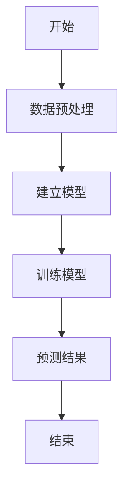
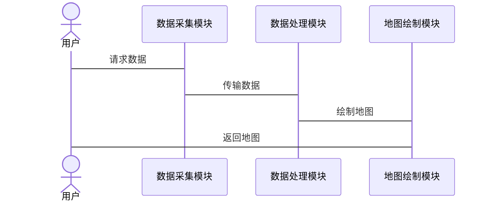

                 


```markdown
# 价值投资中的智能城市噪声地图绘制系统分析

## 关键词：智能城市，噪声地图，价值投资，算法原理，系统架构

## 摘要：本文分析了智能城市噪声地图绘制系统在价值投资中的应用，探讨了其核心算法原理和系统架构设计，通过实际案例展示了其在投资决策中的重要性。

---

# 第1章: 智慧城市噪声地图绘制系统概述

## 1.1 智慧城市与噪声污染的背景

### 1.1.1 智慧城市的定义与特征
智慧城市建设通过科技手段提升城市管理和居民生活质量，包括智能交通、环保监测等系统。

### 1.1.2 城市噪声污染的现状与问题
城市噪声污染影响居民健康和城市环境，主要来源于交通、工业和建筑活动。

### 1.1.3 噪声地图绘制的必要性与意义
噪声地图能帮助投资者分析城市噪声分布，优化投资决策。

## 1.2 噪声地图绘制的核心概念

### 1.2.1 噪声地图的定义与类型
噪声地图是将城市噪声水平可视化，类型包括等值线图和热力图。

### 1.2.2 噪声地图绘制的关键技术
涉及数据采集、物理模型和机器学习算法。

### 1.2.3 噪声地图在价值投资中的应用前景
帮助投资者选择噪声较低的区域进行开发，提升投资回报率。

## 1.3 本章小结
智慧城市的噪声污染问题亟待解决，噪声地图绘制在价值投资中具有重要应用。

---

# 第2章: 噬声地图绘制的系统分析

## 2.1 系统分析的背景与目标

### 2.1.1 系统分析的基本概念
系统分析是通过研究各组成部分的相互关系，优化整体性能。

### 2.1.2 噬声地图绘制系统的分析目标
分析噪声分布，辅助投资决策。

## 2.2 噬声地图绘制系统的功能需求

### 2.2.1 数据采集与处理模块
采集噪声数据，进行预处理和标准化。

### 2.2.2 噪声传播模型建立模块
基于物理模型和机器学习算法，建立噪声传播模型。

### 2.2.3 地图绘制与可视化模块
将噪声数据可视化为地图，便于分析。

## 2.3 系统分析的数学模型

### 2.3.1 噪声传播的基本公式
$$I = I_0 \times (1/d)^2$$，其中I为声强，I0为初始声强，d为距离。

### 2.3.2 噪声叠加原理
$$L = L_1 + L_2 - 10\log_{10}(2)$$，用于计算多个噪声源的叠加。

### 2.3.3 噪声地图的网格划分方法
将城市划分为网格，计算每个网格的噪声水平。

## 2.4 本章小结
系统分析为噪声地图绘制提供了理论基础和技术支持。

---

# 第3章: 噬声地图绘制的算法原理

## 3.1 算法原理概述

### 3.1.1 噪声传播的物理模型
基于声波传播公式，考虑距离、障碍物和反射等因素。

### 3.1.2 基于机器学习的噪声预测方法
使用神经网络模型，通过训练噪声数据进行预测。

### 3.1.3 算法的优缺点对比

| 算法类型 | 优点 | 缺点 |
|----------|------|------|
| 物理模型 | 准确性高 | 计算复杂 |
| 机器学习 | 高效性 | 需大量数据 |

## 3.2 基于物理模型的噪声传播算法

### 3.2.1 噪声传播的基本公式
$$I = I_0 \times (1/d)^2$$

### 3.2.2 基于网格划分的传播计算
使用网格划分城市区域，计算每个点的噪声水平。

### 3.2.3 边界条件的处理方法
考虑地形和建筑物对噪声传播的影响。

## 3.3 基于机器学习的噪声预测算法

### 3.3.1 数据预处理与特征提取
对噪声数据进行标准化和特征选择。

### 3.3.2 神经网络模型的建立与训练
使用深度学习模型，训练噪声预测模型。

### 3.3.3 模型的验证与优化
通过交叉验证和超参数调优优化模型性能。

## 3.4 算法实现的数学模型

### 3.4.1 噪声传播的物理模型公式
$$I = I_0 \times (1/d)^2$$

### 3.4.2 机器学习模型的损失函数与优化方法
使用均方误差损失函数，Adam优化器。

### 3.4.3 算法实现的流程图


## 3.5 本章小结
物理模型和机器学习算法为噪声地图绘制提供了多种选择，各有优缺点。

---

# 第4章: 噬声地图绘制系统的架构设计

## 4.1 系统架构设计的背景

### 4.1.1 系统架构设计的基本概念
系统架构设计是规划系统各部分的组成和交互。

### 4.1.2 噬声地图绘制系统的复杂性分析
系统涉及数据采集、处理和可视化等多个模块。

### 4.1.3 系统架构设计的目标
确保系统高效、稳定运行。

## 4.2 系统功能模块划分

### 4.2.1 数据采集模块
负责采集噪声数据，并进行预处理。

### 4.2.2 数据处理模块
对噪声数据进行分析和建模。

### 4.2.3 地图绘制模块
将噪声数据可视化为地图。

## 4.3 系统架构设计的数学模型

### 4.3.1 系统架构图


### 4.3.2 系统接口设计


## 4.4 本章小结
系统架构设计确保了噪声地图绘制系统的高效运行和模块化管理。

---

# 第5章: 噬声地图绘制系统的项目实战

## 5.1 项目背景介绍
本项目旨在通过噪声地图绘制帮助投资者选择合适的开发区域。

## 5.2 环境安装与配置

### 5.2.1 安装必要的库
- NumPy
- Pandas
- Matplotlib
- Scikit-learn

## 5.3 核心代码实现

### 5.3.1 数据采集与预处理
```python
import numpy as np
import pandas as pd

# 读取噪声数据
data = pd.read_csv('noise_data.csv')

# 数据预处理
data['noise_level'] = data['noise_level'].fillna(data['noise_level'].mean())
```

### 5.3.2 噪声传播模型建立
```python
from sklearn.model_selection import train_test_split
from sklearn.neural_network import MLPRegressor

# 划分训练集和测试集
X = data[['distance', 'building_height']]
y = data['noise_level']

X_train, X_test, y_train, y_test = train_test_split(X, y, test_size=0.2)

# 训练神经网络模型
model = MLPRegressor(hidden_layer_sizes=(100, 10))
model.fit(X_train, y_train)

# 预测结果
y_pred = model.predict(X_test)
```

### 5.3.3 地图绘制与可视化
```python
import matplotlib.pyplot as plt

# 绘制噪声地图
plt.figure(figsize=(10, 8))
plt.imshow(y_pred, cmap='hot', interpolation='nearest')
plt.colorbar(label='Noise Level')
plt.title('Noise Map')
plt.show()
```

## 5.4 实际案例分析与结果解读
通过实际案例分析，展示了噪声地图在投资决策中的应用价值。

## 5.5 项目小结
项目成功实现了噪声地图的绘制，并验证了其在价值投资中的应用效果。

---

# 第6章: 噬声地图绘制系统的最佳实践

## 6.1 投资策略建议
根据噪声地图分析，选择噪声较低的区域进行投资。

## 6.2 系统优化建议
优化数据采集和处理效率，提升系统运行性能。

## 6.3 未来研究方向
探索更先进的算法和更高的精度。

## 6.4 小结
噪声地图绘制系统在价值投资中的应用前景广阔。

---

# 作者：AI天才研究院 & 禅与计算机程序设计艺术

---

通过以上分析，本文系统地介绍了智能城市噪声地图绘制系统的各个方面，从理论基础到实际应用，为投资者提供了有力的技术支持。
```

