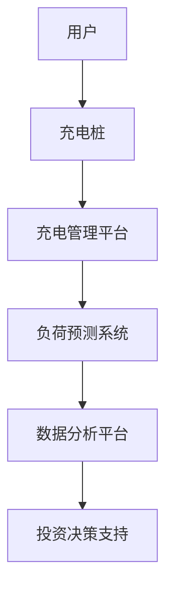
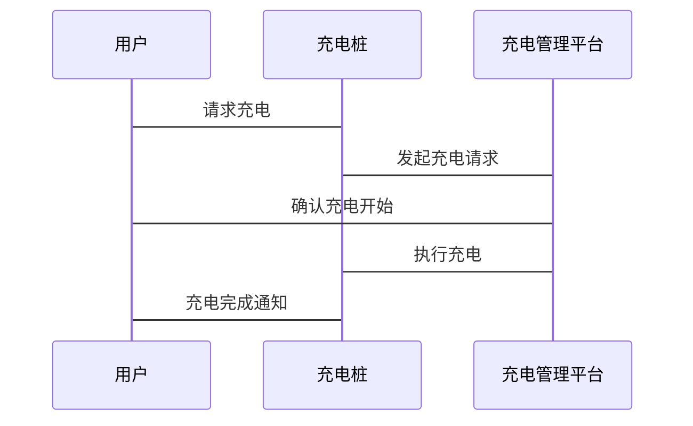

                 


```markdown
# 价值投资中的智能电动汽车充电网络分析

> 关键词：智能电动汽车充电网络，价值投资，电动汽车充电，充电基础设施，智能充电网络，负荷预测，充电站选址，投资分析，系统架构，项目实战，数学模型

> 摘要：智能电动汽车充电网络作为电动汽车普及的关键基础设施，其发展与价值投资密切相关。本文从充电网络的定义、技术原理、商业模式、算法分析、系统架构、项目实战等多个角度，详细探讨智能电动汽车充电网络的投资价值和分析方法。通过对充电网络的负荷预测、充电站选址优化等技术的深入分析，结合实际案例，为投资者提供科学的决策支持。本文结合理论与实践，为价值投资者提供全面的分析框架和实战指导。

---

## 目录

# 第一部分: 智能电动汽车充电网络的背景与价值分析

## 第1章: 电动汽车充电网络的定义与背景

### 1.1 电动汽车充电网络的定义
- 1.1.1 充电网络的基本概念
- 1.1.2 智能充电网络的特征
- 1.1.3 充电网络的构成要素

### 1.2 电动汽车充电网络的发展背景
- 1.2.1 电动汽车行业的快速发展
- 1.2.2 充电基础设施的需求增长
- 1.2.3 智能化充电网络的必要性

### 1.3 充电网络的现状与挑战
- 1.3.1 全球充电网络建设现状
- 1.3.2 充电网络发展的主要挑战
- 1.3.3 技术与市场的结合点

### 1.4 电动汽车充电网络的投资价值
- 1.4.1 充电网络的经济价值
- 1.4.2 投资者关注的热点
- 1.4.3 未来市场潜力分析

# 第二部分: 智能电动汽车充电网络的核心技术与模式

## 第2章: 充电网络的核心技术与模式

### 2.1 充电网络的技术架构
- 2.1.1 充电网络的分层架构
- 2.1.2 智能充电管理系统的功能
- 2.1.3 充电网络的通信机制

### 2.2 充电网络的商业模式
- 2.2.1 充电服务的盈利模式
- 2.2.2 充电网络的运营模式
- 2.2.3 充电网络的生态体系

### 2.3 充电网络的实体关系图
```mermaid
er
    entity 充电网络 {
        <属性: 充电桩数量, 充电功率, 覆盖范围>
    }
    entity 用户 {
        <属性: 用户ID, 用户类型>
    }
    entity 电动汽车 {
        <属性: 车辆ID, 电池容量>
    }
    充电网络 -[拥有]-> 充电桩
    用户 -[使用]-> 充电桩
    电动汽车 -[依赖]-> 充电网络
```

# 第三部分: 智能电动汽车充电网络的算法原理

## 第3章: 充电网络负荷预测算法

### 3.1 负荷预测的基本原理
- 3.1.1 时间序列分析
- 3.1.2 预测模型的选择
- 3.1.3 数据特征提取

### 3.2 基于机器学习的负荷预测
- 3.2.1 算法流程图
```mermaid
grap
    graph TD
        A[开始] --> B[数据收集]
        B --> C[数据预处理]
        C --> D[特征提取]
        D --> E[选择模型]
        E --> F[模型训练]
        F --> G[模型评估]
        G --> H[结果输出]
        H --> K[结束]
```

### 3.3 负荷预测的数学模型
- 3.3.1 线性回归模型
$$y = \beta_0 + \beta_1x + \epsilon$$
- 3.3.2 神经网络模型
$$y = \sigma(w \cdot x + b)$$
其中，$\sigma$ 是激活函数，$w$ 是权重，$b$ 是偏置。

### 3.4 负荷预测的Python实现
```python
import pandas as pd
import numpy as np
from sklearn.linear_model import LinearRegression

# 数据加载与预处理
data = pd.read_csv('charging_load.csv')
X = data[['time', 'temperature', 'holiday']]
y = data['load']

# 模型训练
model = LinearRegression()
model.fit(X, y)

# 模型预测
predicted_load = model.predict(X)
```

## 第4章: 充电站选址优化算法

### 4.1 站址选择的基本原则
- 4.1.1 服务半径最大化
- 4.1.2 用户需求覆盖
- 4.1.3 基础设施可用性

### 4.2 基于遗传算法的选址优化
- 4.2.1 遗传算法流程图
```mermaid
grap
    graph TD
        A[初始化种群] --> B[适应度评估]
        B --> C[选择与交叉]
        C --> D[变异与新种群]
        D --> E[检查终止条件]
        E --> F[输出最优解]
```

### 4.3 选址优化的数学模型
- 4.3.1 线性规划模型
$$\min \sum_{i=1}^{n} c_i x_i$$
$$\text{s.t.} \quad \sum_{i=1}^{n} a_i x_i \geq D$$
$$x_i \in \{0,1\}$$
其中，$c_i$ 是选址成本，$a_i$ 是覆盖区域，$D$ 是需求总量。

### 4.4 选址优化的Python实现
```python
import numpy as np
from scipy.optimize import minimize

# 定义目标函数
def objective(x, A, D):
    return np.sum(A @ x >= D)

# 约束条件
A = np.array([[1, 1, 0], [0, 1, 1], [1, 0, 1]])
D = 3

# 初始猜测
x0 = np.array([1, 1, 1])

# 使用 scipy 最小化
result = minimize(objective, x0, args=(A, D), method='nelder-mead')
```

---

# 第四部分: 智能电动汽车充电网络的系统分析与架构设计

## 第5章: 系统分析与架构设计

### 5.1 项目背景介绍
- 5.1.1 项目目标
- 5.1.2 项目范围
- 5.1.3 项目约束

### 5.2 系统功能设计
- 5.2.1 充电管理模块
- 5.2.2 用户管理模块
- 5.2.3 负荷预测模块
- 5.2.4 数据分析模块

### 5.3 系统架构设计


### 5.4 系统接口设计
- 5.4.1 充电桩接口
- 5.4.2 用户接口
- 5.4.3 数据接口

### 5.5 系统交互流程


---

# 第五部分: 项目实战与投资分析

## 第6章: 项目实战

### 6.1 环境安装与配置
- 6.1.1 Python环境搭建
- 6.1.2 数据库安装
- 6.1.3 开发工具配置

### 6.2 系统核心实现
- 6.2.1 充电管理模块实现
- 6.2.2 负荷预测模块实现
- 6.2.3 数据分析模块实现

### 6.3 实际案例分析
- 6.3.1 案例背景介绍
- 6.3.2 数据分析与处理
- 6.3.3 投资价值评估

### 6.4 项目小结
- 6.4.1 项目成果总结
- 6.4.2 项目经验分享

## 第7章: 投资分析与未来展望

### 7.1 投资分析框架
- 7.1.1 市场分析
- 7.1.2 技术评估
- 7.1.3 财务分析

### 7.2 未来投资趋势
- 7.2.1 新技术的应用
- 7.2.2 市场扩展
- 7.2.3 政策影响

---

# 结语

智能电动汽车充电网络作为电动汽车普及的关键基础设施，其发展与价值投资密切相关。本文从技术、市场、系统架构等多角度，详细探讨了智能电动汽车充电网络的投资价值和分析方法。通过负荷预测、充电站选址优化等技术的深入分析，结合实际案例，为投资者提供了科学的决策支持。

---

# 作者：AI天才研究院/AI Genius Institute & 禅与计算机程序设计艺术 /Zen And The Art of Computer Programming
```

