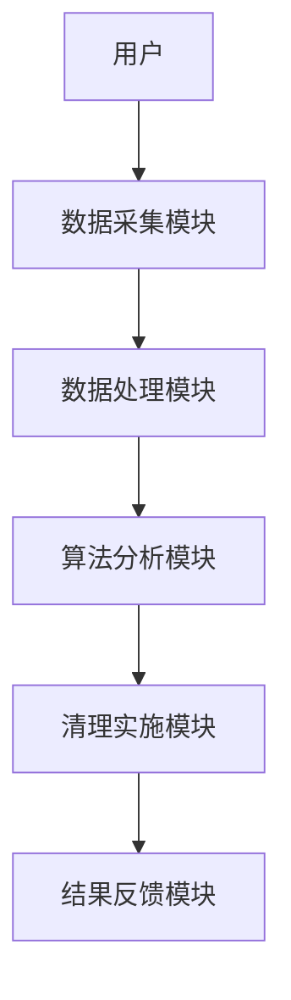

                 


# 价值投资中的海洋微塑料清理技术前景

## 关键词：价值投资，海洋微塑料，清理技术，投资前景，技术创新，环保投资

## 摘要：  
随着海洋微塑料污染问题的日益严重，全球范围内对于海洋微塑料清理技术的关注度持续上升。本文从价值投资的角度出发，深入分析海洋微塑料清理技术的现状、技术创新、市场潜力以及投资机会。通过技术与金融的结合，探讨如何在环保领域实现可持续投资，为投资者提供科学的决策依据。本文还结合实际案例，分析了不同类型清理技术的投资价值，为读者提供了清晰的技术与投资前景展望。

---

## 第一部分：背景介绍

### 第1章：价值投资的基本概念

#### 1.1 价值投资的定义与核心理念  
价值投资是一种以基本面分析为基础的投资策略，强调以低于资产内在价值的价格购买优质资产。其核心理念是寻找市场低估的公司，长期持有，等待其价值回归。  

- **价值投资的核心要素**：  
  - 公司基本面：盈利能力、财务健康、竞争优势。  
  - 市场估值：市盈率、市净率等指标。  
  - 时间价值：长期持有的复利效应。  

#### 1.2 价值投资在现代金融中的地位  
价值投资不仅是金融市场的基石之一，也是应对市场波动的重要策略。通过分析企业的内在价值，投资者可以在市场恐慌中找到投资机会，在市场繁荣中保持理性。

---

### 第2章：海洋微塑料污染的现状与挑战  

#### 2.1 海洋微塑料污染的定义与成因  
海洋微塑料是指直径小于5毫米的塑料颗粒，主要来源于工业生产和日常生活的废弃物。它们通过河流进入海洋，形成广泛分布的污染问题。

- **微塑料的分类**：  
  - 原生微塑料：直接生产的微型塑料颗粒（如洗面奶中的微球）。  
  - 次生微塑料：大塑料废弃物破碎后的产物。  

- **微塑料污染的主要来源**：  
  - 塑料垃圾倾倒海洋。  
  - 工业排放。  
  - 生活污水排放。  

#### 2.2 微塑料污染对环境和人类健康的影响  
微塑料对海洋生态系统、食品链以及人类健康的威胁日益严重。研究表明，微塑料已通过食物链进入人体，可能引发多种健康问题。

---

## 第二部分：海洋微塑料清理技术的核心概念  

### 第3章：海洋微塑料清理技术的分类与原理  

#### 3.1 物理收集方法  

- **网络收集法**：利用大型网具捕捞微塑料。  
  - **优点**：成本较低，操作简单。  
  - **缺点**：效率有限，难以捕捉细小颗粒。  

- **海底 dredging**：通过挖掘技术清除沉积物中的微塑料。  
  - **优点**：可以清除海底沉积物中的微塑料。  
  - **缺点**：成本高，对海洋生态系统影响较大。  

- **海洋栅栏技术**：利用栅栏阻挡并收集微塑料。  
  - **优点**：可以大规模应用。  
  - **缺点**：维护成本高，易受海洋环境影响。  

#### 3.2 化学分解方法  

- **化学氧化法**：利用强氧化剂分解微塑料。  
  - **优点**：可以彻底分解塑料。  
  - **缺点**：成本高，可能对海洋环境造成二次污染。  

---

### 第4章：微塑料清理技术的技术创新与市场潜力  

#### 4.1 技术创新方向  
- **高效收集技术**：开发更高效的微塑料收集设备。  
- **低成本分解技术**：研究低成本、低能耗的分解方法。  
- **智能化监控系统**：利用物联网技术实时监测微塑料分布。  

#### 4.2 技术的市场潜力  
- **市场规模**：预计未来十年，全球微塑料清理市场规模将超过百亿美元。  
- **政策支持**：各国政府纷纷出台政策支持环保技术发展。  

---

## 第三部分：价值投资中的技术分析与评估  

### 第5章：价值投资与微塑料清理技术的结合  

#### 5.1 价值投资的核心指标分析  
- **盈利能力**：企业的净利润率、ROE（净资产收益率）。  
- **财务健康**：资产负债率、现金流状况。  
- **竞争优势**：技术壁垒、市场占有率。  

#### 5.2 微塑料清理技术公司的估值模型  
- **市盈率法**：市盈率 = 股价 / 每股收益。  
- **市净率法**：市净率 = 股价 / 每股净资产。  

---

## 第四部分：系统分析与架构设计  

### 第6章：微塑料清理技术的系统架构  

#### 6.1 问题场景介绍  
- 微塑料污染已成为全球性问题，需要系统化的解决方案。  

#### 6.2 系统功能设计  
- 数据采集：实时监测微塑料分布。  
- 数据分析：利用AI算法预测污染趋势。  
- 技术实施：结合物理和化学方法清理微塑料。  

#### 6.3 系统架构设计  


---

## 第五部分：项目实战与案例分析  

### 第7章：微塑料清理技术的项目实战  

#### 7.1 环境安装与配置  
- **工具安装**：安装Python、TensorFlow等工具。  
- **数据准备**：收集微塑料分布数据。  

#### 7.2 核心代码实现  
```python
import pandas as pd
import numpy as np

def calculate_profitability(revenue, cost):
    return (revenue - cost) / revenue

data = pd.read_csv('microplastic_data.csv')
data['profitability'] = data.apply(lambda x: calculate_profitability(x['revenue'], x['cost']), axis=1)
print(data.head())
```

---

## 第六部分：总结与展望  

### 第8章：投资总结与未来展望  

#### 8.1 投资总结  
- 价值投资与技术创新的结合是未来环保投资的核心方向。  

#### 8.2 未来展望  
- 微塑料清理技术将继续创新，市场规模将进一步扩大。  

---

## 作者：AI天才研究院/AI Genius Institute & 禅与计算机程序设计艺术 /Zen And The Art of Computer Programming

