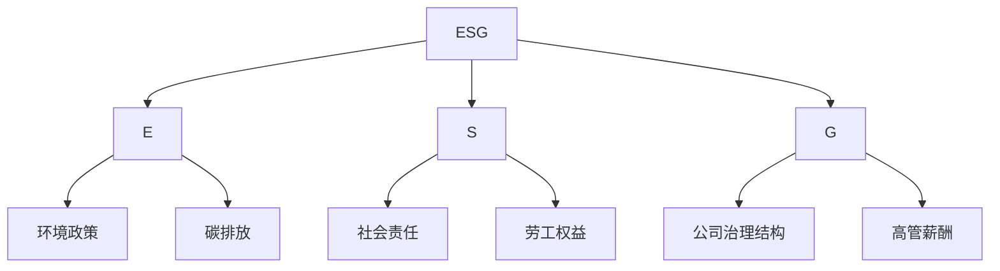
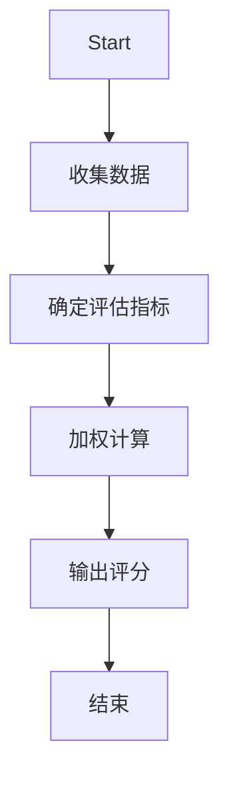
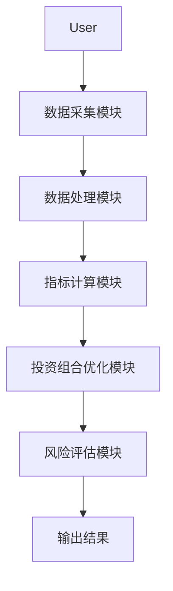

                 


# 价值投资中的环境、社会和治理（ESG）因素考量

---

## 关键词

- 价值投资, ESG, 可持续投资, 环境、社会和治理因素, 投资策略, 企业治理

---

## 摘要

环境、社会和治理（ESG）因素在现代投资决策中扮演着越来越重要的角色。随着全球对可持续发展的关注增加，投资者开始将ESG因素纳入其分析框架，以评估企业的长期价值和风险。本文从ESG的核心概念出发，详细探讨其在价值投资中的应用，包括ESG的评估方法、与投资策略的结合、案例分析以及系统架构设计等内容，帮助读者全面理解如何在投资中考量ESG因素。

---

## 第1章: 引言

### 1.1 什么是ESG

#### 1.1.1 环境（E）、社会（S）、治理（G）的定义

环境（E）指企业在运营过程中对环境的影响，包括碳排放、资源消耗、污染治理等方面。社会（S）关注企业与社会的互动，包括社会责任、员工权益、社区参与等。治理（G）涉及企业的管理结构和决策过程，包括董事会构成、高管薪酬、内部控制等。

#### 1.1.2 ESG的起源与发展

ESG概念起源于20世纪60年代的社会责任投资（SRI），随着全球气候变化、社会不平等等问题的加剧，ESG投资逐渐成为主流。近年来，全球ESG资产规模快速增长，机构投资者越来越重视ESG表现。

#### 1.1.3 ESG与可持续投资的关系

ESG是可持续投资的重要组成部分，通过考量企业的环境、社会和治理表现，投资者可以更全面地评估企业的长期价值和风险。

---

### 1.2 为什么ESG在价值投资中重要

#### 1.2.1 投资者关注ESG的背景

全球气候变化、社会不平等和企业治理问题频发，投资者意识到企业ESG表现与其长期价值密切相关。此外，监管政策的趋严和客户偏好的变化也推动了ESG投资的发展。

#### 1.2.2 ESG对投资风险和收益的影响

研究表明，ESG表现良好的企业往往具有更强的抗风险能力和更高的回报率。例如，高碳排放企业可能面临政策风险，而社会责任感强的企业更容易获得社会认可。

#### 1.2.3 全球ESG投资趋势

近年来，全球ESG投资规模持续增长，越来越多的机构投资者将ESG因素纳入投资决策。

---

### 1.3 本书的核心目标与结构

#### 1.3.1 本书的核心目标

本文旨在帮助投资者理解和应用ESG因素，提供从理论到实践的全面指导。

#### 1.3.2 本书的章节安排

文章分为五章，涵盖ESG的核心概念、评估方法、投资应用、案例分析和系统设计等内容。

#### 1.3.3 本书的适用读者

本文适合投资者、金融从业者以及对可持续投资感兴趣的技术爱好者。

---

## 第2章: ESG的核心概念与联系

### 2.1 ESG的核心概念

#### 2.1.1 环境（E）的核心要素

环境因素包括碳排放、能源消耗、环保政策遵循情况等。例如，企业是否采用可再生能源、是否符合环保法规等。

#### 2.1.2 社会（S）的核心要素

社会因素涵盖社会责任、员工权益、社区参与等。例如，企业是否关注员工福利、是否积极参与公益活动等。

#### 2.1.3 治理（G）的核心要素

治理因素包括公司治理结构、高管薪酬、内部控制等。例如，企业是否设立独立的董事会、是否透明披露财务信息等。

---

### 2.2 ESG概念的属性特征对比

以下表格展示了E、S、G的属性特征对比：

| 属性 | 环境（E） | 社会（S） | 治理（G） |
|------|-----------|-----------|-----------|
| 核心关注点 | 环境影响 | 社会责任 | 公司治理 |
| 评估指标 | 碳排放、能源消耗 | 员工权益、社会责任 | 董事会结构、高管薪酬 |
| 影响因素 | 政策法规、技术进步 | 社会舆论、客户需求 | 内部管理、监管要求 |

---

### 2.3 ESG的实体关系图

以下是ESG各要素的实体关系图：



---

## 第3章: ESG的评估方法与模型

### 3.1 ESG评估的基本方法

#### 3.1.1 定性评估方法

定性评估通过非量化指标进行分析，例如企业是否公开披露ESG信息、是否获得社会责任奖项等。

#### 3.1.2 定量评估方法

定量评估基于量化数据，例如碳排放强度、员工满意度评分等。

#### 3.1.3 综合评估方法

综合评估结合定性和定量方法，通过加权计算得出综合评分。

---

### 3.2 ESG评分模型

#### 3.2.1 基于权重的ESG评分模型

权重分配：E（40%）、S（30%）、G（30%）

评分公式：

$$
\text{ESG评分} = 0.4 \times E + 0.3 \times S + 0.3 \times G
$$

#### 3.2.2 基于因子分析的ESG评分模型

通过因子分析提取关键因子，例如：

$$
\text{因子得分} = a \times E + b \times S + c \times G
$$

#### 3.2.3 基于机器学习的ESG预测模型

使用逻辑回归或神经网络模型预测企业ESG表现。

---

### 3.3 ESG评估流程图

以下是ESG评估的流程图：



---

## 第4章: ESG在投资决策中的应用

### 4.1 系统分析与架构设计

#### 4.1.1 问题场景介绍

投资者需要构建一个基于ESG的智能投资系统，用于筛选和评估企业。

#### 4.1.2 系统功能设计

系统功能包括数据收集、指标计算、投资组合优化、风险评估等。

#### 4.1.3 系统架构设计

以下是系统架构图：



---

## 第5章: 项目实战

### 5.1 环境影响评估的步骤

#### 5.1.1 数据收集

收集企业的碳排放数据、能源消耗数据等。

#### 5.1.2 数据分析

使用Python进行数据分析，例如：

```python
import pandas as pd

# 加载数据
df = pd.read_csv('carbon_emission.csv')

# 计算碳排放强度
df['碳排放强度'] = df['碳排放总量'] / df['营业收入']
```

#### 5.1.3 可视化与报告

生成可视化图表，例如碳排放强度的柱状图。

---

## 第6章: 总结

### 6.1 最佳实践 tips

- 投资者应结合定量和定性方法进行ESG评估。
- 定期更新ESG数据和模型，以应对变化。

### 6.2 小结

本文全面介绍了ESG在价值投资中的应用，从概念到实践，为投资者提供了实用的指导。

### 6.3 注意事项

- ESG评估应结合行业特点。
- 数据来源和模型选择需谨慎。

### 6.4 拓展阅读

推荐阅读《可持续投资：ESG分析与实践》。

---

## 作者

作者：AI天才研究院/AI Genius Institute & 禅与计算机程序设计艺术 /Zen And The Art of Computer Programming

---

通过以上结构，您可以开始撰写详细的文章内容，每个部分都按照上述框架进行深入展开。

