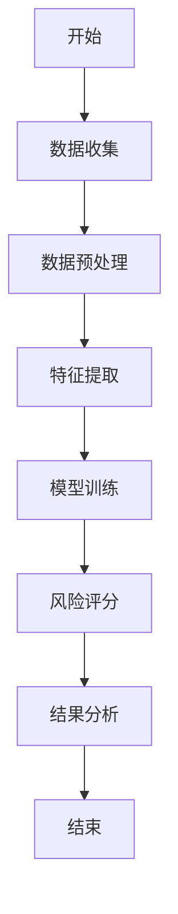

                 


# 价值投资中的监管风险评估

> **关键词**：价值投资、监管风险、风险评估、算法原理、系统架构、项目实战

> **摘要**：本文深入探讨了价值投资中监管风险评估的重要性、方法及其在实际投资中的应用。通过详细分析监管风险的类型、影响因素和评估模型，结合实际案例和系统架构设计，为投资者提供了一套科学的监管风险评估体系，帮助他们在价值投资中做出更明智的决策。

---

## 正文

### 第一部分：价值投资中的监管风险评估基础

#### 第1章：监管风险的基本概念

##### 1.1 监管风险的定义与背景

- **监管风险的定义**：监管风险是指由于监管机构的政策变化、监管力度加强或法规执行不力等因素，可能导致企业或投资组合的价值下降或面临法律风险的可能性。

- **监管风险的背景**：随着全球化和金融市场的复杂化，监管机构的政策和法规对企业运营和投资决策的影响越来越大。投资者在进行价值投资时，必须考虑监管风险对投资标的的影响。

- **监管风险与价值投资的关系**：价值投资的核心是寻找被市场低估的优质企业。然而，监管政策的变化可能会影响企业的盈利能力、市场准入或运营模式，从而影响其估值。

##### 1.2 监管风险的类型

- **政策风险**：由于政府政策的变化（如税收政策、行业监管政策等）对企业经营环境的影响。

- **合规风险**：企业因未能遵守相关法律法规而面临罚款、诉讼或其他法律后果的风险。

- **操作风险**：企业在日常运营中因操作失误或内部管理不善而导致的风险。

##### 1.3 监管风险的影响因素

- **宏观经济环境**：包括经济周期、通货膨胀率、货币政策等。

- **行业特性**：不同行业受监管的力度和频率不同，例如金融行业通常面临更严格的监管。

- **公司治理结构**：公司治理不善可能导致企业更容易受到监管机构的处罚。

#### 第2章：监管风险评估的核心概念

##### 2.1 监管风险评估的框架

- **框架构成**：包括数据收集、风险识别、风险量化和风险应对四个主要步骤。

- **实施步骤**：
  1. 数据收集：收集相关企业的历史数据、行业数据和政策数据。
  2. 风险识别：识别可能影响企业的监管风险类型。
  3. 风险量化：通过数学模型量化各类型监管风险的影响程度。
  4. 风险应对：制定应对策略以降低监管风险的影响。

##### 2.2 监管风险评估的关键指标

- **指标分类**：
  - 政策风险指标：如政策变化频率、政策执行力度等。
  - 合规风险指标：如企业违规记录、法律诉讼次数等。
  - 操作风险指标：如内部控制有效性、操作失误频率等。

- **指标计算方法**：
  - 政策风险指标可以通过政策变化对企业收入的影响程度来计算。
  - 合规风险指标可以通过企业历史违规记录的数量和严重程度来计算。
  - 操作风险指标可以通过企业内部控制的有效性来评估。

- **指标权重分配**：
  - 根据不同行业和企业的特点，合理分配各指标的权重。

##### 2.3 监管风险评估的数学模型

- **线性回归模型**：
  $$风险评分 = \alpha \times 政策风险 + \beta \times 合规风险 + \gamma \times 操作风险$$
  其中，$\alpha$、$\beta$、$\gamma$为各风险类型的权重系数。

- **风险评分模型**：
  $$风险评分 = \frac{\sum (权重 \times 风险值)}{\sum 权重}$$

- **蒙特卡洛模拟**：
  通过模拟不同政策变化和市场环境，评估企业监管风险的分布情况。

#### 第3章：监管风险评估的算法原理

##### 3.1 监管风险评估的常用算法

- **基于统计的算法**：如线性回归、逻辑回归等。
- **基于机器学习的算法**：如随机森林、支持向量机（SVM）等。
- **基于规则的算法**：通过预定义的规则进行风险评估。

##### 3.2 监管风险评估的流程图



##### 3.3 监管风险评估的数学公式

- **风险评分公式**：
  $$风险评分 = \alpha \times 政策风险 + \beta \times 合规风险 + \gamma \times 操作风险$$

### 第二部分：价值投资中的监管风险评估实战

#### 第4章：监管风险评估的系统架构设计

##### 4.1 系统功能设计

- **数据采集模块**：负责收集企业、行业和政策数据。
- **数据处理模块**：对收集的数据进行清洗和预处理。
- **模型计算模块**：利用数学模型计算监管风险评分。
- **结果展示模块**：将风险评估结果以可视化方式呈现。

##### 4.2 系统架构图

```mermaid
pie
```

##### 4.3 系统接口设计

- **输入接口**：接收企业数据、政策数据等输入。
- **输出接口**：输出风险评分和风险分析报告。

#### 第5章：项目实战

##### 5.1 环境安装

- **工具安装**：安装Python、Pandas、Scikit-learn等工具。

##### 5.2 核心代码实现

```python
import pandas as pd
from sklearn.linear_model import LinearRegression

# 数据加载
data = pd.read_csv('regulatory_risk.csv')

# 特征与目标变量分离
X = data[['政策风险', '合规风险', '操作风险']]
y = data['风险评分']

# 模型训练
model = LinearRegression()
model.fit(X, y)

# 风险评分预测
predicted_risk = model.predict(X)
```

##### 5.3 案例分析

- **案例背景**：某企业面临行业政策变化的风险。
- **风险评估**：通过模型计算出该企业的风险评分为0.7（满分1）。
- **结果分析**：企业需要采取措施降低政策风险。

##### 5.4 项目小结

- 通过实际案例展示了监管风险评估系统的应用。
- 强调了模型选择和数据质量的重要性。

### 第三部分：总结与展望

#### 第6章：最佳实践与小结

##### 6.1 最佳实践

- 定期更新模型以适应政策变化。
- 结合定性和定量分析进行综合评估。

##### 6.2 小结

- 监管风险评估是价值投资中不可忽视的重要环节。
- 通过科学的模型和系统的架构设计，可以有效降低监管风险对投资的影响。

##### 6.3 注意事项

- 数据质量和模型选择对评估结果影响重大。
- 需要结合企业的实际情况进行调整和优化。

##### 6.4 拓展阅读

- 推荐阅读相关领域的学术论文和行业报告。

---

### 作者信息

作者：AI天才研究院/AI Genius Institute & 禅与计算机程序设计艺术 /Zen And The Art of Computer Programming

---

通过以上结构，我们系统地探讨了价值投资中的监管风险评估，从理论到实践，为投资者提供了全面的指导和实用的工具。希望本文能帮助读者在复杂多变的市场环境中做出更明智的投资决策。

