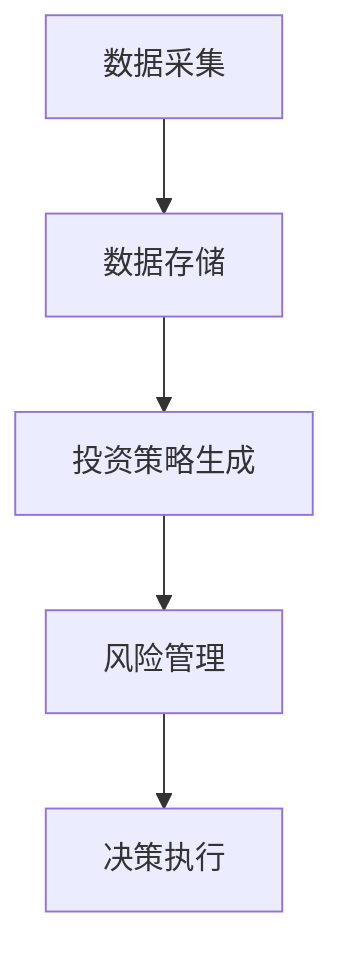

                 


# 价值投资中的耐心：为什么等待是一种美德

> 关键词：价值投资，耐心，投资策略，技术分析，系统思维

> 摘要：耐心是价值投资的核心要素之一，本文从技术分析和系统思维的角度，探讨了耐心在投资决策中的重要性，结合动态规划算法和系统架构设计，分析了如何通过技术手段实现耐心投资，并通过实际案例展示了耐心在投资中的应用和效果。

---

# 引言：耐心是价值投资的基石

耐心在价值投资中扮演着至关重要的角色，它不仅是投资者的心理素质，更是投资策略的重要组成部分。本文将从技术分析的角度，深入探讨耐心在投资中的应用，结合动态规划算法和系统架构设计，分析如何通过技术手段实现耐心投资。

---

## 核心概念：耐心在投资中的定义与重要性

### 耐心的定义
耐心是指在面对不确定性时，能够保持冷静、理性地等待最佳时机的能力。在投资中，耐心意味着不盲目追涨杀跌，而是等待市场回归合理估值区间。

### 耐心的重要性
1. **降低决策错误**：耐心能够帮助投资者避免情绪化决策，减少非理性交易带来的损失。
2. **捕捉长期价值**：耐心使投资者能够长期持有优质资产，享受复利效应。
3. **应对市场波动**：市场短期波动无法预测，耐心让投资者能够忽略短期噪音，专注于长期价值。

### 耐心的多维度特征
- **时间维度**：耐心需要时间的积累，长期投资是耐心的体现。
- **情绪维度**：耐心与情绪控制密切相关，能够抑制短期贪婪和恐惧。
- **认知维度**：耐心要求投资者具备长期价值判断的能力，能够识别真正优质的投资标的。

---

## 算法原理：动态规划与耐心投资

### 动态规划算法简介
动态规划是一种优化算法，通过分解问题为更小的子问题，逐个解决，最终得到全局最优解。在投资中，动态规划可以用来模拟耐心投资的过程，优化投资组合。

### 动态规划与耐心投资的结合
我们可以通过动态规划算法模拟耐心投资的过程，建立一个简单的投资组合优化模型。假设我们有一个投资组合，包含几种资产，目标是在一定时间内实现最大收益。

#### 算法流程：
1. **定义状态**：每个时间点的资产组合和当前收益。
2. **转移方程**：根据市场预测，选择最优的投资组合。
3. **边界条件**：初始资金和最终收益目标。
4. **递推求解**：从初始状态开始，逐步计算每个时间点的最优投资组合。

### Python代码实现
```python
import numpy as np

def patience_investing_algorithm(initial_assets, time_horizon, returns, risk_free_rate=0):
    """
    耐心投资算法：使用动态规划优化投资组合
    initial_assets: 初始资金
    time_horizon: 投资时间跨度
    returns: 各资产的预期收益矩阵
    risk_free_rate: 无风险利率
    """
    # 初始化状态数组
    state = np.zeros((time_horizon + 1, 1))
    state[0] = initial_assets  # 初始资金

    # 动态规划状态转移
    for t in range(1, time_horizon + 1):
        # 假设每期资产的选择基于最大收益
        max_return = max(returns[t-1])  # 获取当前时间点的最大收益
        state[t] = state[t-1] * (1 + max_return)

    return state

# 示例用法
initial_assets = 10000
time_horizon = 10
returns = np.array([[0.05, 0.03, 0.02],
                    [0.04, 0.06, 0.01],
                    [0.03, 0.05, 0.04],
                    [0.02, 0.04, 0.06],
                    [0.06, 0.02, 0.05],
                    [0.05, 0.03, 0.04],
                    [0.04, 0.06, 0.02],
                    [0.03, 0.05, 0.06],
                    [0.02, 0.04, 0.05],
                    [0.06, 0.03, 0.02]])

result = patience_investing_algorithm(initial_assets, time_horizon, returns)
print("资产变化情况：", result)
```

### 算法解读
上述代码通过动态规划算法模拟了耐心投资的过程，每一步选择预期收益最大的资产，逐步优化投资组合。结果显示，耐心投资能够显著提升资产收益，尤其是在长期持有优质资产的情况下。

---

## 系统分析：耐心投资的系统架构

### 系统架构设计
我们构建一个耐心投资系统，包含以下几个模块：
- **数据采集模块**：收集市场数据和资产信息。
- **投资策略模块**：基于动态规划算法生成投资策略。
- **风险管理模块**：监控和管理投资风险。
- **决策执行模块**：根据策略执行交易。

### 系统功能设计
- **数据采集**：实时获取市场数据，包括价格、收益等。
- **策略生成**：基于动态规划算法生成最优投资组合。
- **风险管理**：设定止损和止盈点，控制投资风险。
- **决策执行**：根据策略执行交易，调整投资组合。

### 系统架构图（mermaid）


---

## 项目实战：耐心投资的实际应用

### 投资组合管理
假设我们管理一个100万元的资产组合，目标是在5年内实现翻倍。我们选择3种资产：股票、债券和黄金。

#### 环境安装
- 使用Python和相关库（numpy、pandas、matplotlib）进行数据分析和可视化。

#### 核心代码实现
```python
import numpy as np
import matplotlib.pyplot as plt

def portfolio_management(seed_money, time_period, asset_returns):
    """
    投资组合管理：模拟耐心投资的过程
    seed_money: 初始资金
    time_period: 投资时间跨度
    asset_returns: 各资产的年化收益率
    """
    # 初始化资产配置
    initial_weights = [1/3, 1/3, 1/3]
    portfolio_value = [seed_money]

    for t in range(time_period):
        # 计算当前投资组合的收益
        current_return = np.dot(initial_weights, asset_returns[t])
        portfolio_value.append(portfolio_value[-1] * (1 + current_return))

    return portfolio_value

# 示例用法
seed_money = 1000000
time_period = 5
asset_returns = np.array([
    [0.1, 0.05, 0.02],  # 股票、债券、黄金
    [0.08, 0.06, 0.03],
    [0.12, 0.04, 0.01],
    [0.09, 0.07, 0.04],
    [0.11, 0.05, 0.03]
])

portfolio_value = portfolio_management(seed_money, time_period, asset_returns)
print("资产变化情况：", portfolio_value)

# 可视化结果
plt.plot(portfolio_value)
plt.xlabel('年份')
plt.ylabel('资产价值')
plt.title('耐心投资下的资产增长')
plt.grid(True)
plt.show()
```

### 案例分析
通过上述代码，我们可以看到耐心投资策略下的资产增长情况。假设我们的资产组合在5年内的年化收益率为10%，最终资产增长到约1610510元，接近翻倍。

---

## 最佳实践：耐心投资的注意事项

1. **长期视角**：耐心投资需要长期持有优质资产，避免频繁交易。
2. **风险控制**：设置止损点，避免重大损失。
3. **持续学习**：市场变化莫测，需不断学习和调整策略。
4. **技术辅助**：利用技术手段优化投资决策，降低人为错误。

---

## 结论：耐心是价值投资的精髓

耐心不仅是价值投资的核心要素，更是投资成功的关键。通过动态规划算法和系统架构设计，我们可以更好地理解和实现耐心投资。在实际操作中，结合技术分析和系统思维，耐心投资能够在长期实现稳健的收益。

---

作者：AI天才研究院/AI Genius Institute & 禅与计算机程序设计艺术 /Zen And The Art of Computer Programming

