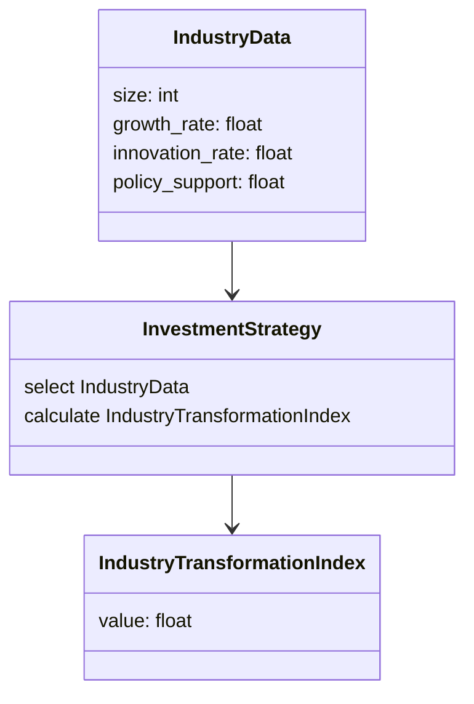
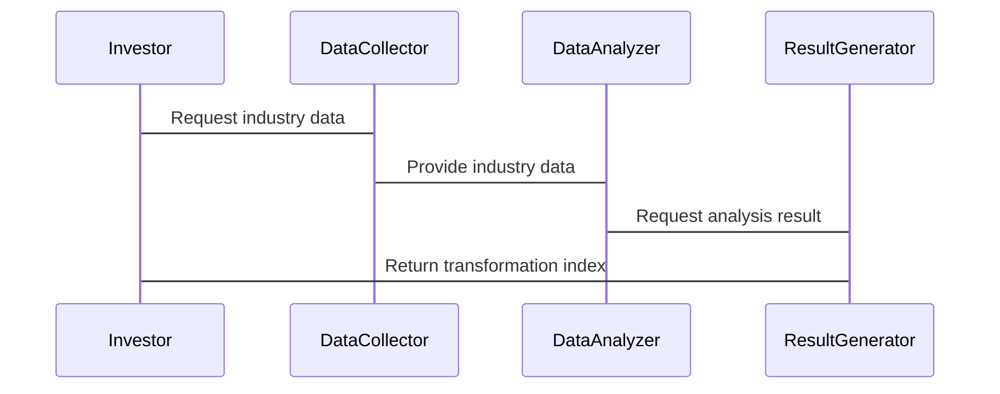

                 


# 价值投资中的行业转型机会识别

> 关键词：价值投资，行业转型，投资机会，行业分析，风险管理

> 摘要：本文详细探讨了在价值投资中如何识别行业转型机会。通过分析行业生命周期、竞争格局、政策环境等多方面因素，结合定量分析方法和系统架构设计，提供了一套识别行业转型机会的系统化方法。文章还通过实际案例展示了如何将理论应用于实践，并总结了投资策略和风险管理的关键点。

---

# 第1章: 价值投资与行业转型概述

## 1.1 价值投资的核心理念

### 1.1.1 价值投资的定义与起源
价值投资是一种投资策略，强调以低于内在价值的价格购买优质资产。该理念由本杰明·格雷厄姆和戴维·多德在20世纪初提出，核心在于寻找市场低估的股票。

### 1.1.2 价值投资的核心理念与原则
- **安全边际**：购买价格低于内在价值，以减少市场波动带来的风险。
- **长期视角**：关注企业的长期价值，而非短期市场波动。
- **企业基本面**：分析企业的财务状况、盈利能力、行业地位等。

### 1.1.3 价值投资与成长投资的区别
- 价值投资关注低估的股票，注重安全边际。
- 成长投资关注高增长的股票，注重未来的增长潜力。

## 1.2 行业转型的定义与特征

### 1.2.1 行业转型的定义
行业转型是指行业在技术和市场变化的推动下，发生重大变革的过程。例如，传统制造业向智能制造转型，能源行业向可再生能源转型。

### 1.2.2 行业转型的特征与表现
- 技术驱动：技术创新是行业转型的主要驱动力。
- 市场需求变化：消费者偏好变化推动行业转型。
- 政策影响：政府政策对企业转型有重要影响。

### 1.2.3 行业转型对投资的影响
行业转型通常伴随着商业模式的改变和市场结构的优化，投资者可以通过识别行业转型机会获得超额收益。

## 1.3 价值投资中的行业转型机会

### 1.3.1 行业转型机会的定义
行业转型机会是指在行业发生重大变革时，部分企业通过创新和调整，实现价值提升的机会。

### 1.3.2 行业转型机会的识别方法
- 行业生命周期分析。
- 行业竞争格局分析。
- 行业政策与市场环境分析。

### 1.3.3 行业转型机会对投资策略的影响
投资者应关注行业转型的早期阶段，选择那些能够成功转型的企业进行投资。

---

# 第2章: 行业转型机会的识别方法

## 2.1 行业生命周期分析

### 2.1.1 行业生命周期的定义
行业生命周期是指行业从萌芽、成长、成熟到衰退的全过程。

### 2.1.2 行业生命周期的阶段划分
- **导入期**：行业刚刚出现，市场需求较低。
- **成长期**：市场需求快速增长，企业数量增加。
- **成熟期**：市场趋于饱和，竞争激烈。
- **衰退期**：市场需求下降，企业数量减少。

### 2.1.3 行业生命周期与转型机会的关系
- 在导入期和成长期，行业存在较大的转型机会。
- 在成熟期和衰退期，行业转型的可能性较小。

## 2.2 行业竞争格局分析

### 2.2.1 行业竞争格局的定义
行业竞争格局是指行业内主要企业的市场份额、竞争策略和市场地位的分布情况。

### 2.2.2 行业竞争格局的分析方法
- 市场集中度分析：使用CR4（前四家企业的市场份额）指标。
- 企业竞争策略分析：分析企业的市场进入壁垒、成本优势等。

### 2.2.3 行业竞争格局对转型机会的影响
- 市场集中度低的行业，转型机会较大。
- 企业竞争策略积极的行业，转型机会较高。

## 2.3 行业政策与市场环境分析

### 2.3.1 行业政策的定义与影响
行业政策是指政府对行业的监管、税收、补贴等政策，影响行业的市场环境。

### 2.3.2 市场环境对行业转型的影响
- 政策支持：政府政策可以推动行业技术升级和结构优化。
- 市场需求：消费者偏好变化推动行业转型。

### 2.3.3 政策与市场环境的综合分析
- 结合政策支持和市场需求，判断行业转型的可能性。

---

# 第3章: 价值投资中的行业分析框架

## 3.1 价值投资的行业分析方法

### 3.1.1 行业分析的定义与目的
行业分析是通过研究行业的市场结构、竞争状况、发展趋势等，为投资决策提供依据。

### 3.1.2 行业分析的核心要素
- 行业规模：市场需求、市场规模。
- 行业结构：市场集中度、竞争格局。
- 行业趋势：技术进步、政策变化。

### 3.1.3 行业分析与投资决策的关系
行业分析是投资决策的重要依据，帮助投资者识别行业机会和风险。

## 3.2 行业基本面分析

### 3.2.1 行业基本面的定义
行业基本面是指行业内的经济状况，包括市场规模、盈利能力、增长潜力等。

### 3.2.2 行业基本面分析的指标与方法
- 市场规模：使用行业收入数据。
- 盈利能力：使用行业利润率、ROE等指标。
- 增长潜力：分析行业的增长率。

### 3.2.3 行业基本面分析对转型机会的影响
- 高增长行业的转型机会较大。
- 高利润率行业的转型风险较低。

## 3.3 行业趋势分析

### 3.3.1 行业趋势的定义与分类
行业趋势是指行业内长期发展的方向，分为技术趋势、市场需求趋势等。

### 3.3.2 行业趋势分析的方法与工具
- 技术趋势分析：使用专利数据、技术文献等。
- 市场需求分析：使用消费者调研、市场研究报告。

### 3.3.3 行业趋势对转型机会的影响
- 技术进步快的行业，转型机会较大。
- 市场需求变化大的行业，转型机会较多。

---

# 第4章: 行业转型机会的定量分析方法

## 4.1 定量分析的定义与作用
定量分析是通过数学模型和数据统计方法，量化分析行业转型机会。

### 4.1.1 定量分析的定义
定量分析是通过数据和模型，量化分析行业转型机会的方法。

### 4.1.2 定量分析的作用
- 提供数据支持，帮助投资者做出科学决策。
- 量化行业风险和机会，优化投资组合。

## 4.2 行业转型机会的数学模型

### 4.2.1 行业转型机会指数的定义
行业转型机会指数是衡量行业转型可能性的指标，通常使用综合指标进行评估。

### 4.2.2 行业转型机会指数的计算公式
$$
\text{转型机会指数} = \frac{\text{行业增长率} + \text{技术创新率} + \text{政策支持力度}}{3}
$$

### 4.2.3 行业转型机会指数的解读
- 高指数值表示行业转型机会大。
- 低指数值表示行业转型机会小。

## 4.3 行业转型机会的算法实现

### 4.3.1 数据预处理
- 收集行业数据：市场规模、增长率、技术创新率、政策支持力度等。
- 数据清洗：处理缺失值、异常值。

### 4.3.2 特征提取
- 提取关键指标：行业增长率、技术创新率、政策支持力度。

### 4.3.3 模型训练
- 使用回归模型或聚类模型进行行业转型机会预测。

### 4.3.4 模型预测
- 预测行业转型机会指数，指导投资决策。

---

# 第5章: 行业转型机会识别的系统架构设计

## 5.1 系统功能设计

### 5.1.1 领域模型（Mermaid类图）


### 5.1.2 系统架构设计（Mermaid架构图）
```mermaid
container IndustryTransformationSystem {
    component DataCollector {
        function collect_data()
    }
    component DataAnalyzer {
        function analyze_data()
    }
    component ResultGenerator {
        function generate_report()
    }
}
```

### 5.1.3 系统接口设计
- 数据接口：行业数据的输入和输出。
- 分析接口：算法模型的调用和结果获取。

## 5.2 系统交互设计（Mermaid序列图）


---

# 第6章: 项目实战——行业转型机会识别

## 6.1 项目背景
以能源行业为例，分析传统能源向可再生能源转型的机会。

## 6.2 数据收集
- 收集能源行业的市场规模、增长率、技术创新率、政策支持力度等数据。

## 6.3 数据分析
- 使用回归模型预测能源行业的转型机会指数。

## 6.4 实际案例分析
- 分析某能源企业的转型策略，评估其转型机会。

---

# 第7章: 总结与展望

## 7.1 本章总结
- 本文详细探讨了价值投资中行业转型机会的识别方法。
- 提供了行业分析框架和定量分析方法。
- 展示了系统架构设计和项目实战案例。

## 7.2 未来展望
- 进一步优化行业转型机会识别模型。
- 探索更多行业转型机会，为投资者提供参考。

---

# 小结

通过以上分析，我们全面探讨了价值投资中行业转型机会的识别方法，结合理论分析和实际案例，为投资者提供了科学的决策支持。未来，随着技术的进步和市场的变化，行业转型机会识别将更加精准和高效。

---

作者：AI天才研究院/AI Genius Institute & 禅与计算机程序设计艺术 /Zen And The Art of Computer Programming

