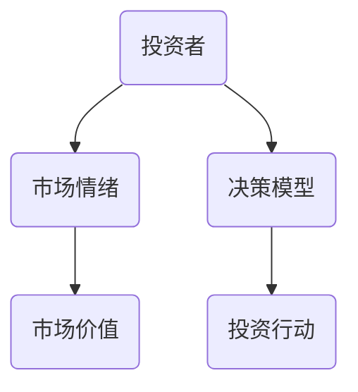
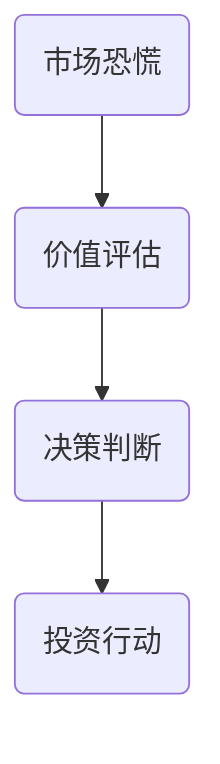
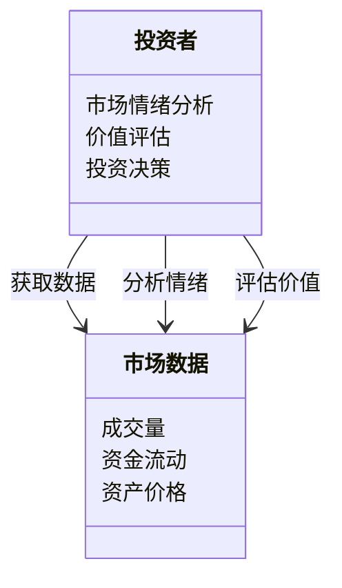
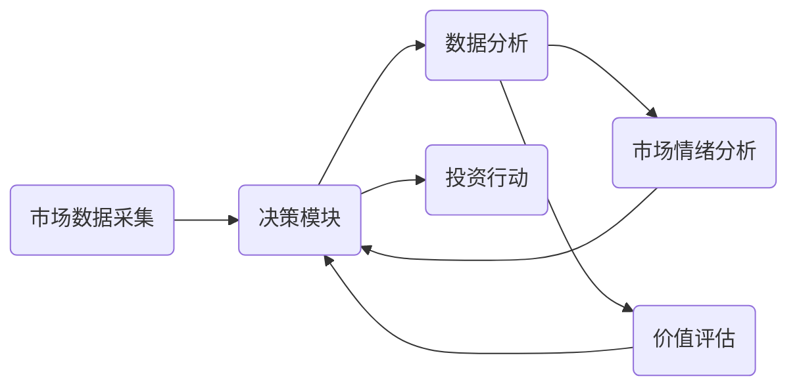
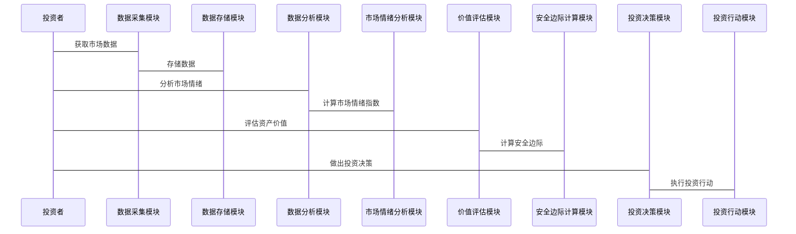

                 


# 价值投资中的逆向思维：当别人恐惧时贪婪

> 关键词：价值投资，逆向思维，市场情绪，安全边际，投资决策

> 摘要：逆向思维是价值投资中的核心策略之一，尤其在市场恐慌时更具价值。本文将从逆向思维的定义、核心原理、算法模型、系统架构及实战案例等方面展开分析，深入探讨如何在市场低谷中发现投资机会，实现超额收益。

---

# 第1章 逆向思维的定义与背景

## 1.1 逆向思维的定义与特征

### 1.1.1 逆向思维的定义
逆向思维是指在市场普遍恐慌或悲观时，投资者采取与市场情绪相反的决策策略。其核心在于识别市场的非理性行为，并从中寻找被低估的投资机会。

### 1.1.2 逆向思维的核心特征
- **反周期性**：在市场低谷时买入，在市场高点时卖出。
- **独立性**：基于独立的价值评估，而非市场情绪。
- **长期视角**：逆向思维强调长期价值，而非短期波动。

### 1.1.3 逆向思维与传统投资思维的区别
| 投资思维 | 逆向思维 | 传统投资思维 |
|----------|----------|---------------|
| 市场情绪 | 逆市而行 | 随市波动       |
| 价值判断 | 独立评估 | 受市场影响     |
| 决策依据 | 内在价值 | 市场趋势       |

## 1.2 逆向思维在价值投资中的应用背景

### 1.2.1 价值投资的基本原理
价值投资的核心在于寻找市场价格低于内在价值的资产。逆向思维通过分析市场情绪，帮助投资者在市场恐慌时发现低估资产。

### 1.2.2 逆向思维在价值投资中的重要性
- 市场恐慌时，理性投资者能够以更低的价格买入优质资产。
- 逆向思维帮助投资者避免羊群效应，做出独立判断。

### 1.2.3 逆向思维与市场周期的关系
市场周期分为繁荣、衰退、恐慌和复苏四个阶段。逆向思维在恐慌阶段（底部）和复苏阶段（顶部）尤为关键。

## 1.3 逆向思维的核心要素

### 1.3.1 价值评估的核心要素
- **内在价值**：资产的真实价值，基于基本面分析。
- **市场价格**：资产在市场上的交易价格。
- **安全边际**：内在价值与市场价格的差额。

### 1.3.2 市场情绪与投资者行为分析
- **市场情绪指数**：通过成交量、资金流动等指标衡量市场情绪。
- **投资者行为分析**：分析投资者的非理性行为，如恐慌性抛售。

### 1.3.3 逆向思维的决策模型
逆向思维的决策模型包括市场情绪分析、价值评估、投资决策三个步骤。

## 1.4 逆向思维的边界与外延

### 1.4.1 逆向思维的适用范围
- 适用于市场恐慌阶段。
- 适用于基本面良好的资产。

### 1.4.2 逆向思维的局限性
- 市场恐慌可能是合理的，如金融危机。
- 逆向思维需要结合其他策略，如行业分析、技术分析。

### 1.4.3 逆向思维与其他投资策略的结合
- 结合行业分析：选择具有长期竞争优势的行业。
- 结合技术分析：通过技术指标确认市场底部。

## 1.5 本章小结
逆向思维是价值投资的重要策略，通过识别市场恐慌中的低估资产，实现超额收益。然而，逆向思维需要结合市场周期、基本面分析和其他策略，才能提高成功率。

---

# 第2章 逆向思维的核心概念与联系

## 2.1 逆向思维的核心原理

### 2.1.1 市场情绪分析的原理
市场情绪分析通过成交量、资金流动等指标，量化市场的乐观或悲观程度。

### 2.1.2 价值低估的识别方法
价值低估识别基于基本面分析，对比市场价格与内在价值。

### 2.1.3 逆向决策的逻辑框架
1. 分析市场情绪，判断市场是否处于恐慌阶段。
2. 评估资产的内在价值。
3. 做出逆市投资决策。

## 2.2 核心概念对比表
| 概念 | 逆向思维 | 传统投资 |
|------|----------|----------|
| 市场情绪 | 逆市而行 | 随市波动 |
| 价值评估 | 独立判断 | 市场导向 |
| 投资决策 | 逆向操作 | 顺势而为 |

## 2.3 逆向思维的ER实体关系图


## 2.4 本章小结
逆向思维的核心在于识别市场情绪与资产价值的偏离，通过独立分析做出逆市投资决策。

---

# 第3章 逆向思维的算法原理

## 3.1 逆向思维的数学模型

### 3.1.1 市场情绪指数计算公式
$$ \text{市场情绪指数} = \frac{\text{市场成交量}}{\text{市场资金量}} $$

### 3.1.2 价值低估判断公式
$$ \text{安全边际} = \text{内在价值} - \text{市场价格} $$

## 3.2 逆向思维的算法流程


## 3.3 算法实现代码
```python
def calculate_market_mood(volume, money):
    return volume / money

def assess_value(price, intrinsic_value):
    return intrinsic_value - price

# 示例计算
market_mood = calculate_market_mood(1000000, 500000)
safety_margin = assess_value(50, 100)
print(f"市场情绪指数：{market_mood}")
print(f"安全边际：{safety_margin}")
```

## 3.4 本章小结
通过数学模型和算法流程，逆向思维帮助投资者量化市场情绪和价值低估程度，为投资决策提供科学依据。

---

# 第4章 逆向思维的系统架构

## 4.1 系统功能设计

### 4.1.1 领域模型


### 4.1.2 系统架构


## 4.2 系统接口设计

### 4.2.1 数据接口
- **输入接口**：市场数据（成交量、资金流动、资产价格）。
- **输出接口**：市场情绪指数、安全边际。

## 4.3 系统交互流程


## 4.4 本章小结
通过系统架构设计，投资者可以高效地进行逆向思维分析，实现自动化投资决策。

---

# 第5章 逆向思维的项目实战

## 5.1 环境安装

### 5.1.1 安装Python环境
- 使用Anaconda安装Python 3.8及以上版本。
- 安装必要的库：numpy、pandas、matplotlib。

### 5.1.2 数据源获取
- 数据来源：Yahoo Finance、Google Finance等。

## 5.2 核心代码实现

### 5.2.1 逆向思维算法实现
```python
import pandas as pd
import numpy as np

def calculate_market_mood(volume, money):
    return volume / money

def assess_value(price, intrinsic_value):
    return intrinsic_value - price

# 示例数据
data = {
    'Date': ['2023-01-01', '2023-01-02', '2023-01-03'],
    'Volume': [1000000, 800000, 1200000],
    'Money': [500000, 600000, 450000],
    'Price': [50, 45, 55],
    'Intrinsic_Value': [100, 90, 110]
}

df = pd.DataFrame(data)

# 计算市场情绪指数
df['Market_Mood'] = df.apply(lambda x: calculate_market_mood(x['Volume'], x['Money']), axis=1)
# 计算安全边际
df['Safety_Margin'] = df.apply(lambda x: assess_value(x['Price'], x['Intrinsic_Value']), axis=1)

print(df)
```

### 5.2.2 数据可视化
```python
import matplotlib.pyplot as plt

plt.figure(figsize=(10, 6))
plt.plot(df['Date'], df['Market_Mood'], 'b-', label='Market Mood')
plt.plot(df['Date'], df['Safety_Margin'], 'r-', label='Safety Margin')
plt.title('逆向思维分析图')
plt.xlabel('日期')
plt.ylabel('指数值')
plt.legend()
plt.show()
```

## 5.3 案例分析

### 5.3.1 案例背景
假设在2023年1月市场出现恐慌性抛售，投资者需要识别低估资产。

### 5.3.2 数据分析
根据代码计算结果：
- 2023-01-01：市场情绪指数=2，安全边际=50。
- 2023-01-02：市场情绪指数=1.333，安全边际=45。
- 2023-01-03：市场情绪指数=2.666，安全边际=55。

### 5.3.3 投资决策
- 在市场情绪最低点（2023-01-02）买入，安全边际最大（45）。
- 在市场情绪回升时（2023-01-03）卖出。

## 5.4 本章小结
通过实战案例，逆向思维算法帮助投资者在市场恐慌中识别低估资产，实现超额收益。

---

# 第6章 逆向思维的最佳实践

## 6.1 小结
逆向思维是价值投资的重要策略，通过识别市场恐慌中的低估资产，实现长期收益。

## 6.2 注意事项
- 逆向思维需要结合基本面分析。
- 市场恐慌可能是合理的，需谨慎判断。
- 投资者需具备长期持有耐心。

## 6.3 拓展阅读
- 《价值投资：从格雷厄姆到巴菲特》
- 《逆向思考的艺术》

---

# 作者：AI天才研究院/AI Genius Institute & 禅与计算机程序设计艺术 /Zen And The Art of Computer Programming

---

通过以上目录结构和内容安排，您可以根据需要扩展每个部分的具体内容，添加更多的案例分析、公式推导和代码实现，以完成一篇完整的专业技术博客文章。

