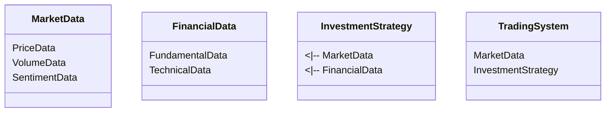
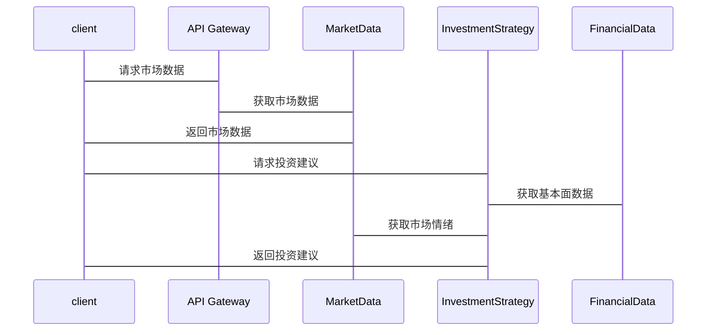

                 


```markdown
# 价值投资中的逆向思维：当别人恐惧时贪婪

> 关键词：价值投资，逆向思维，恐慌市场，安全边际，基本面分析，风险管理

> 摘要：逆向思维是价值投资中的核心策略之一，尤其在市场恐慌时更为重要。本文详细探讨了逆向思维在价值投资中的应用，包括其定义、基本原理、策略执行、经典案例分析、心理因素、风险管理等方面，旨在帮助投资者在市场波动中找到机会，实现稳健投资。

---

## 第一部分：引言：逆向思维与价值投资的结合

### 第1章：逆向思维在价值投资中的重要性

#### 1.1 逆向思维的定义与核心理念

- **逆向思维的定义**：逆向思维是指在常规思维的基础上，采取相反的思考方式，寻找市场的非共识性机会。  
- **核心理念**：逆向思维的核心在于“别人恐惧时我贪婪，别人贪婪时我恐惧”，强调在市场恐慌时寻找低估资产，在市场狂热时保持警惕。

#### 1.2 价值投资的基本原理

- **价值投资的定义**：价值投资是一种以基本面分析为基础的投资方法，旨在寻找市场价格低于其内在价值的资产。  
- **核心原则**：
  - 购买便宜的东西，而不是追逐高价的东西。
  - 长期持有优质资产，等待市场重新发现其价值。

#### 1.3 逆向思维与恐慌市场的结合

- **恐慌市场的定义**：恐慌市场是指投资者因恐慌情绪导致市场交易量骤减，价格大幅下跌的市场环境。  
- **恐慌市场的机会**：在恐慌市场中，许多优质资产因非理性抛售而被低估，为逆向投资者提供了买入机会。

---

### 第2章：当别人恐惧时的贪婪：恐慌市场的投资机会

#### 2.1 市场恐慌的定义与表现

- **市场恐慌的定义**：市场恐慌是指投资者因担心市场进一步下跌而产生强烈的抛售意愿，导致市场流动性枯竭。  
- **市场恐慌的表现形式**：
  - 股票价格大幅波动，尤其是蓝筹股的暴跌。
  - 债券收益率急剧上升，资金从风险资产流向无风险资产。
  - 市场成交额骤减，交易活跃度下降。

#### 2.2 恐慌市场中的投资机会

- **低估值资产的识别**：
  - 使用市盈率（P/E）、市净率（P/B）等指标筛选低于行业平均水平的资产。
  - 关注ROE（净资产收益率）等 profitability metrics，寻找盈利能力强但被市场忽视的公司。
- **恐慌市场中的投资策略**：
  - 逆向买入：在恐慌市场中，分批买入低估资产，逐步建仓。
  - 长期持有：避免短期波动，等待市场回归理性。

#### 2.3 历史上的恐慌市场案例分析

- **经典案例：2008年全球金融危机**：
  - 市场恐慌指数（VIX）飙升至历史高位，标普500指数大幅下跌。
  - 许多优质公司因市场恐慌被低估，如巴菲特增持的银行股。
- **经验教训**：
  - 理解市场恐慌是暂时的，恐慌市场中的机会是暂时的。
  - 需要耐心和纪律，避免被短期恐慌情绪左右。

---

## 第二部分：价值投资中的逆向思维策略

### 第3章：逆向思维的策略与执行

#### 3.1 逆向思维的投资策略

- **逆向思维的核心策略**：
  - 寻找市场的非共识性机会，避免拥挤交易。
  - 逆向买入：在市场底部区域，买入优质资产。
  - 逆向卖出：在市场顶部区域，逐步减仓。

#### 3.2 逆向思维在不同市场环境中的应用

- **牛市中的逆向思维**：
  - 留意市场的高估值资产，避免过度乐观。
  - 分配部分仓位到防御性资产，如债券或黄金。
- **熊市中的逆向思维**：
  - 识别市场底部信号，逐步增加仓位。
  - 选择基本面强劲、估值合理的企业。
- **震荡市中的逆向思维**：
  - 利用市场的波动性，进行波段操作。
  - 保持灵活性，根据市场变化调整仓位。

### 第4章：逆向思维的数学模型与算法原理

#### 4.1 逆向思维的数学模型

- **市场情绪指数的计算**：
  - 使用VIX指数衡量市场恐慌程度。
  - VIX指数越高，市场情绪越恐慌，逆向投资者越应该关注。
- **低估值资产的筛选公式**：
  - 通过P/E、P/B、EV/EBITDA等指标筛选低于行业平均水平的资产。
  - 结合ROE、毛利率等 profitability metrics，寻找基本面强劲的公司。

#### 4.2 逆向思维的算法流程

- **数据采集与处理**：
  - 收集历史价格、财务数据、市场情绪等信息。
  - 清洗数据，剔除异常值，确保数据的准确性。
- **市场情绪分析**：
  - 使用VIX指数、新闻 sentiment 分析等方法，量化市场情绪。
  - 根据情绪指数，判断市场的恐慌程度。
- **低估值资产识别与排序**：
  - 使用筛选公式，识别低估值资产。
  - 根据多因子模型，对资产进行排序，优先选择排名靠前的资产。

---

### 第5章：系统分析与架构设计方案

#### 5.1 问题场景介绍

- **问题背景**：市场恐慌时，如何快速识别低估值资产，制定投资策略。
- **项目介绍**：构建一个基于逆向思维的投资系统，帮助投资者在恐慌市场中捕捉机会。

#### 5.2 系统功能设计（领域模型）



#### 5.3 系统架构设计


#### 5.4 系统接口设计

- **输入接口**：
  - MarketData API：提供历史价格、交易量、市场情绪等数据。
  - FinancialData API：提供基本面数据，如P/E、ROE等。
- **输出接口**：
  - InvestmentStrategy Output：提供低估值资产列表、投资建议、风险提示。

#### 5.5 系统交互设计



---

## 第三部分：项目实战

### 第6章：环境安装与系统核心实现

#### 6.1 环境安装

- **Python环境**：安装Python 3.8+，安装必要的库，如Pandas、NumPy、Plotly、Scikit-learn。
- **数据源**：使用Yahoo Finance API获取市场数据，使用Twitter API获取市场情绪数据。

#### 6.2 核心实现

- **数据清洗**：
  ```python
  import pandas as pd

  # 读取数据
  df = pd.read_csv('market_data.csv')
  # 清洗数据
  df.dropna(inplace=True)
  df = df[ df['volume'] > 0 ]
  ```
- **市场情绪分析**：
  ```python
  from textblob import TextBlob

  def get_sentiment(text):
      return TextBlob(text).sentiment.polarity

  sentiment = df['text'].apply(get_sentiment)
  ```

#### 6.3 应用解读与分析

- **案例分析**：以2020年新冠疫情为例，分析市场恐慌对资产价格的影响。
- **策略实现**：基于VIX指数和基本面数据，构建逆向投资策略。

---

## 第四部分：总结与展望

### 第7章：总结与展望

#### 7.1 核心要点回顾

- 逆向思维是价值投资中的重要策略，在市场恐慌时尤为重要。
- 通过基本面分析和市场情绪分析，识别低估值资产。
- 构建稳健的投资系统，结合数学模型和算法，实现自动化投资。

#### 7.2 未来展望

- 结合人工智能技术，优化逆向投资策略。
- 探索更多市场情绪指标，提升策略的准确性。
- 开发更多工具，帮助投资者在恐慌市场中捕捉机会。

---

## 作者信息

作者：AI天才研究院/AI Genius Institute & 禅与计算机程序设计艺术 /Zen And The Art of Computer Programming

---

# END
```

