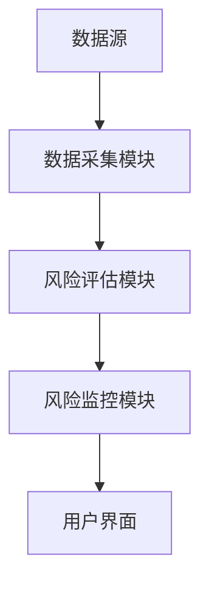
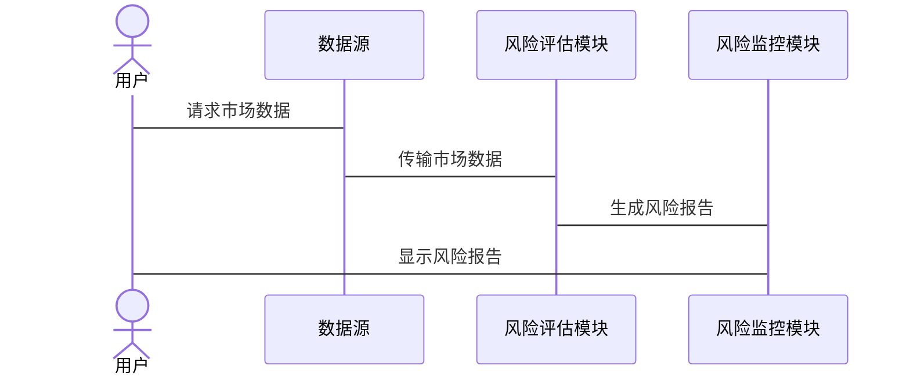

                 


# 价值投资中的风险管理策略

> 关键词：价值投资，风险管理，投资组合，夏普比率，VaR，最大回撤

> 摘要：价值投资是一种注重长期稳健回报的投资策略，而风险管理是确保这种策略成功的关键。本文详细探讨了价值投资中的风险管理策略，包括核心概念、数学模型、系统架构以及实际案例分析。通过理论与实践相结合的方式，帮助投资者在追求超额收益的同时，有效控制投资风险。

---

## 第1章 价值投资中的风险管理背景

### 1.1 价值投资的核心理念

#### 1.1.1 价值投资的定义与特点
- **定义**：价值投资是一种基于对公司内在价值分析的投资策略，旨在以低于内在价值的价格买入优质资产。
- **特点**：
  - 长期视角：关注企业的长期盈利能力。
  - 安全边际：买入价格低于内在价值，以降低风险。
  - 逆向思维：在市场恐慌时买入，在市场狂热时卖出。

#### 1.1.2 风险管理在价值投资中的地位
- 风险管理是价值投资成功的关键，决定投资组合的长期收益和稳定性。
- 风险管理帮助投资者在市场波动中保持冷静，避免情绪化决策。

#### 1.1.3 风险与收益的权衡关系
- 高风险不一定带来高收益，风险管理确保收益的可持续性。
- 通过分散化和止损策略，平衡风险与收益。

### 1.2 价值投资中的风险管理目标
#### 1.2.1 投资目标的设定
- 明确投资目标：追求长期稳健的复利增长。
- 风险承受能力：根据自身财务状况和风险偏好设定。

#### 1.2.2 风险的度量与控制
- 使用夏普比率衡量风险调整后收益。
- 通过分散化降低非系统性风险。

#### 1.2.3 风险管理对投资组合的影响
- 投资组合的波动性降低，稳定性增强。
- 风险管理确保在市场下跌时减少损失，为长期收益积累资本。

### 1.3 风险管理的基本原则
#### 1.3.1 风险与收益的匹配原则
- 风险与收益成正比，但需权衡边际收益。

#### 1.3.2 分散化投资策略
- 通过投资不同资产、行业和地域降低非系统性风险。

#### 1.3.3 风险承受能力的评估
- 结合自身财务状况和心理承受能力，合理配置资产。

## 第2章 风险管理的核心概念与框架

### 2.1 风险的定义与分类
#### 2.1.1 风险的定义
- 风险是未来收益的不确定性，可能影响投资目标的实现。

#### 2.1.2 风险的分类
| 风险类型 | 定义 | 来源 | 特点 |
|----------|------|------|------|
| 系统性风险 | 影响整个市场的风险 | 经济周期、政策变化 | 不可分散 |
| 非系统性风险 | 影响单一资产或行业 | 公司-specific因素 | 可分散 |

#### 2.1.3 风险的三要素
- **风险事件**：可能导致损失的事件。
- **风险敞口**：投资者对风险的暴露程度。
- **风险影响**：风险事件对投资组合的影响程度。

### 2.2 风险评估的数学模型
#### 2.2.1 方差与标准差的定义
- 方差衡量资产收益的离散程度：
  $$ \text{方差} = \sigma^2 = \frac{1}{N}\sum_{i=1}^{N}(x_i - \mu)^2 $$
- 标准差是方差的平方根：
  $$ \text{标准差} = \sigma = \sqrt{\sigma^2} $$

#### 2.2.2 风险调整后的收益计算
- **夏普比率**：
  $$ \text{夏普比率} = \frac{E[r - r_f]}{\sigma} $$
  其中，$r$是资产的预期收益，$r_f$是无风险利率，$\sigma$是资产收益的标准差。

#### 2.2.3 风险调整后的收益分析
- 夏普比率越高，单位风险的超额收益越高，投资组合的风险调整后收益越好。

### 2.3 风险管理框架的构建
#### 2.3.1 风险识别
- 通过历史数据分析和市场分析，识别潜在风险点。

#### 2.3.2 风险量化
- 使用VaR、最大回撤等指标量化风险。

#### 2.3.3 风险控制
- 通过止损、分散化等手段，将风险控制在可承受范围内。

---

### 2.4 本章小结
- 风险管理是价值投资的核心，需要明确风险的定义、分类和量化方法。
- 方差、标准差和夏普比率是常用的风崄量化工具。

---

## 第3章 价值投资中的风险管理策略

### 3.1 投资组合的风险管理
#### 3.1.1 投资组合的分散化策略
- 通过投资不同资产、行业和地域，降低非系统性风险。

#### 3.1.2 股票与债券的配置比例
- 股票和债券的配置比例取决于投资者的风险承受能力和收益目标。

#### 3.1.3 行业与地域的分散化
- 投资多个行业的股票，避免因单一行业波动带来的风险。

### 3.2 个股风险管理策略
#### 3.2.1 个股风险的识别与评估
- 通过基本面分析和估值指标，识别个股风险。

#### 3.2.2 个股止损策略的制定
- 设置止损点，避免单个股票的大幅亏损。

#### 3.2.3 个股风险的动态调整
- 定期评估个股风险，及时调整投资组合。

### 3.3 投资组合的动态再平衡
#### 3.3.1 再平衡的定义与作用
- 再平衡是指定期调整投资组合的配置比例，以维持目标风险水平。

#### 3.3.2 再平衡的时机与方法
- 定期（如每季度）或不定期根据市场变化调整。

#### 3.3.3 再平衡对投资组合的影响
- 保持投资组合的风险和收益目标不变，优化资产配置。

### 3.4 本章小结
- 投资组合的风险管理通过分散化和再平衡策略，降低整体风险，提升长期收益。

---

## 第4章 风险管理的数学模型与工具

### 4.1 风险价值（VaR）模型
#### 4.1.1 VaR的定义与计算
- VaR是在一定置信水平下，可能的最大损失。
  $$ \text{VaR} = \mu + z \cdot \sigma $$
  其中，$\mu$是平均收益，$z$是置信水平对应的z值，$\sigma$是收益的标准差。

#### 4.1.2 VaR在投资组合中的应用
- 用于衡量投资组合在市场下跌时的最大潜在损失。

#### 4.1.3 VaR的优缺点
- 优点：简单易懂，计算方便。
- 缺点：假设市场数据符合正态分布，且忽略极端事件。

### 4.2 最大回撤（Max Drawdown）模型
#### 4.2.1 最大回撤的定义
- 最大回撤是指在特定时间段内，投资组合从最高点到最低点的损失。

#### 4.2.2 最大回撤的计算方法
- 计算投资组合的历史最高点和最低点，计算两者之间的跌幅。

#### 4.2.3 最大回撤在风险管理中的应用
- 用于衡量投资组合在市场下跌时的最大损失。

### 4.3 本章小结
- VaR和最大回撤是常用的风崄量化工具，各有优缺点，应结合使用。

---

## 第5章 系统分析与架构设计

### 5.1 风险管理系统框架
#### 5.1.1 系统功能模块
- **数据采集模块**：收集市场数据和资产信息。
- **风险评估模块**：计算VaR、最大回撤等指标。
- **风险监控模块**：实时监控投资组合的风险。

#### 5.1.2 系统架构图


### 5.2 风险管理系统实现
#### 5.2.1 系统接口设计
- 数据接口：与数据源对接，获取市场数据。
- 用户接口：提供风险评估和监控的可视化界面。

#### 5.2.2 系统交互流程


### 5.3 本章小结
- 系统架构设计为风险管理提供了高效的支持，便于实现自动化和可视化。

---

## 第6章 项目实战：构建风险管理模型

### 6.1 环境安装与配置
- 安装Python和相关库（如Pandas、NumPy、Matplotlib）。

### 6.2 核心代码实现
#### 6.2.1 数据采集与处理
```python
import pandas as pd
import numpy as np

# 示例数据
data = pd.DataFrame({
    '资产': ['股票', '债券', '黄金'],
    '预期收益': [0.1, 0.05, 0.03],
    '标准差': [0.2, 0.1, 0.05]
})
```

#### 6.2.2 风险评估与计算
```python
def calculate VaR(data, confidence_level=0.95):
    # 计算VaR
    returns = data['预期收益']
    mu = returns.mean()
    sigma = returns.std()
    z = norm.ppf(confidence_level)
    var = mu + z * sigma
    return var

from scipy.stats import norm
var = calculate VaR(data)
print(f"VaR at {confidence_level} confidence level: {var}")
```

### 6.3 应用案例分析
#### 6.3.1 投资组合配置
- 根据VaR和夏普比率，优化资产配置比例。

#### 6.3.2 风险监控与调整
- 定期检查投资组合的VaR和最大回撤，进行动态调整。

### 6.4 本章小结
- 通过实际案例分析，验证风险管理模型的有效性。

---

## 第7章 总结与展望

### 7.1 总结
- 价值投资中的风险管理是实现长期稳健收益的关键。
- 通过合理配置资产、分散化投资和动态再平衡，降低整体风险。

### 7.2 展望
- 结合机器学习和大数据分析，进一步优化风险管理模型。
- 开发智能化的风险管理系统，提升风险监控和预警能力。

---

## 参考文献
- 市场风险权威指南
- 价值投资经典文献

---

## 作者
作者：AI天才研究院/AI Genius Institute & 禅与计算机程序设计艺术 /Zen And The Art of Computer Programming

---

**本文遵循CC BY-SA 4.0协议，转载请注明出处。**

