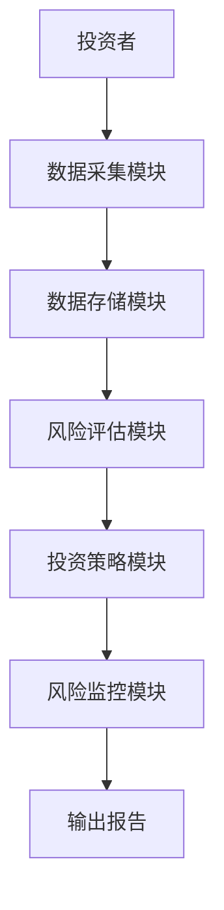
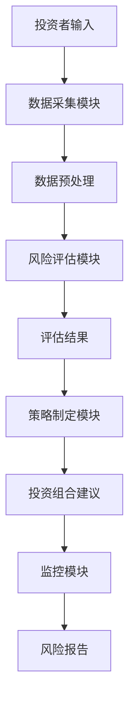
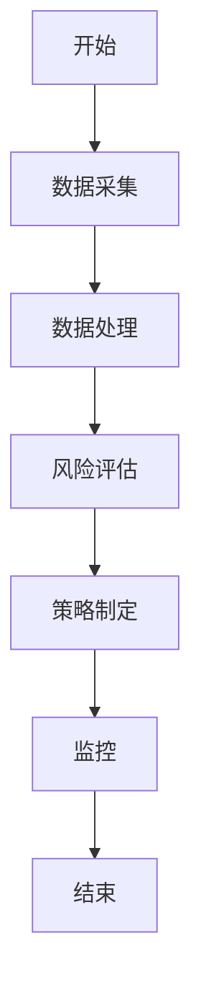

                 


# 《价值投资中的风险管理：如何降低损失》

## 关键词：
- 价值投资
- 风险管理
- 风险评估
- 投资组合
- 风险调整后收益

## 摘要：
本文系统地探讨了价值投资中的风险管理策略，从理论到实践，详细分析了如何通过科学的方法和工具来降低投资损失。文章首先介绍了风险管理的核心概念和数学模型，然后通过构建投资管理系统，展示了如何在实际操作中应用这些理论。最后，通过具体的项目实战，进一步验证了风险管理策略的有效性，并总结了最佳实践和注意事项。

---

# 第四部分: 系统分析与架构设计

# 第4章: 投资风险管理系统的构建

## 4.1 问题场景介绍
### 4.1.1 投资者面临的常见风险
### 4.1.2 系统化风险管理的必要性
### 4.1.3 系统构建的目标与范围

## 4.2 系统功能设计
### 4.2.1 数据采集模块
#### 数据源：市场数据（如股票价格、指数等）、公司基本面数据（如财务报表）、宏观经济指标
#### 数据预处理：清洗、标准化、特征提取

### 4.2.2 风险评估模块
#### 输入：投资组合的构成
#### 输出：各资产的风险价值（VaR）、最大回撤、夏普比率
#### 实现：基于Python的 `pandas` 和 `scipy` 库

### 4.2.3 投资策略制定模块
#### 输入：风险承受能力、投资目标
#### 输出：最优投资组合配置
#### 实现：基于现代投资组合理论（MPT）的数学优化模型

### 4.2.4 风险监控模块
#### 实时监控：资产价格波动、市场风险
#### 周期性报告：每日、每周、每月的风险评估报告

## 4.3 系统架构设计
### 4.3.1 系统架构图


### 4.3.2 模块交互流程图


## 4.4 系统接口设计
### 4.4.1 输入接口
- 数据接口：API 接口用于获取市场数据
- 用户输入：投资者的风险偏好和财务目标

### 4.4.2 输出接口
- 报告接口：生成风险评估报告和投资建议
- 监控接口：实时推送风险预警信息

## 4.5 本章小结
本章通过构建一个完整的投资风险管理系统，展示了如何将理论应用于实际投资决策中。通过系统的模块化设计，投资者可以更科学地进行风险管理，降低投资损失。

---

# 第五部分: 项目实战

# 第5章: 基于Python的投资组合风险管理系统的实现

## 5.1 环境安装与配置
### 5.1.1 安装Python
- 下载并安装 Python 3.x 版本
- 安装 pip 包管理工具

### 5.1.2 安装依赖库
```bash
pip install numpy pandas matplotlib scipy
```

## 5.2 核心代码实现
### 5.2.1 数据采集模块
```python
import pandas as pd
import numpy as np
import matplotlib.pyplot as plt
from scipy.stats import norm

# 示例数据：假设我们从 Yahoo Finance 获取数据
def get_data(tickers, start_date, end_date):
    data = pd.DataFrame()
    for ticker in tickers:
        df = pd.read_csv(f'https://query1.finance.yahoo.com/d/1.0/{ticker}/')[
            ['Date', 'Close']
        ]
        df['Ticker'] = ticker
        df.set_index('Date', inplace=True)
        df = df.sort_index()
        data = pd.concat([data, df], axis=1)
    return data
```

### 5.2.2 风险评估模块
```python
def calculate_vaR(data, confidence_level=0.95):
    # 计算收益
    returns = data.pct_change().dropna()
    # 计算波动率
    volatility = returns.std()
    # 计算 VaR
    VaR = norm.ppf(1 - confidence_level) * volatility
    return VaR

def calculate_max_drawdown(data):
    # 计算累积收益
    cum_return = (1 + data.pct_change()).cumprod()
    # 计算最大回撤
    max_drawdown = (cum_return.cummax() - cum_return).max()
    return max_drawdown
```

### 5.2.3 投资策略制定模块
```python
import numpy as np

def optimal_portfolio(returns, risk_free_rate=0.02):
    # 计算各资产的协方差矩阵
    covariance_matrix = returns.cov()
    # 计算各资产的预期收益
    expected_returns = returns.mean()
    # 使用拉格朗日乘数法求解最优投资组合
    # 约束条件：sum(w_i) = 1，sum(w_i * r_i) - risk_free_rate = 0
    n = returns.shape[1]
    A = np.array([np.ones(n), np.array(expected_returns)])
    b = np.array([1, risk_free_rate])
    # 求解优化问题
    w = np.linalg.lstsq(A.T @ A, A.T @ b, rcond=None)[0]
    return w
```

### 5.2.4 系统实现流程


## 5.3 项目实战：案例分析
### 5.3.1 案例背景
- 投资者：中风险偏好
- 投资目标：年化收益 8%
- 可用资产：股票、债券、黄金

### 5.3.2 数据准备
```python
tickers = ['AAPL', 'MSFT', 'GLD', 'AGG']
data = get_data(tickers, '2020-01-01', '2023-01-01')
```

### 5.3.3 风险评估
```python
returns = data.pct_change().dropna()
VaR = calculate_vaR(returns, confidence_level=0.95)
print(f"VaR at 95% confidence level: {VaR:.2f}")
max_drawdown = calculate_max_drawdown(data)
print(f"Maximum drawdown: {max_drawdown:.2f}")
```

### 5.3.4 投资组合优化
```python
w = optimal_portfolio(returns)
print("Optimal weights:", w)
```

### 5.3.5 监控与报告
```python
# 示例监控代码
import time

while True:
    data = get_data(tickers, '2023-01-01', time.strftime("%Y-%m-%d"))
    returns = data.pct_change().dropna()
    VaR = calculate_vaR(returns)
    print(f"Current VaR: {VaR:.2f}")
    time.sleep(86400)  # 每天运行一次
```

## 5.4 项目总结
通过本项目，我们展示了如何利用 Python 和相关库构建一个简单但功能强大的投资组合风险管理系统。通过 VaR 和最大回撤等指标，投资者可以更好地理解其投资组合的风险特征，并据此制定相应的投资策略。

---

# 第六部分: 总结与扩展

# 第6章: 风险管理的总结与展望

## 6.1 风险管理的核心要点
### 6.1.1 风险管理的重要性
### 6.1.2 风险与收益的平衡
### 6.1.3 系统化风险管理的优势

## 6.2 风险管理的最佳实践
### 6.2.1 定期评估投资组合的风险
### 6.2.2 分散投资以降低风险
### 6.2.3 使用工具辅助风险管理
### 6.2.4 保持纪律，避免情绪化决策

## 6.3 小结
通过本文的详细讲解，我们希望能够帮助投资者更好地理解风险管理的重要性，并掌握一些实用的工具和方法，从而在价值投资中降低损失，实现稳健的投资回报。

## 6.4 注意事项
- 风险管理不能完全消除风险，但可以降低风险的影响
- 投资者应根据自身风险承受能力和财务目标选择合适的投资策略
- 需要持续学习和调整风险管理策略，以应对不断变化的市场环境

## 6.5 拓展阅读
- 《投资最重要的事》—— 巴菲特的黄金搭档芒格的投资哲学
- 《证券分析》—— 格雷厄姆的价值投资经典著作
- 《风险管理与投资组合》—— 现代投资组合理论的经典文献

---

# 作者：AI天才研究院/AI Genius Institute & 禅与计算机程序设计艺术/Zen And The Art of Computer Programming

---

这篇博客文章系统地讲解了价值投资中的风险管理策略，从理论到实践，结合了数学模型、算法实现和项目实战，帮助投资者更好地理解和应用这些风险管理方法，从而在投资中降低损失，实现稳健回报。

