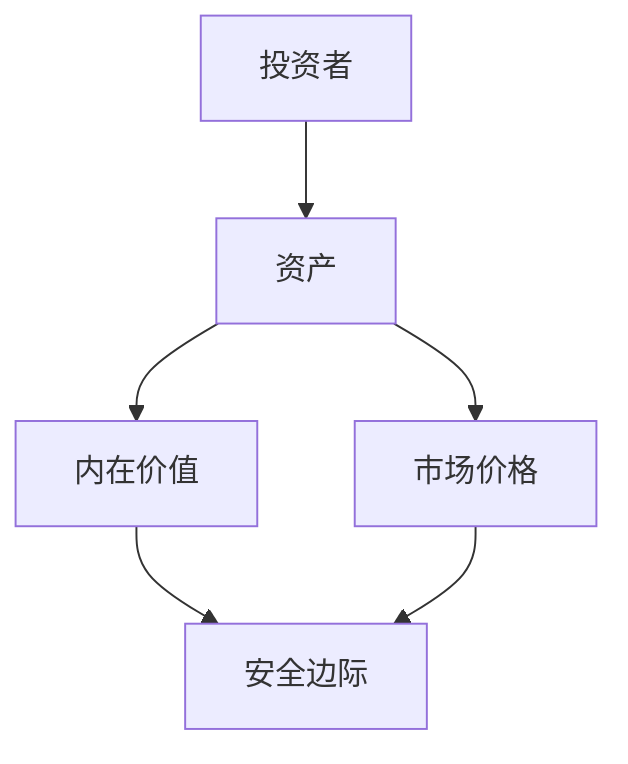
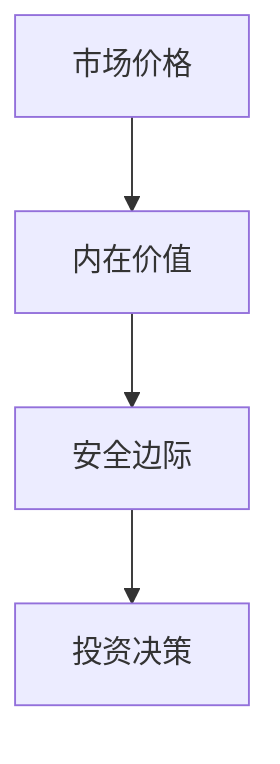

                 


# 价值投资中的风险管理：安全边际的作用

> 关键词：价值投资，风险管理，安全边际，内在价值，资产定价，投资策略

> 摘要：本文深入探讨了价值投资中的风险管理，特别是安全边际在降低投资风险中的关键作用。通过分析安全边际的定义、计算方法及其在投资决策中的应用，本文为投资者提供了如何通过安全边际来构建稳健的投资策略的指导。

---

# 第一部分: 引言

## 第1章: 价值投资与风险管理概述

### 1.1 价值投资的核心理念

价值投资是一种以基本面分析为基础的投资策略，其核心在于寻找市场价格低于其内在价值的资产。这种投资方法强调长期持有优质资产，而不是频繁交易以追求短期收益。价值投资的核心理念是通过深入分析企业的财务状况、行业地位和竞争优势，找到那些被市场低估的投资标的。

### 1.2 风险管理的基本概念

在投资过程中，风险管理是确保投资组合稳健增长的关键环节。风险管理的核心在于识别、评估和控制可能的投资风险，以避免或减少潜在的损失。在价值投资中，风险管理尤为重要，因为投资者需要在市场波动中保持冷静，并避免因短期波动而做出错误决策。

### 1.3 安全边际的定义与作用

安全边际是价值投资中的一个关键概念，它指的是市场价格与内在价值之间的差距。安全边际的存在为投资者提供了缓冲空间，以应对市场波动和不确定性。当市场价格远低于内在价值时，安全边际越大，投资的风险就越小，回报的潜力也就越大。

---

# 第二部分: 安全边际的核心概念与计算方法

## 第2章: 安全边际的定义与计算

### 2.1 安全边际的数学模型

安全边际的计算公式可以表示为：

$$ \text{安全边际} = \text{内在价值} - \text{市场价格} $$

其中，内在价值是基于企业基本面分析得出的理论价值，而市场价格是资产在市场上的当前价格。通过计算安全边际，投资者可以判断资产是否被低估，从而决定是否进行投资。

### 2.2 安全边际的属性特征对比

下表对比了安全边际与其他风险管理工具的属性特征：

| 特性                | 安全边际          | 市场波动率         | 资产质量         |
|---------------------|-------------------|-------------------|-----------------|
| 定义                | 内在价值 - 市场价格 | 价格波动幅度       | 资产的质量优劣   |
| 作用                | 提供风险缓冲       | 描述价格波动       | 影响投资决策     |
| 计算方式            | 内在价值 - 市场价格 | 标准差、波动率     | 财务指标分析     |

### 2.3 安全边际的ER实体关系图

下图展示了安全边际在价值投资中的实体关系：



### 2.4 本章小结

本章通过数学模型和实体关系图，详细解释了安全边际的定义、计算方法及其在价值投资中的作用。安全边际为投资者提供了重要的风险管理工具，帮助他们在市场波动中做出更稳健的投资决策。

---

# 第三部分: 价值投资中的风险管理策略

## 第3章: 安全边际在价值投资中的应用

### 3.1 安全边际在选股中的应用

在选股过程中，投资者可以通过计算安全边际来筛选出被市场低估的资产。例如，假设某股票的内在价值为10元，市场价格为8元，则其安全边际为2元。这种情况下，投资者可以考虑买入该股票，因为其市场价格远低于内在价值。

### 3.2 安全边际在资产配置中的应用

在资产配置中，投资者可以通过分析不同资产的安全边际，构建一个多元化的投资组合。例如，投资者可以选择多个具有较高安全边际的资产，以降低投资组合的整体风险。

### 3.3 安全边际在投资决策中的应用

在投资决策中，安全边际可以帮助投资者避免因市场波动而做出错误决策。例如，当市场价格接近内在价值时，投资者应保持谨慎，并考虑卖出资产以锁定收益。

## 第4章: 风险管理的系统化方法

### 4.1 投资组合的风险评估

投资者可以通过分析投资组合中各资产的安全边际，评估整体投资组合的风险。例如，如果投资组合中大部分资产的安全边际较高，则整体风险较低；反之，则整体风险较高。

### 4.2 风险对冲策略

通过使用衍生工具（如期权和期货），投资者可以对冲部分投资风险。例如，投资者可以购买认沽期权，以对冲市场价格下跌的风险。

### 4.3 风险监控与调整

投资者需要定期监控投资组合的安全边际，并根据市场变化进行调整。例如，当市场价格接近内在价值时，投资者可以减少对该资产的持有量，以降低风险。

---

# 第四部分: 安全边际的量化分析与算法实现

## 第4章: 安全边际的量化模型

### 4.1 安全边际的数学表达式

安全边际的量化模型可以表示为：

$$ \text{安全边际率} = \frac{\text{内在价值} - \text{市场价格}}{\text{市场价格}} $$

安全边际率越高，资产的投资价值越大。例如，假设某资产的内在价值为12元，市场价格为10元，则其安全边际率为20%。

### 4.2 安全边际的量化分析流程

下图展示了安全边际的量化分析流程：



### 4.3 安全边际的Python实现

以下是计算安全边际的Python代码示例：

```python
# 计算安全边际的函数
def calculate_margin(intrinsic_value, market_price):
    return intrinsic_value - market_price

# 示例数据
intrinsic_value = 12  # 内在价值
market_price = 10     # 市场价格

# 计算安全边际
margin = calculate_margin(intrinsic_value, market_price)
print("安全边际为:", margin)
```

### 4.4 本章小结

本章通过量化分析和Python代码实现，详细解释了安全边际的计算方法及其在投资决策中的应用。通过量化模型，投资者可以更准确地评估资产的风险和收益。

---

# 第五部分: 实际案例分析

## 第5章: 安全边际在实际投资中的应用

### 5.1 案例背景介绍

假设某投资者关注一只股票，其内在价值为20元，市场价格为15元。根据安全边际的计算公式，其安全边际为5元。

### 5.2 案例分析与解读

通过分析该股票的安全边际，投资者可以判断其市场价格远低于内在价值，具有较高的投资价值。因此，投资者可以考虑买入该股票，并在市场价格接近内在价值时卖出，以实现收益。

### 5.3 案例总结

本案例展示了安全边际在实际投资中的应用。通过计算安全边际，投资者可以识别出具有较高投资价值的资产，并在市场波动中做出更明智的投资决策。

---

# 第六部分: 总结与展望

## 第6章: 总结与展望

### 6.1 总结

本文深入探讨了价值投资中的风险管理，特别是安全边际在降低投资风险中的关键作用。通过分析安全边际的定义、计算方法及其在投资决策中的应用，本文为投资者提供了如何通过安全边际来构建稳健的投资策略的指导。

### 6.2 展望

未来，随着金融市场的不断发展，安全边际的概念和应用将更加广泛。投资者可以通过不断优化量化模型和算法，进一步提高风险管理的效率和准确性。

---

# 作者：AI天才研究院/AI Genius Institute & 禅与计算机程序设计艺术 /Zen And The Art of Computer Programming

