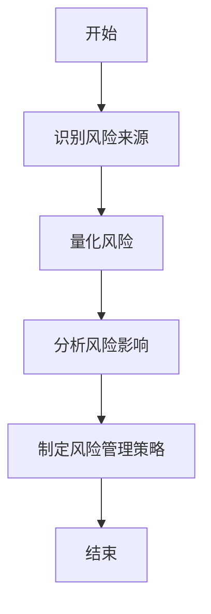
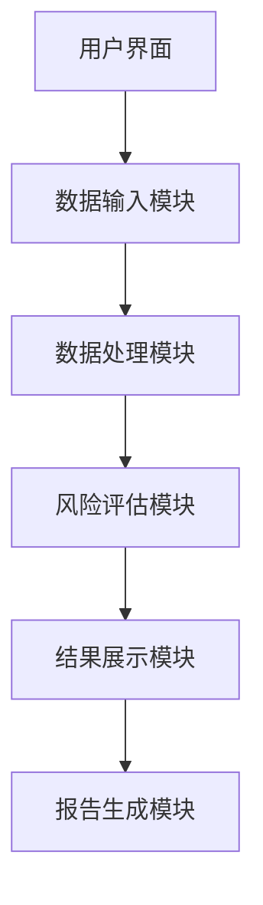
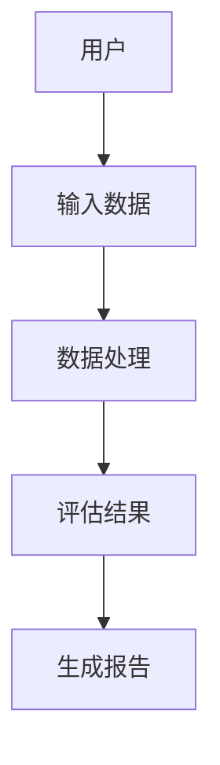

                 


# 价值投资中的风险评估：超越波动性

**关键词**：价值投资、风险评估、波动性、CAPM、夏普比率

**摘要**：本文探讨了价值投资中的风险评估方法，超越了传统的波动性分析。通过分析风险的多维性，引入数学模型和算法，构建系统化的风险评估框架，并通过案例分析展示实际应用，为投资者提供实用的建议。

---

# 价值投资中的风险评估：超越波动性

## 引言

价值投资是一种长期投资策略，强调通过分析企业的基本面来评估其内在价值。然而，投资过程中不可避免地存在风险。传统的风险评估方法通常关注资产价格的波动性，但这种方法往往忽视了其他重要的风险因素。本文将探讨如何从多维度评估风险，超越波动性，帮助投资者做出更明智的投资决策。

---

## 第一部分：风险评估的核心概念

### 1.1 风险的多维性

在价值投资中，风险不仅仅体现在价格波动上，还涉及财务状况、行业环境、宏观经济等多个方面。以下是主要风险维度的对比表格：

| **风险维度** | **具体内容** |
|--------------|--------------|
| 财务风险     | 利润表、资产负债表、现金流量表分析 |
| 市场风险     | 行业趋势、市场波动 |
| 流动性风险   | 资产变现能力 |
| 政策风险     | 宏观经济政策影响 |

### 1.2 风险评估的流程

以下是风险评估的流程图：



---

## 第二部分：数学模型与算法

### 2.1 CAPM模型

CAPM（资本资产定价模型）用于评估资产的预期回报率，公式为：

$$
E(r_i) = r_f + \beta_i (E(r_m) - r_f)
$$

其中：
- \(E(r_i)\) 是资产的预期回报率
- \(r_f\) 是无风险利率
- \(\beta_i\) 是资产的贝塔系数
- \(E(r_m)\) 是市场预期回报率

以下是计算贝塔系数的Python代码示例：

```python
import numpy as np

# 假设数据为市场回报和资产回报
market_returns = [...]  # 市场回报数据
asset_returns = [...]    # 资产回报数据

covariance = np.cov(asset_returns, market_returns)[0, 1]
variance = np.var(market_returns)

beta = covariance / variance
```

### 2.2 夏普比率

夏普比率衡量投资组合的风险调整后收益，公式为：

$$
\text{夏普比率} = \frac{E(r_p) - r_f}{\sigma_p}
$$

其中：
- \(E(r_p)\) 是投资组合的预期回报率
- \(r_f\) 是无风险利率
- \(\sigma_p\) 是投资组合的波动率

以下是计算夏普比率的Python代码示例：

```python
import numpy as np

# 假设数据为投资组合回报和无风险利率
portfolio_returns = [...]  # 投资组合回报数据
risk_free_rate = [...]      # 无风险利率

expected_return = np.mean(portfolio_returns)
std_deviation = np.std(portfolio_returns)

sharpe_ratio = (expected_return - risk_free_rate) / std_deviation
```

---

## 第三部分：系统化风险评估与管理

### 3.1 系统架构设计

以下是风险评估系统的架构图：



### 3.2 接口设计

以下是系统接口设计的流程图：



---

## 第四部分：项目实战

### 4.1 案例分析：苹果公司

#### 数据收集与分析

- **财务数据**：利润表、资产负债表、现金流量表
- **市场数据**：行业趋势、市场波动

#### 结果解读

通过分析，得出苹果公司的财务状况稳健，市场风险较低，具备较高的投资价值。

---

## 总结与建议

### 5.1 最佳实践

- 定期审查投资组合
- 保持对宏观经济的关注
- 结合多种风险评估方法

### 5.2 小结

超越波动性的风险评估方法能够帮助投资者更全面地识别和管理风险，从而做出更明智的投资决策。

### 5.3 注意事项

- 风险评估结果仅供参考，需结合市场实际情况
- 避免过度依赖单一模型

### 5.4 拓展阅读

建议阅读相关书籍和文献，深入理解风险评估的复杂性。

---

**作者：AI天才研究院/AI Genius Institute & 禅与计算机程序设计艺术 /Zen And The Art of Computer Programming**

---

通过本文的详细分析，读者可以系统地理解价值投资中的风险评估方法，并在实际投资中应用这些策略。

