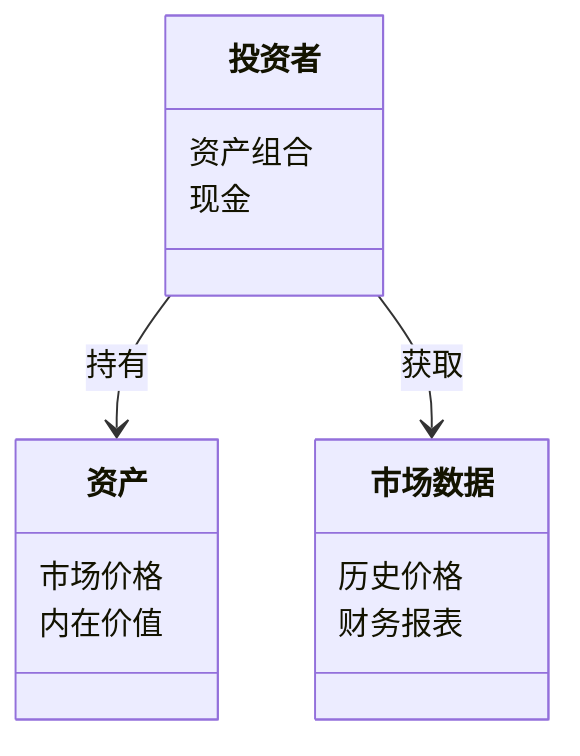

                 


# 价值投资之父本杰明·格雷厄姆的投资哲学

---

## 关键词  
价值投资、安全边际、内在价值、市场先生、投资哲学、投资策略、投资决策系统

---

## 摘要  
本杰明·格雷厄姆是价值投资之父，他的投资哲学深刻影响了现代投资理论。本文从格雷厄姆的投资理念出发，详细探讨其核心概念，包括安全边际、内在价值和市场先生，并结合数学模型和系统设计，分析其在实际投资中的应用。通过案例分析和项目实战，帮助读者理解如何将格雷厄姆的哲学转化为可操作的投资策略。

---

# 第1章: 价值投资的背景与核心理念

## 1.1 投资哲学的起源与问题背景  
在金融市场的历史长河中，投资者们不断探寻着稳定获利的秘诀。传统投资理论往往依赖技术分析和市场预测，但这种基于市场波动的策略在实践中充满了不确定性。1934年，本杰明·格雷厄姆与戴维·多德合著的《证券分析》为价值投资奠定了基础，提出了以“安全边际”为核心的选股方法。  

### 核心问题  
1. 如何在市场波动中找到稳定的收益？  
2. 投资者如何避免市场情绪的干扰？  
3. 什么是衡量投资价值的核心指标？  

## 1.2 价值投资的核心理念  
格雷厄姆的价值投资理念强调以低于内在价值的价格买入优质资产，通过安全边际来降低风险。其核心思想可以用以下公式表示：  
$$ \text{安全边际} = \text{内在价值} - \text{市场价格} $$  
这一理念颠覆了传统投资中“追涨杀跌”的做法，为投资者提供了一种更为稳健的投资策略。  

## 1.3 本杰明·格雷厄姆的生平与思想体系  
格雷厄姆是一位严谨的学者和实践者，他的投资哲学不仅停留在理论上，更经过了长期的市场检验。通过分析他的投资组合和决策过程，我们可以发现，他始终坚持买入低估资产，耐心持有，直至市场重新认识到其价值。  

---

# 第2章: 核心概念与理论基础

## 2.1 安全边际的概念与应用  
### 2.1.1 安全边际的定义与内涵  
安全边际是价值投资的核心概念，它是指资产的内在价值与其市场价格之间的差额。通过安全边际，投资者可以确保在市场价格波动时仍能获得正收益。  

### 2.1.2 安全边际在投资决策中的作用  
安全边际不仅提供了风险缓冲，还能帮助投资者在市场恐慌时找到优质资产。通过对比不同资产的安全边际，投资者可以制定更为稳健的投资策略。  

### 2.1.3 安全边际的量化方法  
$$ \text{安全边际率} = \frac{\text{内在价值} - \text{市场价格}}{\text{市场价格}} $$  
通过计算安全边际率，投资者可以量化其投资的风险程度。  

## 2.2 内在价值的评估与计算  
### 2.2.1 内在价值的定义与计算公式  
内在价值是资产在长期视角下的合理估值，通常通过现金流折现法（DCF）计算：  
$$ V = \sum_{t=1}^{n} \frac{CF_t}{(1 + r)^t} $$  
其中，$CF_t$ 是第t年的现金流，$r$ 是折现率。  

### 2.2.2 内在价值与市场价值的对比  
通过对比内在价值与市场价值，投资者可以判断资产是否被低估或高估。例如，当市场价格远低于内在价值时，资产具有较高的安全边际。  

## 2.3 市场先生与投资者心理  
### 2.3.1 市场先生的概念与角色  
市场先生是格雷厄姆用来描述市场的比喻，他每天为投资者提供买卖价格，但其情绪波动会影响市场走势。投资者需要独立于市场情绪，做出理性决策。  

### 2.3.2 投资者心理对市场的影响  
市场先生的情绪波动往往会导致市场短期偏离内在价值，这也是价值投资者寻找机会的时刻。  

---

# 第3章: 价值投资的数学模型与算法原理

## 3.1 内在价值评估的数学模型  
### 3.1.1 现金流折现法的数学公式  
$$ V = \sum_{t=1}^{n} \frac{CF_t}{(1 + r)^t} $$  
其中，$CF_t$ 是第t年的自由现金流，$r$ 是资本成本。  

### 3.1.2 市盈率与市净率的计算方法  
$$ \text{市盈率} = \frac{\text{股价}}{\text{每股收益}} $$  
$$ \text{市净率} = \frac{\text{股价}}{\text{每股净资产}} $$  

### 3.1.3 股息率与股票估值的关系  
$$ \text{股息率} = \frac{\text{每股股息}}{\text{股价}} $$  

## 3.2 安全边际的量化方法  
### 3.2.1 安全边际的计算公式  
$$ \text{安全边际} = \text{内在价值} - \text{市场价格} $$  

### 3.2.2 安全边际率的计算与应用  
$$ \text{安全边际率} = \frac{\text{安全边际}}{\text{市场价格}} \times 100\% $$  

## 3.3 投资组合优化的数学模型  
### 3.3.1 马科维茨投资组合理论简介  
马科维茨的现代投资组合理论（MPT）通过优化资产配置，降低了投资组合的整体风险。  

### 3.3.2 价值投资与现代投资组合理论的结合  
通过将价值投资的理念融入MPT，投资者可以在追求超额收益的同时，降低整体风险。  

---

# 第4章: 价值投资的系统分析与架构设计

## 4.1 投资决策系统的功能设计  
### 4.1.1 系统目标与范围  
投资决策系统的目的是帮助投资者筛选低估资产，制定投资策略。  

### 4.1.2 系统功能模块划分  
- 数据采集模块：获取市场数据和公司基本面信息。  
- 估值计算模块：计算内在价值和安全边际。  
- 投资决策模块：根据安全边际率生成投资信号。  

### 4.1.3 系统输入与输出的设计  
- 输入：历史价格、财务数据、市场指标。  
- 输出：安全边际率、投资信号、投资组合建议。  

## 4.2 投资决策系统的架构设计  
### 4.2.1 领域模型（Mermaid 类图）  


### 4.2.2 系统架构图（Mermaid 架构图）  
```mermaid
archi
    节点 Investor（投资者）{
        接口：获取数据
        接口：生成决策
    }
    节点 MarketData（市场数据）{
        接口：提供数据
    }
    节点 Valuation（估值模块）{
        接口：计算内在价值
        接口：计算安全边际
    }
    投资者 --> MarketData
    投资者 --> Valuation
    Valuation --> 投资者
```

---

# 第5章: 项目实战与案例分析

## 5.1 环境安装与工具准备  
- 数据来源：使用Yahoo Finance获取市场数据。  
- 工具：Python编程语言，Pandas、NumPy库。  

## 5.2 核心代码实现  
### 5.2.1 计算内在价值  
```python
import pandas as pd
import numpy as np

def calculate_intrinsic_value(eps, growth_rate, discount_rate):
    # 现金流折现法
    cash_flows = []
    for year in range(1, 11):
        cash_flow = eps * (1 + growth_rate) ** (year - 1)
        cash_flows.append(cash_flow)
    intrinsic_value = np.sum(cash_flows / (1 + discount_rate) ** year for year in range(10))
    return intrinsic_value
```

### 5.2.2 计算安全边际  
```python
def calculate_margin_of_safety(price, intrinsic_value):
    margin_of_safety = intrinsic_value - price
    return margin_of_safety
```

## 5.3 案例分析  
以苹果公司为例，假设其每股收益（EPS）为2.5，增长率5%，折现率为10%。计算其内在价值和安全边际：  
$$ \text{内在价值} = \sum_{t=1}^{10} \frac{2.5 \times (1 + 0.05)^{t-1}}{(1 + 0.10)^t} $$  
假设市场价格为100美元，则安全边际为：  
$$ \text{安全边际} = \text{内在价值} - 100 $$  

---

# 第6章: 最佳实践与小结

## 6.1 小结  
格雷厄姆的价值投资哲学为投资者提供了稳健的投资策略。通过安全边际和内在价值的评估，投资者可以在市场波动中找到低估资产，实现长期稳健的收益。

## 6.2 注意事项  
- 投资者需结合市场环境调整策略。  
- 安全边际的计算需基于可靠的财务数据。  
- 长期持有优质资产是价值投资的核心。

## 6.3 拓展阅读  
- 《证券分析》——本杰明·格雷厄姆  
- 《投资学原理》——查理·芒格  

---

# 作者：AI天才研究院/AI Genius Institute & 禅与计算机程序设计艺术 /Zen And The Art of Computer Programming

