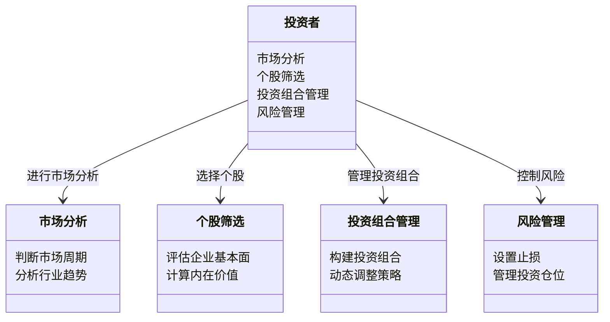
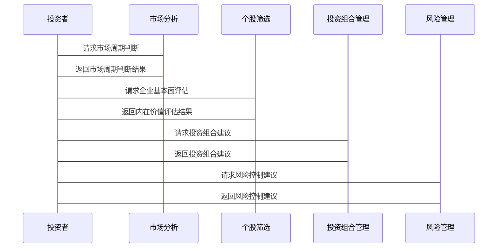

                 


# 价值投资在不同市场周期中的应用策略

## 关键词：价值投资，市场周期，投资策略，内在价值，风险管理

## 摘要：  
价值投资是一种基于对企业内在价值评估的投资策略，其核心在于寻找市场价格低于内在价值的资产。然而，市场周期的变化会对价值投资的实施产生重大影响。本文从价值投资的核心理论出发，分析不同市场周期（如牛市、熊市、震荡市）下的投资策略，探讨如何通过系统化的分析框架和风险管理手段，在不同市场环境下实现稳健的投资收益。

---

## 第一部分：价值投资的核心理论与基础

### # 第1章：价值投资的核心概念

#### ## 1.1 价值投资的定义与背景

##### ### 1.1.1 价值投资的起源与发展  
价值投资的起源可以追溯到本杰明·格雷厄姆和戴维·多德的工作。他们提出，股票的价值应基于其内在价值，而非市场价格。这一理念在投资领域产生了深远影响，尤其是在市场波动剧烈的情况下，价值投资为投资者提供了一种寻找安全边际的方法。

##### ### 1.1.2 价值投资的核心理念  
价值投资的核心理念是寻找市场价格低于内在价值的资产。内在价值是基于企业基本面的长期评估，包括盈利能力、成长潜力和行业地位等因素。投资者通过识别市场低估的资产，在市场价格回归内在价值的过程中实现收益。

##### ### 1.1.3 价值投资与其它投资策略的对比  
与短期交易策略或趋势投资不同，价值投资注重长期视角和企业的基本面分析。它强调安全边际和风险管理，而非短期价格波动。这种策略适合那些能够承受市场短期波动、追求长期稳健回报的投资者。

#### ## 1.2 价值投资的核心要素

##### ### 1.2.1 内在价值的定义与计算  
内在价值是基于企业未来现金流的现值。计算内在价值需要考虑企业的盈利能力、成长潜力、行业地位、财务状况等因素。例如，使用股息贴现模型（DDM）或现金流折现模型（DCF）来估算企业的内在价值。

##### ### 1.2.2 市场价格与内在价值的关系  
市场价格围绕内在价值波动，但在短期内可能偏离内在价值。价值投资的机会在于市场价格低于内在价值时买入，等待市场价格回归内在价值。

##### ### 1.2.3 安全边际的概念与重要性  
安全边际是指市场价格与内在价值之间的差距。通过保持足够的安全边际，投资者可以降低市场波动带来的风险，确保在市场价格大幅波动时仍能获得正收益。

#### ## 1.3 价值投资的适用场景

##### ### 1.3.1 价值投资在不同市场周期中的表现  
在牛市中，价值投资可能表现不佳，因为市场价格被高估，内在价值与市场价格的差距缩小。在熊市中，价值投资可能表现较好，因为市场价格可能大幅低于内在价值。在震荡市中，价值投资需要灵活调整策略，寻找低估资产。

##### ### 1.3.2 价值投资在不同类型资产中的应用  
价值投资不仅适用于股票，还可以应用于房地产、债券和其他资产。不同资产类别的内在价值计算方法有所不同，但核心理念是寻找市场价格低于内在价值的资产。

##### ### 1.3.3 价值投资的局限性与边界条件  
价值投资的局限性在于其依赖于对内在价值的准确估算，这需要投资者具备较强的基本面分析能力。此外，价值投资在短期波动较大的市场中可能表现不佳，需要投资者具备长期持有的耐心。

---

## 第二部分：市场周期与投资策略

### # 第2章：市场周期的基本类型

#### ## 2.1 市场周期的定义与特征

##### ### 2.1.1 牛市、熊市、震荡市的定义  
- **牛市**：市场价格持续上涨，投资者情绪乐观，市场参与者积极买入资产。  
- **熊市**：市场价格持续下跌，投资者情绪悲观，市场参与者倾向于抛售资产。  
- **震荡市**：市场价格波动较大，但没有明显的上涨或下跌趋势。

##### ### 2.1.2 不同市场周期对价值投资的影响  
在牛市中，市场价格可能高于内在价值，价值投资的机会较少。在熊市中，市场价格可能低于内在价值，价值投资的机会较多。在震荡市中，价值投资者需要灵活调整策略，寻找低估资产。

##### ### 2.1.3 市场周期的判断方法与工具  
投资者可以通过技术分析（如均线、MACD等指标）和基本面分析来判断市场周期。此外，还可以参考市场情绪指标（如恐慌指数、投资者情绪调查等）来辅助判断。

#### ## 2.2 不同市场周期中的价值投资策略

##### ### 2.2.1 牛市中的价值投资策略  
在牛市中，价值投资的机会较少，因为市场价格可能被高估。投资者可以考虑以下策略：  
- 选择估值较低的股票，耐心持有，等待市场价格回归内在价值。  
- 分散投资，避免过度集中于高估资产。  
- 调整投资组合，增加防御性资产的配置。

##### ### 2.2.2 熊市中的价值投资策略  
在熊市中，市场价格可能大幅低于内在价值，价值投资的机会较多。投资者可以考虑以下策略：  
- 买入内在价值高于市场价格的资产，尤其是具有强大基本面的企业。  
- 增加投资仓位，利用市场恐慌情绪寻找低估资产。  
- 保持长期视角，耐心持有优质资产，等待市场复苏。

##### ### 2.2.3 震荡市中的价值投资策略  
在震荡市中，市场价格波动较大，但没有明显的上涨或下跌趋势。投资者可以考虑以下策略：  
- 选择具有强大基本面的企业，长期持有，避免频繁交易。  
- 分散投资，降低市场波动对投资组合的影响。  
- 灵活调整投资组合，根据市场变化及时优化配置。

#### ## 2.3 市场周期中的风险管理

##### ### 2.3.1 风险管理的基本原则  
- 分散投资：避免过度集中于某一资产或行业，降低市场波动带来的风险。  
- 设置止损：在市场价格跌破内在价值一定比例时，及时止损，避免进一步亏损。  
- 保持流动性：在市场波动较大时，保持一定的现金储备，以应对突发事件。

##### ### 2.3.2 不同市场周期中的风险控制策略  
- 在牛市中，避免过度杠杆，控制投资仓位，防止市场回调时出现较大亏损。  
- 在熊市中，增加防御性资产的配置，降低投资组合的波动性。  
- 在震荡市中，灵活调整投资组合，及时应对市场变化。

##### ### 2.3.3 价值投资中的止损与止盈机制  
- 止损：当市场价格跌破内在价值一定比例时，及时卖出，避免进一步亏损。  
- 止盈：当市场价格达到内在价值一定比例时，及时卖出，锁定收益。  

---

## 第三部分：价值投资的系统化分析框架

### # 第3章：企业基本面分析

#### ## 3.1 财务报表分析方法

##### ### 3.1.1 利润表分析  
- 收入和利润的增长趋势  
- 营业成本和费用的占比  
- 净利润的稳定性  

##### ### 3.1.2 资产负债表分析  
- 资产和负债的结构  
- 负债水平和偿债能力  
- 资产周转率  

##### ### 3.1.3 现金流量表分析  
- 经营活动、投资活动和筹资活动的现金流情况  
- 自由现金流的稳定性  

#### ## 3.2 企业成长性分析

##### ### 3.2.1 行业增长潜力  
- 行业发展趋势和市场规模  
- 行业竞争格局和企业的市场地位  

##### ### 3.2.2 企业盈利增长  
- 收入和利润的复合增长率  
- 未来的盈利预测  

#### ## 3.3 企业竞争优势评估

##### ### 3.3.1 核心竞争力  
- 技术创新、品牌优势、成本优势等  

##### ### 3.3.2 可持续发展能力  
- 管理团队的稳定性  
- 企业研发投入和创新能力  

---

### # 第4章：行业分析与竞争优势评估

#### ## 4.1 行业生命周期分析

##### ### 4.1.1 行业发展阶段  
- 初创期、成长期、成熟期、衰退期  

##### ### 4.1.2 行业增长潜力  
- 行业市场规模和未来发展趋势  

#### ## 4.2 企业竞争优势的判断

##### ### 4.2.1 市场地位  
- 市场份额、竞争对手分析  

##### ### 4.2.2 技术创新  
- 研发投入、技术壁垒  

#### ## 4.3 行业政策对价值投资的影响

##### ### 4.3.1 政策环境  
- 政府政策对企业的影响  
- 行业监管政策的变化  

##### ### 4.3.2 政策风险  
- 政策变化对企业盈利能力的影响  

---

### # 第5章：投资组合构建与优化

#### ## 5.1 投资组合构建的基本原则

##### ### 5.1.1 资产配置  
- 股票、债券、现金等资产的配置比例  

##### ### 5.1.2 风险分散  
- 通过多样化投资降低市场风险  

##### ### 5.1.3 长期视角  
- 长期持有优质资产，避免短期波动影响投资决策  

#### ## 5.2 投资组合优化策略

##### ### 5.2.1 动态调整  
- 根据市场变化和企业基本面调整投资组合  

##### ### 5.2.2 定期再平衡  
- 定期审视投资组合，重新调整配置比例  

##### ### 5.2.3 个股筛选  
- 选择内在价值高于市场价格的优质个股  

---

## 第四部分：价值投资的系统化分析框架

### # 第6章：系统分析与架构设计

#### ## 6.1 问题场景介绍  
价值投资者需要在不同市场周期中，通过系统化的分析框架，选择具有长期增长潜力的优质资产，并制定相应的投资策略。  

#### ## 6.2 系统功能设计

##### ### 6.2.1 领域模型（Mermaid 类图）  


#### ## 6.3 系统架构设计（Mermaid 架构图）  


#### ## 6.4 系统接口设计  
- 投资者与市场分析模块接口：传递市场数据，获取市场周期判断结果。  
- 投资者与个股筛选模块接口：传递企业数据，获取内在价值评估结果。  
- 投资者与投资组合管理模块接口：传递资产配置比例，获取投资组合建议。  
- 投资者与风险管理模块接口：传递投资组合数据，获取风险控制建议。  

#### ## 6.5 系统交互设计（Mermaid 序列图）  


---

## 第五部分：项目实战与案例分析

### # 第7章：项目实战

#### ## 7.1 环境安装与配置

##### ### 7.1.1 投资分析工具的安装  
- 使用Excel或Python进行财务数据分析和内在价值计算。  

##### ### 7.1.2 数据源的获取  
- 通过金融数据平台获取企业财务报表和市场数据。  

#### ## 7.2 核心实现源代码

##### ### 7.2.1 内在价值计算示例（Python代码）  
```python
def calculate_intrinsic_value(revenue, profit_margin, growth_rate, discount_rate):
    # 假设未来5年的现金流
    cash_flows = []
    for i in range(5):
        cash_flows.append(revenue * (1 + growth_rate) ** i * profit_margin)
    # 计算终值
    terminal_value = cash_flows[-1] * (1 + discount_rate) ** -1
    # 计算现值
    present_value = sum(cash_flows) + terminal_value
    return present_value / (1 + discount_rate) ** 5

# 示例数据
revenue = 100000000
profit_margin = 0.1
growth_rate = 0.05
discount_rate = 0.1

intrinsic_value = calculate_intrinsic_value(revenue, profit_margin, growth_rate, discount_rate)
print(f"内在价值: {intrinsic_value}")
```

##### ### 7.2.2 投资组合优化示例  
```python
import numpy as np
from scipy.optimize import minimize

def portfolio_optimization(returns, weights):
    # 定义优化目标函数
    def objective(weights):
        return np.dot(weights.T, returns @ weights)
    # 定义约束条件
    constraints = [
        {'type': 'eq', 'fun': lambda w: np.sum(w) - 1}
    ]
    # 求解优化问题
    result = minimize(objective, weights, constraints=constraints)
    return result.x

# 示例数据
returns = np.array([[0.1, 0.12, 0.08], [0.12, 0.09, 0.1], [0.08, 0.1, 0.15]])
weights = np.array([1/3, 1/3, 1/3])

optimized_weights = portfolio_optimization(returns, weights)
print(f"优化后的权重: {optimized_weights}")
```

#### ## 7.3 案例分析与解读

##### ### 7.3.1 科技股的价值评估  
以某科技公司为例，分析其财务报表、成长潜力和竞争优势，计算其内在价值，并制定相应的投资策略。

##### ### 7.3.2 困境企业的投资机会  
分析某困境企业的财务状况，评估其内在价值，判断是否具有投资价值。

##### ### 7.3.3 市场波动中的安全边际  
在市场波动中，如何通过安全边际寻找低估资产，制定灵活的投资策略。

---

## 第六部分：总结与展望

### # 第8章：总结与展望

#### ## 8.1 价值投资的核心要点回顾  
- 内在价值计算：基于企业基本面分析，寻找市场价格低于内在价值的资产。  
- 市场周期策略：根据不同市场周期，灵活调整投资策略，优化投资组合。  
- 风险管理：设置止损、分散投资、保持流动性，降低市场波动带来的风险。  

#### ## 8.2 价值投资的未来趋势  
- 数字化与智能化：利用大数据和人工智能技术，提升企业基本面分析和市场周期判断的效率和准确性。  
- ESG投资：将环境、社会和治理因素纳入价值投资框架，关注可持续发展能力。  
- 全球化视角：在跨国市场中寻找投资机会，分散投资风险，提升投资回报。  

---

## 附录

### # 附录A：价值投资工具与资源

#### ## A.1 常用价值投资工具  
- 金融数据平台：如 Bloomberg、FactSet、Morningstar 等。  
- 财务分析工具：如 Excel、Python（Pandas、NumPy 等）。  

#### ## A.2 经典书籍推荐  
- 《格雷厄姆股票投资策略》  
- 《彼得·林奇谈投资》  
- 《投资最重要的事情》  

---

## 参考文献

1. 格雷厄姆，本杰明. 《证券分析》. 北京：机械工业出版社，2004.  
2. 多德，戴维. 《价值投资策略》. 北京：中信出版社，2010.  
3. 林奇，彼得. 《彼得·林奇谈投资》. 北京：人民邮电出版社，2006.  
4. 罗伯特，约翰. 《投资的艺术》. 北京：经济管理出版社，2012.  

---

## 作者：AI天才研究院/AI Genius Institute & 禅与计算机程序设计艺术 /Zen And The Art of Computer Programming

