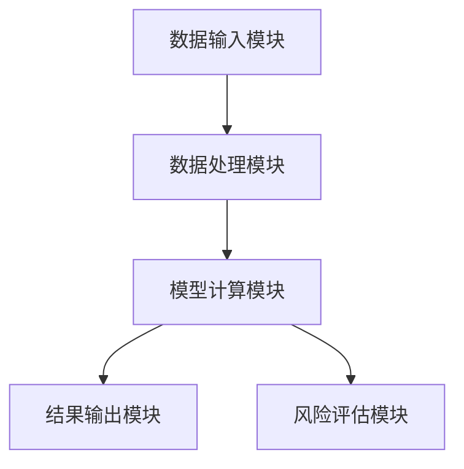

                 


# 价值投资在不同资产类别中的应用

## 关键词：
- 价值投资
- 资产类别
- 内在价值
- 安全边际
- 投资策略
- 数学模型
- 投资分析

## 摘要：
价值投资是一种以长期视角为基础的投资策略，主要通过分析资产的内在价值来确定投资标的。本文将从不同资产类别的特点出发，探讨价值投资在股票、债券、房地产等领域的具体应用，并通过数学模型和系统架构设计，详细分析价值投资的核心算法和实现方法。同时，本文还将通过实际案例，展示如何在实际投资中应用价值投资策略，并总结最佳实践经验和注意事项。

---

## 第一部分: 价值投资的核心理论与方法论

### 第1章: 价值投资的基本概念与理论基础

#### 1.1 价值投资的定义与核心理念
##### 1.1.1 价值投资的定义
价值投资是一种以分析资产的内在价值为基础的投资策略。其核心理念是通过识别市场价格与内在价值之间的差异，寻找被市场低估的投资标的。

##### 1.1.2 价值投资的核心理念
价值投资强调长期投资、安全边际和内在价值的分析。投资者需要关注企业的基本面，如盈利能力、财务状况和行业地位，而不是市场的短期波动。

##### 1.1.3 价值投资与其它投资策略的区别
与趋势投资、技术分析等策略不同，价值投资更注重资产的内在价值，而非市场的技术指标或趋势。

#### 1.2 价值投资的历史与发展
##### 1.2.1 价值投资的起源
价值投资的起源可以追溯到20世纪初，本杰明·格雷厄姆和戴维·多德是这一投资理念的奠基人。

##### 1.2.2 价值投资的发展历程
随着金融市场的不断发展，价值投资的理论和方法不断完善，逐渐形成了多种应用场景。

##### 1.2.3 价值投资在现代投资学中的地位
价值投资是现代投资学的重要组成部分，广泛应用于股票、债券、房地产等多种资产类别。

#### 1.3 价值投资的三大核心要素
##### 1.3.1 资产的内在价值
内在价值是资产在合理市场条件下的公平价格，通常通过现金流折现模型（DCF）等方法进行评估。

##### 1.3.2 市场价格与内在价值的差异
市场价格与内在价值的差异为投资者提供了超额收益的机会。

##### 1.3.3 安全边际的概念与作用
安全边际是市场价格与内在价值之间的差距，用于降低投资风险。

### 第2章: 不同资产类别的特点与价值投资的应用场景

#### 2.1 股票投资中的价值投资策略
##### 2.1.1 股票的内在价值评估方法
股票的内在价值可以通过股息贴现模型（DDM）和现金流折现模型（DCF）进行评估。

##### 2.1.2 市盈率、市净率等估值指标的应用
市盈率（P/E）和市净率（P/B）是常用的股票估值指标，可以帮助投资者判断市场价格是否合理。

##### 2.1.3 股票投资中的安全边际策略
通过比较市场价格与内在价值，投资者可以确定安全边际，降低投资风险。

#### 2.2 债券投资中的价值投资策略
##### 2.2.1 债券的内在价值评估
债券的内在价值主要取决于其票面价值、利率和剩余期限。

##### 2.2.2 利率风险与债券价格的关系
债券价格与利率呈负相关关系，利率上升会导致债券价格下跌。

##### 2.2.3 债券投资中的信用评级与安全边际
信用评级是债券投资的重要因素，高信用评级的债券通常具有更高的内在价值和更低的风险。

#### 2.3 房地产投资中的价值投资策略
##### 2.3.1 房地产的内在价值评估
房地产的内在价值取决于其地理位置、建筑质量和周边环境等因素。

##### 2.3.2 地理位置、建筑质量和周边环境对价值的影响
地理位置是房地产价值的核心因素，建筑质量和周边环境则会影响其溢价能力。

##### 2.3.3 房地产市场周期与价值投资机会
房地产市场具有周期性，投资者需要在市场低谷时寻找被低估的资产。

#### 2.4 其他资产类别中的价值投资应用
##### 2.4.1 信托与基金中的价值投资策略
信托和基金的价值投资策略类似于股票和债券，需要分析其内在价值和市场价格。

##### 2.4.2 私募股权与风险投资中的价值评估
私募股权和风险投资需要对目标企业的未来现金流进行评估，确定其内在价值。

##### 2.4.3 商品投资（如黄金、原油）中的价值分析
商品投资需要分析其供需关系和市场周期，判断其内在价值和投资机会。

### 第3章: 价值投资的核心算法与数学模型

#### 3.1 内在价值评估的数学模型
##### 3.1.1 股票的股息贴现模型（DDM）
股息贴现模型（DDM）用于评估股票的内在价值，公式为：
$$ V = \frac{D}{k - g} $$
其中，$V$ 是股票的内在价值，$D$ 是预期股息，$k$ 是折现率，$g$ 是股息增长率。

##### 3.1.2 现金流折现模型（DCF）
现金流折现模型（DCF）用于评估企业的整体价值，公式为：
$$ V = \sum_{t=1}^{n} \frac{CF_t}{(1 + r)^t} $$
其中，$CF_t$ 是第$t$年的现金流，$r$ 是折现率，$n$ 是项目寿命。

##### 3.1.3 市盈率与市净率的比较分析
市盈率（P/E）和市净率（P/B）是常用的估值指标，公式分别为：
$$ P/E = \frac{P}{E} $$
$$ P/B = \frac{P}{B} $$
其中，$P$ 是市场价格，$E$ 是每股收益，$B$ 是每股净资产。

#### 3.2 价值投资中的风险管理模型
##### 3.2.1 马科维茨投资组合理论
马科维茨投资组合理论认为，最优投资组合应使风险最小化，同时使收益最大化。

##### 3.2.2 风险调整后的收益评估（夏普比率）
夏普比率用于衡量投资组合的风险调整后收益，公式为：
$$ \text{夏普比率} = \frac{E[r_p] - r_f}{\sigma_p} $$
其中，$E[r_p]$ 是投资组合的预期收益，$r_f$ 是无风险利率，$\sigma_p$ 是投资组合的收益标准差。

##### 3.2.3 现金流波动性分析
现金流的波动性是评估资产风险的重要指标，可以通过标准差或波动率来衡量。

#### 3.3 价值投资中的安全边际计算
##### 3.3.1 安全边际的定义与计算公式
安全边际是市场价格与内在价值之间的差距，公式为：
$$ \text{安全边际} = V - P $$
其中，$V$ 是内在价值，$P$ 是市场价格。

##### 3.3.2 安全边际与资产价格的关系
安全边际越大，资产的投资价值越高，风险越低。

##### 3.3.3 安全边际在不同资产类别中的应用
在股票投资中，安全边际用于判断是否买入；在债券投资中，安全边际用于判断是否投资高风险债券。

### 第4章: 价值投资的系统化分析与架构设计

#### 4.1 价值投资分析框架的设计
##### 4.1.1 数据收集与处理模块
数据收集与处理模块负责获取资产的基本面数据，如财务报表和市场数据。

##### 4.1.2 资产评估与定价模块
资产评估与定价模块通过数学模型计算资产的内在价值和市场价格。

##### 4.1.3 风险评估与安全边际计算模块
风险评估与安全边际计算模块用于评估资产的风险，并计算安全边际。

#### 4.2 价值投资系统的架构设计
##### 4.2.1 系统功能模块划分
系统功能模块包括数据输入、模型计算、结果输出和风险评估。

##### 4.2.2 系统架构设计（Mermaid架构图）


##### 4.2.3 系统接口设计
系统接口设计包括数据输入接口、模型计算接口和结果输出接口。

##### 4.2.4 系统交互设计（Mermaid序列图）
```mermaid
sequenceDiagram
    participant A[用户]
    participant B[数据输入模块]
    participant C[模型计算模块]
    participant D[结果输出模块]
    A -> B: 提交投资标的
    B -> C: 调用模型计算
    C -> D: 输出评估结果
    A <- D: 获取评估结果
```

## 第5章: 项目实战与案例分析

### 5.1 环境安装与工具准备
需要安装Python编程环境，并安装Pandas、NumPy等数据分析库。

### 5.2 系统核心实现源代码
以下是一个简单的价值投资分析代码示例：

```python
import pandas as pd
import numpy as np

# 示例股票数据
data = {
    '股价': [100, 110, 120, 90, 80],
    '每股收益': [10, 12, 15, 8, 7]
}
df = pd.DataFrame(data)

# 计算内在价值（简化模型）
def calculate_intrinsic_value(stock_price, earnings_per_share):
    return stock_price * (1 + 0.05)  # 假设增长率5%

intrinsic_values = df['股价'].apply(lambda x: calculate_intrinsic_value(x, df['每股收益']))
print(intrinsic_values)
```

### 5.3 代码应用解读与分析
以上代码通过简单模型计算股票的内在价值，投资者可以根据实际数据调整模型参数。

### 5.4 实际案例分析和详细讲解剖析
以某股票为例，分析其内在价值和市场价格，判断是否具有投资价值。

### 5.5 项目小结
通过实际案例分析，验证了价值投资策略的有效性，并总结了在实际操作中需要注意的问题。

## 第6章: 最佳实践、小结与注意事项

### 6.1 最佳实践
- 长期投资，避免频繁交易
- 分散投资，降低风险
- 定期评估，及时调整

### 6.2 小结
价值投资是一种有效的投资策略，需要投资者具备扎实的分析能力和长期的耐心。

### 6.3 注意事项
- 风险管理是投资的关键
- 市场波动会影响投资标的的价格
- 资产配置是投资成功的重要因素

## 第7章: 拓展阅读与学习资源

### 7.1 拓展阅读
- 格雷厄姆的《 Intelligent Investor》
- 《投资学基础》

### 7.2 学习资源
- 在线课程：价值投资入门
- 投资分析工具推荐

## 作者信息：
作者：AI天才研究院/AI Genius Institute  
联系邮箱：info@aiguru.com  
GitHub地址：https://github.com/aiguru/investing

