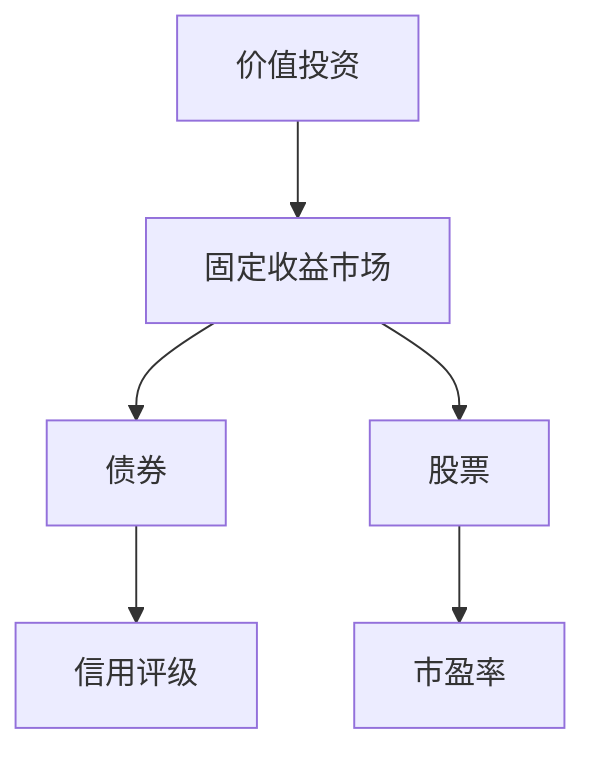
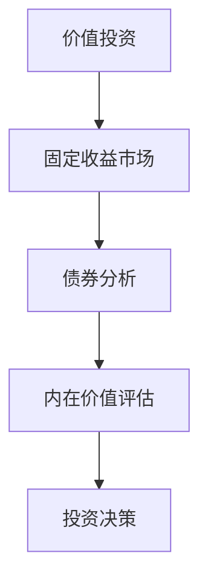
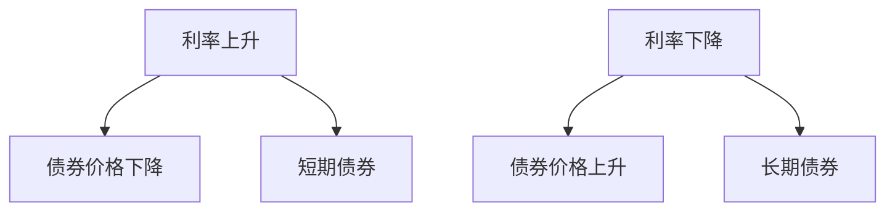
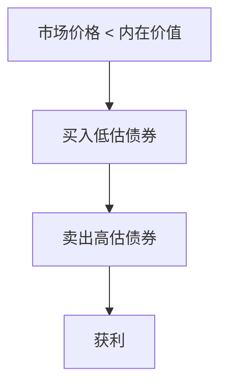

                 


# 价值投资在固定收益市场的应用

> 关键词：价值投资、固定收益市场、债券分析、套利机会、风险管理、投资组合优化、系统架构设计

> 摘要：本文探讨了价值投资在固定收益市场中的应用，通过分析债券定价、信用评级、利率周期等关键因素，结合实际案例和数学模型，详细阐述了如何在固定收益市场中运用价值投资策略。文章还介绍了固定收益市场的套利机会、风险管理方法以及投资组合优化的策略，并通过系统架构设计和项目实战，展示了如何将价值投资理论应用于实际投资操作中。

---

## 第一部分: 价值投资的基本原理

### 第1章: 价值投资的起源与发展

#### 1.1 价值投资的定义与核心理念

- **价值投资的起源与历史发展**
  - 价值投资起源于20世纪初，由本杰明·格雷厄姆和戴维·多德提出。
  - 核心理念是寻找市场价格低于内在价值的证券进行投资。
  - 在固定收益市场中，价值投资强调通过分析债券的内在价值，寻找被低估的投资机会。

- **价值投资的核心理念与原则**
  - 独立思考：不随市场情绪波动，坚持基本面分析。
  - 安全边际：买入价格低于内在价值，留有安全空间。
  - 长期持有：价值投资强调长期持有的策略，避免短期波动的干扰。

- **价值投资与成长投资的对比**
  - 成长投资关注高成长性的公司，愿意为未来的增长支付溢价。
  - 价值投资关注被低估的资产，注重安全性和稳定性。

#### 核心概念与联系

- **核心概念对比表**

| 概念         | 价值投资              | 成长投资              |
|--------------|-----------------------|-----------------------|
| 投资目标     | 寻找低估资产            | 寻找高成长性公司      |
| 投资策略     | 低估值、高分红         | 高增长、高市盈率      |
| 风险承受     | 低风险偏好             | 高风险偏好             |

- **实体关系图**



---

### 第2章: 固定收益市场的基本运作机制

#### 2.1 固定收益市场的概述

- **固定收益市场的定义与特点**
  - 固定收益市场是指交易期限固定的证券市场，主要包括债券、国债、公司债等。
  - 市场参与者包括政府、企业和个人投资者。
  - 市场具有低风险、高流动性、收益稳定的特征。

- **主要固定收益工具介绍**
  - 国债：由政府发行，信用评级高，风险较低。
  - 公司债：由企业发行，信用评级取决于企业的财务状况。
  - 金融债券：由金融机构发行，风险较高。

- **固定收益市场的参与者与交易机制**
  - 参与者包括一级市场中的发行人和二级市场中的投资者。
  - 交易机制包括拍卖交易和场外交易。

#### 核心概念与联系

- **固定收益市场的主要参与者对比**

| 参与者         | 职能                           | 风险偏好 |
|----------------|--------------------------------|-----------|
| 政府           | 发行国债，筹集资金             | 低风险    |
| 企业           | 发行公司债，筹集资金             | 高风险    |
| 个人投资者     | 购买债券，获取稳定收益           | 中风险    |
| 机构投资者     | 管理资金，进行组合投资           | 中风险    |

---

### 第3章: 价值投资在固定收益市场的应用基础

#### 3.1 价值投资与固定收益市场的结合

- **价值投资在固定收益市场的适用性分析**
  - 固定收益市场的资产具有确定的现金流，适合价值评估。
  - 价值投资者可以通过分析债券的内在价值，寻找被低估的投资机会。

- **固定收益市场中的价值评估方法**
  - 利率模型：如久期分析和凸性分析。
  - 信用评级：通过分析企业的财务状况和行业风险，确定债券的信用评级。

- **价值投资在固定收益市场中的优势与挑战**
  - 优势：低波动性、高稳定性。
  - 挑战：市场信息不透明、定价偏差。

#### 核心概念与联系

- **价值投资与固定收益市场结合的流程图**



---

## 第二部分: 固定收益市场的分析与估值

### 第4章: 固定收益工具的定价与风险分析

#### 4.1 固定收益工具的定价模型

- **债券定价的基本原理**
  - 债券价格由其未来现金流的现值决定。
  - 利率是影响债券价格的主要因素。

- **利率风险与信用风险的分析**
  - 利率风险：债券价格受利率波动的影响。
  - 信用风险：债券发行人违约的风险。

- **债券收益率的计算与比较**
  - 名义收益率、实际收益率、到期收益率。

#### 核心概念与联系

- **债券收益率计算公式**

$$ 到期收益率 = \frac{C + (F - P)}{P} $$

其中：
- \( C \)：债券的年息
- \( F \)：债券面值
- \( P \)：债券价格

---

### 第5章: 信用评级与债券选择策略

#### 5.1 信用评级的定义与作用

- **信用评级的分类与标准**
  - 国际评级机构（穆迪、标普、惠誉）的评级标准。
  - 评级从AAA（最高）到D（最低）。

- **信用评级对债券选择的影响**
  - 评级高的债券风险低，但收益也较低。
  - 评级低的债券风险高，但收益可能更高。

#### 核心概念与联系

- **信用评级与债券收益率的关系**

| 信用评级 | 利息收益率 |
|----------|------------|
| AAA      | 5%         |
| AA       | 6%         |
| A        | 7%         |
| BBB      | 8%         |
| BB       | 9%         |

---

### 第6章: 利率周期与债券投资机会

#### 6.1 利率周期的定义与影响

- **利率周期的阶段划分**
  - 上升周期、下降周期、底部和顶部。

- **不同利率周期下的债券投资策略**
  - 利率上升：短期债券风险低。
  - 利率下降：长期债券收益高。

#### 核心概念与联系

- **利率周期与债券价格波动的关系**



---

## 第三部分: 价值投资策略在固定收益中的应用

### 第7章: 价值投资在债券投资中的具体应用

#### 7.1 价值投资在债券投资中的核心策略

- **债券的内在价值评估**
  - 通过基本面分析，确定债券的合理价格。
  - 考虑利率、信用风险和流动性因素。

- **固定收益市场中的估值偏差与套利机会**
  - 市场价格与内在价值的差异。
  - 套利机会：买入低估债券，卖出高估债券。

#### 核心概念与联系

- **套利机会的识别流程图**



---

### 第8章: 固定收益市场的套利机会与风险控制

#### 8.1 固定收益市场的套利策略

- **套利的基本原理与分类**
  - 无风险套利和风险套利。
  - 常见套利策略：跨市场套利、跨期套利。

- **套利的风险与控制方法**
  - 市场风险、流动性风险。
  - 风险控制：分散投资、设置止损。

#### 核心概念与联系

- **套利策略的风险分析表**

| 风险类型 | 描述               | 控制方法       |
|----------|--------------------|----------------|
| 市场风险 | 市场波动影响套利收益 | 分散投资       |
| 流动性风险 | 套利标的流动性差    | 设置止损点      |

---

## 第四部分: 项目实战与总结

### 第9章: 项目实战：价值投资在固定收益市场中的应用

#### 9.1 环境安装与工具准备

- **工具准备**
  - 数据分析工具：Python、Excel。
  - 金融分析库：Pandas、NumPy、Matplotlib。

#### 9.2 系统核心实现源代码

- **债券内在价值计算代码**

```python
def calculate_intrinsic_value(face_value, coupon_rate, years, discount_rate):
    intrinsic_value = 0
    for i in range(years):
        cash_flow = face_value * coupon_rate
        intrinsic_value += cash_flow / (1 + discount_rate) ** (i + 1)
    intrinsic_value += face_value / (1 + discount_rate) ** years
    return intrinsic_value

# 示例计算
face_value = 1000
coupon_rate = 0.05
years = 5
discount_rate = 0.03
print("债券内在价值:", calculate_intrinsic_value(face_value, coupon_rate, years, discount_rate))
```

#### 9.3 实际案例分析与解读

- **案例分析**
  - 某公司债券面值1000元，票面利率5%，剩余期限5年，市场利率3%。
  - 计算内在价值：约1018.01元。
  - 市场价格为980元，存在套利机会。

#### 9.4 项目小结

- **项目总结**
  - 通过代码实现债券内在价值的计算，验证了价值投资策略的有效性。
  - 在实际操作中，需要考虑市场波动和交易成本。

---

## 第五部分: 总结与展望

### 10章: 总结与最佳实践

#### 10.1 总结

- 价值投资在固定收益市场中的应用具有重要意义。
- 通过基本面分析和套利策略，可以在固定收益市场中获取超额收益。

#### 10.2 最佳实践 tips

- **风险管理**
  - 保持分散投资，避免过度集中。
  - 设置止损点，控制潜在损失。

- **系统架构设计**
  - 构建数据分析系统，实时监控市场波动。
  - 使用机器学习模型，优化投资决策。

---

## 作者

作者：AI天才研究院/AI Genius Institute & 禅与计算机程序设计艺术 /Zen And The Art of Computer Programming

---

以上是《价值投资在固定收益市场的应用》的文章大纲和内容，按照逻辑清晰、结构紧凑的原则进行了详细阐述，涵盖了从基础理论到实际应用的各个方面。

