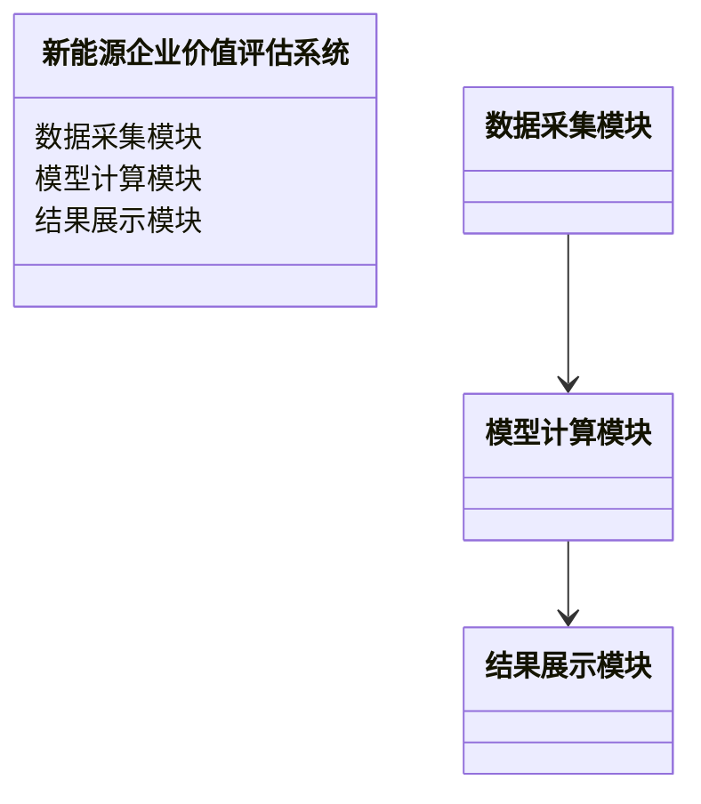
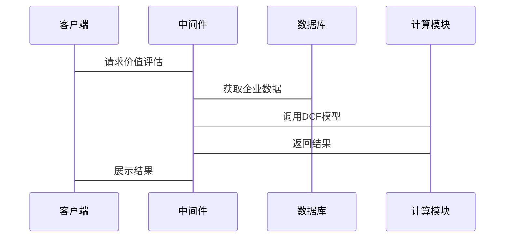

                 


# 价值投资在新能源领域的应用：绿色革命的机遇

---

## 关键词：  
价值投资、新能源、绿色革命、现金流分析、DCF模型、风险管理、技术分析

---

## 摘要：  
本文探讨了价值投资在新能源领域的应用，特别是在绿色革命的背景下，分析了新能源行业的现状、价值评估模型、技术分析方法以及投资策略。通过详细讲解现金流分析、估值方法、风险评估和行业趋势分析，结合实际案例，为投资者提供了系统化的投资框架和实践指导。

---

## 目录大纲

### 第1章：价值投资与新能源行业的背景介绍
1.1 价值投资的核心概念
1.2 新能源行业的现状与发展
1.3 绿色革命的背景与机遇
1.4 价值投资在绿色革命中的作用

### 第2章：新能源行业的价值评估模型
2.1 新能源项目的现金流分析
2.2 新能源行业的估值方法
2.3 新能源行业的风险评估

### 第3章：新能源行业的技术分析与投资策略
3.1 新能源技术的演进与趋势
3.2 新能源行业的技术分析方法
3.3 新能源行业的投资策略

### 第4章：系统分析与架构设计
4.1 问题场景介绍
4.2 系统功能设计（领域模型）
4.3 系统架构设计
4.4 系统接口设计
4.5 系统交互设计

### 第5章：项目实战：光伏企业的价值评估
5.1 环境安装与数据准备
5.2 源代码实现
5.3 案例分析与解读

### 第6章：项目实战：电动汽车企业的价值评估
6.1 环境安装与数据准备
6.2 源代码实现
6.3 案例分析与解读

### 第7章：最佳实践与小结
7.1 投资策略与风险管理
7.2 项目小结与总结

---

## 正文

---

### 第1章：价值投资与新能源行业的背景介绍

#### 1.1 价值投资的核心概念
价值投资是一种长期投资策略，强调以低于内在价值的价格购买优质资产。核心要素包括：
- **内在价值**：资产的未来现金流的现值。
- **安全边际**：买入价格与内在价值的差距，提供缓冲空间。
- **长期视角**：关注企业的长期盈利能力，而非短期波动。

#### 1.2 新能源行业的现状与发展
新能源行业涵盖太阳能、风能、生物质能等领域，是全球能源转型的核心。随着技术进步和政策支持，新能源发电成本持续下降，市场竞争力增强。

#### 1.3 绿色革命的背景与机遇
绿色革命旨在通过清洁能源替代化石能源，减少碳排放。政策支持（如《巴黎协定》）、技术进步和环保意识提升推动了新能源行业的快速发展。

#### 1.4 价值投资在绿色革命中的作用
价值投资者通过分析新能源企业的基本面，挖掘被低估的潜力股，为绿色革命提供资金支持，推动行业技术创新和可持续发展。

---

### 第2章：新能源行业的价值评估模型

#### 2.1 新能源项目的现金流分析
现金流分析是价值评估的核心。使用现金流贴现模型（DCF）预测未来现金流，计算现值。

##### 公式：
$$DCF = \sum_{t=1}^{n} \frac{CF_t}{(1+r)^t} + \frac{FV}{(1+r)^n}$$

##### 案例：光伏企业现金流预测
假设某光伏企业未来5年的现金流分别为$100万、$120万、$150万、$180万、$200万，贴现率为10%。计算现值：

$$PV = \frac{100}{1.1} + \frac{120}{1.1^2} + \frac{150}{1.1^3} + \frac{180}{1.1^4} + \frac{200}{1.1^5}$$

---

#### 2.2 新能源行业的估值方法
常用的估值方法包括：
- **DCF模型**：预测自由现金流，计算企业价值。
- **市盈率法（P/E）**：比较企业的盈利能力和股价。
- **相对估值法**：对比行业可比公司。

#### 2.3 新能源行业的风险评估
风险因素包括政策变化、技术风险和市场需求波动。使用风险中性模型量化风险：

$$ Risk = \sum_{i=1}^{n} P_i \times Impact_i $$

---

### 第3章：新能源行业的技术分析与投资策略

#### 3.1 新能源技术的演进与趋势
- 太阳能：高效电池技术（如PERC）降低成本。
- 风能：大容量机组和 offshore 风电技术发展。

#### 3.2 新能源行业的技术分析方法
- 技术生命周期分析：判断技术成熟度。
- 技术经济性分析：评估技术的经济可行性。

#### 3.3 新能源行业的投资策略
- 竞争优势：选择具有技术壁垒的企业。
- 财务健康：关注企业的盈利能力和现金流。

---

### 第4章：系统分析与架构设计

#### 4.1 问题场景介绍
设计一个新能源企业价值评估系统，包括数据采集、模型计算和结果展示。

#### 4.2 系统功能设计（领域模型）


#### 4.3 系统架构设计


#### 4.4 系统接口设计
- 数据接口：从数据库获取企业数据。
- 计算接口：调用DCF模型进行计算。

#### 4.5 系统交互设计


---

### 第5章：项目实战：光伏企业的价值评估

#### 5.1 环境安装与数据准备
安装Python和相关库（如Pandas、NumPy）。

#### 5.2 源代码实现
```python
def calculateDCF(cash_flows, discount_rate):
    present_value = 0
    for t, cf in enumerate(cash_flows, 1):
        present_value += cf / (1 + discount_rate) ** t
    return present_value

cash_flows = [100, 120, 150, 180, 200]
discount_rate = 0.10
DCF = calculateDCF(cash_flows, discount_rate)
print(f"DCF Value: {DCF}")
```

#### 5.3 案例分析与解读
通过DCF模型计算光伏企业的价值，识别其是否被低估。

---

### 第6章：项目实战：电动汽车企业的价值评估

#### 6.1 环境安装与数据准备
同上。

#### 6.2 源代码实现
```python
def calculateDCF(cash_flows, discount_rate):
    present_value = 0
    for t, cf in enumerate(cash_flows, 1):
        present_value += cf / (1 + discount_rate) ** t
    return present_value

cash_flows = [150, 180, 200, 220, 250]
discount_rate = 0.10
DCF = calculateDCF(cash_flows, discount_rate)
print(f"DCF Value: {DCF}")
```

#### 6.3 案例分析与解读
评估电动汽车企业的DCF值，判断其投资价值。

---

### 第7章：最佳实践与小结

#### 7.1 投资策略与风险管理
- 长期视角，关注企业基本面。
- 设置安全边际，分散投资风险。

#### 7.2 项目小结与总结
价值投资在新能源领域具有广阔前景，但需结合技术分析和市场趋势，谨慎选择标的。

---

## 作者：  
AI天才研究院/AI Genius Institute & 禅与计算机程序设计艺术/Zen And The Art of Computer Programming

