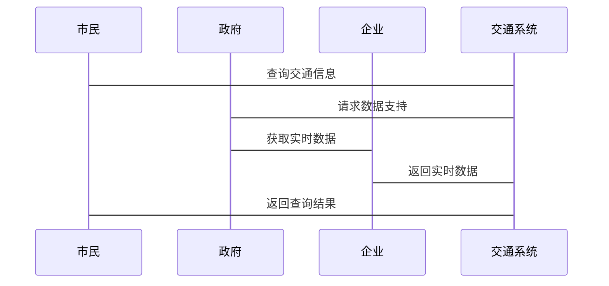

                 


# 价值投资在智慧城市发展中的应用：基础设施投资新思路

## 关键词：价值投资, 智慧城市, 基础设施, 投资策略, 智能系统, 数字化转型

## 摘要：  
本文探讨了价值投资在智慧城市基础设施建设中的应用，分析了智慧城市的定义与特征，价值投资的基本原理及其在基础设施投资中的优势。通过具体案例分析，展示了如何运用价值投资的理念优化智慧城市基础设施投资决策，构建可持续的智慧城市发展模式。文章结合系统工程方法，提出了基于价值投资的智慧城市基础设施投资策略，并展望了未来的发展方向。

---

# 目录大纲：《价值投资在智慧城市发展中的应用：基础设施投资新思路》

## 第一部分：引言
### 第1章：智慧城市的定义与价值投资概述
#### 1.1 智慧城市的定义与特征
- 智慧城市的起源与发展
- 智慧城市的核心要素与技术
- 智慧城市与传统城市的区别

#### 1.2 价值投资的基本原理
- 价值投资的定义与历史
- 价值投资的核心理念与原则
- 价值投资在不同领域的应用

#### 1.3 智慧城市基础设施投资的背景与意义
- 智慧城市基础设施的重要性
- 价值投资在基础设施投资中的作用
- 当前智慧城市基础设施投资的现状与挑战

## 第二部分：价值投资的理论基础
### 第2章：价值投资的核心理念
#### 2.1 价值投资的基本原则
- 独立思考与长期视角
- 安全边际与内在价值
- 价值投资与市场波动

#### 2.2 价值投资的分析框架
- 财务分析：评估企业的盈利能力与财务健康
- 行业分析：选择具有竞争优势的行业
- 管理层分析：评估管理层的能力与诚信

#### 2.3 价值投资与风险管理
- 投资组合的构建与风险分散
- 价值陷阱的识别与规避
- 价值投资中的止损策略

## 第三部分：智慧城市基础设施的分析
### 第3章：智慧城市基础设施的类型与特点
#### 3.1 智慧城市基础设施的主要类型
- 交通基础设施：智能交通系统、车联网
- 能源基础设施：智能电网、可再生能源
- 信息通信基础设施：5G网络、物联网
- 公共服务基础设施：智慧医疗、智慧教育

#### 3.2 智慧城市基础设施的投资价值
- 各类基础设施的市场需求与增长潜力
- 技术进步对基础设施价值的影响
- 政策支持与市场环境对投资的影响

### 第4章：影响智慧城市基础设施投资的因素
#### 4.1 宏观因素
- 经济环境：GDP增长、通货膨胀
- 政策环境：政府投资、政策补贴
- 技术进步：人工智能、大数据、区块链

#### 4.2 微观因素
- 企业财务状况：现金流、资产负债率
- 市场竞争：行业集中度、替代产品
- 项目可行性：技术成熟度、市场需求

## 第四部分：价值投资在智慧城市基础设施中的应用
### 第5章：价值投资的应用策略
#### 5.1 投资策略的选择
- 确定投资目标：长期收益 vs. 短期收益
- 资产配置：分散投资 vs. 集中投资
- 风险控制：止损机制 vs. 持股待涨

#### 5.2 项目选择的准则
- 企业基本面分析：ROE、ROA、净利润率
- 行业竞争优势：技术壁垒、成本优势
- 管理层能力：决策能力、执行力

#### 5.3 投资组合的构建
- 股票投资：智慧城市相关企业的选择
- 债券投资：政府债券、企业债券
- 其他金融工具：ETF、指数基金

### 第6章：价值投资在智慧城市中的优势
#### 6.1 长期视角与智慧城市发展
- 长期投资与智慧城市基础设施的长期价值
- 价值投资与智慧城市可持续发展
- 风险控制与智慧城市基础设施的稳定性

#### 6.2 价值投资与智慧城市创新
- 价值投资对技术创新的推动
- 智慧城市中的新兴行业机会
- 投资者的角色转变：从资金提供者到价值创造者

## 第五部分：系统分析与架构设计
### 第7章：智慧城市的系统架构
#### 7.1 系统需求分析
- 用户需求：市民、政府、企业
- 功能需求：交通、能源、通信、公共服务
- 性能需求：实时性、可靠性、可扩展性

#### 7.2 系统架构设计
- 分层架构：数据层、服务层、应用层
- 模块划分：交通管理模块、能源管理模块、通信网络模块
- 数据流设计：数据采集、数据处理、数据存储、数据展示

#### 7.3 实体关系图
```mermaid
er
  actor(市民)
  actor(政府)
  actor(企业)
  entity(交通系统)
  entity(能源系统)
  entity(通信网络)
  entity(公共服务)
  rel(市民 ↔ 交通系统)
  rel(政府 ↔ 能源系统)
  rel(企业 ↔ 通信网络)
  rel(市民 ↔ 公共服务)
```

#### 7.4 序列图


## 第六部分：项目实战
### 第8章：智慧城市的项目实战
#### 8.1 项目环境安装
- 操作系统：Linux（Ubuntu 20.04）
- 开发工具：Python（3.8+）、Jupyter Notebook、Django框架
- 数据库：MySQL 8.0
- 依赖库安装：pip install numpy pandas matplotlib scikit-learn

#### 8.2 系统核心代码实现
```python
import numpy as np
import pandas as pd
from sklearn.model_selection import train_test_split
from sklearn.linear_model import LinearRegression

# 数据加载与预处理
data = pd.read_csv('smart_city_data.csv')
X = data[['GDP', '人口', '技术投入']]
y = data['基础设施投资']

# 数据分割
X_train, X_test, y_train, y_test = train_test_split(X, y, test_size=0.2, random_state=42)

# 模型训练
model = LinearRegression()
model.fit(X_train, y_train)

# 模型预测
y_pred = model.predict(X_test)

# 模型评估
from sklearn.metrics import mean_squared_error, r2_score
mse = mean_squared_error(y_test, y_pred)
r2 = r2_score(y_test, y_pred)

print(f'Mean Squared Error: {mse}')
print(f'R-squared: {r2}')
```

#### 8.3 代码应用解读与分析
- 数据加载与预处理：从CSV文件中读取数据，选择相关特征变量。
- 数据分割：将数据分为训练集和测试集，确保模型的泛化能力。
- 模型训练：使用线性回归模型拟合数据，捕捉变量之间的关系。
- 模型预测：基于训练好的模型，预测测试集的基础设施投资。
- 模型评估：计算均方误差和R平方值，评估模型的拟合优度。

#### 8.4 实际案例分析
- 案例背景：某城市计划投资建设智慧交通系统。
- 数据分析：通过回归分析，评估不同因素对交通系统投资的影响。
- 投资决策：基于模型预测结果，选择最优投资方案。

#### 8.5 项目小结
- 项目目标的实现情况
- 模型的优缺点
- 未来改进方向

## 第七部分：总结与展望
### 第9章：总结与展望
#### 9.1 核心内容总结
- 价值投资的核心理念与智慧城市的结合
- 智慧城市基础设施的投资策略与风险控制
- 系统架构与项目实战的经验总结

#### 9.2 未来展望
- 价值投资在智慧城市中的创新应用
- 新兴技术（如AI、大数据）对投资决策的影响
- 智慧城市与价值投资的长期发展趋势

---

## 作者：AI天才研究院/AI Genius Institute & 禅与计算机程序设计艺术 /Zen And The Art of Computer Programming

---

通过以上目录和内容，文章详细探讨了价值投资在智慧城市建设中的应用，从理论到实践，结合案例分析和系统设计，为读者提供了全面的视角和深度的分析。

