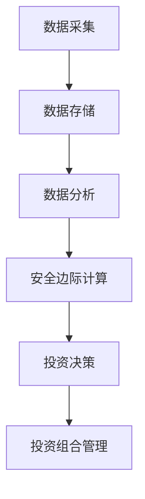
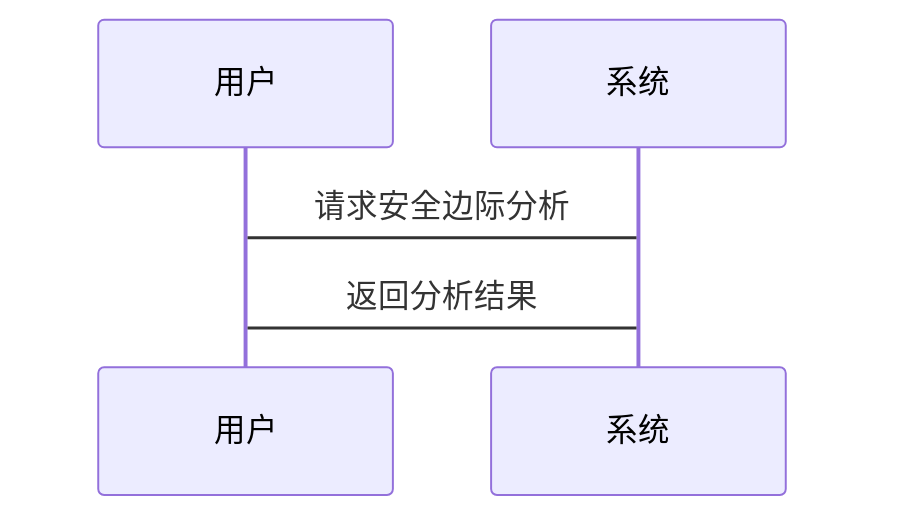

                 


# 价值投资的核心原则：安全边际

## 关键词：价值投资、安全边际、内在价值、投资风险、市场周期

## 摘要：  
价值投资是一种以基本面分析为基础的投资策略，其核心原则是购买低于内在价值的资产，从而在长期获得超额收益。安全边际是价值投资中的关键概念，它通过在资产价格与内在价值之间建立一个保护性的缓冲区，降低投资风险并提高投资的确定性。本文将深入探讨安全边际的核心原理、计算方法、在不同市场环境中的应用，以及如何通过系统架构和项目实战来实现安全边际的有效管理。

---

## 第一部分：价值投资的核心原则

### 第1章：价值投资的基本概念

#### 1.1 价值投资的定义与历史  
价值投资是一种长期投资策略，起源于20世纪初，由本杰明·格雷厄姆和戴维·多德提出，并由沃伦·巴菲特发扬光大。其核心理念是寻找市场价格低于内在价值的资产，通过长期持有实现收益。与短期交易策略不同，价值投资强调对公司基本面的深入研究，关注企业的盈利能力、财务状况和竞争优势。

#### 1.2 安全边际的定义与重要性  
安全边际是指资产的市场价格与其内在价值之间的差额。简单来说，安全边际 = 内在价值 - 市场价格。当市场价格低于内在价值时，安全边际为正，表示投资具有一定的“缓冲”空间，能够降低投资风险并为投资者提供保护。安全边际的重要性体现在以下几个方面：  
1. **降低投资风险**：通过购买价格低于内在价值的资产，投资者能够减少因市场价格波动带来的损失。  
2. **提高投资的确定性**：安全边际为投资者提供了更大的概率来获得正收益。  
3. **长期复利效应**：在安全边际的基础上进行投资，能够在市场波动中保持稳健，并通过复利效应实现财富的长期增长。

---

### 第2章：安全边际的核心原理

#### 2.1 安全边际的计算方法  
要计算安全边际，首先需要确定资产的内在价值。以下是计算内在价值的常用方法：  

1. **DCF模型（Discounted Cash Flow Model）**  
   DCF模型是通过预测企业未来现金流并将其贴现到现值来估算内在价值的方法。  
   - **公式**：  
     $$ \text{内在价值} = \sum_{t=1}^{n} \frac{\text{现金流}_t}{(1 + r)^t} + \frac{\text{终值}}{(1 + r)^n} $$  
     其中，\( r \) 是折现率，\( n \) 是预测期数。  

2. **市盈率（P/E）和市净率（P/B）**  
   市盈率 = 市场价格 / 每股净利润，市净率 = 市场价格 / 每股净资产。这些指标可以帮助投资者评估资产的相对估值。  

3. **安全边际计算公式**  
   $$ \text{安全边际} = \text{内在价值} - \text{市场价格} $$  

#### 2.2 安全边际与投资决策  
安全边际在投资决策中的应用主要体现在以下几个方面：  
1. **买入决策**：在购买资产时，确保市场价格低于内在价值，且安全边际足够大。  
2. **卖出决策**：当市场价格远高于内在价值时，安全边际为负，应考虑卖出。  
3. **投资组合管理**：通过调整投资组合中资产的安全边际，优化风险与收益的平衡。

---

### 第3章：内在价值的评估方法

#### 3.1 内在价值的定义与计算  
内在价值是资产在长期稳定经营中能够产生的现金流的现值。以下是几种常见的内在价值评估方法：  

1. **绝对估值法**  
   - 使用DCF模型、股利贴现模型（DDM）等方法，通过对企业未来现金流的预测来估算内在价值。  

2. **相对估值法**  
   - 通过比较同类资产的市场价格和估值指标（如市盈率、市净率）来估算内在价值。  

#### 3.2 不同资产类别的内在价值评估  
不同的资产类别具有不同的内在价值评估方法：  
1. **股票**  
   - 使用DCF模型、P/E、P/B等指标进行评估。  
2. **债券**  
   - 使用债券的票面价值、到期收益率（YTM）和现值公式进行评估。  
3. **房地产**  
   - 使用现金流折现法、资本化率等方法进行评估。  

---

### 第4章：安全边际与投资风险

#### 4.1 投资风险的定义与分类  
投资风险是指在投资过程中可能面临的本金损失或收益低于预期的风险。常见的投资风险包括：  
1. **市场风险**：市场价格波动带来的风险。  
2. **流动性风险**：资产难以快速变现的风险。  
3. **信用风险**：债券发行人违约的风险。  

#### 4.2 安全边际在风险管理中的应用  
安全边际通过在市场价格与内在价值之间建立缓冲区，能够有效降低投资风险：  
1. **风险控制**：通过选择安全边际较高的资产，降低因市场波动导致的损失。  
2. **风险分散**：在投资组合中引入不同资产类别的安全边际分析，分散风险。  
3. **风险评估**：定期评估投资组合中的安全边际，及时调整持仓。

---

### 第5章：安全边际在不同市场环境中的应用

#### 5.1 不同市场环境下的安全边际策略  
1. **牛市环境**  
   - 市场价格可能高于内在价值，安全边际较低，应谨慎投资。  
2. **熊市环境**  
   - 市场价格可能大幅低于内在价值，安全边际较高，是买入机会。  
3. **震荡市环境**  
   - 安全边际可能波动较大，需密切关注市场变化，灵活调整策略。  

#### 5.2 安全边际与市场周期  
市场周期对安全边际的影响主要体现在：  
1. **市场周期的定义与影响**  
   - 市场周期包括上升周期和下降周期，影响资产的市场价格和内在价值。  
2. **安全边际与市场预期**  
   - 预期市场周期变化时，调整安全边际的计算和投资策略。  

---

## 第二部分：安全边际的系统分析与架构设计

### 第6章：系统架构与模块化设计

#### 6.1 系统功能设计  
- **数据采集模块**：收集资产的市场数据和基本面数据。  
- **分析模块**：计算内在价值和安全边际。  
- **决策模块**：基于安全边际和市场环境生成投资决策。  

#### 6.2 系统架构设计  
以下是系统架构的Mermaid图：  


#### 6.3 系统接口设计  
- **数据接口**：与数据源（如股票数据库）连接，获取实时数据。  
- **用户接口**：提供直观的界面，展示安全边际分析结果和投资建议。  

---

### 第7章：系统交互与流程优化

#### 7.1 系统交互设计  
以下是系统交互的Mermaid序列图：  


#### 7.2 流程优化  
通过优化数据处理流程和算法效率，提高系统的运行速度和分析精度。

---

## 第三部分：项目实战与最佳实践

### 第8章：项目实战

#### 8.1 环境安装与配置  
- 安装Python、Pandas、NumPy等工具，配置开发环境。  

#### 8.2 核心实现源代码  
以下是计算安全边际的Python代码：  
```python
def calculate_intrinsic_value(revenue, expenses, interest, tax_rate, discount_rate, years):
    # 假设企业未来n年的现金流
    cash_flow = []
    for i in range(years):
        net_income = revenue - expenses - interest
        tax = net_income * tax_rate
        after_tax_income = net_income - tax
        cash_flow.append(after_tax_income)
    # 计算现值
    present_value = sum([cf / (1 + discount_rate)**i for i, cf in enumerate(cash_flow)])
    return present_value

def calculate_margin_of_safety(intrinsic_value, market_price):
    return intrinsic_value - market_price
```

#### 8.3 代码应用与案例分析  
以某股票为例，计算其内在价值和安全边际，展示代码的应用和结果分析。

---

### 第9章：最佳实践与注意事项

#### 9.1 小结  
安全边际是价值投资中的核心原则，通过在市场价格与内在价值之间建立缓冲区，降低投资风险并提高投资的确定性。

#### 9.2 注意事项  
- **避免过度依赖模型**：内在价值评估需要结合定性和定量分析。  
- **动态调整**：定期重新评估安全边际，适应市场变化。  
- **分散投资**：通过分散投资降低单一资产的风险。  

#### 9.3 拓展阅读  
推荐阅读《证券分析》（本杰明·格雷厄姆）、《巴菲特的选股之道》等书籍，深入理解安全边际的应用。

---

## 第四部分：总结与展望

### 第10章：总结与未来展望

#### 10.1 总结  
安全边际是价值投资的核心原则，通过科学的计算和系统的管理，投资者能够在复杂多变的市场中保持稳健的投资策略。

#### 10.2 未来展望  
随着人工智能和大数据技术的发展，安全边际的计算将更加精准和高效，未来在新兴市场和技术领域的应用也将更加广泛。

---

## 作者：AI天才研究院 & 禅与计算机程序设计艺术

