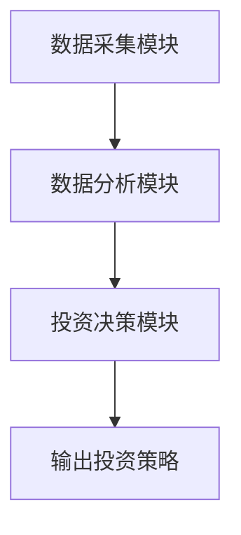

                 


# 价值投资的核心原则：安全边际理论解析

## 关键词：
- 价值投资
- 安全边际
- 内在价值
- 格雷厄姆
- 投资策略

## 摘要：
本文详细解析了价值投资的核心原则——安全边际理论。从理论的起源到实际应用，从数学模型到系统架构，全面探讨了安全边际理论的深刻内涵和实际操作方法。通过具体的案例分析和代码实现，帮助读者掌握这一经典投资策略的核心要义，并能够将其应用于实际投资中。

---

# 第一部分：价值投资的核心概念与背景

## 第1章：安全边际理论的起源与发展

### 1.1 价值投资的起源
价值投资是20世纪最具影响力的投资理论之一，其核心思想由本杰明·格雷厄姆和戴维·多德共同提出。格雷厄姆的学生彼得·林奇和沃伦·巴菲特继承并发展了这一理论。价值投资的核心理念是寻找市场价格低于内在价值的股票进行投资，从而实现长期稳定的收益。

### 1.2 安全边际理论的核心思想
安全边际理论是价值投资的基石。它强调在购买股票时，市场价格与内在价值之间的差异（即安全边际）越大，投资的风险越小，收益越稳定。格雷厄姆认为，市场价往往会受到情绪和短期波动的影响，而内在价值则代表了企业的真正价值。

### 1.3 价值投资与现代投资理论的对比
与现代投资组合理论（MPT）不同，价值投资并不追求资产的分散化，而是通过精选具有安全边际的个股来实现超额收益。价值投资更注重基本面分析，而MPT则更注重资产的波动性和相关性。

---

## 第2章：安全边际理论的核心概念

### 2.1 安全边际的定义与特征
安全边际是指市场价格与内在价值之间的差异。具体来说，如果一只股票的内在价值为10元，而市场价格为8元，那么安全边际为2元。安全边际越大，投资的风险越小，收益的确定性越高。

#### 表2.1：安全边际与市场价、内在价值的对比

| 概念         | 定义                                                                 |
|--------------|----------------------------------------------------------------------|
| 内在价值     | 股票未来现金流的现值，反映企业的真正价值                               |
| 市场价格     | 当前市场上股票的交易价格                                             |
| 安全边际     | 内在价值与市场价格的差额，提供保护的空间                             |

### 2.2 安全边际与投资风险的关系
安全边际越大，投资者在面对市场波动时的容错空间越大。即使企业的未来现金流预测出现偏差，安全边际也能为投资提供保护。因此，安全边际是降低投资风险的重要工具。

---

## 第3章：安全边际理论的数学模型与公式

### 3.1 内在价值的计算公式
内在价值是价值投资的核心，其计算通常基于贴现现金流模型（DCF）。以下是DCF模型的公式：

$$
\text{内在价值} = \frac{\text{自由现金流}}{\text{贴现率}}
$$

例如，假设某公司未来每年产生100元的自由现金流，贴现率为10%，那么其内在价值为：

$$
\text{内在价值} = \frac{100}{0.10} = 1000 \text{元}
$$

### 3.2 安全边际的计算公式
安全边际的计算公式如下：

$$
\text{安全边际} = \text{内在价值} - \text{市场价格}
$$

例如，某股票的内在价值为20元，市场价格为15元，其安全边际为5元。

---

## 第4章：安全边际理论的系统架构设计

### 4.1 投资决策系统的功能模块
为了实现安全边际理论的自动化应用，我们可以设计一个投资决策系统，其功能模块包括：

1. **数据采集模块**：获取股票的财务数据、市场数据等。
2. **数据分析模块**：计算股票的内在价值和安全边际。
3. **投资决策模块**：根据安全边际的大小，生成买入、卖出或持有策略。

### 4.2 系统架构设计
以下是系统架构的简图：



---

## 第5章：安全边际理论的项目实战

### 5.1 环境安装与配置
为了实现安全边际的计算，我们需要安装以下工具：

1. Python编程语言
2. 数据分析库（如Pandas、NumPy）
3. 财务数据接口（如Yahoo Finance API）

### 5.2 核心算法实现
以下是计算内在价值和安全边际的Python代码示例：

```python
import pandas as pd
import numpy as np

# 假设我们有以下数据
free_cash_flow = 100  # 自由现金流（元）
discount_rate = 0.10   # 贴现率

# 计算内在价值
intrinsic_value = free_cash_flow / discount_rate
print(f"内在价值为：{intrinsic_value} 元")

# 假设市场价格为800元
market_price = 800
safety_margin = intrinsic_value - market_price
print(f"安全边际为：{safety_margin} 元")
```

### 5.3 实际案例分析
以可口可乐为例，假设其自由现金流为500元，贴现率为8%，市场价格为4000元。计算其内在价值和安全边际：

$$
\text{内在价值} = \frac{500}{0.08} = 6250 \text{元}
$$

$$
\text{安全边际} = 6250 - 4000 = 2250 \text{元}
$$

由于安全边际较大，说明此时投资可口可乐的风险较低，收益较高。

---

## 第6章：安全边际理论的最佳实践与小结

### 6.1 最佳实践
1. **注重安全边际**：在选择股票时，优先考虑那些市场价格远低于内在价值的股票。
2. **长期持有**：价值投资强调长期持有，避免频繁交易。
3. **分散投资**：虽然价值投资不依赖分散化，但适当分散仍有助于降低风险。

### 6.2 小结
安全边际理论是价值投资的核心原则，它通过强调内在价值与市场价格的差异，帮助投资者降低风险，实现超额收益。在实际投资中，我们可以通过数据分析和系统设计，将这一理论应用于具体的操作中。

---

## 作者：AI天才研究院/AI Genius Institute & 禅与计算机程序设计艺术 /Zen And The Art of Computer Programming

---

以上是《价值投资的核心原则：安全边际理论解析》的完整内容，从理论到实践，全面解析了安全边际理论的深刻内涵和应用方法。

