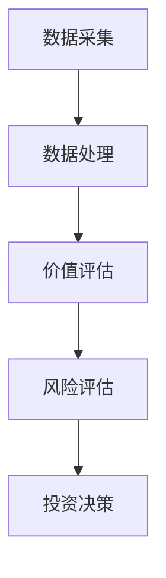

                 


# 《价值投资者的耐心：长期持有的重要性》

---

## 关键词：
价值投资、长期持有、耐心资本、安全边际、复利效应

---

## 摘要：
价值投资是一种强调长期持有的投资策略，核心在于寻找被市场低估的企业，通过长期持有实现企业价值的回归。本文将从价值投资的背景、核心概念、长期持有的重要性、耐心资本的构建与管理、安全边际的原理与应用、价值陷阱的识别与规避、价值评估的数学模型、系统分析与架构设计、项目实战以及最佳实践等多个方面展开详细论述，帮助读者全面理解价值投资的长期策略。

---

## 第1章：价值投资的起源与核心理念

### 1.1 价值投资的起源

#### 1.1.1 投资的本质与误区
投资的本质是通过配置资源，以低于其内在价值的价格买入资产，并在长期持有中获得收益。然而，许多投资者容易陷入短期波动的误区，追求短期收益，忽视长期价值。这种短视的行为往往导致投资失败。

#### 1.1.2 价值投资的提出与发展
价值投资的概念起源于20世纪初，由本杰明·格雷厄姆和戴维·多德提出。他们强调以低于内在价值的价格买入股票，并长期持有，直到市场重新认识到其真实价值。

#### 1.1.3 价值投资的核心理念
价值投资的核心理念是“买入便宜的东西”。投资者应关注企业的内在价值，而非市场的短期波动。通过深入研究企业的财务状况、行业地位和管理层能力，找到那些被市场低估的优质企业进行投资。

---

### 1.2 长期持有的重要性

#### 1.2.1 短期交易的局限性
短期交易者往往受到市场情绪的影响，容易被市场的短期波动所迷惑。频繁交易不仅增加了交易成本，还可能导致错失长期上涨的机会。

#### 1.2.2 长期持有与复利效应
长期持有能够充分利用复利效应，使投资收益呈指数级增长。复利效应的核心在于时间，越长的持有时间，复利效果越显著。

#### 1.2.3 价值投资者的耐心与纪律
价值投资者需要具备强大的耐心和纪律，能够在市场低迷时坚持持有，避免因短期亏损而放弃投资。这种耐心是价值投资成功的关键。

---

## 第2章：价值投资的核心概念与背景

### 2.1 价值投资的定义与特征

#### 2.1.1 价值投资的定义
价值投资是一种通过深入研究企业的财务状况、行业地位和管理层能力，以低于其内在价值的价格买入股票，并长期持有的投资策略。

#### 2.1.2 价值投资的核心特征
- **内在价值**：关注企业的实际价值，而非市场的表象。
- **安全边际**：买入价格低于内在价值，以降低投资风险。
- **长期持有**：避免频繁交易，充分利用复利效应。

#### 2.1.3 价值投资与其它投资策略的对比
- **与趋势投资**：趋势投资者关注市场的短期趋势，而价值投资者关注企业的长期价值。
- **与成长投资**：成长投资者关注企业的成长潜力，而价值投资者关注企业的低估价值。

---

### 2.2 长期持有的背景与逻辑

#### 2.2.1 经济周期与市场波动
经济周期的波动会影响市场的短期走势，但不会改变企业的长期价值。价值投资者需要在市场低迷时抓住买入机会，在市场繁荣时保持冷静。

#### 2.2.2 企业价值的长期增长
企业的内在价值取决于其盈利能力、成长能力和竞争优势。通过长期持有优质企业，投资者能够分享其长期增长的成果。

#### 2.2.3 投资者心理与行为偏差
投资者的心理偏差（如贪婪和恐惧）常常导致错误的决策。长期持有可以帮助投资者克服心理偏差，坚持价值投资的原则。

---

## 第3章：耐心资本的构建与管理

### 3.1 耐心资本的定义与作用

#### 3.1.1 耐心资本的定义
耐心资本是指那些能够长期持有的资本，不因短期市场波动而改变投资策略。耐心资本的核心在于对企业的长期价值有信心。

#### 3.1.2 耐心资本在投资中的作用
- **降低投资风险**：通过长期持有，减少市场波动对企业价值的影响。
- **实现复利效应**：耐心资本能够充分利用复利效应，使投资收益稳步增长。
- **避免短期决策**：耐心资本能够帮助投资者避免因短期波动而做出错误决策。

---

### 3.2 安全边际的原理与应用

#### 3.2.1 安全边际的定义
安全边际是指买入价格与内在价值之间的差距。通过设置安全边际，投资者能够降低投资风险，确保在市场低估时买入。

#### 3.2.2 安全边际的计算方法
安全边际 = 内在价值 - 买入价格

---

#### 3.2.3 安全边际在投资决策中的应用
- **筛选投资标的**：通过计算安全边际，筛选出具有足够安全空间的投资标的。
- **动态调整投资组合**：根据市场变化，动态调整投资标的的安全边际，确保投资组合的稳健性。

---

## 第4章：价值陷阱与长期持有的风险

### 4.1 价值陷阱的定义与特征

#### 4.1.1 价值陷阱的定义
价值陷阱是指那些表面上看似低估，但实际上具有重大问题的企业。投资者如果误判企业价值，可能会陷入价值陷阱，导致长期亏损。

#### 4.1.2 价值陷阱的常见类型
- **财务造假**：企业通过财务造假掩盖真实的财务状况。
- **管理层问题**：企业管理层存在严重问题，无法带领企业实现长期增长。
- **行业衰退**：所在行业面临衰退，企业难以维持竞争优势。

---

### 4.2 如何识别价值陷阱

#### 4.2.1 财务指标分析
通过分析企业的财务指标（如ROE、毛利率、资产负债率等），识别企业的财务健康状况。

#### 4.2.2 行业分析与竞争地位
研究企业的行业地位和竞争优势，判断其在行业中的竞争力。

#### 4.2.3 管理层与公司治理
了解企业的管理层背景和公司治理结构，判断其管理能力和诚信度。

---

## 第5章：价值评估的数学模型

### 5.1 现金流折现模型（DCF）

#### 5.1.1 DCF模型的原理
DCF（Discounted Cash Flow）模型是一种通过预测企业未来现金流，并将其折现为现值，以估算企业内在价值的方法。

#### 5.1.2 DCF模型的步骤
1. **预测未来现金流**：根据企业的历史数据和行业趋势，预测未来几年的现金流。
2. **计算终值**：使用永续增长率预测企业未来现金流的终值。
3. **折现现金流**：将未来现金流和终值折现为现值，计算企业的内在价值。

#### 5.1.3 DCF模型的数学公式
$$
\text{内在价值} = \frac{\text{现金流}}{(1 + r)^t} + \frac{\text{终值}}{(1 + r)^n}
$$
其中，\( r \) 是折现率，\( t \) 是时间，\( n \) 是预测的年数。

---

#### 5.1.4 DCF模型的Python代码实现

```python
def discounted_cash_flow(cash_flows, discount_rate, terminal_value):
    present_value = 0
    for year, cash_flow in enumerate(cash_flows):
        if year == 0:
            present_value += cash_flow
        else:
            present_value += cash_flow / (1 + discount_rate) ** year
    present_value += terminal_value / (1 + discount_rate) ** len(cash_flows)
    return present_value

# 示例
cash_flows = [100, 150, 200, 250]
discount_rate = 0.1
terminal_value = 500

intrinsic_value = discounted_cash_flow(cash_flows, discount_rate, terminal_value)
print("内在价值：", intrinsic_value)
```

---

### 5.2 市盈率与市净率分析

#### 5.2.1 市盈率的计算公式
$$
\text{市盈率} = \frac{\text{股价}}{\text{每股收益}}
$$

#### 5.2.2 市净率的计算公式
$$
\text{市净率} = \frac{\text{股价}}{\text{每股净资产}}
$$

---

## 第6章：系统分析与架构设计

### 6.1 投资决策的系统架构

#### 6.1.1 系统功能设计
- **数据采集**：收集企业的财务数据、行业信息等。
- **价值评估**：使用DCF模型等方法评估企业内在价值。
- **风险评估**：分析企业的财务风险、行业风险等。
- **投资决策**：根据评估结果，制定投资策略。

#### 6.1.2 系统架构图


---

### 6.2 投资决策的流程优化

#### 6.2.1 优化目标
- 提高投资决策的效率和准确性。
- 减少人为错误，确保决策的科学性。

#### 6.2.2 优化步骤
1. **数据采集与处理**：确保数据的准确性和完整性。
2. **价值评估**：使用多种模型进行交叉验证，提高评估的准确性。
3. **风险评估**：全面分析企业的各种风险因素，制定风险管理策略。
4. **投资决策**：结合价值评估和风险评估结果，制定最优投资策略。

---

## 第7章：项目实战

### 7.1 环境配置与数据获取

#### 7.1.1 环境配置
- **操作系统**：Windows 10 或 macOS 10.15+
- **Python版本**：Python 3.8+
- **工具安装**：安装Jupyter Notebook、pandas、numpy等库。

#### 7.1.2 数据获取
从公开的金融数据库（如Yahoo Finance）获取企业的财务数据和股票价格。

---

### 7.2 价值评估与投资决策

#### 7.2.1 DCF模型的应用
以某企业为例，使用DCF模型评估其内在价值，并制定买入价格。

#### 7.2.2 投资决策
根据评估结果，制定买入、持有或卖出的投资策略。

---

### 7.3 案例分析：茅台投资策略

#### 7.3.1 茅台的价值评估
使用DCF模型评估茅台的内在价值，分析其长期增长潜力。

#### 7.3.2 投资策略
基于评估结果，制定长期持有的投资策略，分享茅台的长期增长收益。

---

## 第8章：最佳实践与小结

### 8.1 成功经验总结

#### 8.1.1 长期思维的重要性
价值投资者需要具备长期思维，关注企业的长期价值，而非短期波动。

#### 8.1.2 安全边际的设置
通过设置安全边际，降低投资风险，确保投资标的的低估状态。

#### 8.1.3 持续学习与交流
不断学习投资知识，与同行交流经验，提升自身的投资能力。

---

### 8.2 风险管理与心态控制

#### 8.2.1 风险管理
- **分散投资**：避免过度集中，降低投资风险。
- **定期复盘**：定期检查投资组合，及时调整策略。

#### 8.2.2 心态控制
- **避免贪婪与恐惧**：保持冷静，避免因市场波动而做出错误决策。
- **坚持长期策略**：耐心持有，相信时间的力量。

---

### 8.3 拓展阅读与持续学习

#### 8.3.1 经典书籍
- 《价值： simplexity 公式》
- 《投资最重要的事情》
- 《聪明的投资者》

#### 8.3.2 持续学习
通过阅读、实践和交流，不断提升自身的投资能力，适应市场的变化。

---

## 作者：
**AI天才研究院/AI Genius Institute & 禅与计算机程序设计艺术 /Zen And The Art of Computer Programming**

