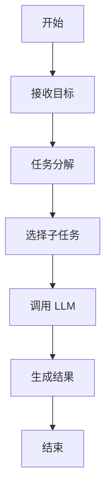
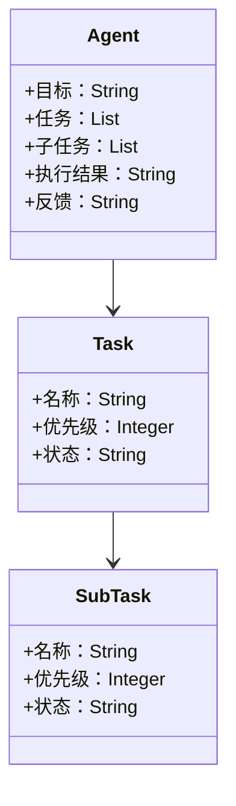
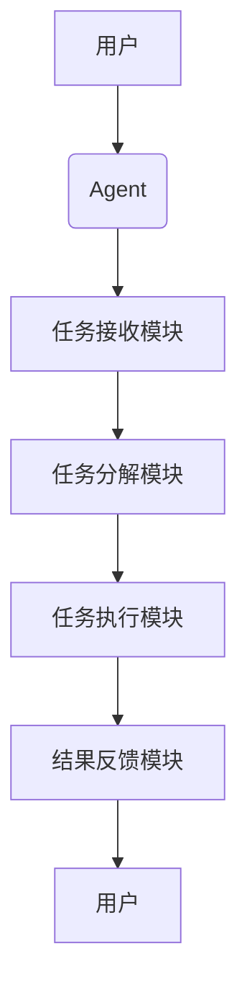

                 


# 任务导向型 AI Agent：基于 LLM 的目标完成系统

> 关键词：任务导向型 AI Agent，LLM，目标完成系统，人工智能，大语言模型

> 摘要：本文详细探讨了任务导向型 AI Agent 的设计与实现，基于大语言模型（LLM）的核心算法原理，结合实际案例分析，系统性地阐述了任务导向型 AI Agent 的系统架构、算法流程、数学模型、系统接口设计及实际应用。

---

## 第一部分：任务导向型 AI Agent 的背景与基础

### 第1章：任务导向型 AI Agent 概述

#### 1.1 问题背景与描述
任务导向型 AI Agent 是一种基于大语言模型（LLM）的人工智能代理系统，旨在通过理解和执行特定目标或任务来实现用户的需求。随着 AI 技术的快速发展，传统的 AI 系统逐渐暴露出在复杂任务处理中的局限性，例如缺乏目标导向性、难以适应动态变化的环境以及无法高效完成复杂任务等问题。任务导向型 AI Agent 通过结合自然语言处理、强化学习和任务分解等技术，为解决这些问题提供了新的思路。

##### 问题背景
- **传统 AI 系统的局限性**：传统 AI 系统通常基于规则或预定义的逻辑进行操作，难以应对复杂多变的任务环境。
- **动态任务需求**：现代应用场景中，任务需求往往是动态变化的，传统系统难以快速适应。
- **复杂任务分解**：复杂的任务需要分解为多个子任务，传统系统在任务分解和优先级排序方面存在不足。

##### 问题描述
任务导向型 AI Agent 需要具备以下能力：
1. 理解用户的目标或任务。
2. 分解任务并制定执行计划。
3. 调用大语言模型（LLM）完成具体任务。
4. 根据反馈优化执行策略。

#### 1.2 核心概念与联系
任务导向型 AI Agent 的核心在于其目标导向性和任务分解能力。以下是其核心概念的详细描述：

##### 核心概念原理
- **目标导向性**：AI Agent 通过理解用户的目标，制定相应的执行策略。
- **任务分解**：将复杂任务分解为多个子任务，并优先处理关键子任务。
- **动态适应性**：根据环境变化和反馈，动态调整任务执行策略。

##### 概念属性特征对比表格
以下是对任务导向型 AI Agent 与其他 AI Agent 的对比：

| 属性 | 传统 AI Agent | 任务导向型 AI Agent |
|------|---------------|---------------------|
| 目标导向性 | 无或弱 | 强 |
| 任务分解能力 | 无或弱 | 强 |
| 动态适应性 | 无或弱 | 强 |
| 适用场景 | 简单任务 | 复杂任务 |

##### ER 实体关系图
任务导向型 AI Agent 的 ER 实体关系图如下：

```mermaid
er
  actor(Agent, 目标)
  actor(Agent, 任务)
  actor(Agent, 子任务)
  actor(Agent, 执行结果)
  actor(Agent, 反馈)
```

---

## 第二部分：任务导向型 AI Agent 的算法与数学模型

### 第2章：任务导向型 AI Agent 的算法原理

#### 2.1 基于 LLM 的任务导向型 AI Agent 算法
任务导向型 AI Agent 的核心算法基于大语言模型（LLM），通过自然语言理解和生成能力来实现任务的分解与执行。

##### 算法流程
以下是基于 LLM 的任务导向型 AI Agent 的算法流程：



##### 算法实现的数学模型
为了实现任务分解和优先级排序，算法中使用了概率模型和优化算法。

###### 概率分布模型
任务优先级的概率分布模型如下：

$$ P(i) = \frac{e^{-w_i}}{\sum_{j=1}^{n} e^{-w_j}} $$

其中，\( w_i \) 是任务 \( i \) 的权重，\( P(i) \) 是任务 \( i \) 的优先级概率。

###### 损失函数与优化器
损失函数用于衡量预测任务优先级与实际优先级的差异：

$$ L = \sum_{i=1}^{n} (P_{\text{pred}}(i) - P_{\text{true}}(i))^2 $$

优化器使用Adam优化算法，参数更新公式如下：

$$ \theta_{t+1} = \theta_t - \eta \frac{\partial L}{\partial \theta_t} $$

其中，\( \eta \) 是学习率。

---

## 第三部分：任务导向型 AI Agent 的系统分析与架构设计

### 第3章：任务导向型 AI Agent 的系统架构设计

#### 3.1 系统功能设计
任务导向型 AI Agent 的系统功能设计包括任务接收、任务分解、任务执行和结果反馈四个模块。

##### 领域模型
以下是系统功能的领域模型：



#### 3.2 系统架构设计
任务导向型 AI Agent 的系统架构设计如下：



---

## 第四部分：任务导向型 AI Agent 的项目实战

### 第4章：任务导向型 AI Agent 的实现

#### 4.1 环境安装
以下是在 Python 环境中安装必要的库：

```bash
pip install numpy
pip install transformers
pip install torch
```

#### 4.2 核心实现代码

##### 任务分解模块
```python
import numpy as np

def decompose_task(main_task):
    tasks = []
    # 任务分解逻辑
    for sub_task in main_task.split(','):
        tasks.append({'name': sub_task.strip(), 'priority': np.random.randint(1, 6)})
    return tasks
```

##### LLM 调用模块
```python
from transformers import pipeline

text_generation = pipeline('text-generation', model='gpt2')

def call_llm(prompt):
    return text_generation(prompt, max_length=50)[0]['generated_text']
```

##### 结果处理模块
```python
def process_result(response):
    return {'status': 'success', 'result': response}
```

#### 4.3 案例分析
以一个简单的任务为例，展示任务分解与执行过程：

```python
main_task = "写一篇关于 AI 的文章"
tasks = decompose_task(main_task)
print(tasks)  # [{'name': '收集资料', 'priority': 4}, {'name': '撰写大纲', 'priority': 3}, {'name': '撰写正文', 'priority': 2}]
response = call_llm("写一篇关于 AI 的文章：")
print(process_result(response))
```

---

## 第五部分：总结与展望

### 第5章：总结与展望

#### 5.1 总结
任务导向型 AI Agent 通过结合大语言模型和任务分解技术，能够高效地完成复杂任务。本文详细探讨了其算法原理、系统架构和实现方法。

#### 5.2 注意事项
- 确保任务分解的准确性和合理性。
- 在实际应用中，需根据具体场景调整参数和算法。

#### 5.3 未来展望
任务导向型 AI Agent 的未来发展将集中在以下几个方向：
1. 多模态任务处理能力。
2. 更复杂的任务分解策略。
3. 更高效的算法优化。

---

作者：AI天才研究院/AI Genius Institute & 禅与计算机程序设计艺术 /Zen And The Art of Computer Programming

