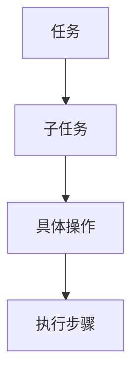
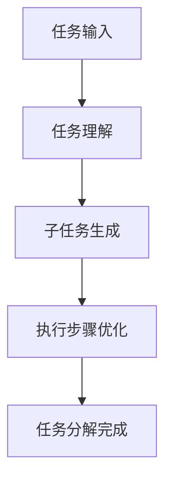
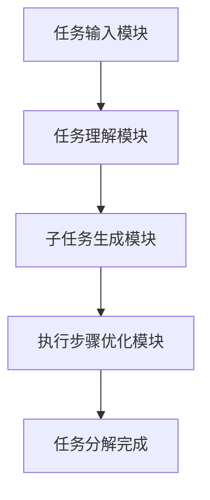
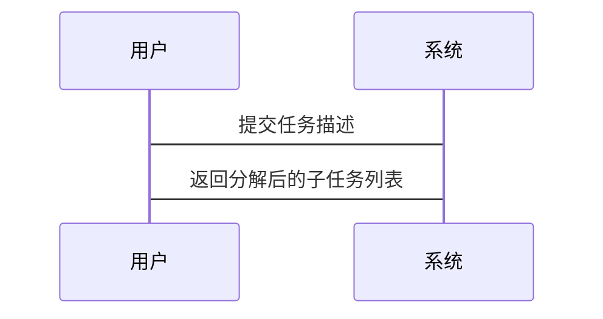

                 


# 任务规划AI Agent：利用LLM进行复杂任务分解

> 关键词：任务规划AI Agent, LLM, 复杂任务分解, 人工智能, 大语言模型

> 摘要：本文深入探讨了任务规划AI Agent利用大语言模型（LLM）进行复杂任务分解的核心概念、算法原理、系统架构设计以及实际应用案例。通过详细分析，读者将理解如何利用LLM的强大能力来分解复杂任务，并掌握相关技术的实现方法。

---

# 第一部分: 任务规划AI Agent概述

# 第1章: 任务规划AI Agent的背景与概念

## 1.1 任务规划AI Agent的定义与核心概念

### 1.1.1 任务规划的基本概念

任务规划是指将一个复杂的任务分解为多个子任务，并为每个子任务制定执行计划的过程。任务规划的核心目标是确保任务能够在预定的时间和资源约束下高效完成。

### 1.1.2 AI Agent的基本特征

AI Agent（智能体）是一种能够感知环境、自主决策并执行任务的智能系统。AI Agent具备以下基本特征：

1. **自主性**：能够在没有外部干预的情况下自主运行。
2. **反应性**：能够根据环境的变化调整自己的行为。
3. **目标导向**：具备明确的目标，并能够为实现目标采取合理行动。
4. **学习能力**：能够通过经验改进自身的性能。

### 1.1.3 任务规划AI Agent的核心要素

任务规划AI Agent结合了任务规划和AI Agent的核心要素，包括：

1. **任务分解**：将复杂任务分解为可执行的子任务。
2. **执行计划**：为每个子任务制定详细的执行步骤。
3. **动态调整**：在执行过程中根据环境变化动态调整计划。

## 1.2 任务规划AI Agent的背景与应用

### 1.2.1 传统任务规划的局限性

传统任务规划方法通常依赖于严格的规则和预定义的步骤，难以应对复杂多变的环境。其主要局限性包括：

1. **缺乏灵活性**：无法应对任务执行过程中的突发情况。
2. **计算复杂度高**：在任务规模较大时，计算复杂度急剧上升。
3. **难以处理不确定性**：难以应对任务执行过程中可能出现的不确定性。

### 1.2.2 AI Agent在任务规划中的优势

AI Agent通过引入智能算法和学习能力，能够有效克服传统任务规划的局限性。其主要优势包括：

1. **灵活性**：能够根据环境变化动态调整任务执行计划。
2. **高效性**：通过智能算法优化任务分解和执行效率。
3. **适应性**：能够适应不同任务场景的需求。

### 1.2.3 任务规划AI Agent的典型应用场景

任务规划AI Agent的应用场景广泛，包括：

1. **智能助手**：帮助用户完成日常任务，如日程安排、信息查询等。
2. **机器人控制**：用于工业机器人或服务机器人任务规划。
3. **自动驾驶**：自动驾驶汽车的任务规划与路径优化。

## 1.3 LLM在任务规划中的作用

### 1.3.1 大语言模型的基本原理

大语言模型（LLM）通过大量的数据训练，能够理解和生成人类语言。其基本原理包括：

1. **数据训练**：通过监督学习和无监督学习训练模型。
2. **语言理解**：能够理解上下文和语义信息。
3. **生成能力**：能够生成连贯且符合逻辑的文本。

### 1.3.2 LLM在任务分解中的应用

LLM在任务分解中的应用主要体现在以下几个方面：

1. **任务理解**：通过自然语言处理技术理解任务的描述和目标。
2. **子任务生成**：将复杂任务分解为多个子任务，并为每个子任务生成执行步骤。
3. **任务优化**：根据任务执行情况动态优化任务分解和执行计划。

### 1.3.3 LLM与任务规划AI Agent的结合

通过将LLM集成到任务规划AI Agent中，可以充分发挥LLM的语言理解和生成能力，提升任务分解和执行的效率和准确性。

---

## 1.4 本章小结

本章从任务规划和AI Agent的基本概念出发，介绍了任务规划AI Agent的核心要素及其在复杂任务分解中的优势。同时，详细探讨了LLM在任务规划中的作用，为后续章节的深入分析奠定了基础。

---

# 第二部分: 任务分解的核心概念与算法原理

# 第2章: 任务分解的核心概念与联系

## 2.1 任务分解的定义与核心要素

### 2.1.1 任务分解的基本概念

任务分解是指将复杂任务分解为多个子任务，并为每个子任务制定具体的执行步骤。任务分解的核心目标是通过合理分配资源和优化执行顺序，提高任务执行效率。

### 2.1.2 任务分解的核心要素

任务分解的核心要素包括：

1. **任务目标**：任务需要实现的目标。
2. **子任务**：任务分解后的具体子任务。
3. **执行步骤**：每个子任务的具体执行步骤。
4. **资源约束**：任务执行过程中需要考虑的资源限制。

### 2.1.3 任务分解的边界与外延

任务分解的边界是指任务分解的起点和终点，外延是指任务分解的范围和适用场景。任务分解的边界和外延需要根据具体任务需求进行定义。

## 2.2 核心概念的原理与联系

### 2.2.1 任务分解与AI Agent的关系

任务分解是AI Agent实现任务规划的核心环节。AI Agent通过任务分解能够将复杂任务转化为可执行的子任务，并通过动态调整子任务的执行顺序和资源分配，提高任务执行效率。

### 2.2.2 LLM在任务分解中的角色

LLM在任务分解中主要扮演以下角色：

1. **任务理解**：通过自然语言处理技术理解任务描述和目标。
2. **子任务生成**：根据任务目标生成具体的子任务。
3. **执行步骤优化**：通过优化算法改进子任务的执行步骤。

### 2.2.3 任务分解的ER实体关系图

任务分解的ER实体关系图展示了任务、子任务和具体操作之间的关系。



---

## 2.3 本章小结

本章详细探讨了任务分解的核心概念及其与AI Agent和LLM的关系，通过ER实体关系图展示了任务分解的内在联系，为后续章节的算法设计奠定了基础。

---

# 第三章: 任务分解的算法原理

## 3.1 基于LLM的任务分解算法

### 3.1.1 算法概述

基于LLM的任务分解算法通过调用大语言模型，将复杂任务分解为多个子任务，并为每个子任务生成具体的执行步骤。

### 3.1.2 算法流程

1. **任务输入**：接收需要分解的任务描述。
2. **任务理解**：通过自然语言处理技术理解任务描述和目标。
3. **子任务生成**：根据任务目标生成具体的子任务。
4. **执行步骤优化**：通过优化算法改进子任务的执行步骤。

### 3.1.3 算法流程图



### 3.1.4 算法实现代码示例

以下是一个基于LLM的任务分解算法的Python代码示例：

```python
def decompose_task(task_description):
    # 调用大语言模型 API
    response = llm_api(task_description)
    # 解析LLM返回的结果
    subtasks = parse_subtasks(response)
    # 返回分解后的子任务列表
    return subtasks
```

---

## 3.2 任务分解的数学模型

### 3.2.1 任务分解的数学模型

任务分解的数学模型可以通过概率论和优化理论进行建模。以下是一个简单的数学模型示例：

$$ P(task) = \sum_{i=1}^{n} P(subtask_i) $$

其中，$P(task)$ 表示任务的成功概率，$P(subtask_i)$ 表示第 $i$ 个子任务的成功概率。

### 3.2.2 优化模型

任务分解的优化模型可以通过以下公式表示：

$$ \text{minimize} \sum_{i=1}^{n} c_i x_i $$

其中，$c_i$ 是第 $i$ 个子任务的成本，$x_i$ 是第 $i$ 个子任务的执行次数。

---

## 3.3 本章小结

本章详细探讨了基于LLM的任务分解算法及其数学模型，通过算法流程图和代码示例展示了任务分解的具体实现过程，为后续章节的系统架构设计奠定了基础。

---

# 第四章: 任务分解系统架构设计

## 4.1 系统架构概述

### 4.1.1 系统功能模块

任务分解系统主要包含以下几个功能模块：

1. **任务输入模块**：接收需要分解的任务描述。
2. **任务理解模块**：通过自然语言处理技术理解任务描述和目标。
3. **子任务生成模块**：根据任务目标生成具体的子任务。
4. **执行步骤优化模块**：通过优化算法改进子任务的执行步骤。

### 4.1.2 系统架构图



---

## 4.2 系统接口设计

### 4.2.1 系统接口定义

任务分解系统主要包含以下几个接口：

1. **任务输入接口**：接收任务描述字符串。
2. **LLM调用接口**：调用大语言模型API。
3. **子任务输出接口**：输出分解后的子任务列表。

### 4.2.2 接口数据流向

任务输入模块通过任务输入接口接收任务描述，然后调用LLM调用接口调用大语言模型API，最后通过子任务输出接口输出分解后的子任务列表。

---

## 4.3 系统交互流程

### 4.3.1 系统交互序列图



---

## 4.4 本章小结

本章详细探讨了任务分解系统的系统架构设计和接口设计，通过系统交互序列图展示了任务分解的具体实现过程，为后续章节的项目实战奠定了基础。

---

# 第五章: 任务分解项目实战

## 5.1 项目背景与需求分析

### 5.1.1 项目背景

本项目旨在开发一个基于LLM的任务分解系统，能够将复杂任务分解为多个子任务，并为每个子任务生成具体的执行步骤。

### 5.1.2 项目需求

1. **任务输入**：支持多种格式的任务描述输入。
2. **任务理解**：能够准确理解任务描述和目标。
3. **子任务生成**：能够将任务分解为多个子任务。
4. **执行步骤优化**：能够优化子任务的执行步骤。

---

## 5.2 项目实现与代码解读

### 5.2.1 环境配置

任务分解系统的环境配置如下：

1. **Python版本**：Python 3.8及以上。
2. **依赖库**：需要安装`llm`库和其他必要的依赖库。

### 5.2.2 核心代码实现

以下是任务分解系统的核心代码实现：

```python
class TaskDecompositionSystem:
    def __init__(self):
        self.llm = LLM()  # 初始化大语言模型

    def decompose_task(self, task_description):
        # 调用LLM进行任务分解
        subtasks = self.llm.decompose(task_description)
        return subtasks
```

### 5.2.3 代码功能解读

1. **任务输入**：通过`decompose_task`方法接收任务描述。
2. **任务理解**：通过`llm.decompose`方法调用大语言模型进行任务分解。
3. **子任务生成**：返回分解后的子任务列表。

---

## 5.3 项目小结

本章通过一个具体的项目案例，详细展示了任务分解系统的实现过程。通过核心代码实现和功能解读，读者可以更好地理解任务分解系统的具体实现方法。

---

# 第六章: 总结与展望

## 6.1 本章总结

通过本文的详细探讨，我们深入理解了任务规划AI Agent利用LLM进行复杂任务分解的核心概念、算法原理和系统架构设计。同时，通过项目实战，我们掌握了任务分解系统的具体实现方法。

## 6.2 未来展望

随着大语言模型技术的不断发展，任务分解AI Agent的应用场景将更加广泛。未来，我们可以进一步研究如何优化任务分解算法，提高任务分解的准确性和效率。

---

# 作者

作者：AI天才研究院/AI Genius Institute & 禅与计算机程序设计艺术 /Zen And The Art of Computer Programming

