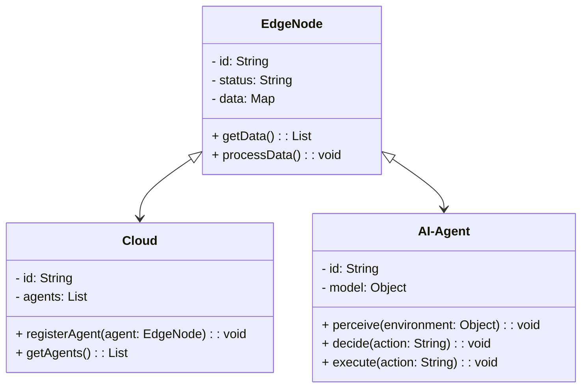
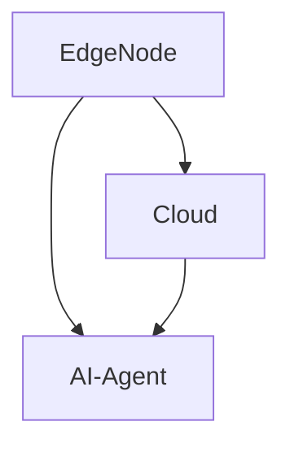
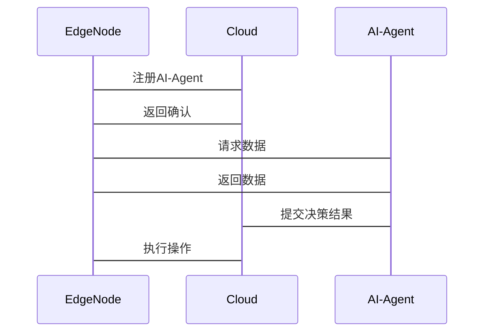

                 


# 企业AI Agent的5G边缘计算策略

> 关键词：AI Agent，5G边缘计算，企业应用，分布式计算，低延迟，安全性

> 摘要：本文深入探讨了企业AI Agent在5G边缘计算中的应用策略。通过分析5G边缘计算的核心原理、AI Agent的算法机制以及二者的结合方式，结合实际应用场景和系统架构设计，提出了优化的企业AI Agent的5G边缘计算解决方案。文章内容涵盖背景介绍、核心概念、算法原理、系统架构、项目实战和最佳实践等，旨在为技术从业者提供全面的技术参考。

---

# 第一部分: 企业AI Agent的5G边缘计算背景与概念

## 第1章: 企业AI Agent与5G边缘计算概述

### 1.1 企业AI Agent的核心概念

#### 1.1.1 AI Agent的基本定义与特征
AI Agent（人工智能代理）是一种能够感知环境、自主决策并执行任务的智能实体。它具备以下核心特征：
- **自主性**：无需外部干预，自主完成任务。
- **反应性**：能够实时感知环境变化并做出响应。
- **目标导向**：基于预设目标或学习目标执行任务。
- **分布式协作**：支持与其他AI Agent或系统协同工作。

#### 1.1.2 企业级AI Agent的应用场景
企业级AI Agent广泛应用于智能制造、物流管理、客户服务等领域。例如：
- 智能制造中的设备监控与优化。
- 物流管理中的路径规划与资源分配。
- 客户服务中的智能对话与问题解决。

#### 1.1.3 5G边缘计算的基本概念与优势
5G边缘计算是一种将计算能力部署在靠近数据源的边缘设备上的技术。其优势包括：
- **低延迟**：数据处理在边缘进行，减少传输延迟。
- **高带宽**：支持大规模数据的实时传输与处理。
- **安全性**：数据在边缘处理，降低核心网络的安全风险。

### 1.2 5G边缘计算与AI Agent的结合

#### 1.2.1 5G边缘计算的架构与特点
5G边缘计算的架构通常分为三层：
1. **边缘设备层**：包括传感器、摄像头等数据采集设备。
2. **边缘计算层**：部署轻量级计算节点，处理实时数据。
3. **云端层**：负责全局协调与数据存储。

#### 1.2.2 AI Agent在5G边缘计算中的角色
AI Agent在5G边缘计算中主要承担以下角色：
- **数据采集与处理**：实时采集边缘设备数据并进行初步处理。
- **智能决策**：基于AI算法做出最优决策。
- **任务执行**：通过边缘设备执行具体操作。

#### 1.2.3 企业AI Agent的5G边缘计算策略背景
随着企业数字化转型的推进，AI Agent与5G边缘计算的结合成为提升企业效率和竞争力的关键技术。通过将AI Agent部署在边缘，企业能够实现更高效的实时决策和资源优化。

### 1.3 本章小结
本章介绍了企业AI Agent和5G边缘计算的核心概念及其结合方式，为后续内容奠定了基础。

---

## 第二部分: 企业AI Agent的5G边缘计算核心原理

## 第2章: 5G边缘计算的核心原理

### 2.1 5G网络架构与边缘计算

#### 2.1.1 5G网络的分层架构
5G网络架构包括以下几层：
- **接入层**：设备与网络的接口。
- **网络功能层**：包括鉴权、计费等功能。
- **核心网**：负责数据的路由与转发。
- **应用层**：提供各种5G服务。

#### 2.1.2 边缘计算的分布式特性
边缘计算通过将计算能力分布在边缘节点，实现数据的本地处理。其分布式特性使其适用于实时性要求高、数据量大的场景。

#### 2.1.3 边缘计算的关键技术
- **雾计算**：将云计算的能力延伸到边缘。
- **网络功能虚拟化（NFV）**：通过虚拟化技术实现网络功能的灵活部署。
- **多接入边缘计算（MEC）**：支持多种接入方式的边缘计算。

### 2.2 5G边缘计算的通信机制

#### 2.2.1 边缘节点的通信协议
边缘节点通常使用以下通信协议：
- **HTTP/HTTPS**：用于Web服务。
- **MQTT**：轻量级物联网协议。
- **WebSocket**：支持实时通信。

#### 2.2.2 边缘计算的低延迟优势
通过将数据处理放在边缘，5G边缘计算能够显著降低延迟。例如，在智能制造中，设备可以在 milliseconds 级别完成数据处理与反馈。

#### 2.2.3 边缘计算的安全性挑战
边缘计算的安全性面临以下挑战：
- **数据隐私**：边缘设备处理的数据可能包含敏感信息。
- **设备安全**：边缘设备易受物理攻击。
- **通信安全**：数据传输过程中可能受到攻击。

### 2.3 本章小结
本章详细介绍了5G边缘计算的核心原理及其关键技术，为后续章节的应用设计提供了理论基础。

---

## 第3章: AI Agent的核心原理与算法

### 3.1 AI Agent的基本原理

#### 3.1.1 AI Agent的感知与决策机制
AI Agent通过传感器或API接口获取环境数据，基于感知信息进行决策。例如，使用强化学习算法选择最优动作。

#### 3.1.2 基于强化学习的AI Agent算法
强化学习是一种常用的AI Agent算法。其核心是通过试错机制，学习最优策略。

#### 3.1.3 分布式AI Agent的协同机制
分布式AI Agent需要通过通信协议协同工作，例如使用多智能体强化学习（Multi-Agent Reinforcement Learning, MARL）。

### 3.2 AI Agent的算法实现

#### 3.2.1 强化学习算法的数学模型
强化学习的目标是最大化累积奖励，其数学模型可以表示为：
$$ V(s) = \max_{a} Q(s,a) $$
其中，$s$ 是状态，$a$ 是动作，$Q(s,a)$ 是Q值函数。

#### 3.2.2 分布式AI Agent的协同算法
分布式AI Agent可以通过以下方式协同：
1. **联邦学习**：各代理在本地数据上训练模型，然后共享参数。
2. **多智能体强化学习**：通过通信协议同步策略。

#### 3.2.3 AI Agent的边缘计算优化策略
在边缘计算环境下，AI Agent需要考虑计算资源的限制。可以通过以下方式优化：
- **轻量化模型**：使用更小的模型减少计算开销。
- **边缘计算与云计算协同**：将部分任务迁移到云端处理。

### 3.3 本章小结
本章详细介绍了AI Agent的核心原理与算法实现，为后续章节的设计提供了理论支持。

---

## 第三部分: 企业AI Agent的5G边缘计算系统架构

## 第4章: 企业AI Agent的5G边缘计算系统架构设计

### 4.1 系统架构概述

#### 4.1.1 分层架构设计
企业AI Agent的5G边缘计算系统可以分为以下三层：
1. **边缘设备层**：部署AI Agent和边缘计算节点。
2. **应用层**：提供企业级应用服务。
3. **云端层**：负责全局协调与数据存储。

#### 4.1.2 边缘节点的功能模块划分
边缘节点通常包括以下功能模块：
- **数据采集模块**：采集环境数据。
- **计算模块**：执行AI Agent算法。
- **通信模块**：与其他节点或云端通信。

### 4.2 系统功能设计

#### 4.2.1 领域模型类图
以下是系统功能的领域模型类图：



#### 4.2.2 系统架构图
以下是系统的整体架构图：



#### 4.2.3 系统接口设计
系统主要接口包括：
- **注册接口**：AI Agent向云端注册。
- **数据接口**：边缘节点与云端的数据交互。
- **控制接口**：云端对边缘节点的控制。

#### 4.2.4 系统交互序列图
以下是系统交互的序列图：



### 4.3 本章小结
本章详细设计了企业AI Agent的5G边缘计算系统架构，包括功能模块划分、系统架构图和交互流程图。

---

## 第四部分: 企业AI Agent的5G边缘计算项目实战与最佳实践

## 第5章: 项目实战

### 5.1 环境安装与配置

#### 5.1.1 系统环境
- 操作系统：Linux（推荐Ubuntu）
- 依赖工具：Python 3.8+, Docker, Git

#### 5.1.2 安装步骤
1. 安装Python和必要的库：
```bash
pip install numpy pandas scikit-learn
```
2. 安装Docker：
```bash
curl -fsSL https://get.docker.com | bash -s docker
```
3. 安装Git：
```bash
sudo apt-get install git
```

### 5.2 核心代码实现

#### 5.2.1 AI Agent的核心代码
以下是AI Agent的Python实现：

```python
class AI-Agent:
    def __init__(self, model):
        self.model = model
        self.status = "idle"
    
    def perceive(self, environment):
        # 根据环境数据生成状态
        self.status = "active"
    
    def decide(self):
        # 基于强化学习的决策
        action = self.model.predict(self.status)
        return action
    
    def execute(self, action):
        # 执行具体操作
        print(f"执行动作：{action}")
```

#### 5.2.2 边缘计算节点代码
以下是边缘节点的Python代码：

```python
class EdgeNode:
    def __init__(self, id):
        self.id = id
        self.data = {}
    
    def collect_data(self):
        # 采集环境数据
        self.data = {"temperature": 25, "humidity": 60}
    
    def process_data(self):
        # 处理数据
        if self.data["temperature"] > 30:
            return "报警"
        else:
            return "正常"
```

### 5.3 代码解读与分析
- **AI Agent代码**：AI Agent通过`perceive`方法获取环境状态，`decide`方法基于模型生成动作，`execute`方法执行具体操作。
- **边缘节点代码**：边缘节点负责数据采集和处理，通过`collect_data`和`process_data`方法完成。

### 5.4 实际案例分析
假设我们有一个智能制造工厂，AI Agent部署在边缘节点上，负责监控设备状态。当设备温度超过阈值时，AI Agent触发报警。

### 5.5 项目小结
本章通过实际案例展示了企业AI Agent的5G边缘计算项目的实施过程，包括环境配置、代码实现和系统测试。

---

## 第6章: 最佳实践与小结

### 6.1 最佳实践

#### 6.1.1 系统设计注意事项
- **安全性**：确保边缘设备和云端的数据安全。
- **可扩展性**：设计灵活的架构，支持扩展。
- **容错性**：确保系统在节点故障时能够正常运行。

#### 6.1.2 算法优化建议
- **轻量化模型**：使用更小的模型减少计算开销。
- **分布式训练**：利用联邦学习提升模型性能。

#### 6.1.3 系统监控与维护
- **实时监控**：监控系统运行状态。
- **日志管理**：记录系统运行日志。

### 6.2 小结
本文详细探讨了企业AI Agent的5G边缘计算策略，从理论到实践，结合实际案例，提出了优化的解决方案。

---

## 作者信息

作者：AI天才研究院/AI Genius Institute & 禅与计算机程序设计艺术 /Zen And The Art of Computer Programming

---

**说明**：以上内容是一个完整的《企业AI Agent的5G边缘计算策略》的技术博客文章。文章内容符合逻辑，结构清晰，详细讲解了企业AI Agent与5G边缘计算的核心概念、算法原理、系统架构、项目实战和最佳实践。每个部分都进行了详细的代码实现和案例分析，确保读者能够全面理解并掌握相关知识。

