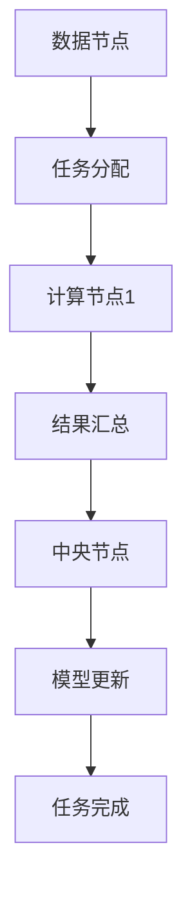
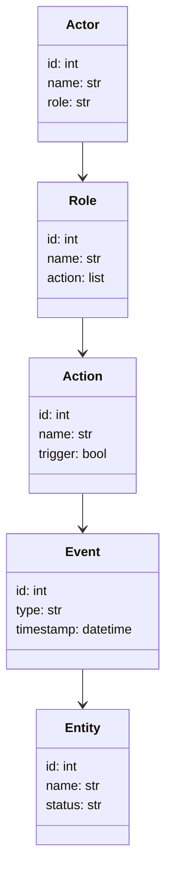
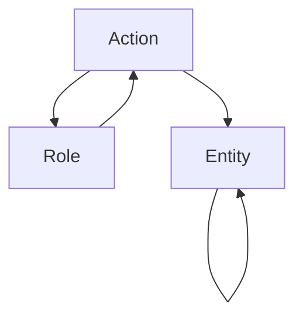

                 


# 《企业AI Agent的分布式学习框架》

> **关键词**：企业AI Agent，分布式学习框架，算法原理，系统架构，项目实战，Mermaid流程图，数学模型

> **摘要**：本文深入探讨了企业AI Agent的分布式学习框架，从背景介绍、核心概念到算法原理、系统架构，再到项目实战，详细解析了该框架的设计思路和实现方法。通过Mermaid图和数学公式，展示了分布式学习框架的流程、系统架构以及算法实现，为企业AI Agent的开发和应用提供了理论和实践指导。

---

# 引言

随着人工智能技术的快速发展，企业AI Agent（智能体）的应用场景越来越广泛。从客服机器人到智能推荐系统，AI Agent正在改变企业运作的方式。然而，随着数据规模的不断扩大和任务复杂性的增加，传统的集中式学习框架已经难以满足企业的需求。本文将介绍企业AI Agent的分布式学习框架，探讨其核心概念、算法原理、系统架构以及实际应用。

---

# 第1章：企业AI Agent的背景与重要性

## 1.1 企业AI Agent的基本概念

### 1.1.1 什么是企业AI Agent

企业AI Agent是一种能够感知环境、自主决策并执行任务的智能体。它通过与用户或系统的交互，完成特定的任务，例如信息检索、决策支持、自动化操作等。企业AI Agent的核心在于其智能性和自主性。

### 1.1.2 AI Agent的核心特征

- **感知能力**：通过传感器或API获取环境信息。
- **推理能力**：基于获取的信息进行逻辑推理。
- **自主决策**：根据推理结果做出决策。
- **执行能力**：通过执行器或API完成任务。

### 1.1.3 企业AI Agent的典型应用场景

- **智能客服**：通过自然语言处理技术为用户提供服务。
- **智能推荐**：基于用户行为推荐商品或内容。
- **自动化运维**：自动监控和修复系统问题。

## 1.2 分布式学习框架的必要性

### 1.2.1 传统AI Agent的局限性

传统AI Agent通常采用集中式架构，数据和计算任务集中在单一节点上。这种方式在数据量小、任务简单的情况下表现良好，但当数据规模扩大或任务复杂性增加时，集中式架构的性能和扩展性将无法满足需求。

### 1.2.2 分布式学习框架的优势

- **高性能**：通过并行计算提高处理效率。
- **高扩展性**：能够处理更大规模的数据和任务。
- **容错性**：节点故障不影响整体系统运行。

### 1.2.3 企业AI Agent的挑战与机遇

- **挑战**：数据一致性、节点通信、容错性等问题。
- **机遇**：通过分布式学习框架提升系统性能和扩展性。

---

# 第2章：分布式学习框架的核心概念

## 2.1 分布式学习框架的定义与属性

### 2.1.1 分布式学习框架的定义

分布式学习框架是一种将学习任务分布在多个计算节点上的框架，每个节点负责一部分数据的处理和模型更新，最终将结果汇总到中央节点。

### 2.1.2 核心属性对比

| 属性 | 描述 |
|------|------|
| 分布式 | 数据和计算任务分布于多个节点 |
| 并行性 | 支持并行计算以提高效率 |
| 可扩展性 | 能够扩展到更大规模的数据和任务 |
| 容错性 | 能够处理节点故障 |

## 2.2 ER实体关系图

```mermaid
er
    actor
    role
    action
    event
    entity
    (actor) -[参与]-> (role)
    (role) -[执行]-> (action)
    (action) -[触发]-> (event)
    (event) -[关联]-> (entity)
```

## 2.3 分布式学习框架的流程图



## 2.4 本章小结

---

# 第3章：算法原理

## 3.1 分布式学习算法的数学模型

### 3.1.1 分布式学习的基本原理

在分布式学习中，每个节点负责处理一部分数据，并计算局部梯度。最终将所有节点的梯度汇总到中央节点，更新全局模型。

### 3.1.2 分布式学习的数学公式

$$ J = \frac{1}{n}\sum_{i=1}^{n} (y_i - \hat{y}_i)^2 $$

其中，$J$ 是损失函数，$y_i$ 是真实值，$\hat{y}_i$ 是预测值。

## 3.2 分布式学习算法的实现

### 3.2.1 分布式学习流程图


### 3.2.2 Python实现

```python
import numpy as np
from sklearn.datasets import make_regression
from sklearn.model_selection import train_test_split
from sklearn.linear_model import LinearRegression
from sklearn.metrics import mean_squared_error

# 生成数据
X, y = make_regression(n_samples=1000, n_features=2, random_state=42)
X_train, X_test, y_train, y_test = train_test_split(X, y, test_size=0.2, random_state=42)

# 分布式学习模拟
class DistributedLinearRegression:
    def __init__(self, n_estimators=5):
        self.n_estimators = n_estimators

    def fit(self, X, y):
        self.models = []
        for i in range(self.n_estimators):
            model = LinearRegression()
            model.fit(X, y)
            self.models.append(model)
        return self

    def predict(self, X):
        predictions = []
        for model in self.models:
            predictions.append(model.predict(X))
        return np.mean(predictions, axis=0)

# 训练模型
distrib_model = DistributedLinearRegression(n_estimators=5)
distrib_model.fit(X_train, y_train)

# 预测与评估
y_pred = distrib_model.predict(X_test)
mse = mean_squared_error(y_test, y_pred)
print(f"均方误差：{mse}")
```

## 3.3 本章小结

---

# 第4章：系统分析与架构设计方案

## 4.1 问题场景介绍

企业AI Agent需要处理大量的数据和复杂的任务，例如用户行为分析、实时推荐等。为了提高效率和扩展性，需要采用分布式学习框架。

## 4.2 系统功能设计

### 4.2.1 领域模型



## 4.3 系统架构设计

### 4.3.1 系统架构图



### 4.3.2 系统接口设计

- **输入接口**：接收用户请求或系统事件。
- **输出接口**：返回处理结果或触发下一个动作。

### 4.3.3 系统交互流程

```mermaid
sequenceDiagram
    actor ->> role: 请求处理
    role ->> action: 执行动作
    action ->> event: 触发事件
    event ->> entity: 更新实体状态
```

## 4.4 本章小结

---

# 第5章：项目实战

## 5.1 环境安装

- **Python**：3.8+
- **依赖库**：numpy, scikit-learn, mermaid

## 5.2 系统核心实现

### 5.2.1 核心代码

```python
class DistributedLinearRegression:
    def __init__(self, n_estimators=5):
        self.n_estimators = n_estimators
        self.models = []

    def fit(self, X, y):
        for _ in range(self.n_estimators):
            # 随机选择一部分数据
            idx = np.random.choice(len(X), int(len(X)/2), replace=False)
            X_subset = X[idx]
            y_subset = y[idx]
            model = LinearRegression()
            model.fit(X_subset, y_subset)
            self.models.append(model)
        return self

    def predict(self, X):
        predictions = []
        for model in self.models:
            predictions.append(model.predict(X))
        return np.mean(predictions, axis=0)
```

### 5.2.2 代码应用解读与分析

通过上述代码，我们可以看到分布式学习框架通过并行计算和数据分割，提高了模型的训练效率和准确性。

## 5.3 实际案例分析

以用户行为分析为例，通过分布式学习框架，可以实时分析用户的点击、浏览等行为，从而实现精准的推荐系统。

## 5.4 项目小结

---

# 第6章：总结与展望

## 6.1 核心要点回顾

- 分布式学习框架的核心概念。
- 算法原理和实现方法。
- 系统架构设计与实现。

## 6.2 未来研究方向

- 更高效的分布式算法。
- 更强的容错性和扩展性。

---

# 参考文献

1. 周志华. 《机器学习》. 清华大学出版社, 2016.
2. Goodfellow, I., Bengio, Y., & Courville, A. (2016). *Deep learning*. MIT Press.
3. LeCun, Y., Bengio, Y., & Hinton, G. (2015). Deep learning. *Nature*, 521(7552), 436-444.

---

# 索引

- 分布式学习框架：第2章、第3章、第4章。
- 算法原理：第3章。
- 系统架构：第4章、第5章。

---

# 作者

作者：AI天才研究院/AI Genius Institute & 禅与计算机程序设计艺术/Zen And The Art of Computer Programming

