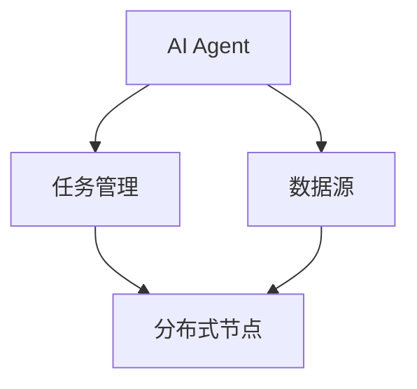
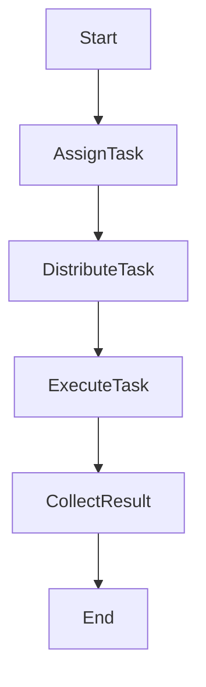
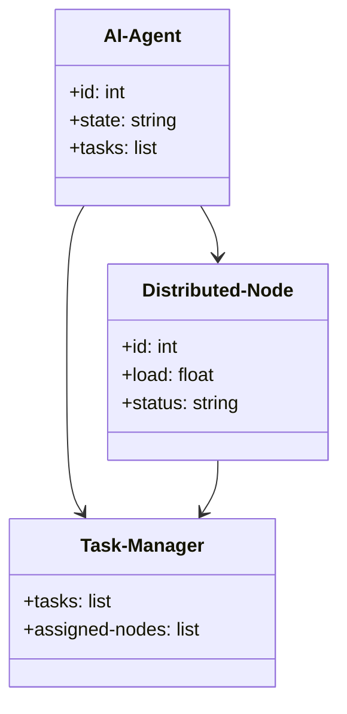

                 


# 企业AI Agent的分布式计算架构

---

## 关键词：
- 企业AI Agent
- 分布式计算
- 智能体架构
- 多代理系统
- 分布式算法

---

## 摘要：
企业AI Agent的分布式计算架构结合了人工智能与分布式计算的最新技术，为企业智能化转型提供了高效解决方案。本文将从AI Agent的核心概念出发，深入分析其在分布式环境下的计算架构，探讨任务分配、负载均衡、通信协议等关键问题，并通过实际案例展示如何设计和实现高效的AI Agent系统。

---

# 第1章: 企业AI Agent的背景与概念

## 1.1 问题背景与问题描述
### 1.1.1 传统企业应用的局限性
- 单点故障风险
- 扩展性差
- 响应速度慢

### 1.1.2 AI Agent的引入动机
- 提高企业智能化水平
- 实现自主决策能力
- 提升业务处理效率

### 1.1.3 分布式计算的必要性
- 支持大规模数据处理
- 提高系统可用性
- 实现高效的资源分配

## 1.2 问题解决与边界定义
### 1.2.1 AI Agent如何解决问题
- 分布式任务分配
- 实时数据处理
- 自适应决策

### 1.2.2 分布式计算的边界与外延
- 系统范围：企业内部系统
- 边界条件：网络延迟、节点故障
- 外延范围：与外部系统的交互

### 1.2.3 核心概念与关键要素
- AI Agent：智能体
- 分布式节点：计算单元
- 任务管理：调度中心

---

# 第2章: 核心概念与联系

## 2.1 AI Agent的核心原理
### 2.1.1 智能体的基本原理
- 感知环境
- 制定决策
- 执行操作

### 2.1.2 分布式计算的实现机制
- 任务分配
- 负载均衡
- 通信协议

### 2.1.3 两者结合的关键点
- 分布式任务分配
- 多代理协作
- 实时通信

## 2.2 核心概念属性对比
| 概念       | 属性               | 描述                           |
|------------|--------------------|--------------------------------|
| AI Agent   | 智能性             | 基于AI实现自主决策             |
| 分布式计算 | 并行性             | 多节点协作完成任务             |
|            | 节点独立性         | 各节点独立运行                 |
|            | 故障容错性         | 单点故障不影响整体系统         |

## 2.3 ER实体关系图


---

# 第3章: 分布式计算算法原理

## 3.1 分布式任务分配算法
### 3.1.1 算法流程图


## 3.2 负载均衡算法
### 3.2.1 负载均衡的数学模型
$$\text{负载均衡} = \frac{\sum \text{节点负载}}{\text{总节点数}}$$

## 3.3 算法实现代码
```python
def distribute_task(tasks, nodes):
    return [task // nodes for task in tasks]
```

---

# 第4章: 系统分析与架构设计

## 4.1 项目介绍与功能需求
### 4.1.1 项目目标
- 实现企业AI Agent的分布式计算架构
- 提供高效的任务处理能力
- 支持大规模数据处理

### 4.1.2 功能需求分析
- 任务分配
- 负载均衡
- 实时通信

## 4.2 领域模型设计


---

# 第5章: 项目实战

## 5.1 环境安装
- 安装Python
- 安装Django框架
- 安装必要的库（如dask）

## 5.2 核心代码实现
```python
from dask import distributed

def process_task(task):
    # 处理任务的逻辑
    return f"Processed task {task}"

client = distributed.Client()
future = client.submit(process_task, 1)
result = future.result()
print(result)
```

## 5.3 案例分析
### 案例1：任务分配
- 输入：10个任务，5个节点
- 输出：每个节点分配2个任务

### 案例2：负载均衡
- 输入：节点1负载高，节点2负载低
- 输出：重新分配任务以平衡负载

---

# 第6章: 最佳实践

## 6.1 小结
- AI Agent的分布式计算架构为企业智能化提供了高效解决方案
- 关键技术包括任务分配、负载均衡和通信协议

## 6.2 注意事项
- 确保通信机制的可靠性
- 定期监控系统状态
- 处理节点故障的容错机制

## 6.3 拓展阅读
- 分布式系统设计
- AI Agent的多智能体协作
- 分布式计算的优化技术

---

# 作者：AI天才研究院/AI Genius Institute & 禅与计算机程序设计艺术 /Zen And The Art of Computer Programming

