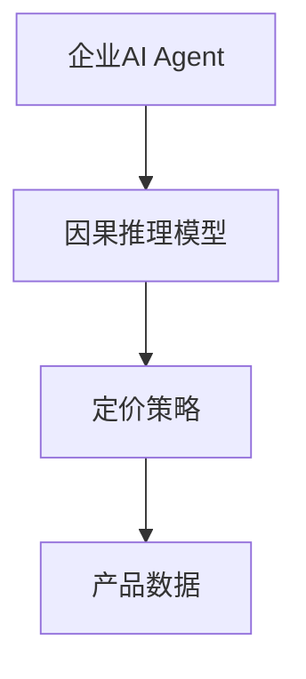

                 


# 企业AI Agent的因果推理在产品定价策略中的精准应用

## 关键词：企业AI Agent、因果推理、产品定价策略、精准应用、数学模型、机器学习、数据驱动

## 摘要：本文详细探讨了企业AI Agent如何通过因果推理优化产品定价策略，涵盖数据预处理、因果模型构建、定价策略生成及项目实战，提供理论与实践相结合的解决方案。

---

## 正文

### 第一部分: 企业AI Agent的背景与核心概念

#### 第1章: 问题背景与核心概念

##### 1.1 问题背景
- **传统定价策略的局限性**：传统定价多基于经验或统计分析，难以应对市场波动和个性化需求。
- **数据驱动定价的兴起**：大数据和机器学习技术的应用使得动态定价成为可能。
- **企业AI Agent的引入**：AI Agent通过自动化分析优化定价策略，提升企业竞争力。

##### 1.2 核心概念
- **企业AI Agent**：具备数据处理、因果推理和策略生成的智能系统。
- **因果推理**：分析变量间因果关系，用于预测和决策。
- **产品定价策略**：基于因果推理制定的价格调整方案。

##### 1.3 问题解决与边界
- **问题描述**：传统定价策略难以精准反映市场变化。
- **解决方案的边界**：AI Agent应用于定价策略优化，不涉及生产或库存管理。
- **核心概念的结构**：数据-模型-策略的闭环系统。

#### 第2章: 因果推理与AI Agent的核心联系

##### 2.1 因果推理的原理
- **潜在结果框架**：每个客户在特定价格下的购买行为。
- **反事实推理**：评估不同定价策略的效果。
- **结构方程模型**：因果关系的数学表示。

##### 2.2 AI Agent的结构与功能
- **数据收集**：整合销售数据、客户行为数据。
- **因果模型构建**：识别变量间的因果关系。
- **定价策略生成**：基于因果模型制定最优价格。

##### 2.3 实体关系图


### 第二部分: 算法原理与数学模型

#### 第3章: 因果推理的数学模型

##### 3.1 潜在结果框架
$$ Y_i = \theta(X_i) + \epsilon_i $$
解释：每个客户在特定处理下的结果。

##### 3.2 反事实推理公式
$$ \text{ATE} = E[Y_i^{t} - Y_i^{c}] $$
解释：计算平均处理效应，评估不同策略的效果。

##### 3.3 结构方程模型
$$ Y = \beta X + \epsilon $$
解释：因果关系的线性模型，用于构建因果图。

#### 第4章: AI Agent的实现算法

##### 4.1 数据预处理
- **特征工程**：提取影响定价的关键特征。
- **数据清洗**：处理缺失值和异常值。

##### 4.2 因果模型构建
- **因果图构建**：使用结构方程模型识别因果关系。
- **反事实推理**：评估不同价格策略的影响。

##### 4.3 定价策略生成
- **策略生成**：基于因果模型制定价格调整方案。
- **效果验证**：通过A/B测试验证策略的有效性。

### 第三部分: 系统分析与架构设计

#### 第5章: 系统架构设计

##### 5.1 问题场景介绍
- **数据源**：整合销售数据、客户行为数据。
- **目标**：构建因果推理模型，优化定价策略。

##### 5.2 系统功能设计
- **数据预处理模块**：清洗和特征工程。
- **因果推理模块**：构建因果图和反事实推理。
- **定价策略生成模块**：制定价格策略并验证效果。

##### 5.3 系统架构图


### 第四部分: 项目实战

#### 第6章: 项目实战

##### 6.1 环境安装与配置
- **Python安装**：安装Python和必要的库如pandas、numpy、doWhy。
- **数据加载**：读取销售数据和客户行为数据。

##### 6.2 核心代码实现
```python
import pandas as pd
from doWhy import CausalModel

# 数据预处理
data = pd.read_csv('pricing_data.csv')
data.dropna(inplace=True)

# 构建因果模型
cm = CausalModel()
cm.add_node('price', 'float')
cm.add_node('sales', 'float')
cm.add_edge('price', 'sales')
cm.add_edge('customer_segment', 'sales')

# 反事实推理
ate = cm.estimate_ate('price', 'sales')
print(f"ATE: {ate}")
```

##### 6.3 实际案例分析
- **案例分析**：分析某产品的定价策略，应用因果推理模型优化价格。
- **效果验证**：通过A/B测试验证策略的有效性。

### 第五部分: 总结与扩展

#### 第7章: 总结与扩展

##### 7.1 最佳实践
- **数据质量**：确保数据准确性和完整性。
- **模型选择**：根据具体情况选择合适的因果模型。
- **效果验证**：通过A/B测试验证策略效果。

##### 7.2 小结
本文详细探讨了企业AI Agent如何利用因果推理优化定价策略，提供了从理论到实践的全面指导。

##### 7.3 注意事项
- **数据隐私**：确保数据处理符合隐私保护法规。
- **模型解释性**：选择具有可解释性的因果模型。

##### 7.4 拓展阅读
- 推荐阅读《Causal Inference for the Social Sciences》和《机器学习实战》。

---

## 作者：AI天才研究院/AI Genius Institute & 禅与计算机程序设计艺术 /Zen And The Art of Computer Programming

---

这篇文章详细讲解了企业AI Agent如何利用因果推理优化产品定价策略，结合理论与实践，提供了全面的技术指导。

